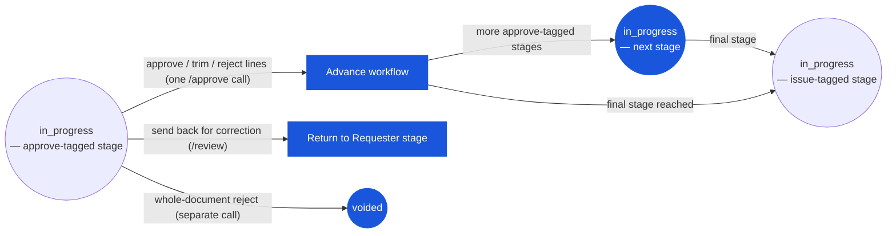

# Store Requisition — User Flow — Approver

> **At a Glance**
> **Persona:** Approver — whoever holds a workflow stage tagged `enum_stage_role.approve` &nbsp;·&nbsp; **Module:** [store-requisition](/en/inventory/store-requisition) &nbsp;·&nbsp; **Workflow stages:** in_progress (approve-tagged stage) → in_progress (next stage) / voided / draft (send-back) &nbsp;·&nbsp; **Key permissions:** approve, trim approved_qty, reject (bundled into the same `/approve` call), send-back (`/review`)
> **What this persona does:** Reviews submitted SR lines against operational need and source availability; approves, trims, rejects, or sends back via workflow stage advance.
> ⚠️ **Corrected this pass.** The prior version of this page described a value-threshold-routed multi-tier escalation, budget-cap and par-level-cap trims, approval delegation, and SLA time-out escalation — a repo-wide search for `threshold`, `delegat`, and `par_level` against the SR module and the workflow orchestrator returned zero hits (`tb_product_location.par_qty` exists but is a stock-replenishment policy field, not a per-line "par level" surfaced to the approver). These claims are removed or marked unconfirmed below.

## 1. Role in This Module

The **Approver** persona is whoever holds a workflow stage tagged `enum_stage_role.approve` (typically titled Department Head) who owns the review of a submitted SR before it can be released for issuance. The Approver is the control gate between the outlet's demand (`requested_qty`) and the store's release authority (`approved_qty ≤ requested_qty`). On entry the SR is at `doc_status = in_progress` with `workflow_current_stage` pointing at a stage where the Approver is in `user_action.execute`. The Approver reviews each line against operational need and current source availability; approves in full, trims `approved_qty` down, rejects (bundled into the same `/approve` call as other approved lines), or sends the whole document back for correction via a separate `/review` call. Per-line approval / review / rejection signatures (`approved_by_id`, `review_by_id`, `reject_by_id` plus name / date / message columns) are persisted directly on `tb_store_requisition_detail` for audit; per-line `history` JSON appends a `{ seq, name, status, message, by, at }` entry for every action. The Approver never advances `doc_status` directly except at the final stage (where the same `/approve` call completes the document) — the header status stays `in_progress` throughout any earlier stage. **Unconfirmed:** whether the requester is blocked from approving their own SR — no `requestor_id` cross-check was found in `store-requisition.service.ts`. **Unconfirmed:** approval delegation — no `delegat` hits were found anywhere in the workflow orchestrator or this module.

### Workflow position (Approver highlighted)

```mermaid
graph LR
    submitted(("in_progress\n— approve-tagged stage")) -->|"approve / trim / reject lines (one /approve call)"| advance["Advance workflow"]:::current
    advance -->|"more approve-tagged stages"| nextstage(("in_progress\n— next stage")):::current
    nextstage -->|"final stage"| fulfil(("in_progress\n— issue-tagged stage"))
    advance -->|"final stage reached"| fulfil
    submitted -->|"send back for correction (/review)"| sendback["Return to Requester stage"]:::current
    submitted -->|"whole-document reject (separate call)"| voided(("voided")):::current
    classDef current fill:#1a56db,color:#fff,stroke:#1a56db;
```

### Permission Matrix — V2 Action × Stage Role (Approver)

The Approver acts at `doc_status = in_progress` while `workflow_current_stage` points to a stage where the Approver is in `user_action.execute`. If the tenant's `tb_workflow` config defines more than one `approve`-tagged stage, the same action set applies at each stage — this is a generic feature of the shared workflow engine, not something specific to SR — but no value-threshold-based routing between stages was found in code.

| Action | Approver at any `approve`-tagged stage |
|---|---|
| Open SR pending approval | ✅ (`SR_AUTH_005`) |
| Approve line in full (`approved_qty = requested_qty`) | ✅ (`SR_AUTH_005`) |
| Trim `approved_qty` down (`0 < approved_qty < requested_qty`) | ✅ (`SR_AUTH_005`) |
| Reject line, bundled with other lines' approve decisions in one `/approve` call | ✅ (`SR_AUTH_005`, `SR_VAL_010`) |
| Send the whole document back for correction (`/review`; cannot mix with approve/reject in the same call) | ✅ (`SR_AUTH_005`) |
| Mix approve / reject per line in one `/approve` call | ✅ — confirmed in `computeSrAction()` (`sr-form-schema.ts`) |
| Approve own SR (where Approver = Requester) | Unconfirmed whether blocked — no SoD check found in code |
| Raise `approved_qty` above `requested_qty` | ❌ (`SR_VAL_010`) |
| Final-stage advance (recording `issued_qty`) | Same `/approve` endpoint — gated by which stage's `enum_stage_role` the user holds (`approve` vs `issue`), not a separate commit permission |

## 2. Entry Point and Primary Flow

**Entry point:** Two confirmed paths into the approve action.

- **Approvals dashboard → Pending SR approvals** — list view filtered to `(doc_status = 'in_progress', workflow_current_stage = '<approver-stage>', user_action.execute CONTAINS me)`; the approver picks an SR to open.
- **Notification → SR submitted for your approval** — an in-app notification is dispatched on submit (`sendSubmitNotification` in `store-requisition.logic.ts`) and deep-links to the SR detail.

If a tenant's workflow defines more than one `approve`-tagged stage, the document advances from one to the next using the identical action surface described here — this is a property of the shared workflow engine, not a distinct "multi-tier" feature built for SR.

**Primary flow (happy path, 8 steps):**

1. **Open the SR.** The detail view shows the header (source / destination, `sr_type`, dates, requester, description, dimension), the lines with their `requested_qty` and the UI-only enrichment block (current source on-hand, on-order, last price, last vendor, product category — not persisted on the SR), and the workflow history.
2. **Verify the request against context.** For each line: does it match the recipe demand for any production planned in the period (`info.recipe_id` if present)? Is the source on-hand sufficient (the UI-only enrichment block, not persisted)? **Corrected this pass:** no confirmed "par level" or "budget-impact hint" surfaces on this screen — a `product.par_level` field and a Finance-wired budget module were not found in current source (`tb_product_location.par_qty` is a stock-replenishment policy field, unrelated to this screen).
3. **Per-line decision.** For each line the Approver chooses one of:
   - **Approve in full**: set `approved_qty = requested_qty`. Per-line: `approved_by_id`, `approved_by_name`, `approved_date_at = now()`, optional `approved_message`.
   - **Trim down**: set `approved_qty ∈ (0, requested_qty)`. Per-line: same signature columns; `approved_message` explains the trim (e.g. "trimmed to source on-hand" — the only confirmed trim reason; "par-level cap" and "budget cap" wording is illustrative, not a system-generated label). `approved_qty > requested_qty` is rejected by `SR_VAL_010`.
   - **Reject the line**: set `approved_qty = 0`. Per-line: `reject_by_id`, `reject_by_name`, `reject_date_at = now()`, `reject_message` optional (the reject dialog allows an empty reason; per-line reason is not enforced as mandatory in the frontend). Bundled into the same `/approve` call as other lines' decisions.
   - **Send back the whole document for correction**: a separate `/review` call; if any line is marked "review," the whole submission becomes a send-back and approve/reject selections on other lines in that same submission are not applied (`computeSrAction()`).
4. **Mixed decisions across lines.** Approve and reject can mix in one `/approve` call; review cannot mix with either in the same submission (see point 3). The screen does not show "running totals of approved/rejected value" in the components read this pass — treat that framing as unconfirmed.
5. **Confirm the action.** Click **Approve** (or **Send Back**, depending on the mix). The system validates `SR_VAL_010` per line (cap check on `approved_qty`) and `SR_AUTH_014` (Approver is in `user_action.execute`).
6. **Workflow advance.** When all lines on the current stage have been actioned, the system advances `workflow_current_stage` to the next stage — the next `approve`/`issue`-tagged stage per `tb_workflow`, or `completed` if this was the final stage. A separate whole-document `/reject` call (only enabled when every line is marked reject) sets `doc_status = voided` directly — **not** `cancelled` (see [01-data-model.md](./01-data-model.md) §5 item 11).
7. **Notify downstream.** A notification is dispatched to the next stage's users (`sendApproveNotification` in `store-requisition.logic.ts`); the requester is also notified of the outcome.
8. **Audit trail recorded.** `last_action` is updated along with `last_action_at_date` and `last_action_by_id`; `workflow_history` gets an entry; each touched line gets a `history` JSON append. The approver's per-line signature columns (`approved_by_*`, `review_by_*`, `reject_by_*`) are the formal audit signature; the comment table is for additional discussion thread.

## 3. Decision Branches

- **Trim to source availability**: the source on-hand is less than the requested quantity. The Approver trims `approved_qty` to the available stock. The trim is recorded with an `approved_message` such as "trimmed to source on-hand." The next stage will see the trimmed value.
- **Reject for missing justification**: an unusual or high-value line lacks a justification note. The Approver chooses send-back (not reject) and writes a `review_message`; the line is returned to the requester for amendment.
- **Reject the entire SR**: every line is marked reject in one submission, enabling the whole-document `/reject` action. The system sets `doc_status = voided` directly — **corrected this pass**: prior versions of this page described this landing on `cancelled`; no `cancelled` assignment exists anywhere in `store-requisition.service.ts`.
- **Send back a single line, approve the rest**: **corrected this pass.** `computeSrAction()` shows that marking even one line "review" makes the whole submission a send-back — approve/reject selections on other lines in that same submission are not sent. To approve some lines and separately flag one for correction, the Approver would need two submissions (approve the others first, then a follow-up send-back), not one mixed action as previously described.
- **Multi-tier escalation, delegation, and SLA time-out escalation** — **removed this pass; unconfirmed.** No value-threshold routing, delegation, or SLA-timeout logic was found in `workflow-orchestrator.service.ts` or this module. If a tenant's `tb_workflow` genuinely defines more than one `approve` stage, the document simply advances through them using the ordinary mechanism in Section 2 — there is no confirmed value-based trigger for when that happens.

## 4. Exit Point / Handoffs

The Approver's involvement on a given SR ends at one of three confirmed boundaries:

- **All lines actioned, workflow advances to the next stage** — handoff to whoever holds the next stage (an issuance-tagged stage, or another approval stage if the tenant's workflow has more than one). The current approver's signature is preserved.
- **Any line sent back for correction** — handoff back to the **Requester**. The SR re-enters the requester workflow stage; the requester addresses the `review_message` and resubmits.
- **Whole-document reject** — `in_progress → voided` (not `cancelled`); the document terminates; the requester is notified.

No confirmed post-commit dispute path specific to the Approver was found; see [03-user-flow-audit-config.md](./03-user-flow-audit-config.md) for what is and isn't confirmed about post-commit correction.

## 5. References

- Parent overview: [03-user-flow.md](./03-user-flow.md) — the canonical five-value lifecycle on `enum_doc_status` and the cross-persona handoff table; Section 4 row "Approver → Fulfiller" and "Approver → Requester (send-back)" anchor this persona's exits.
- `../carmen/docs/store-requisitions/SR-User-Experience.md` § Approving a Store Requisition — carmen/docs source for the approver (named "James Wilson, Department Head" in the persona narrative); journey steps map onto Section 2 above.
- `../carmen/docs/store-requisitions/SR-Overview.md` § User Roles → Approver row — carmen/docs source for the persona's responsibility scope.
- `../carmen/docs/store-requisitions/Store Requisitions.md` § UC-64 (Approve Requisition Requests), § UC-65 (Deny Requisition Requests), § UC-66 (Modify Requisition Requests) — use-case sources for the approve / trim / reject decisions in Section 2 above.
- Sibling: [03-user-flow-requester.md](./03-user-flow-requester.md) — upstream persona; the Approver's input is the Requester's submitted SR.
- Sibling: [03-user-flow-fulfiller.md](./03-user-flow-fulfiller.md) — the issuance-stage persona; the Approver's `approved_qty` is the cap that stage works within (same generic `/approve` mechanism).
- Sibling: [03-user-flow-audit-config.md](./03-user-flow-audit-config.md) — corrected this pass; most of the oversight/config workspace it previously described (RBAC console, thresholds) was not found in current source.
- Sibling: [01-data-model.md](./01-data-model.md) — per-line approval / review / rejection signature columns on `tb_store_requisition_detail` (`approved_by_*`, `review_by_*`, `reject_by_*`), the `history` and `stages_status` JSON timelines.
- Sibling: [02-business-rules.md](./02-business-rules.md) — `SR_VAL_010` (approval invariant: `approved_qty ≤ requested_qty`), `SR_AUTH_005`–`SR_AUTH_006` (approve / trim / send-back authority, mixing rules), `SR_POST_005`–`SR_POST_010` (final-stage advance and whole-document reject → `voided`).
- Related: [recipe](/en/inventory/recipe) — recipe-driven SRs carry `info.recipe_id`; the Approver sees the recipe context as part of the per-line decision.
- Related: [inventory](/en/inventory/inventory) — source-availability context surfaced at approve time (UI enrichment); the Approver's trim decisions ripple into the fulfiller's pick.
