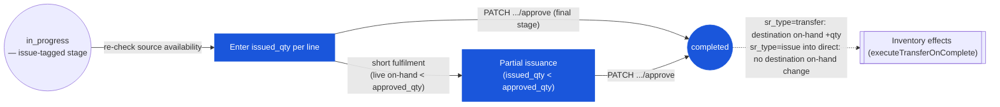

# Store Requisition — User Flow — Fulfiller

> **At a Glance**
> **Persona:** Store Keeper / Warehouse Supervisor — whoever holds the workflow stage tagged `enum_stage_role.issue` &nbsp;·&nbsp; **Module:** [store-requisition](/en/inventory/store-requisition) &nbsp;·&nbsp; **Workflow stages:** in_progress (issue-tagged stage) → completed (final stage advance fires the inventory-transaction write) &nbsp;·&nbsp; **Key permissions:** record `issued_qty` via the same generic `/approve` endpoint the Approver uses; no lot-selection UI (FIFO auto-assigned)
> **What this persona does:** Records `issued_qty` at the issue-tagged stage — the same generic approve action other stages use — which, on the final advance, decrements source on-hand.
> **Re-synced 2026-09-22:** the issue date is resolved against the open inventory period (`resolveIssueDate()`, `issue_date_pattern` dialog) and stamped as `issue_at` / `issue_by_id`; the cap `issued_qty ≤ approved_qty` is **not enforced**; the closed-period block that the 2026-07-15 pass could not find is now real; the Stock Movement tab shows the posted lots.
> ⚠️ **Corrected this pass.** The prior version of this page described a distinct "commit" action, a manual lot-selection sub-form, an enforced Approver ≠ Fulfiller segregation of duties with a configurable low-value threshold, and GL posting. None of these were confirmed — see the callout below and the Section 1 rewrite.

## 1. Role in This Module

The **Fulfiller** persona is whoever holds the workflow stage tagged `enum_stage_role.issue` (typically titled Store Keeper / Warehouse Supervisor) at the source location, who records `issued_qty` per line (which may be less than `approved_qty` if stock has dropped since approval). **Corrected this pass:** the frontend's "Issue" button (`useIssueStoreRequisition`) calls the exact same `PATCH .../approve` endpoint as the Approver's "Approve" button (`useApproveStoreRequisition`) — the only difference is the `stage_role` tag sent in the request body. There is no separate "commit" endpoint. The document becomes `completed` when this call is made at the final workflow stage (`workflow_next_stage === '-'`), which fires `executeTransferOnComplete()` in `store-requisition.logic.ts`: it writes `tb_inventory_transaction` rows via `InventoryTransactionService.executeTransfer()`, decrementing source on-hand and, for `sr_type = transfer`, incrementing destination on-hand. **Lot assignment at this step is system-computed FIFO** (`getAvailableFifoLots` / `consumeFifoLots`) — no lot-selection UI exists in the SR frontend, so there is no manual "pick a lot" action for this persona. GL/journal-entry posting from this event is unconfirmed (see [02-business-rules.md](./02-business-rules.md) `SR_POST_007`). On entry the SR is at `doc_status = in_progress` with `workflow_current_stage` pointing at the issue-tagged stage; each line the Fulfiller acts on has `approved_qty > 0` (or `0` if that line was rejected upstream) and the Approver's per-line signature is preserved on `tb_store_requisition_detail.approved_by_*`. **Unconfirmed:** whether an Approver is blocked from also holding the issue stage on the same SR — no `approved_by_id` cross-check was found in `store-requisition.service.ts`, and no SoD-relaxation threshold config was found anywhere in this module. Post-commit corrections are out of scope for this persona; they go through `[inventory-adjustment](/en/inventory/inventory-adjustment)`.

### Workflow position (Fulfiller highlighted)

### Permission Matrix — V1 Status × Action (Fulfiller)

The Fulfiller acts at `doc_status = in_progress` while `workflow_current_stage` is tagged `enum_stage_role.issue` and the Fulfiller is in `user_action.execute`. The Fulfiller cannot exceed the Approver's `approved_qty` per line. **Corrected this pass:** no segregation-of-duties check (Approver ≠ Fulfiller) or SoD-relaxation threshold was found anywhere in `store-requisition.service.ts`.

| Action | `in_progress` (issue-tagged stage) | `completed` |
|---|---|---|
| View SR and approved quantities | ✅ (`SR_AUTH_007`) | ✅ |
| Re-check live source availability | ✅ (`SR_VAL_013` pre-check) | — |
| Enter `issued_qty` per line | ✅ (`SR_AUTH_007`) — the cap `≤ approved_qty` is **not enforced** (`SR_VAL_008` corrected) | ❌ |
| Select lots for lot-controlled items | ❌ — no lot-selection UI exists; lots are FIFO-assigned automatically at the final-stage advance | ❌ |
| Enter per-line comments / attachments | ✅ | ❌ |
| Final stage advance (`in_progress → completed`) | ✅ (`SR_AUTH_007`) — same `/approve` endpoint as any other stage | ❌ |
| Short fulfilment (partial issue; `issued_qty < approved_qty`) | ✅ (`SR_POST_012`) | — |
| Advance at final stage where Fulfiller = line Approver | Unconfirmed whether blocked — no SoD check found in code | — |
| Edit header | ❌ | ❌ |
| Issue outside every open period | Prompted for `issue_date_pattern`; `today` refused (`SR_VAL_014`) | — |
| Whole-document reject (`in_progress → voided`) | ✅ — same generic reject action any current-stage actor can invoke; not a distinct "void" right | ❌ |

> ℹ️ **Corrected — no distinct "commit" or "3-variant" mechanism found.** Both `sr_type = transfer` and `sr_type = issue` complete through the identical `/approve` call when `workflow_next_stage === '-'`; `executeTransfer()`'s only branching is whether the destination `location_type` is `direct` (expensed immediately, on-hand stays 0) or `inventory` (on-hand increments). There is no separate "Complete" action distinct from recording `issued_qty` and advancing the final stage.

## 2. Entry Point and Primary Flow

**Entry point:** One confirmed path into the issuance action.

- **The SR list, filtered to the issue stage** — list view filtered to `(doc_status = 'in_progress', workflow_current_stage = '<issue-tagged stage>', user_action.execute CONTAINS me)`; the Fulfiller opens an SR from here. **Unconfirmed:** whether the list additionally filters by `from_location_id IN my_locations` — no such location-scoping check was found in `store-requisition.service.ts`.

**Primary flow (happy path):**

1. **Open the SR at the source.** The detail view shows the destination outlet, `sr_type`, expected date, requester, the approver's signature on each line (`approved_by_name`, `approved_date_at`, `approved_message`), and the lines with `approved_qty` (in the product's UoM).
2. **Re-check source availability at the moment of issue.** The per-row Inventory Information dialog shows live source on-hand; no pre-check runs on the server — the only guard is the cost-layer consumption throwing `Insufficient stock` during the final fan-out (`SR_VAL_013`). If live on-hand has fallen below `approved_qty` since approval, the Fulfiller should short-fulfil (decision branch below).
3. **Pick the items physically and enter `issued_qty` per line.** What was actually picked, in the product's UoM. Neither the form (`z.coerce.number()` with no bounds) nor the backend caps the value at `approved_qty` — `SR_VAL_008` is a convention, not a control. An intermediate **Save** at this stage (`PUT` with `stage_role: "issue"`) already stamps `issue_at` / `issue_by_id`.
4. **Capture additional context.** Per-line free-text comments; attachments write to `tb_store_requisition_detail_comment`.
5. **Click Issue.** This calls the identical `PATCH .../approve` endpoint the Approver's "Approve" button uses (`useIssueStoreRequisition` and `useApproveStoreRequisition` are the same mutation, differing only in `stage_role: "issue"`). The backend first resolves the issue date (`resolveIssueDate()`): the SR's own `sr_date` must lie in an open period (else `SR_DATE_OUTSIDE_OPEN_PERIOD`), today is used when it is inside an open period, otherwise the client is asked for `issue_date_pattern` — *open-period* dates the issue on the last day of the SR's period, *today* is refused (`SR_ISSUE_DATE_TODAY_OUTSIDE_PERIOD`). When this is the final stage (`workflow_next_stage === '-'`), the document becomes `completed`, `issue_at` / `issue_by_id` are stamped, and `executeTransferOnComplete()` fires.
6. **Inventory fan-out fires.** For each line with `issued_qty > 0`, `InventoryTransactionService.executeTransfer()` inserts a `tb_inventory_transaction` row (`inventory_doc_type = store_requisition`, dated `doc_date = issue_at` and placed in that date's period) with `tb_inventory_transaction_detail` child(ren) carrying `lot_no` (system-assigned FIFO), `expiry_date`, and `cost_per_unit`; stamps the id on `tb_store_requisition_detail.inventory_transaction_id`; decrements source on-hand; for `sr_type = transfer` increments destination on-hand (for `sr_type = issue` into a `direct` location, the transfer-in nets to zero — no destination on-hand change). GL/journal-entry posting is unconfirmed.
7. **Document state transitions.** `doc_status = in_progress → completed`; `workflow_history` gets the final entry. The SR is now locked against further edits; the **Stock Movement** tab (`GET .../stock-movements`) switches from the line-based preview to the posted rows (`is_posted = true`, real `lot_no`, `cost_per_unit`, `total_cost`). **Corrected this pass:** no confirmed downstream "Receiver" handoff exists — see [03-user-flow-receiver.md](./03-user-flow-receiver.md).

## 3. Decision Branches

- **At-issue stock-out (live on-hand < `approved_qty`)** — reducing `issued_qty` to what is actually available and issuing anyway is the intended path. If the Fulfiller issues more than on-hand, `createFifoConsumption()` / `createAverageConsumption()` throw `Insufficient stock. Requested: …, Available: …` inside the fan-out transaction; because the header update has already been committed, the SR is left `completed` with no movement written — a known ordering hazard, not a graceful validation (`SR_VAL_013`, `SR_POST_006`).
- **Lot assignment** — **corrected this pass.** There is no lot-selection UI or "rotation policy" choice exposed to this persona; `createFifoConsumption()` in `inventory-transaction.service.ts` assigns lots automatically via `getAvailableFifoLots()` / `consumeFifoLots()`. Multi-lot consumption for a single line is a backend detail, not a Fulfiller decision.
- **Closed-period issue attempt** — **confirmed real (2026-09-18).** If the SR's `sr_date` is not inside an open inventory period the issue call fails with `SR_DATE_OUTSIDE_OPEN_PERIOD` (422) — typically an SR submitted with `sr_date_pattern = today` into a not-yet-open period; it becomes issuable once that period opens. If today itself is outside every open period, the date-pattern dialog appears and only *open-period* is accepted (`SR_VAL_014`).
- **SoD violation at issuance** — **removed this pass; unconfirmed.** No cross-check between `approved_by_id` and the issuing user was found in code, and no SoD-relaxation threshold config exists anywhere in this module.

## 4. Exit Point / Handoffs

The Fulfiller's involvement on a given SR ends at one of two confirmed boundaries:

- **Final stage advance succeeds (`in_progress → completed`)** — the SR is locked; source on-hand has decremented; for `sr_type = transfer` the destination has received stock. **No confirmed downstream "Receiver" persona exists** — see [03-user-flow-receiver.md](./03-user-flow-receiver.md) for what was checked. Any subsequent correction is via `[inventory-adjustment](/en/inventory/inventory-adjustment)`.
- **Whole-document reject** — `in_progress → voided` (same generic reject action any current-stage actor, including this one, can invoke); the document terminates.

Post-commit reversal of a `completed` SR is not part of the routine Fulfiller path; see [03-user-flow-audit-config.md](./03-user-flow-audit-config.md) for what is and isn't confirmed about post-commit correction.

## 5. References

- Parent overview: [03-user-flow.md](./03-user-flow.md) — the corrected lifecycle and cross-persona handoff table (no confirmed "Fulfiller → Receiver" or "Receiver + Inventory Controller" handoffs).
- `../carmen/docs/store-requisitions/SR-User-Experience.md` § Processing a Store Requisition — carmen/docs source for the fulfiller (named "Maria Rodriguez, Warehouse Supervisor" in the persona narrative); treat as design intent, not verified current behavior.
- `../carmen/docs/store-requisitions/Store Requisitions.md` § UC-69 (Approve Requisition and Record Stock as Issued) — use-case source; current code implements this as the same generic `/approve` action other stages use, not a distinct "commit" use case.
- Sibling: [03-user-flow-approver.md](./03-user-flow-approver.md) — the Fulfiller's `approved_qty` cap is set there; both personas act through the identical `/approve` endpoint.
- Sibling: [03-user-flow-receiver.md](./03-user-flow-receiver.md) — corrected this pass to document that no distinct Receiver persona was found in current source.
- Sibling: [03-user-flow-audit-config.md](./03-user-flow-audit-config.md) — corrected this pass; GL/journal verification and SoD-relaxation-threshold config were not found in current source.
- Sibling: [01-data-model.md](./01-data-model.md) — `tb_store_requisition_detail.issued_qty`, the `inventory_transaction_id` link, and the lot-data linkage via `tb_inventory_transaction_detail` (lot lives on the inventory transaction and is FIFO-assigned automatically — see §5 items 2, 6, 12 of the data model).
- Sibling: [02-business-rules.md](./02-business-rules.md) — `SR_VAL_008` (quantity invariant — not enforced), `SR_VAL_013` (source stock guard inside the fan-out), `SR_VAL_014` / `SR_VAL_016` (open-period gate and `issue_date_pattern`), `SR_AUTH_007` (issue-stage authority), `SR_POST_005`–`SR_POST_006` (final-stage advance and inventory fan-out), `SR_POST_010` (whole-document reject → `voided`).
- Related: [inventory](/en/inventory/inventory) — the downstream module the final-stage advance fans out into; lot, expiry, and cost-layer data live on `tb_inventory_transaction_detail`.
- Related: [costing](/en/inventory/costing) — source-location FIFO / moving-average feeds the issued unit cost.
- Related: [good-receive-note](/en/inventory/good-receive-note) — inter-warehouse transfers described in earlier versions of this page as a "paired GRN" pattern; not independently re-verified this pass.
