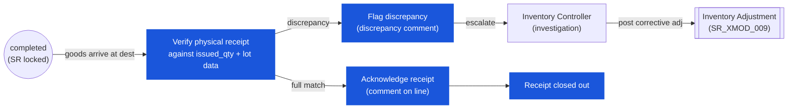

# Store Requisition — User Flow — Receiver

> **At a Glance**
> **Persona:** Destination outlet representative / dock stock controller &nbsp;·&nbsp; **Module:** [[store-requisition]] &nbsp;·&nbsp; **Workflow stages:** completed (already terminal — physical verification, no status change) &nbsp;·&nbsp; **Key permissions:** acknowledge receipt (comment), raise discrepancy comment escalation
> **What this persona does:** Confirms physical receipt against issued_qty / lot, flags discrepancies via comments, and escalates to Inventory Controller for adjustment.

## 1. Role in This Module

The **Receiver** persona is the **destination outlet representative** — the person at the consuming outlet (kitchen, bar, banquet) or the destination warehouse who confirms physical receipt of stock issued from the source location. In small operations the Receiver is often the same physical user as the Requester (the Outlet Manager) wearing a second hat at the dock; in larger operations the Receiver is a dedicated stock controller at the destination. On entry the SR is at `doc_status = completed` (the Fulfiller has committed the issue at source and the inventory transactions have been written; the destination's on-hand has already been incremented for `sr_type = transfer` or the destination cost-centre has been debited for `sr_type = issue`). The Receiver's job is **physical acknowledgement and discrepancy detection** — counting what physically arrives, comparing against the SR's `issued_qty` per line, verifying lot and expiry data on the linked inventory transaction, and **flagging any mismatch** between what the system says was issued and what was actually received. The Receiver does NOT change `doc_status` directly — the SR is already terminal at `completed` — but they raise discrepancy events through the comment system (`tb_store_requisition_comment`, `tb_store_requisition_detail_comment`) that escalate to the Inventory Controller for resolution via `[[inventory-adjustment]]`. The Receiver has **no commit authority** on the SR; their role is verification and signal-raising after the source-side commit has already fired. For `sr_type = transfer` SRs paired with a destination GRN (the `[[good-receive-note]]` paired pattern used in tenants where the destination is a different legal entity or remote facility), the Receiver's flow may overlap with the GRN Receiver flow — see [[good-receive-note/03-user-flow-receiver]].

### Workflow position (Receiver highlighted)

### Permission Matrix — V1 Status × Action (Receiver)

The Receiver operates exclusively on `completed` SRs — the SR is already terminal when the Receiver enters the flow. The Receiver cannot change `doc_status`, alter `issued_qty`, or raise an inventory adjustment directly; their authority is limited to verification and signal-raising. Per `SR_AUTH_008`, the Receiver may confirm physical receipt and flag discrepancies.

| Action | `completed` | All other statuses |
|---|---|---|
| View SR (header, lines, issued_qty, lot data on linked inventory transaction) | ✅ (`SR_AUTH_008`) | ✅ (read-only) |
| Acknowledge full receipt (append `user` comment on line) | ✅ (`SR_AUTH_008`, `SR_POST_013`) | ❌ |
| Flag discrepancy (append discrepancy comment with actual received qty) | ✅ (`SR_AUTH_008`, `SR_POST_013`) | ❌ |
| Attach evidence (photos, weight tickets) to line comment | ✅ | ❌ |
| Change `doc_status` | ❌ (`SR_POST_013` — status does not move) | ❌ |
| Alter `issued_qty` on any line | ❌ | ❌ |
| Void SR | ❌ | ❌ |
| Post inventory adjustment directly | ❌ (goes via Inventory Controller → `SR_XMOD_009`) | ❌ |

> ℹ️ **Discrepancy handling:** A discrepancy comment does NOT move `doc_status` — the SR stays `completed`. Resolution is via `[[inventory-adjustment]]` co-authored by the Inventory Controller (`SR_XMOD_009`). For `sr_type = transfer` SRs paired with a destination GRN, the Receiver's flow may extend into the GRN module.

## 2. Entry Point and Primary Flow

**Entry point:** Two paths into the receive acknowledgement.

- **Inbound SR queue → SRs issued to my outlet** — list view filtered to `(doc_status = 'completed', to_location_id IN my_locations, last_action_at_date >= last_check)`; the Receiver picks an SR to acknowledge.
- **Physical delivery at the dock** — goods arrive with a printed pick list / mobile-scanned SR `sr_no`; the Receiver opens the SR by reference number and acknowledges.

**Primary flow (happy path, 8 steps):**

1. **Open the SR at the destination.** The detail view shows the source location, `sr_type`, the date of issue (`last_action_at_date` for the commit), the Fulfiller's signature (the user who acted on commit, identifiable via `last_action_by_id`), and the lines with `issued_qty` per line. The Receiver also sees the inventory-transaction link (`inventory_transaction_id`) per line which surfaces lot, expiry, and cost data.
2. **Verify the physical delivery against the SR.** Open the goods at the dock; for each line in the SR: count the physical quantity, identify the lot label, check expiry date, inspect for damage in transit. The Receiver records observations directly against the SR (no separate document needed for the routine case — discrepancies escalate via `[[inventory-adjustment]]` if material).
3. **Acknowledge full receipt on each line.** When the physical quantity matches `issued_qty` and the lot / expiry data matches the linked inventory transaction, the Receiver appends a `user` comment to the line ("received in full, condition good") via `tb_store_requisition_detail_comment`. No state transition; no quantity adjustment on the SR.
4. **Flag a discrepancy on a line.** When physical quantity differs from `issued_qty` (short, over, or wrong lot), the Receiver writes a discrepancy comment with the actual received quantity, the expected quantity (which is `issued_qty`), the discrepancy reason if known (broken in transit, miscounted at source, wrong lot picked, missing lot), and any supporting evidence (photos, weight tickets) via attachments on the line comment.
5. **Notify the Inventory Controller.** The discrepancy comment is `type = 'user'` and visible in the SR's activity log; if the tenant has a discrepancy-escalation workflow, the comment may also raise a `system` event into the Inventory Controller's queue (config-dependent). The escalation is **out-of-band from the SR's `doc_status`** — the SR stays `completed`.
6. **Wait for Inventory Controller resolution.** The Inventory Controller reviews the discrepancy, investigates source vs destination counts, decides on the corrective action: (a) accept the discrepancy and post an adjustment at the destination (via `[[inventory-adjustment]]` increasing or decreasing destination on-hand to match physical); (b) accept the discrepancy and post an adjustment at the source (if the source's records were wrong); (c) escalate further to security / loss prevention if the gap suggests pilferage; (d) cancel the discrepancy with a system comment if it turns out to be a counting error.
7. **Close out the receipt.** Once the discrepancy (if any) has been resolved (or the line was a full match from step 3), the Receiver may append a final closure comment ("received and reconciled") on the SR. The SR's status does not change — it remains `completed` from the source-side commit; the destination-side reconciliation lives in the comment thread and (where applicable) in the linked adjustment document.
8. **Update destination outlet's on-hand visibility.** For `sr_type = transfer`, the destination's `tb_inventory_status[to_location_id, product_id].quantity_on_hand` was already incremented at source-side commit; the Receiver's role is verification, not on-hand entry. For `sr_type = issue`, the goods go directly into the destination's consumption (no on-hand at destination); the Receiver verifies the cost-centre debit is correct.

## 3. Decision Branches

- **Full match** — physical quantity equals `issued_qty`; lots and expiry match the linked inventory transaction. The Receiver appends a routine acknowledgement comment; no further action. This is the most common path.
- **Short receipt (`received < issued_qty`)** — physical quantity is less than the system says was issued. The gap may be due to (a) breakage in transit, (b) miscount at source (Fulfiller's error), (c) loss in transit (pilferage / handling), or (d) miscount at destination (Receiver's error). The Receiver writes a discrepancy comment with the actual received quantity; the Inventory Controller investigates.
- **Over receipt (`received > issued_qty`)** — rare but possible if the source mis-counted on the high side. The Receiver writes a discrepancy comment; the Inventory Controller either (a) reconciles by adjusting source counts upward (the source had hidden stock) or (b) adjusts destination counts upward to match physical (source-side records were correct, destination receives the extra). Note this can also indicate a fulfilment error at source where extra was released without being recorded.
- **Wrong lot received** — the lot number on the physical goods does not match the lot recorded on the linked `tb_inventory_transaction_detail`. For non-perishables this may be a cosmetic mismatch (the source picked a different lot than recorded); for perishables it matters because expiry tracking is broken. The Receiver flags the wrong-lot discrepancy; the Inventory Controller works with the Fulfiller / source records to correct the lot trace via `[[inventory-adjustment]]` (or a lot-correction comment if the physical lot is in the source's records but was mis-recorded on this SR).
- **Damaged goods on arrival** — physical goods arrived damaged in transit. The Receiver records the damaged quantity, photographs the damage, and either (a) accepts the goods and writes off the damaged portion at the destination via `[[inventory-adjustment]]` ("damaged-on-arrival" reason) or (b) refuses the damaged portion and escalates to the Inventory Controller for source-side return logistics.
- **Late arrival vs `expected_date`** — physical goods arrived after the destination needed them (production has been delayed or the outlet had to substitute). The Receiver notes the lateness in a comment; the Inventory Controller may track chronic-lateness patterns for supply-chain review. No state change.
- **Goods never arrived** — the SR is `completed` but the destination never sees the physical goods (lost in transit). The Receiver flags a "missing-on-arrival" discrepancy with `received = 0` against non-zero `issued_qty`; the Inventory Controller initiates a search and, failing recovery, posts a compensating loss adjustment at the destination via `[[inventory-adjustment]]`.
- **`sr_type = transfer` paired with destination GRN** — in tenants that use the paired SR + GRN pattern for inter-warehouse transfers (typically when source and destination are different legal entities or remote facilities), the Receiver opens a destination-side GRN to formally acknowledge receipt with a separate document, signature image, and full GRN lifecycle. The GRN side is governed by the [[good-receive-note]] module; the SR side remains `completed` from the source-side commit. The two documents are reconciled by reference.

## 4. Exit Point / Handoffs

The Receiver's involvement on a given SR ends at one of four boundaries:

- **Full match acknowledged** — no further action; the SR remains `completed`; the receipt is logged in the comment thread for audit. The Receiver moves on to the next inbound SR.
- **Discrepancy flagged, awaiting controller** — handoff to the **Inventory Controller** (Audit / Config persona) for investigation and corrective action. The SR stays `completed`; the controller works through the discrepancy and, where needed, posts an adjustment via `[[inventory-adjustment]]`.
- **Discrepancy resolved by adjustment** — handoff completes when the Inventory Controller posts the corrective adjustment. The adjustment document carries a back-reference to the originating SR `id` for audit (`SR_XMOD_009`); the SR itself stays `completed` and the destination on-hand now matches physical. The Receiver may append a closure comment.
- **Escalation to security / loss prevention** — for material discrepancies suggesting pilferage or theft, the Inventory Controller escalates beyond the inventory system; the Receiver's role at this point is fact-witness (signed-off discrepancy comment with evidence). The SR is unaffected operationally.

The Receiver does NOT have authority to reverse the SR, void it, or alter `issued_qty` on the line — those rights live with the Inventory Controller (administrative void on pre-commit is no longer possible because the SR is already `completed`) and with the Finance team (post-commit reversal via inventory-adjustment).

## 5. References

- Parent overview: [03-user-flow.md](./03-user-flow.md) — the canonical lifecycle and the cross-persona handoff table; Section 4 row "Fulfiller → Receiver" describes the entry boundary; "Receiver → Inventory Controller (discrepancy flag)" is this persona's primary exit.
- `../carmen/docs/store-requisitions/SR-Overview.md` § User Roles → Receiver row — carmen/docs source for the persona's responsibility scope ("Confirms receipt of transferred items; view incoming SRs; confirm receipt; report discrepancies").
- `../carmen/docs/store-requisitions/SR-User-Experience.md` — note: the User-Experience source uses a four-persona model (Store Manager, Warehouse Supervisor, Department Head, Finance Manager) and does not detail the Receiver as a separate persona; the Receiver role described here is consolidated from the Overview's User Roles table and the Stock Movement Processing flow.
- Sibling: [03-user-flow-fulfiller.md](./03-user-flow-fulfiller.md) — upstream persona; the Receiver's input is the goods physically dispatched by the Fulfiller, with `issued_qty` and lot data persisted on the linked inventory transaction.
- Sibling: [03-user-flow-requester.md](./03-user-flow-requester.md) — in small outlets often the same physical user as the Receiver; the Requester sees the receipt acknowledgement and any discrepancy that affects what they planned for.
- Sibling: [03-user-flow-audit-config.md](./03-user-flow-audit-config.md) — Inventory Controller handles discrepancy investigation and posts the inventory-adjustment to reconcile destination on-hand with physical; the Receiver is the primary signal-raiser to this persona.
- Sibling: [01-data-model.md](./01-data-model.md) — `tb_store_requisition_detail.issued_qty` and `inventory_transaction_id` are the values the Receiver compares against physical receipt; lot data lives on `tb_inventory_transaction_detail` (§5 item 6 of the data model).
- Sibling: [02-business-rules.md](./02-business-rules.md) — `SR_POST_013` (Receiver discrepancy flag does NOT move `doc_status`; resolution via inventory-adjustment); `SR_XMOD_009` (post-commit corrections flow through inventory-adjustment, not SR editing).
- Related: [[good-receive-note]] — for tenants that pair an SR (source side) with a GRN (destination side) on inter-warehouse transfers, the Receiver's flow extends into [[good-receive-note/03-user-flow-receiver]].
- Related: [[inventory-adjustment]] — the resolution path for material discrepancies; the adjustment document carries a back-reference to the SR for audit.
- Related: [[inventory]] — destination on-hand visibility (for `sr_type = transfer`) was incremented at source-side commit; the Receiver's verification confirms the system on-hand matches physical.
