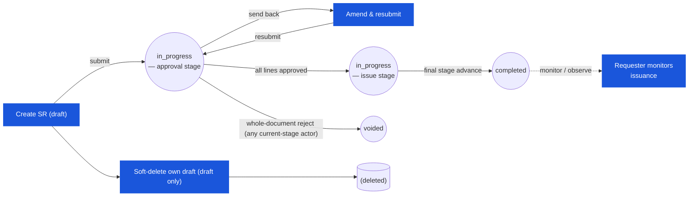

# Store Requisition — User Flow — Requester

> **At a Glance**
> **Persona:** Outlet Manager (consuming location) &nbsp;·&nbsp; **Module:** [store-requisition](/en/inventory/store-requisition) &nbsp;·&nbsp; **Workflow stages:** draft → in_progress (amend on send-back) &nbsp;·&nbsp; **Key permissions:** create / edit / submit draft, soft-delete own draft, amend after send-back
> ⚠️ **Corrected this pass:** "retract at first approval stage" and the SoD claim below are not backed by current source — see the callout in Section 1.
> **What this persona does:** Raises the SR — picks source/destination (the movement type is derived), adds lines with requested_qty, submits for approval (answering the open-period date prompt when asked), and amends on send-back.
> **Re-synced 2026-09-22:** no `sr_type` picker (derived server-side), `sr_no`/`sr_date` finalised at submit, department derived from the requester, no source-availability check at submit, Submit available on the unsaved form, Duplicate, owner-only single/batch delete, no auto-save.

## 1. Role in This Module

The **Requester** persona is the **Outlet Manager** (kitchen, bar, banquet, restaurant) — the person at the consuming location who identifies stock needs and raises the requisition against a source warehouse or central store. The Requester owns the editable `draft`: they pick the source location and destination outlet, see the movement type derived from the destination (`sr_type = issue` when the destination is `direct`, `transfer` otherwise — `deriveSrType()`, shown as a read-only label), add product lines with `requested_qty` and a required date (`expected_date`), attach supporting notes (recipe demand snapshot, banquet event detail, par-level rationale), and submit the document for approval. On entry the requester is logged in with create-SR permission and at least one SR workflow whose first stage allows create (`CreateWorkflowGate` on `/new`); the department is taken from the requester's `tb_department_user` membership (the form has no department picker — `resolveRequesterDepartment()`), and locations are limited to the ones the user is assigned to (`tb_location_user`). The SR states owned by this persona are `draft` (full edit rights, including soft-delete/withdrawal — confirmed restricted to `draft` only) and a sliver of `in_progress` — the requester can amend / resubmit when the current-stage actor sends the document back for correction (the requester stage is re-entered via the workflow). **Corrected this pass:** no confirmed action lets the requester retract an already-submitted (`in_progress`) SR — `store-requisition.service.ts` has no `cancel`/`withdraw` endpoint, only a `draft`-only soft-delete. The claim that "segregation of duties forbids the requester from approving their own SR" (`SR_AUTH_011`) is also unconfirmed — no `requestor_id` cross-check was found at the approve action in current source.

### Workflow position (Requester highlighted)

### Permission Matrix — V1 Status × Action (Requester)

The Requester holds full edit rights at `draft` and re-enters `in_progress` only when the current-stage actor sends the document back for correction. The claim that segregation of duties forbids the Requester from approving their own SR (`SR_AUTH_011`) is **unconfirmed** — no such check was found in `store-requisition.service.ts`.

| Action | `draft` | `in_progress` (send-back only) | `completed` | `voided` |
|---|---|---|---|---|
| Create SR | ✅ (`SR_AUTH_001`) | — | — | — |
| Edit header (locations, dates, description, dimension) | ✅ (`SR_AUTH_002`) | ✅ send-back only | ❌ | ❌ |
| Add / edit / delete lines (`requested_qty`) | ✅ (`SR_AUTH_002`) | ✅ send-back only | ❌ | ❌ |
| Attach supporting evidence (comments / attachments) | ✅ | ✅ | ❌ | ❌ |
| Submit for approval (`draft → in_progress`) | ✅ (`SR_AUTH_003`) | — | — | — |
| Resubmit after send-back | — | ✅ (`SR_AUTH_003`) | — | — |
| Soft-delete own draft (only confirmed withdrawal path; owner only, single or batch from the list) | ✅ (`SR_AUTH_004`) | ❌ — no confirmed `in_progress` withdrawal action | ❌ | — |
| Duplicate (view mode → `/new?duplicate_id=`) | ✅ | ✅ | ✅ | ✅ |
| View SR (read-only) | ✅ | ✅ | ✅ | ✅ |
| Approve own SR | Unconfirmed whether blocked — no SoD check found in code | Unconfirmed | — | — |

> ℹ️ **Send-back loop:** When an Approver sends the SR back for correction, the SR remains at `doc_status = in_progress` but the `workflow_current_stage` returns to the requester stage. The Requester amends and resubmits; already-approved lines are not reversed.

## 2. Entry Point and Primary Flow

**Entry point:** Three paths into draft creation.

- **SR module → New** — pick the workflow, source location and destination location (the destination lookup excludes the chosen source); the movement type label updates from the destination's `location_type`; **Add Item** is enabled once workflow + both locations are set.
- **Duplicate** — from a saved SR's view-mode header (`/new?duplicate_id=<id>`): header and lines are pre-filled, the form is dirty from the start, and saving creates a fresh draft.
- **Stock Replenishment wizard** — `POST .../stock-replenishment/sr` creates one draft per `(source, destination)` pair; the requester finds it in the list and continues from step 7.
- **Edit returned SR (send-back from approver)** — approver routed the document back to the requester stage with `review_message` per line; the requester re-enters the same workflow stage they originated, amends quantities / notes, and resubmits.

**Primary flow (happy path, 10 steps):**

1. **Identify the need.** Review the outlet's par levels, the upcoming production schedule (recipe demand, banquet event sheet), known stock-out points, and on-hand at the outlet. Decide the source location (typically the central store) and the destination (the requester's own outlet for `issue`, or another inventory store for `transfer`).
2. **Open the SR module → New.** Nothing is written until **Save** (or **Submit**, which saves first). On save the system writes `tb_store_requisition` at `doc_status = draft` with the placeholder `sr_no = draft-<hex>`; `requestor_id` defaults to the logged-in user and `department_id` is required by the create DTO (the client sends the user's department).
3. **Pick the source and destination locations.** Source is `from_location_id` (must be `inventory` or `consignment` — a `direct` source is rejected at save); destination is `to_location_id`, whose `location_type` decides `sr_type` (`direct` → `issue`, otherwise `transfer`). There is no movement-type picker and no compatibility error (`SR_VAL_003`).
4. **Enter header detail.** `sr_date` (defaults to today — only a placeholder until submit), `expected_date` (required by the form, must be on or after `sr_date`), `description`, and the cost-dimension `dimension` JSON if the outlet splits across multiple cost-centres.
5. **Add line items.** Search the product catalog by name, code, or category; pick a product. The screen surfaces a UI-only enrichment block showing current on-hand at the source, on-order, last price, last vendor, and the product's category / barcode (these are **not** stored on the SR line — see [store-requisition/01-data-model](/en/inventory/store-requisition/01-data-model) § 5 item 5). Enter `requested_qty` (decimals allowed; the unit is shown after the quantity) — the line total is fetched from the costing endpoint (`sr-item-cost-sync.tsx`) for display only. Each line writes one row to `tb_store_requisition_detail`. Repeat for each product needed.
6. **Split lines by cost-dimension if needed.** A single product on the same SR with two different cost-dimension allocations (e.g. 60% to Banquet, 40% to A-la-carte) is modelled as two separate lines, each with its own `dimension` JSON (per the unique index `SRT1_*`). Identical product+dimension is a duplicate (`SR_VAL_007`).
7. **Attach supporting evidence.** Recipe demand snapshot, event sheet, photos, par-level analysis, approval pre-clearance memo. Attachments are scoped to the SR header (via `tb_store_requisition_comment.attachments`) or to individual lines (via `tb_store_requisition_detail_comment.attachments`).
8. **Pre-submit review.** The per-row **Inventory Information** dialog (click, not hover) shows On Hand / On Order / Re-order / Re-stock at the source — informational only; **no source-availability check runs at submit** (`SR_VAL_009` unconfirmed). What *is* checked at submit: every product must be enabled at the destination location (`SR_VAL_015`), and the form must be complete (an incomplete form shows a toast and jumps to the field instead of opening the confirm dialog).
9. **Submit for approval.** Click **Submit** in the footer (available even on an unsaved new form — the client creates the draft and then calls `PATCH .../submit`). The backend derives the department if missing, runs `ValidateSRBeforeSubmitSchema` and the destination product check, freezes `sr_date` — if today is outside every open period the client receives `SR_DATE_PATTERN_REQUIRED` and shows a two-button dialog (**date in the open period** / **today**), then retries with `sr_date_pattern` — mints the real `sr_no`, sets `doc_status = in_progress`, initialises every line's `approved_qty = requested_qty`, advances the workflow to the first stage and populates `user_action.execute`, writes `workflow_history` and per-line `history`, and dispatches a submit notification. The document is no longer editable from the requester's hands (except via send-back).
10. **Track status until issuance.** The requester monitors progress: approver decisions land back as send-backs (returns to the requester stage) or advances (workflow moves on to the issue-tagged stage); on the final stage advance, the requester is notified that the goods are issued and on their way. There is no confirmed post-issuance "Receiver" acknowledgement or discrepancy-flag mechanism in current source (see [03-user-flow-receiver.md](./03-user-flow-receiver.md)) — any physical-receipt check at the destination is informal today; the closest system surface is a generic comment on the `completed` SR.

## 3. Decision Branches

- **Source on-hand lower than the request** — nothing blocks the submit (`SR_VAL_009` unconfirmed). The requester can see on-hand in the Inventory Information dialog and trim voluntarily; otherwise the approver trims, or the issue stage fails with `Insufficient stock` (`SR_VAL_013`).
- **Product not enabled at the destination** — submit is rejected with `The following products are not allowed in the destination location: <names>` (`SR_VAL_015`); remove the line or have the product enabled on the destination's product-location list.
- **Today is outside every open inventory period** — the date-pattern dialog appears (`SR_DATE_PATTERN_REQUIRED`). Choosing *open-period* dates the SR on the last day of the current open period (so it can be issued now); choosing *today* dates it in a period that is not open yet — the issue stage will refuse it with `SR_DATE_OUTSIDE_OPEN_PERIOD` until that period opens. If no period is open at all: `SR_NO_OPEN_PERIOD`.
- **Requester belongs to several departments** — `SR_DEPARTMENT_AMBIGUOUS` (422) at submit when the draft has no department; the client must supply `department_id`.
- **Split cost-dimension allocation**: the same product is requested with two different cost-centre splits (e.g. 60/40 between Banquet and A-la-carte). The requester adds two lines for the same `product_id`, each with its own `dimension` JSON (per the unique index `SRT1_*`). The two lines flow independently through approval and fulfilment.
- **Emergency / out-of-cycle SR**: the outlet has an immediate need outside the normal weekly replenishment cycle. The requester raises the SR with `description` flagged as emergency, sets `expected_date` to today / tomorrow, and may attach an emergency rationale memo; the approver and fulfiller see the urgency flag in their queues. There is no separate `emergency_flag` column on the schema — urgency is conveyed via `description` and `info` extension; the workflow may have an emergency-stage routing in tenant config.
- **Send-back from approver**: the approver routes the SR back to the requester stage with `review_message` per affected line. The requester sees the document in their queue at `doc_status = in_progress` but at the requester workflow stage; they may edit `requested_qty` or `description`, address the reviewer's note, and resubmit (which re-routes the document to the approval stage). Note: the requester cannot bypass an active send-back — they must respond.
- **Withdraw own SR** — there is no action to retract an already-submitted (`in_progress`) SR. The only pre-submit withdrawal is soft-deleting the `draft` — allowed only for the owner (`SR_DELETE_FORBIDDEN` otherwise), singly from the document or in bulk from the list (`DELETE .../batch`, all-or-nothing). Once submitted, the requester must ask the current-stage actor to reject the whole document (which sets `voided`, not `cancelled`).
- **Leaving the form with unsaved changes** — there is no auto-save; `useNavigationGuard` shows the *Discard changes?* dialog (**Keep editing** / **Discard**).

## 4. Exit Point / Handoffs

The Requester's involvement on a given SR ends at one of three confirmed boundaries:

- **Submit succeeds** — handoff to whoever holds the first workflow stage. The document is now `in_progress`; the requester is in monitor-only mode until either a send-back routes the document back or the workflow advances.
- **Send-back received** — temporary handoff **back to the Requester** at the requester workflow stage. The requester addresses the `review_message`, edits as needed, and re-submits. This is a loop within `in_progress`, not a status change.
- **Whole-document reject** — `in_progress → voided` (not `cancelled` — see the Section 1 correction note); document terminates; the requester may raise a new SR if the need persists.

After the final workflow-stage advance completes the SR, the Requester's role is to monitor for the goods arriving — there is no confirmed "Receiver" persona or discrepancy-flag mechanism in current source (see [03-user-flow-receiver.md](./03-user-flow-receiver.md)), so any post-commit acknowledgement is informal today.

## 5. References

- Parent overview: [03-user-flow.md](./03-user-flow.md) — the corrected lifecycle on `enum_doc_status` (`draft / in_progress / completed`, plus `voided` as the one reachable cancellation path — `cancelled` is enum-defined but unreachable), the global state machine that this persona's path traverses, and the cross-persona handoff table.
- `../carmen/docs/store-requisitions/SR-User-Experience.md` § Creating a Store Requisition — carmen/docs source for the requester (named "Alex Chen, Store Manager" in the persona narrative); journey steps map onto Section 2 above.
- `../carmen/docs/store-requisitions/SR-Overview.md` § User Roles → Requester row — carmen/docs source for the persona's responsibility scope.
- `../carmen/docs/store-requisitions/Store Requisitions.md` § UC-68 (Create and Manage Store Requisition) — use-case main success scenario for create / submit.
- Sibling: [03-user-flow-approver.md](./03-user-flow-approver.md) — downstream persona that picks up the SR after submit; handles the approve / trim / reject / send-back decisions.
- Sibling: [03-user-flow-fulfiller.md](./03-user-flow-fulfiller.md) — issuance persona; the Requester's outcome on the goods depends on the `issued_qty` recorded there.
- Sibling: [03-user-flow-receiver.md](./03-user-flow-receiver.md) — corrected this pass to document that no distinct Receiver persona was found in current source.
- Sibling: [03-user-flow-audit-config.md](./03-user-flow-audit-config.md) — corrected this pass; most of the oversight/config workspace it previously described was not found in current source.
- Sibling: [01-data-model.md](./01-data-model.md) — canonical `enum_doc_status`, `enum_sr_type`, and the `tb_store_requisition_detail` columns the requester writes (`product_id`, `requested_qty`, `dimension`).
- Sibling: [02-business-rules.md](./02-business-rules.md) — `SR_VAL_005`, `SR_VAL_014`–`SR_VAL_016` (submit-time gates the requester encounters), `SR_AUTH_001`–`SR_AUTH_004` (the requester's confirmed authority scope), `SR_POST_002`, `SR_POST_011` (owner-only soft-delete).
- Related: [stock-replenishment](/en/inventory/store-requisition/stock-replenishment) — the only confirmed auto-create path (`POST .../stock-replenishment/sr`).
- Related: [inventory](/en/inventory/inventory) — source on-hand visibility at line-entry time (UI-only enrichment, not persisted on the SR line) and the downstream inventory-transaction write the SR triggers on commit.
