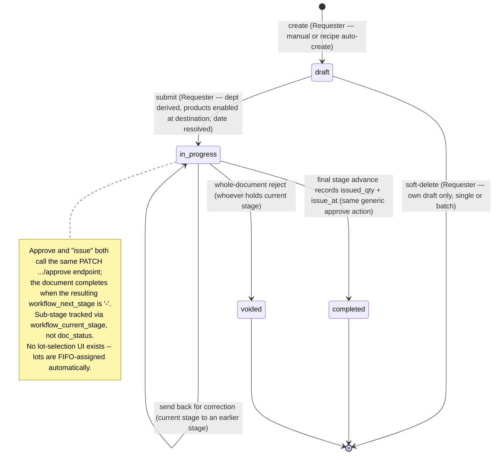

# Store Requisition — User Flow

> **At a Glance**
> **Module:** [store-requisition](/en/inventory/store-requisition) &nbsp;·&nbsp; **Personas:** Requester &nbsp;·&nbsp; Approver &nbsp;·&nbsp; Fulfiller (confirmed) &nbsp;·&nbsp; Receiver + Audit / Config (unconfirmed — correction pages)
> **Workflow lifecycle:** draft → in_progress (approval + issuance sub-stages) → completed, with voided as the one reachable cancellation (whole-document reject); `cancelled` is enum-defined but not reachable by any current code path
> **Drill into per-persona views below for action-level detail**
> **Re-synced 2026-09-22:** `sr_type` is derived from the two locations; `sr_date` / `sr_no` are finalised at submit; the issue date is resolved against the open period (date-pattern dialog); every workflow verb is `PATCH`; the quantity caps are not enforced; drafts are owner-deletable (single or batch); Duplicate and the Stock Movement tab exist.

## 1. Overview

This page is the **overview entry point** for the user-flow set of the `store-requisition` module. A Store Requisition (SR) is the document that records an **internal stock movement between locations** — a header row in `tb_store_requisition` together with one or more `tb_store_requisition_detail` lines. An SR may be a *consumption pull* (`sr_type = issue`, stock leaves inventory and lands as expense on the destination outlet's cost-centre) or an *inventory transfer* (`sr_type = transfer`, stock physically moves between two inventory-holding locations). The SR is the **system of record for internal stock movement**: until it commits, no inventory is decremented at source and no expense / inventory entry is raised at destination; once committed, the source on-hand falls, the destination either receives stock or absorbs cost, and the inventory transactions (with their lot, expiry, and cost-layer data) are written through the linked `tb_inventory_transaction`.

Section 2 below is the **global state machine** — the canonical list of legal transitions across the five values of `enum_doc_status` (`draft`, `in_progress`, `completed`, `cancelled`, `voided`), independent of who acts. Each per-persona file (linked from Section 3) describes that persona's *path through* the state machine — their entry point, the actions available to them, the decision branches they face, and the handoff that ends their involvement. Section 4 then summarises the cross-persona handoffs that stitch the individual paths together. Read this overview first to anchor the lifecycle, then drill into the persona file that matches your role.

A note on workflow stages: unlike GRN where approval and fulfilment are separate header statuses, the SR collapses both phases under the single `in_progress` value. The `workflow_current_stage` field is what distinguishes "awaiting approver" from "awaiting issuer". So the state machine in Section 2 lists only the legal `doc_status` moves; intra-`in_progress` stage advances (approve, send-back, route to the issue-tagged stage) are workflow-internal and do not change `doc_status`.

## 2. Document Lifecycle

> ⚠️ **Corrected this pass.** The previous version of this section described `cancelled` as a real, reachable state (requester withdrawal, all-lines-rejected auto-cancel) and `voided` as a separate Inventory-Controller/Sysadmin-only administrative path. Direct reads of `store-requisition.service.ts` show neither is accurate: `cancelled` is never assigned by any current service method, and `voided` is set unconditionally by the same whole-document reject action any current-stage actor can invoke. See [01-data-model.md](./01-data-model.md) §5 item 11 and [02-business-rules.md](./02-business-rules.md) §5 for the full correction.

The SR document status is stored on `tb_store_requisition.doc_status` and constrained to the five values declared in the shared `enum_doc_status`: `draft` (initial editable state, no stock impact, line entry by requester), `in_progress` (submitted and under workflow control; still no stock impact until the final stage), `completed` (single posting event has fired — inventory decremented at source, cost-layer consumed, destination receives stock or an unposted expense, document locked), `cancelled` (enum-defined but not reachable by any current code path), and `voided` (the confirmed destination of a whole-document reject; no inventory impact). The transitions below cover the legal moves between them; everything else is rejected by the workflow engine. Downstream effects (source on-hand decrement, destination on-hand increment for `transfer`) fire on the final workflow-stage advance only — see [02-business-rules.md](./02-business-rules.md) Section 5 for posting rules. GL/journal-entry posting is unconfirmed in current source.

> ℹ️ **Note — intra-`in_progress` stages:** The `in_progress` self-loop covers however many stages the tenant's `tb_workflow` configuration defines, all sharing the same `doc_status`. The actual sub-stage is tracked via `tb_store_requisition.workflow_current_stage`. There is no confirmed distinction in the backend between an "approval" stage and a "fulfilment" stage beyond which `enum_stage_role` tag the current stage carries (`approve` vs `issue`) — both act through the identical `/approve` endpoint.

| From state | Action | To state | Allowed for | Pre-conditions |
| ---------- | ------ | -------- | ----------- | -------------- |
| `(none)` | create | `draft` | Requester | Create DTO requires `workflow_id`, `department_id`, `from_location_id`, `to_location_id`, `sr_date`; `sr_type` is derived from the two locations (`deriveSrType()` — a `direct` source is rejected); `sr_no` is the placeholder `draft-<hex>`. Lines may be empty. `/new` is wrapped in `CreateWorkflowGate` — a user with no SR workflow that allows create sees `AccessDeniedBlock`. The **Submit** button is already enabled on the unsaved form: the client saves first, then submits. |
| `(none)` | auto-create from stock replenishment | `draft` | Requester via `POST /api/{bu}/stock-replenishment/sr` | Below-par rows become one SR draft per `(from_location, location_id)` pair through the ordinary `StoreRequisitionLogic.create()` (`SR_XMOD_011`). The previously listed recipe auto-create path has no code behind it (`SR_XMOD_006`, unconfirmed). |
| `(none)` | duplicate | `draft` | Requester | **Duplicate** in the view-mode header opens `/store-operation/store-requisition/new?duplicate_id=<id>` with header and lines pre-filled (`buildSrDuplicateValues`); saving creates a new draft. |
| `draft` | edit / save | `draft` | Requester (owner) | Header and line validation rules in [02-business-rules.md](./02-business-rules.md) Section 2 pass at save (warn-only for some) or block on submit; document remains editable. |
| `draft` | submit | `in_progress` | Requester (owner) | `PATCH .../submit`. Department derived from the requester if missing (`SR_VAL_005`); `ValidateSRBeforeSubmitSchema` (workflow, requester, department, ≥ 1 line with `requested_qty > 0`); every product enabled at the destination (`SR_VAL_015`); `sr_date` frozen via `resolveSubmitSrDate()` — outside an open period the client is asked to pick `open-period` / `today` (`SR_VAL_014`/`016`); `sr_no` minted. No source-availability check exists. Workflow engine routes to the first stage and populates `user_action.execute`; every line's `approved_qty` is initialised to `requested_qty`. |
| `draft` | soft-delete (only confirmed pre-submit withdrawal) | `(deleted)` | Requester (own draft) | Restricted to `doc_status = draft` **and** the document owner (`SR_DELETE_FORBIDDEN` otherwise; platform super-admin bypass). The list offers a batch delete (`DELETE .../store-requisitions/batch`, all-or-nothing). There is no `in_progress` withdrawal action. |
| `in_progress` | approve / trim / reject line (mix of approve+reject in one call; not mixable with review) | `in_progress` | Whoever is in `user_action.execute` for the current stage | `PATCH .../approve`. The cap `approved_qty ≤ requested_qty` is **not enforced** (`SR_VAL_010`). `workflow_current_stage` advances per the workflow's routing (`SR_XMOD_008`). Segregation-of-duties checks are unconfirmed — no such code was found. |
| `in_progress` | send back (`PATCH .../review`, whole-call action) | `in_progress` | Whoever is in `user_action.execute` for the current stage | Requires a destination stage (`des_stage`, picked from `GET .../workflow-previous-step-list`); message optional. Sets `last_action = reviewed`; `doc_status` unchanged. The requester resubmits through the same `PATCH .../submit`, which accepts `in_progress + reviewed` and keeps `sr_no` / `sr_date`. |
| `in_progress` | final stage advance, records `issued_qty` | `completed` | Whoever is in `user_action.execute` for the stage tagged `enum_stage_role.issue` | Same `PATCH .../approve` endpoint as any other stage (`stage_role: "issue"`); `resolveIssueDate()` runs first — the SR's own date must be in an open period, and outside an open period the client is asked for `issue_date_pattern` (`today` refused). Completes when `workflow_next_stage === '-'`; stamps `issue_at` / `issue_by_id`; triggers source on-hand decrement and, for `sr_type = transfer`, destination on-hand increment via `executeTransferOnComplete` (movement dated `issue_at`). Lot assignment is automatic FIFO; `Insufficient stock` at the source throws inside the fan-out. |
| `in_progress` | whole-document reject | `voided` | Whoever is in `user_action.execute` for the current stage | Not restricted to an "admin" role — the same reject action is available to whoever currently holds the stage. Reason text optional per the reject dialog (maxLength 256, no minimum). No inventory impact (the SR never posted). |
| `completed` | (no further status transition) | `completed` | — | Terminal state. Corrections require a compensating adjustment in `[inventory-adjustment](/en/inventory/inventory-adjustment)`; the SR itself remains locked. The **Stock Movement** tab (`GET .../stock-movements`) now shows the posted lots and costs (`is_posted = true`). No confirmed receiver-acknowledgement or discrepancy-flag action exists against a `completed` SR — see [03-user-flow-receiver.md](./03-user-flow-receiver.md). |
| `voided` | (no further action) | `voided` | — | Terminal state. Retained for audit. |

## 3. Persona Index

Each persona below has a dedicated drill-down file describing their entry point, primary flow, decision branches, and exit point. Slugs match the persona role; clicking the link opens the per-persona view. The five-persona grouping collapses the six raw carmen/docs personas (Store Manager, Warehouse Supervisor, Department Head, Finance Manager, Inventory Controller, System Administrator + Auditor) into five operational roles.

- [Requester](./03-user-flow-requester.md) — Outlet Manager who identifies stock needs at the consuming location, creates the SR, adds items with `requested_qty` and required date, attaches supporting notes, submits the document for approval, and tracks status.
- [Approver](./03-user-flow-approver.md) — Department Head who reviews submitted requisitions against operational need and source availability; approves, trims `approved_qty` down from `requested_qty`, rejects lines, or sends it back for correction. Per-line approval signature persisted directly on `tb_store_requisition_detail`.
- [Fulfiller](./03-user-flow-fulfiller.md) — Whoever holds the workflow stage tagged `enum_stage_role.issue` (Store Keeper), who records `issued_qty` per line via the same generic approve action the Approver uses. Lots are FIFO-assigned automatically; there is no lot-selection UI.
- [Receiver](./03-user-flow-receiver.md) — **Corrected this pass: unconfirmed as a distinct persona.** No receiver route, permission key, or discrepancy-flag mechanism was found in current source; see the page for what is and isn't confirmed.
- [Audit / Config](./03-user-flow-audit-config.md) — **Corrected this pass: largely unconfirmed.** The "Inventory Controller / Finance / Sysadmin / Auditor" workspace this page previously described (RBAC console, GL verification, SoD-relaxation thresholds) has no matching route or code; see the page for what is and isn't confirmed.

## 4. Cross-Persona Handoffs

The table below captures the moments where the SR moves from one persona's responsibility to another's. Each handoff is anchored to the document state (and where relevant the `workflow_current_stage`) at the point of transfer.

| From persona | Trigger | To persona | Document state at handoff |
| ------------ | ------- | ---------- | ------------------------- |
| Requester | Submit for approval | Approver | `in_progress` (first stage; `user_action.execute` populated with first-stage users) |
| Approver | Send back for correction | Requester | `in_progress` (workflow routed back to requester stage; per-line `review_message` written) |
| Approver | All lines approved at final approval stage | Fulfiller (next stage's users, same `/approve` mechanism) | `in_progress` (workflow advances; `user_action.execute` populated with users at the next stage) |
| Approver / Fulfiller | Whole-document reject | (terminal — `voided`) | `voided`, not `cancelled` — see the correction note in Section 2. No inventory impact. |
| Fulfiller | Records `issued_qty`, final stage completes | (no confirmed downstream persona) | `completed` (source on-hand decremented; destination on-hand incremented for `transfer` or no destination on-hand change for `issue`; lot data auto-assigned on linked inventory transaction). No confirmed "Receiver" handoff exists — see [03-user-flow-receiver.md](./03-user-flow-receiver.md). |
| Fulfiller | Hits at-issue stock-out and records partial | — | `completed` (with `issued_qty < approved_qty` on one or more lines). No confirmed alerting/notification mechanism specific to this case was found. |
| Stock replenishment (auto-create) | Purchaser/requester raises SRs from the below-par list | Requester | `draft` (one per `(from_location, location_id)` pair, created by `POST .../stock-replenishment/sr`). The recipe auto-create row previously listed here has no code behind it. |

Rows describing a "Receiver" or "Inventory Controller / Sysadmin / Finance" persona acting on the SR after commit were removed this pass — see [03-user-flow-receiver.md](./03-user-flow-receiver.md) and [03-user-flow-audit-config.md](./03-user-flow-audit-config.md) for what was checked and what remains unconfirmed.

## 5. References

- `../carmen/docs/store-requisitions/SR-User-Experience.md` — carmen/docs user-experience source: persona descriptions (Store Manager / Warehouse Supervisor / Department Head / Finance Manager), user journeys (Create / Approve / Process), and the legacy 6-state lifecycle diagram (`Draft → Submitted → UnderReview → Approved → InProcess → Fulfilled → Completed`) — note that diagram is **not** canonical here; this page follows the Prisma five-value `enum_doc_status` (`draft / in_progress / completed / cancelled / voided`).
- `../carmen/docs/store-requisitions/SR-Overview.md` — carmen/docs module overview: purpose, scope, audience, integration points; the Section 2 lifecycle and the Section 4 handoffs are aligned to the Prisma enum, not to the Overview's `In Process / Complete / Reject / Void / Draft` five-state which collapses into the Prisma enum as documented in [01-data-model.md](./01-data-model.md) Section 5 item 1.
- `../carmen/docs/store-requisitions/Store Requisitions.md` — Use cases UC-64 (Approve), UC-65 (Deny), UC-66 (Modify), UC-67 (Monitor), UC-68 (Create and Manage), UC-69 (Approve and Record Stock as Issued); the Requester, Approver, and Fulfiller persona files draw their primary-flow steps from these.
- Sibling: [01-data-model.md](./01-data-model.md) — canonical `enum_doc_status`, `enum_sr_type`, and the three-quantity invariant (`requested_qty / approved_qty / issued_qty`) referenced throughout Section 2.
- Sibling: [02-business-rules.md](./02-business-rules.md) Section 5 — posting effects and authorization gates referenced by each row of Section 2.
- Related modules: [inventory](/en/inventory/inventory) (downstream — on commit the source's on-hand falls and the destination's rises for `transfer`; lot, expiry, and cost-layer data live on the linked inventory transaction), [costing](/en/inventory/costing) (source-location FIFO / moving-average feeds the issued unit cost), [stock-replenishment](/en/inventory/store-requisition/stock-replenishment) (the only confirmed auto-create path; recipe-driven SR creation is unconfirmed), [good-receive-note](/en/inventory/good-receive-note) (inter-location transfers may pair an SR-OUT at source with a GRN-IN at destination), [inventory-adjustment](/en/inventory/inventory-adjustment) (post-commit corrections).
