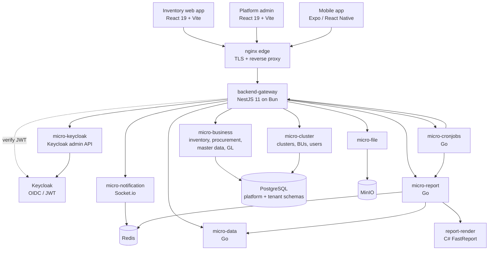
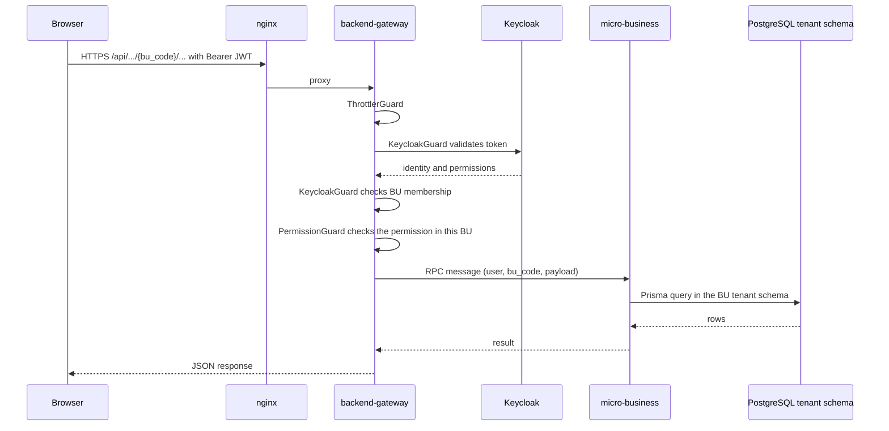
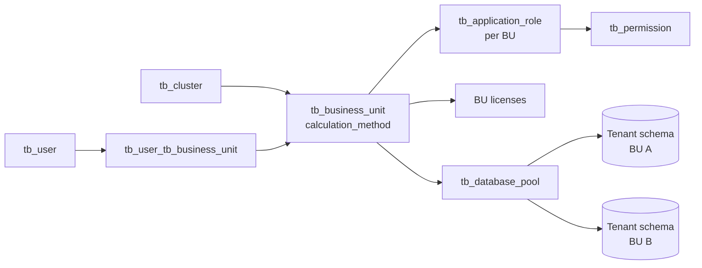
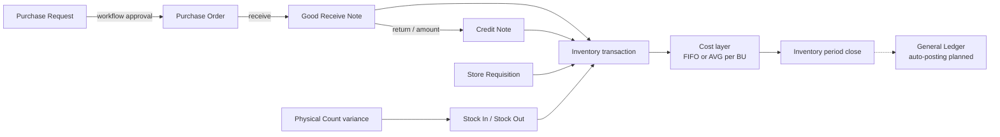

# System Overview

One page to orient yourself before diving into the [Inventory](/en/inventory) or [Platform](/en/platform) books: what Carmen does, why it exists, what it must satisfy, what it is built with, and how the pieces connect.

> **At a glance** — Carmen is a multi-tenant SaaS ERP that runs the procurement → receiving → inventory → costing chain for hotels and restaurants in Thailand. Browsers talk to one NestJS **backend gateway**, which fans out to domain microservices and Go sidecar services over PostgreSQL with one **platform schema** plus one **tenant schema per business unit**.

## 1. What Carmen Is

Carmen is a procurement-to-inventory ERP for hospitality operators — hotels, resorts and restaurant groups with several outlets or properties. It covers:

| Area | What it manages | Book |
|------|-----------------|------|
| Procurement | Purchase requests, purchase orders, goods received notes (GRN), credit notes, vendor price lists | [Inventory](/en/inventory) |
| Inventory | Stock movements, store requisitions, stock in/out adjustments, physical count, spot check, period close | [Inventory](/en/inventory) |
| Costing | FIFO or weighted-average cost layers, chosen per business unit | [Costing](/en/inventory/costing) |
| Master data | Products, categories, units and conversions, vendors, locations, recipes | [Inventory](/en/inventory) |
| Accounting | General Ledger foundation — chart of accounts, journal vouchers, GL periods, budgets | [General Ledger](/en/inventory/general-ledger) |
| Reporting | Templated reports (FastReport `.frx`), dashboards, scheduled exports | [Reporting & Audit](/en/inventory/reporting-audit) |
| Platform administration | Clusters, business units, users, RBAC, licenses, report templates | [Platform](/en/platform) |

Currency throughout is Thai Baht (฿).

## 2. Why It Exists

Hospitality purchasing is high-volume, perishable and spread across many outlets. Without one system, each property buys, receives and counts stock in its own way, and food cost is only known after month-end. Carmen exists to close that gap.

| Business problem | How Carmen addresses it |
|------------------|-------------------------|
| Purchasing without control — anyone can order from any vendor at any price | Purchase requests go through a configurable approval **workflow** (`tb_workflow` stages) before becoming purchase orders; vendor price lists drive the price |
| Food and beverage cost is invisible until month-end | Every receipt and issue creates an inventory transaction with a **cost layer**, so stock value and cost are known per movement |
| Multi-property groups cannot see or govern all outlets | A **cluster** groups business units; users, roles and licenses are managed centrally in the Platform admin |
| Stock on the books differs from stock on the shelf | **Physical count** posts the variance as stock in/out; **spot check** compares balances without posting |
| Finance needs defensible numbers | **Period close** snapshots cost layers; a General Ledger foundation holds journal vouchers and GL periods |
| Changes need traceability | Soft deletes, `doc_version` optimistic locking, comment threads and activity logs on documents |

Target users (from the Master PRD in `carmen/docs/prd`): procurement managers, inventory controllers, store and kitchen managers, finance controllers, F&B directors and system administrators.

## 3. Requirements

### 3.1 Functional Requirements

| # | Requirement | Where it is documented |
|---|-------------|------------------------|
| F1 | Raise, approve, reject and send back purchase requests through multi-stage workflows | [Purchase Request](/en/inventory/purchase-request) |
| F2 | Convert approved requests into purchase orders and send them to vendors | [Purchase Order](/en/inventory/purchase-order) |
| F3 | Receive goods against a PO or directly, including extra (landed) cost | [Good Receive Note](/en/inventory/good-receive-note) |
| F4 | Return goods or credit amounts against a GRN | [Credit Note](/en/inventory/purchase-order/credit-note) |
| F5 | Move stock between locations and issue to outlets | [Store Requisition](/en/inventory/store-requisition) |
| F6 | Adjust stock with typed reasons | [Inventory Adjustment](/en/inventory/inventory-adjustment) |
| F7 | Count stock and post variances; spot-check without posting | [Physical Count](/en/inventory/physical-count), [Spot Check](/en/inventory/spot-check) |
| F8 | Value stock with FIFO or weighted average per business unit | [Costing](/en/inventory/costing) |
| F9 | Maintain products, units, vendors, locations, price lists and recipes | [Product](/en/inventory/product), [Master Data](/en/inventory/master-data), [Vendor Pricelist](/en/inventory/vendor-pricelist), [Recipe](/en/inventory/recipe) |
| F10 | Produce templated and scheduled reports and dashboards | [Reporting & Audit](/en/inventory/reporting-audit), [Dashboard](/en/inventory/dashboard) |
| F11 | Administer clusters, business units, users, roles and licenses | [Platform](/en/platform) |

### 3.2 Non-Functional Requirements

| Concern | Requirement | How it is met |
|---------|-------------|---------------|
| Multi-tenancy | One business unit's data must never leak into another's | Shared **platform schema** for cross-tenant config; isolated **tenant schema** per business unit; `bu_code` in tenant API paths |
| Access control | Users act only within the BUs and permissions granted to them | Keycloak (OIDC/JWT) authentication; per-BU application roles mapped to permissions; `KeycloakGuard` then `PermissionGuard` on routes |
| Concurrency | Two users editing the same document must not silently overwrite each other | `doc_version` column on documents (optimistic locking) |
| Auditability | Records are traceable and recoverable | Soft deletes, comment threads on documents, activity events |
| Licensing | Features are enabled per cluster / BU | License and feature-group tables in the platform schema; license interceptor in the gateway |
| Reporting load | Large reports must not block the API | Synchronous rendering up to a row limit, otherwise an async job queued in Redis |
| Observability | Services can be traced in production | OpenTelemetry export to SigNoz |

## 4. Tech Stack

Versions are as declared in each repository's manifest (`package.json`, `go.mod`, `.csproj`), verified 2026-09-23.

| Layer | Component | Technology |
|-------|-----------|------------|
| Client | Inventory web app | React 19, Vite 7, TypeScript 5.9, Tailwind 4, React Router 7, TanStack Query 5, react-hook-form + Zod, Radix UI |
| Client | Platform admin | React 19, Vite 8, TypeScript 5.9, Tailwind 4, shadcn/ui, React Router 7 |
| Client | Mobile app | Expo 56, React Native 0.85 |
| Edge | Reverse proxy | nginx (TLS termination, proxy to gateway and web apps) |
| API | Backend gateway | NestJS 11 on Bun, Swagger, WebSocket |
| Domain services | micro-business, micro-cluster, micro-file, micro-keycloak, micro-notification | NestJS 11, Prisma 7, HTTP-as-RPC transport, Turborepo monorepo |
| Sidecar services | micro-report, micro-cronjobs, micro-data | Go 1.25, Gin, GORM, gocron |
| Report rendering | report-render | C# ASP.NET Core (.NET 8), FastReport OpenSource |
| Data | Database | PostgreSQL (platform schema + tenant schemas) |
| Data | Cache / queue | Redis (asynq jobs) |
| Data | Files | MinIO object storage |
| Identity | Authentication | Keycloak (OIDC / JWT) |
| Real-time | Notifications | Socket.io |
| Ops | Observability | OpenTelemetry → SigNoz |
| QA | Tests and API contracts | Playwright (E2E), Bruno (API collections) |
| Docs | This wiki | Wiki.js with git storage |

## 5. Diagrams

### 5.1 System Architecture

The gateway is the single HTTP entry point. NestJS services behind it are called over an HTTP-as-RPC transport (`@MessagePattern`); the Go services are plain HTTP sidecars. The browser never calls a microservice directly.

### 5.2 Life of One API Request

For testers, the status code tells you which check failed:

| Status | Raised by | Meaning |
|--------|-----------|---------|
| `400` | `KeycloakGuard` | `bu_code` missing on a BU-scoped route |
| `401` | `KeycloakGuard` | Token missing, invalid or expired |
| `403` | `KeycloakGuard` | Authenticated, but not a member of the requested BU |
| `403` | `PermissionGuard` | Member of the BU, but the role lacks the route's permission |
| `429` | `ThrottlerGuard` | Rate limit exceeded |

### 5.3 Multi-Tenancy Model

Everything except the tenant schemas lives in the shared **platform schema** and is managed in the [Platform](/en/platform) book. Each business unit's documents — PRs, POs, GRNs, stock, cost layers, GL — live in its own **tenant schema**. The BU's `calculation_method` decides whether its stock is costed FIFO or weighted average.

### 5.4 Procurement-to-Inventory Flow

Every stock-affecting document funnels into `tb_inventory_transaction` and its cost layer. Spot check reads balances only and never creates a transaction. Documents do **not** post to the GL automatically today — journal vouchers are created manually or by template runs; automatic posting is planned (dashed line).

## 6. Repository Map

Where to look when this wiki is not enough. Implementation and E2E tests are the source of truth; design docs come second.

| Repository | Source of truth for |
|------------|---------------------|
| `carmen-inventory-frontend-react` | Inventory screens, routes and client-side validation |
| `carmen-platform` | Platform admin screens (clusters, BUs, users, RBAC, report templates) |
| `carmen-inventory-mobile` | Mobile screens |
| `carmen-turborepo-backend-v2` | Gateway routes and guards, domain logic, Prisma schemas (`packages/prisma-shared-schema-platform`, `-tenant`), nginx and k8s config |
| `micro-report`, `report-render` | Report data building and `.frx` rendering |
| `micro-cronjobs` | Scheduled jobs (scheduled reports, GL template runs, cleanup) |
| `micro-data` | Dataset execution for dashboards and widgets |
| `carmen-turborepo-backend-bruno` | Exact API request and response shapes |
| `carmen-inventory-frontend-e2e`, `carmen-platform-e2e` | Executable expected behaviour (Playwright) |
| `carmen/docs` | Design concepts and business requirements |

Adjacent systems outside this wiki's scope: the Knowledge Base / AI chat (`knowledge-base-carmen`) and the planned accounting modules beyond GL (AP, AR, fixed assets, tax — `carmen-accounting-concept`).

## 7. Where to Go Next

- [Carmen Inventory book](/en/inventory) — module-by-module reference for inventory, procurement and costing
- [Carmen Platform book](/en/platform) — clusters, business units, users, RBAC and report templates
- [Costing](/en/inventory/costing) — how FIFO and weighted-average cost layers are calculated
- [Access Control](/en/inventory/access-control) — how permissions apply inside a business unit
