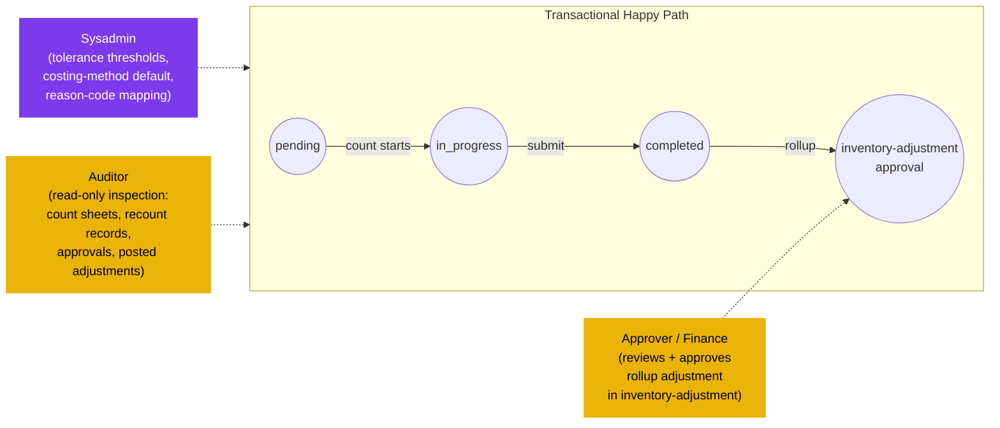

# Physical Count — User Flow — Audit / Config

## 1. Persona

This persona group collapses three roles whose touch on the physical-count module is approval, observation, or configuration:

- **Approver / Finance Reviewer** — reviews completed counts and rollup adjustments, validates variance reasonableness against historical patterns, approves the variance-adjustment document, signs off financial impact at period close.
- **Auditor** — observes a sample of counts in progress, inspects the full chain end-to-end (count sheets, recount records, approvals, posted adjustments, journal entries) for compliance, segregation-of-duties, and policy adherence.
- **Sysadmin** — configures tenant defaults: tolerance thresholds for variance flagging (`PHC_VAL_007`), the default `enum_physical_count_costing_method`, and reason-code mapping for `COUNT_OVERAGE` / `COUNT_SHORTAGE` in [[inventory-adjustment]].

Authority anchor for `PHC_AUTH_003`.

### Position relative to the transactional flow (off-path observers)

### Permission Matrix — V6 Action × Sub-persona (Audit / Config)

All three sub-personas are non-transactional within the physical-count module — none creates, edits, submits, or re-opens count documents. Approver / Finance approval action lands on the rollup adjustment in [[inventory-adjustment]], not on `tb_physical_count`. Rows are derived from Section 3 (Primary Actions) of this file; rule citations refer to [[physical-count/02-business-rules]] § 4 / § 5.

| Action | Approver / Finance | Auditor | Sysadmin |
|---|---|---|---|
| View count period / count document / count detail (read-only) | ✅ | ✅ (`PHC_AUTH_003`) | ✅ |
| View recount comment threads and counter zone-assignments | ✅ | ✅ (`PHC_AUTH_003`) | ✅ |
| View rollup adjustment (`tb_stock_in` / `tb_stock_out`) in [[inventory-adjustment]] | ✅ | ✅ | ✅ |
| Review variance lines + linked `info.countId` back to source count | ✅ (`PHC_AUTH_003`) | ✅ | ❌ |
| Approve rollup adjustment (`in_progress → completed`) | ✅ (`ADJ_AUTH_*` in [[inventory-adjustment]]) | ❌ | ❌ |
| Reject rollup adjustment (return to Count Lead) | ✅ | ❌ | ❌ |
| Observe count in progress (sample-based; add observation comment) | ❌ | ✅ (`PHC_AUTH_003`) | ❌ |
| Inspect full chain (count sheet → recount → approvals → posted adj → inventory tx) | ❌ | ✅ (`PHC_AUTH_003`) | ❌ |
| Configure tolerance threshold (`PHC_VAL_007` default) | ❌ | ❌ | ✅ (`PHC_AUTH_003`) |
| Configure costing-method default (`enum_physical_count_costing_method`) | ❌ | ❌ | ✅ (`PHC_AUTH_003`) |
| Configure reason-code mapping (`COUNT_OVERAGE` / `COUNT_SHORTAGE` → GL account) | ❌ | ❌ | ✅ (`PHC_AUTH_003`) |
| Create / edit / submit count documents | ❌ | ❌ | ❌ |
| Re-open completed count (`PHC_VAL_008`) | ❌ | ❌ | ❌ |

> ℹ️ **Approval scope note:** Approver / Finance approval authority is exercised on the rollup `tb_stock_in` / `tb_stock_out` document in [[inventory-adjustment]], not directly on `tb_physical_count`. The physical-count document itself is terminal at `completed`; only the rollup adjustment progresses to GL posting. This means the Approver / Finance column above applies at the inventory-adjustment boundary, not at the physical-count boundary.

## 2. Entry Points

- **My approvals** — Approver / Finance: queue of rollup `tb_stock_in` / `tb_stock_out` documents in `in_progress` per [[inventory-adjustment]] `ADJ_AUTH_*`. Note: the approval lands on the adjustment document, not on `tb_physical_count`.
- **Audit log** — Auditor: read-only view across periods, count documents, recount comment threads, rollup adjustments, journal entries.
- **Configuration screens** — Sysadmin: tolerance / costing-method / reason-code admin pages.

## 3. Primary Actions

| Action | Persona | State precondition | State effect | Notes |
| ------ | ------- | ------------------ | ------------ | ----- |
| Review rollup variance adjustment | Approver / Finance | Rollup `tb_stock_in` / `tb_stock_out` in `in_progress` | (read) variance lines + linked `info.countId` back to source count | Cross-reference [[inventory-adjustment/03-user-flow-finance]]. |
| Approve rollup adjustment | Approver / Finance | All ADJ-side validations pass | Adjustment moves to `completed`; writes `tb_inventory_transaction` | The approval IS the financial sign-off. |
| Reject rollup adjustment | Approver / Finance | Variance unreasonable / under-investigated | Adjustment returns to `draft`; Count Lead must investigate | May trigger a recount or a hold pending operational reconciliation. |
| Observe count in progress | Auditor | Count document in `in_progress` | (read) live `actual_qty` entries, counter zone-assignments, recount flags | Sample-based; observation note stored as count comment. |
| Inspect full chain | Auditor | Count `completed`; rollup adjustment `completed` | (read) count sheet → recount records → approvals → posted adjustment → inventory transaction → journal entry | The full audit trail. |
| Configure tolerance threshold | Sysadmin | (any) | New tenant default for `PHC_VAL_007` | Applied to future counts. |
| Configure costing-method default | Sysadmin | (any) | New tenant default for `enum_physical_count_costing_method` | Applied to future rollups. |
| Configure reason-code mapping | Sysadmin | (any) | `tb_adjustment_type` rows for `COUNT_OVERAGE` / `COUNT_SHORTAGE` with `info.glAccount` | Per [[inventory-adjustment/01-data-model]] § 2.1. |

## 4. Decision Points

- **Approver / Finance — approve, reject, or escalate.** Approve when variance is within historical norms and the count process was followed; reject and request investigation when variance is anomalous (unusually large positive overage, suspiciously round shortage); escalate to a higher-tier approver when financial impact exceeds threshold per `ADJ_AUTH_005`.
- **Auditor — observe early or inspect late.** Observation during `in_progress` catches process-discipline issues; late inspection of `completed` count + adjustment chain verifies that documentation is intact for external audit.
- **Sysadmin — strictness vs operational friction.** Tighter tolerance (low %) catches more variance but creates more recount overhead; looser tolerance speeds counts but may mask shrinkage. Costing-method choice (`standard` vs `last` vs `average`) shifts how variance value is computed.

> **TODO:** Source the exact configuration UI for tolerance / costing-method admin from `../carmen-inventory-frontend/`; confirm whether tolerance is per-tenant, per-location, or per-category.

## 5. Exit / Handoff

| Trigger | Handoff to | Artefact |
| ------- | ---------- | -------- |
| Approver / Finance approves rollup adjustment | [[inventory]] ledger (system) | `tb_inventory_transaction` written; GL journal entry posted. |
| Approver / Finance rejects rollup adjustment | Count Lead | Rollup `tb_stock_in` / `tb_stock_out` returned to `draft`. |
| Auditor completes inspection | (read-only, no state change) | Audit report (external artefact). |
| Sysadmin updates config | (configuration applied to next count) | Updated tenant default values. |

## 6. References

- **Primary (TODO):** carmen/docs source — does not exist for this module.
- **Frontend (TODO):** `../carmen-inventory-frontend/` — approval queue and admin configuration screens.
- **E2E (TODO):** `../carmen-inventory-frontend-e2e/tests/` — no physical-count spec currently exists.
- Related: [[physical-count/03-user-flow]] (overview), [[physical-count/02-business-rules]] (`PHC_AUTH_003`, `PHC_VAL_007`, `PHC_POST_002`), [[inventory-adjustment/03-user-flow-finance]] (rollup-side approver flow), [[inventory-adjustment/03-user-flow-audit-config]] (parallel audit / config flow on the adjustment side).
