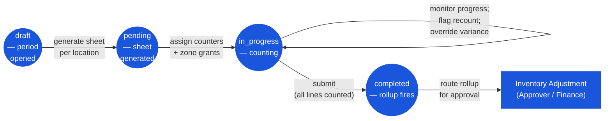

# Physical Count — User Flow — Count Lead

## 1. Persona

**Count Lead** — Inventory Controller / Inventory Manager. The single owner of the count exercise: schedules the period, configures scope (location, categories, mode — frozen vs live), assigns counters and zones, generates and distributes count sheets, monitors progress, resolves discrepancies via recounts, and triggers the variance rollup to [[inventory-adjustment]]. Authority anchor for `PHC_AUTH_001`.

### Workflow position (Count Lead highlighted)

### Permission Matrix — V1 Status × Action (Count Lead)

The Count Lead is the single owner of the count exercise — the only persona who can open periods, generate sheets, assign counters, flag recounts, and submit. Rows are derived from Section 3 (Primary Actions) of this file; rule citations refer to [[physical-count/02-business-rules]] § 4 / § 5.

| Action | Period `draft` | Count `pending` | Count `in_progress` | Count `completed` |
|---|---|---|---|---|
| Open count period (`tb_physical_count_period`) | ✅ (`PHC_VAL_001` — tb_period open) | — | — | — |
| Generate count sheet for (period, location) | ✅ | ✅ (`PHC_VAL_002`–`PHC_VAL_003`) | — | — |
| Set count mode (`physical_count_type`: frozen / live) | ✅ | ✅ (before in_progress only) | ❌ (`PHC_VAL_002` — immutable once started) | ❌ |
| Assign counter(s) to zone | — | ✅ (`PHC_AUTH_004`) | ✅ | ❌ |
| Monitor progress (`product_counted` vs `product_total`) | — | ✅ | ✅ (`PHC_CALC_004`) | ✅ (read-only) |
| Flag variance line for recount (`PHC_VAL_007`) | — | — | ✅ (`PHC_AUTH_001`) | ❌ |
| Override / accept variance (countersignature) | — | — | ✅ (`PHC_AUTH_001`) | ❌ |
| Submit count (`in_progress → completed`) | — | — | ✅ (`PHC_AUTH_001`; `PHC_VAL_004` — all lines counted; `PHC_POST_001` rollup fires) | — |
| Route rollup adjustment for approval | — | — | — | ✅ — to Approver / Finance via [[inventory-adjustment]] |
| Edit lines after completion | — | — | — | ❌ (`PHC_VAL_008` — immutable; raise manual adjustment) |

## 2. Entry Points

- **Period scheduler / calendar** — open a new `tb_physical_count_period` at fiscal period-end or per cycle-count cadence.
- **Count document list** — drill into an existing period to add `tb_physical_count` documents per location.
- **My queue** — recount-flagged lines and pending submissions awaiting Count Lead action.
- **Notifications** — counter completion alerts, variance-breach alerts.

## 3. Primary Actions

| Action | State precondition | State effect | Notes |
| ------ | ------------------ | ------------ | ----- |
| Open count period | `tb_period` is open per `INV_VAL_008` | New `tb_physical_count_period` in `draft` | Per `PHC_VAL_001`. |
| Generate count sheet | Period in `draft` or `counting`; location is inventory- or consignment-type | New `tb_physical_count` in `pending`; on-hand snapshot captured per line | Per `PHC_VAL_002`–`PHC_VAL_003`. Choose `physical_count_type` (`yes` frozen / `no` live). |
| Assign counter(s) to zone | Count document in `pending` | Counter zone-grant recorded | Per `PHC_AUTH_004`. |
| Monitor progress | Count document in `in_progress` | (read) `product_counted` vs `product_total` | Live progress via `PHC_CALC_004`. |
| Flag line for recount | Variance breaches tolerance per `PHC_VAL_007` | Detail-comment with recount tag | Recount must be performed by a different counter. |
| Override / accept variance | `PHC_VAL_007` flag exists | Flag cleared; line eligible for rollup | Count Lead countersignature recorded in detail-comment thread. |
| Submit count | `product_counted == product_total`, no open recount flags | `status = completed`; rollup adjustment created | Per `PHC_POST_001`–`PHC_POST_002`. |

## 4. Decision Points

- **Mode choice (frozen vs live).** Frozen (`physical_count_type = yes`) blocks all inventory writes at the location for the count window per `PHC_VAL_006`; cleaner variance, operational downtime. Live (`no`) keeps operations running; harder to audit. Drive by location value and audit policy.
- **Tolerance breach response.** When `|diff_qty| / on_hand_qty` exceeds threshold, the Count Lead can (a) trigger recount (different counter), (b) override / accept the variance with countersignature, (c) hold the line pending investigation.
- **Submit vs hold.** Once all lines counted, Count Lead chooses to submit (firing the rollup) or hold pending operational reconciliation (e.g. expected receipts not yet posted).

> **TODO:** Source the exact UI for recount flagging, override countersignature, and rollup-trigger button from `../carmen-inventory-frontend/`.

## 5. Exit / Handoff

| Trigger | Handoff to | Artefact |
| ------- | ---------- | -------- |
| Submit count | System → [[inventory-adjustment]] rollup | `tb_physical_count.status = completed`; `tb_stock_in` / `tb_stock_out` created with `info.countId`. |
| Route rollup adjustment for approval | Audit / Config (Approver / Finance) per `ADJ_AUTH_*` | Rollup `tb_stock_in` / `tb_stock_out` in `in_progress`. |
| Period closes | Auditor (read-only) | All under-period documents in `completed`. |

## 6. References

- **Primary (TODO):** carmen/docs source — does not exist for this module.
- **Frontend (TODO):** `../carmen-inventory-frontend/` — Count Lead UI screens.
- **E2E (TODO):** `../carmen-inventory-frontend-e2e/tests/` — no physical-count spec currently exists.
- Related: [[physical-count/03-user-flow]] (overview), [[physical-count/02-business-rules]] (`PHC_AUTH_001`, `PHC_VAL_*`, `PHC_POST_*`), [[inventory-adjustment/03-user-flow-inventory-controller]] (rollup-side flow, same persona acting as adjustment owner).
