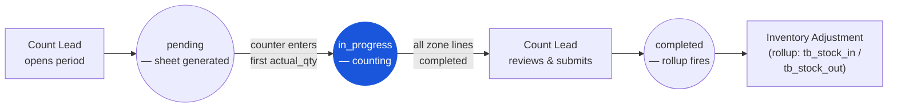

# Physical Count — User Flow — Counter

### Workflow position (Counter highlighted)

### Permission Matrix — V1 Status × Action (Counter)

The Counter is a data-entry persona scoped to their assigned zone. They can read and write `actual_qty` on their lines and add comments, but cannot submit the count document or change any configuration. Rows are derived from Section 2 (Entry Point and Primary Flow) of this file; rule citations refer to [[physical-count/02-business-rules]] § 4 / § 5.

| Action | Count document `pending` | Count document `in_progress` | Count document `completed` |
|---|---|---|---|
| View assigned count sheet (zone-scoped lines) | ✅ (`PHC_AUTH_004`) | ✅ (`PHC_AUTH_004`) | ✅ (read-only) |
| Enter first `actual_qty` (triggers `pending → in_progress`) | ✅ (`PHC_AUTH_002`) | — | ❌ |
| Enter / edit `actual_qty` on own zone lines | — | ✅ (`PHC_VAL_005` — qty ≥ 0) | ❌ (`PHC_VAL_008` — immutable) |
| Flag damaged / unlabelled / unfamiliar item (comment + photo) | — | ✅ (`PHC_AUTH_002`) | ❌ |
| Add free-text comment to count document | — | ✅ (`PHC_AUTH_002`) | ❌ |
| Sign off completed zone (notify Count Lead) | — | ✅ (notification; no status change) | — |
| Submit count document (`in_progress → completed`) | ❌ (`PHC_AUTH_002` — Count Lead only) | ❌ (`PHC_AUTH_002` — Count Lead only) | — |
| View lines outside own zone | ❌ (`PHC_AUTH_004` — zone-scoped) | ❌ (`PHC_AUTH_004` — zone-scoped) | ❌ |
| Re-enter a recount line flagged by Count Lead | — | ✅ (different counter from original) | ❌ |

## 1. Persona

**Counter** — Counter / Store Keeper. The floor-level worker who performs the physical count on assigned zones, records quantities on the count sheet (`tb_physical_count_detail.actual_qty`), flags items that are damaged, unlabelled, or unfamiliar via line-level comments, and signs off completed sheets back to the Count Lead. Authority anchor for `PHC_AUTH_002`.

## 2. Entry Points

- **My count assignments** — list of `tb_physical_count` documents with `pending` or `in_progress` status where the counter has a zone-grant.
- **Count sheet view** — drill into one count document and see only the detail lines for the counter's zone.
- **Mobile / handheld scanner** — typical floor device for scanning product barcodes and entering `actual_qty` line by line.

## 3. Primary Actions

| Action | State precondition | State effect | Notes |
| ------ | ------------------ | ------------ | ----- |
| Open assigned count sheet | Count document in `pending` or `in_progress`; counter has zone-grant | (read) zone-scoped lines visible | Per `PHC_AUTH_004`. |
| Enter first `actual_qty` | Count document in `pending` | Count document advances to `in_progress`; `start_counting_at` / `start_counting_by_id` stamped | First line entry triggers transition. |
| Enter / edit `actual_qty` on a line | Line within own zone | `actual_qty` saved; `counted_at` / `counted_by_id` stamped | `actual_qty ≥ 0` per `PHC_VAL_005`. |
| Flag damaged / unlabelled / unfamiliar item | Line in counter's zone | `tb_physical_count_detail_comment` row created with attachment (photo) | Soft-flag; Count Lead reviews. |
| Add comment to count document | Document in `in_progress` | `tb_physical_count_comment` row created | Free-text notes (e.g. "zone B fully counted, awaiting recount on line 17"). |
| Sign off completed zone | All zone lines have non-null `actual_qty` | Notification fires to Count Lead | Counter does not submit the document — Count Lead does, per `PHC_AUTH_002`. |

## 4. Decision Points

- **Damaged / unfamiliar items.** When a counter finds an item that doesn't match the sheet (unlabelled, damaged, miscategorised), the line is flagged with a comment + photo; the variance handling decision is the Count Lead's.
- **Zero-on-shelf vs zero-counted.** If the sheet shows `on_hand_qty > 0` but the counter sees nothing on the shelf, `actual_qty = 0` is entered explicitly (not left blank). Blank `actual_qty` blocks submit per `PHC_VAL_004`; entered-zero proceeds to variance flag.
- **Recount lines.** When a line is flagged for recount, the recount is performed by a **different counter** to remove individual counting bias — the original counter does not re-enter their own line.

> **TODO:** Source the exact mobile / scanner UI screens and the blind-count (book qty hidden) toggle from `../carmen-inventory-frontend/`.

## 5. Exit / Handoff

| Trigger | Handoff to | Artefact |
| ------- | ---------- | -------- |
| Complete all assigned lines | Count Lead | Notification + completed-zone tag in comment thread. |
| Flag line for further inspection | Count Lead | `tb_physical_count_detail_comment` with damaged / unlabelled tag. |
| (no submit action) | Count Lead | Counter cannot submit; only Count Lead per `PHC_AUTH_002`. |

## 6. References

- **Primary (TODO):** carmen/docs source — does not exist for this module.
- **Frontend (TODO):** `../carmen-inventory-frontend/` — Counter / mobile UI; check cmobile (`../cmobile/`) for the PWA-side count sheet implementation if applicable.
- **E2E (TODO):** `../carmen-inventory-frontend-e2e/tests/` — no physical-count spec currently exists.
- Related: [[physical-count/03-user-flow]] (overview), [[physical-count/02-business-rules]] (`PHC_AUTH_002`, `PHC_VAL_004`–`PHC_VAL_005`), [[physical-count/03-user-flow-count-lead]] (the handoff partner).
