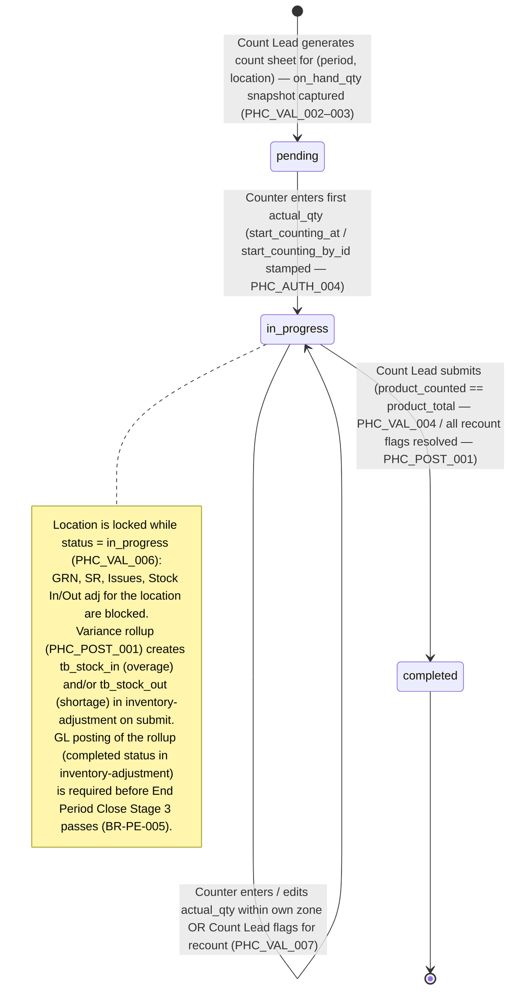

# Physical Count — User Flow

## 1. Overview

This page is the **overview entry point** for the user-flow set of the `physical-count` module. Unlike a single-document module (PR, PO, GRN), the physical count is run as a **three-tier exercise** — a `tb_physical_count_period` header gathers all count documents for one fiscal period; under it, one `tb_physical_count` document per `(period, location)` carries the counting status and counter progress; under each count document, `tb_physical_count_detail` rows hold the per-product `on_hand_qty` (book snapshot) / `actual_qty` (counted) / `diff_qty` (variance). The work moves along this hierarchy: Count Lead opens the period, generates count sheets per location, assigns counters; Counters walk their zones and enter physical quantities line by line; Count Lead inspects variance, triggers recounts, approves completion; the rollup then writes a variance adjustment to [[inventory-adjustment]] which is the path to the [[inventory]] ledger.

Section 2 below describes the **document lifecycle state machines** for both `tb_physical_count_period.status` (`draft → counting → completed`) and `tb_physical_count.status` (`pending → in_progress → completed`), independent of who acts. Each per-persona file (linked from Section 3) describes that persona's *path through* this state space — entry point, available actions, decision branches, handoff that ends their involvement. Section 4 then summarises the cross-persona handoffs that stitch the individual paths together (Count Lead → Counter for zone assignment; Counter → Count Lead for completed-sheet sign-off; Count Lead → Approver/Finance for variance-adjustment approval via [[inventory-adjustment]]).

> **TODO:** Source the canonical UI screens / wizard flows from `../carmen-inventory-frontend/` once a `physical-count` route is discoverable; cross-reference E2E specs at `../carmen-inventory-frontend-e2e/tests/` once added. No carmen/docs source folder exists for this module.

## 2. Document Lifecycle

**Period-level state machine (`enum_physical_count_period_status`):**

```mermaid
stateDiagram-v2
    [*] --> draft : Count Lead creates period header (tb_period open per INV_VAL_008 — PHC_VAL_001)
    draft --> counting : First tb_physical_count created under period (auto-transition — Count Lead)
    counting --> completed : All child tb_physical_count rows reach completed (system — terminal; period locked)
    completed --> [*]

    note right of counting
        One or more count documents (one per location) may be
        in_progress simultaneously. Period stays in counting
        until every location's document reaches completed.
    end note
```

**Document-level state machine (`enum_physical_count_status`):**

### 2.1 Period-level transitions (`enum_physical_count_period_status`)

| From state | Action | To state | Allowed for | Pre-conditions |
| ---------- | ------ | -------- | ----------- | -------------- |
| `(none)` | create `tb_physical_count_period` for an open `tb_period` | `draft` | Count Lead | `tb_period` exists and is `open` per `INV_VAL_008`. |
| `draft` | open first `tb_physical_count` under the period | `counting` | Count Lead | Auto-transitions on first child-document create. |
| `counting` | all child counts reach `completed` | `completed` | System | All `tb_physical_count` rows under the period have `status = completed`. Terminal; period locked from new counts. |

### 2.2 Document-level transitions (`enum_physical_count_status`)

| From state | Action | To state | Allowed for | Pre-conditions |
| ---------- | ------ | -------- | ----------- | -------------- |
| `(none)` | generate count sheet for `(period, location)` | `pending` | Count Lead | Period in `draft` or `counting`; location is inventory- or consignment-type per `PHC_VAL_003`; mode (`physical_count_type`) chosen. `on_hand_qty` snapshot captured per line. |
| `pending` | counter enters first `actual_qty` | `in_progress` | Counter | Counter has zone-grant for the location per `PHC_AUTH_004`. `start_counting_at` / `start_counting_by_id` stamped. |
| `in_progress` | edit `actual_qty` / add detail comments | `in_progress` | Counter (own lines) | Lines within counter's zone. |
| `in_progress` | flag variance line for recount | `in_progress` | Count Lead | Variance breach per `PHC_VAL_007`. Triggers recount sub-flow. |
| `in_progress` | submit (all lines counted) | `completed` | Count Lead | `product_counted == product_total` per `PHC_VAL_004`; all recount flags resolved. Fires variance rollup per `PHC_POST_001`. |
| `completed` | view / report / audit | `completed` | All personas (per scope) | Terminal. Immutable per `PHC_VAL_008`. |

### 2.3 Variance-rollup fan-out

The `in_progress → completed` transition on `tb_physical_count` is the **rollup event**. Per `PHC_POST_001` / `PHC_POST_002`:

- Lines with `diff_qty > 0` group into one or more `tb_stock_in` documents under reason `COUNT_OVERAGE`.
- Lines with `diff_qty < 0` group into one or more `tb_stock_out` documents under reason `COUNT_SHORTAGE`.
- Lines with `diff_qty = 0` produce no rollup row.
- Each rollup document carries `info.countId = <tb_physical_count.id>` for the back-join.
- Adjustment post (per [[inventory-adjustment/03-user-flow]]) writes the inventory transaction and GL entry; the count document does not write to the ledger directly.

> **TODO:** Document the rollup-document-numbering convention (whether one rollup per location, one rollup per reason, or one rollup per line) when frontend logic is confirmed.

## 3. Persona Files

Each file describes one persona group's path through the lifecycle above. The three groups collapse from the four canonical personas in [[physical-count]] § 4:

- **[[physical-count/03-user-flow-count-lead|Count Lead]]** — Inventory Controller / Inventory Manager: schedules the exercise, configures scope, assigns counters, monitors progress, resolves discrepancies, approves recounts, triggers rollup.
- **[[physical-count/03-user-flow-counter|Counter]]** — Counter / Store Keeper: performs the count on assigned zones, records quantities, flags damaged / unfamiliar items, signs off completed sheets.
- **[[physical-count/03-user-flow-audit-config|Audit / Config]]** — Approver / Finance Reviewer + Auditor + Sysadmin: reviews completed counts and rollup adjustments, validates variance reasonableness, signs off financial impact; Auditor inspects the chain; Sysadmin configures tolerance / costing-method defaults.

## 4. Cross-Persona Handoffs

| From persona | Trigger | To persona | Handoff artefact |
| ------------ | ------- | ---------- | ---------------- |
| Count Lead | Generates count sheet + assigns zones | Counter | `tb_physical_count` in `pending`; counter zone-grant. |
| Counter | Completes their zone | Count Lead | `tb_physical_count_detail` lines for the zone have non-null `actual_qty`. |
| Count Lead | Flags variance line for recount | Counter (different from original counter) | Detail-comment with recount-required tag. |
| Count Lead | Submits the count | System → rollup → [[inventory-adjustment]] | `tb_physical_count.status = completed`; rollup `tb_stock_in` / `tb_stock_out` created. |
| Count Lead | Routes rollup adjustment for approval | Audit / Config (Approver / Finance) | `tb_stock_in` / `tb_stock_out` in `in_progress`. |
| Approver / Finance | Approves rollup adjustment | System → [[inventory]] ledger | `tb_stock_in` / `tb_stock_out` in `completed`; `tb_inventory_transaction` written. |
| Auditor | Reviews completed counts + posted adjustments | (read-only — terminal) | Full chain readable: count sheet, recount records, approvals, posted adjustments, journal entries. |

> **TODO:** Diagram these handoffs once Mermaid / sequence-diagram convention is established for the wiki. Cross-link to [[inventory-adjustment/03-user-flow]] for the rollup-side flow.

## 5. References

- **Primary (TODO):** carmen/docs source — does not exist for this module.
- **Frontend (TODO):** `../carmen-inventory-frontend/` — UI flow source.
- **E2E (TODO):** `../carmen-inventory-frontend-e2e/tests/` — no physical-count spec currently exists.
- Related flow pages: [[inventory-adjustment/03-user-flow]] (rollup-side flow), [[spot-check]] (partial-count cousin flow).
