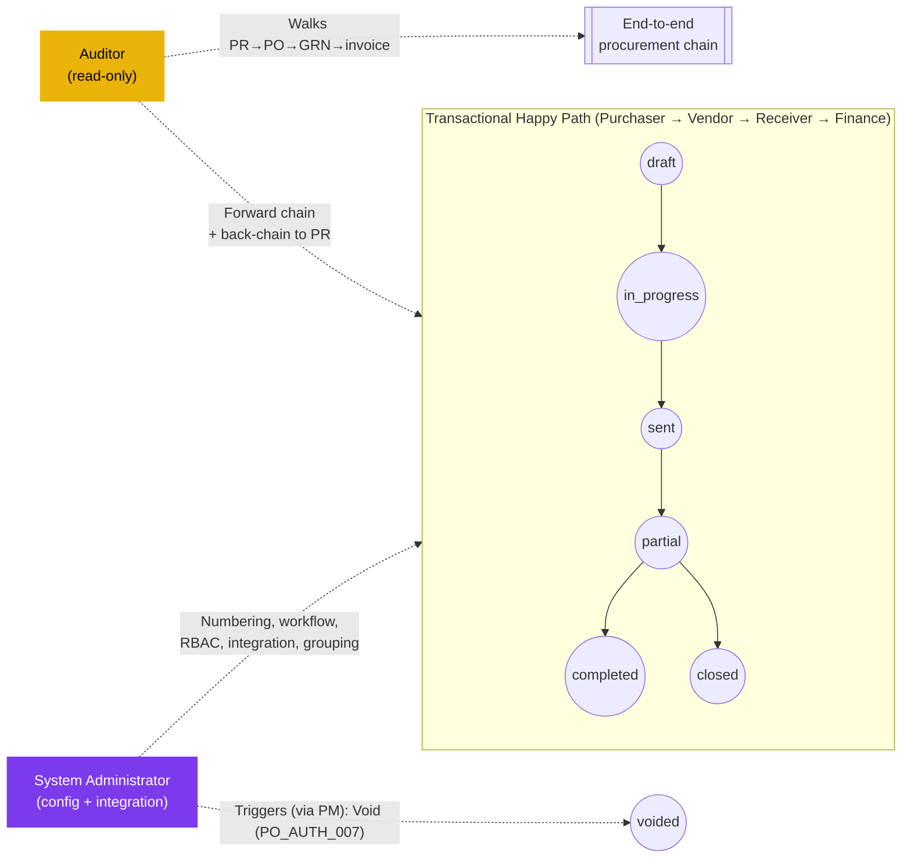

# Purchase Order — User Flow — Audit / Config

> **At a Glance**
> **Persona:** Audit / Config (Auditor + System Administrator) &nbsp;·&nbsp; **Module:** [[purchase-order]] &nbsp;·&nbsp; **Workflow stages:** Off-path observers — Sysadmin owns PO numbering, workflow definition (stages / `stage_role` / `user_action.execute[]`), RBAC for `PO_AUTH_001`–`PO_AUTH_011`, integrations (vendor, pricelist snapshot, budget soft-commit, GRN); Auditor traces PR → PO → GRN → invoice via `workflow_history`, comments, three-way match record &nbsp;·&nbsp; **Key permissions:** Sysadmin configures workflow / RBAC / integrations; Auditor read-only across the chain
> **What this persona does:** Configures the PO module's policy and integration surface (Sysadmin); audits end-to-end procurement chain integrity, SoD (`PO_AUTH_010`), and three-way-match conformance (Auditor).

## 1. Role in This Module

The **Audit / Config** persona axis groups two distinct roles that both sit **outside the transactional happy path** of the `purchase-order` module but are essential to its governance and operability. The **Auditor** is a read-only persona whose interest spans the **end-to-end procurement chain** — Purchase Request → Purchase Order → Goods Receive Note → vendor invoice / AP posting — and who uses the PO module's activity log (`ActivityLogTab`), `workflow_history`, `tb_purchase_order_comment` (`PO_POST_005`, `PO_POST_009`), and the cross-document bridges (PR→PO via `tb_purchase_order_detail_tb_purchase_request_detail`, PO→GRN via the GRN detail back-reference per `PO_XMOD_003`, PO/GRN→invoice via the three-way match record under `PO_POST_008`) to verify policy compliance, segregation of duties (`PO_AUTH_010`: Purchaser ≠ Receiver), three-way-match integrity (`PO_POST_008` / `PO_POST_009`), and full traceability from requisition through commitment, receipt, and payable. The Auditor has **no write surface** in the module: they cannot approve, transmit, void, close, edit lines, or change PO state. The **System Administrator** is a configuration persona who owns the **policy and integration surface** for the module — the PO numbering scheme that drives `tb_purchase_order.po_no`, the workflow definition referenced by `tb_purchase_order.workflow_id` (stages, `stage_role`, and the `user_action.execute[]` membership that gates every transition per `PO_AUTH_011`), the RBAC role-to-permission map for `PO_AUTH_001`–`PO_AUTH_011`, the integration wiring to vendor, vendor-pricelist (snapshot at PR-to-PO conversion), budget (soft-commit on submit per `PO_POST_002`), and inventory (on-hand increment via GRN per `PO_XMOD_003`), the PR-to-PO conversion and vendor+currency grouping rules, the document templates used at transmission (`PO_POST_004`), and the tax / currency / FX rate sources consumed by `PO_CALC_001`–`PO_CALC_011`. Neither role is on the create-to-close happy path; each has its own entry point, surface, and exit semantics: the Auditor exits via a generated report with no PO state change, the Sysadmin exits via a saved configuration that takes effect for new POs while preserving snapshot semantics for POs already `in_progress` or beyond. The pair is documented here on a single persona axis because both roles are peripheral to the transactional flow and share a common pattern of "off-path, governance-oriented" operation.

### Position relative to the transactional flow (off-path observers)

### Permission Matrix — Action × Sub-persona (Audit / Config)

The Auditor observes the end-to-end chain (PR → PO → GRN → invoice) with no write surface. The Sysadmin owns the policy / integration surface and does not directly mutate PO state — remediation that requires a state change (void, early-close) escalates to the Procurement Manager.

| Action | Auditor | System Administrator |
|---|---|---|
| Read PO `workflow_history` / `tb_purchase_order_comment` | ✅ | ✅ |
| Read header / lines / snapshots (vendor / pricelist / FX) | ✅ | ✅ |
| Walk PR→PO bridge (`tb_purchase_order_detail_tb_purchase_request_detail`) | ✅ | ✅ |
| Walk PO→GRN back-reference (`PO_XMOD_003`) | ✅ | ✅ |
| Walk PO/GRN → vendor-invoice three-way match (`PO_POST_008`) | ✅ | ✅ |
| Detect `PO_AUTH_010` segregation-of-duties breach (Purchaser ≡ Receiver) | ✅ | ✅ |
| Flag PO in audit case file (audit-side store only) | ✅ | ❌ |
| Export report (sensitive fields require export-approver) | ✅ | ✅ |
| Edit PO numbering scheme / templates | ❌ | ✅ |
| Edit workflow stages / `stage_role` / threshold (`PO_AUTH_004`, `PO_AUTH_011`) | ❌ | ✅ |
| Assign / remove users from `user_action.execute[]` | ❌ | ✅ |
| Edit RBAC permission map (`PO_AUTH_001`–`PO_AUTH_011`) | ❌ | ✅ |
| Edit integration endpoints (vendor / pricelist / budget / inventory) | ❌ | ✅ |
| Edit PR-to-PO conversion / grouping rule | ❌ | ✅ |
| Save configuration with `effective_from` (in-flight snapshot preserved) | ❌ | ✅ |
| Roll back configuration | ❌ | ✅ |
| Integration cutover (probe + drain + go-live) | ❌ | ✅ |
| Edit PO header / lines / vendor / qty | ❌ | ❌ |
| Approve / Transmit / Reject / Send-back | ❌ | ❌ |
| Void / Early-close PO | ❌ | ❌ (escalate to PM under `PO_AUTH_007` / `PO_AUTH_008`) |

> ℹ️ **Snapshot principle:** Sysadmin configuration changes apply forward-only. POs already at `in_progress`, `sent`, `partial`, or `closed` retain their snapshotted workflow stage chain, threshold, integration wiring, and tax / currency context. New POs created after `effective_from` use the new configuration.

## 2. Entry Point and Primary Flow

The two roles have separate entry points and flows; each is addressed below.

### 2.1. Auditor flow

**Entry point:** Sidebar → **Audit** workspace → **Procurement Activity Queries** (or, when starting from a known document, Sidebar → **Purchase Order** module → open a PO → **Activity Log** tab / **Related Documents** tab). The Auditor lands on a query-builder surface scoped to the procurement document family (PR / PO / GRN / invoice), not on the My POs or review queues used by transactional personas.

**Primary flow (happy path — Auditor):**

1. From **Audit → Procurement Activity Queries**, select an audit query template (e.g. "All POs voided in period", "All POs transmitted by buyer", "Three-way-match exceptions", "Segregation-of-duties violations", "All status transitions for a PO", "PR-to-PO conversions in period") or build an ad-hoc query against `workflow_history`, `tb_purchase_order_comment`, the header / detail snapshots, and the cross-document bridges.
2. Apply **filters**: date range (`order_date`, `approval_date`, `last_action_at_date`, or `created_at`), business unit, buyer, vendor, currency, `po_status` value, `po_type` (`manual` vs `purchase_request`), and `total_amount` band including the high-value threshold flag. Filter chips appear above the result table; an empty filter set is rejected to prevent unbounded scans of the chain.
3. Review the **result set**: each row is one PO (or one event, depending on query shape) with `po_no`, vendor, buyer, current state, last action, last actor, and the relevant audit fact for the query (e.g. void reason, GRN count, invoice match outcome). Sort by any column; click into a row to drill into the **full chain** for that PO.
4. On the drill-down page, walk the **forward chain** — from the PO's `po_status` timeline through the linked GRN postings (`PO_POST_006` / `PO_POST_007` driven by [[good-receive-note]]) and onward to the vendor invoice three-way-match record (`PO_POST_008`) and the AP liability posting — and the **back chain** — from the PO header through the PR→PO bridge `tb_purchase_order_detail_tb_purchase_request_detail` back to the originating Purchase Request(s) and their approval trail. Verify the chain is contiguous (no gaps, no out-of-order timestamps), that segregation of duties was respected (`PO_AUTH_010`: `buyer_id` / `last_action_by_id` on the `sent` transition ≠ the user who posted any GRN), that every transition has both an actor and a justification where required, and that the PR→PO vendor+currency grouping (carmen/docs § 2.3.2) was applied correctly.
5. If an anomaly is found (e.g. an approval recorded outside the stage's `user_action.execute[]` per `PO_AUTH_011`, a void without a reason comment in `tb_purchase_order_comment`, a three-way-match override that bypasses `PO_POST_009`, or a same-user PO/GRN pairing violating `PO_AUTH_010`), **flag** the PO in the audit case file with a note. Flagging does **not** change the PO — it writes to an audit-side store only.
6. **Export the report** as CSV / PDF for the period or for the case file. Exports of sensitive fields (e.g. vendor pricing snapshots, buyer / approver identities, full justification text, attachment payloads) require a secondary approval per the data-export policy — the Auditor submits the export request and an export-approver releases it. The exported report and approval record are themselves audit objects.

### 2.2. System Administrator flow

**Entry point:** Sidebar → **Configuration** workspace → **PO Numbering & Templates** (for `po_no` scheme and document templates), **PO Workflow Settings** (for stages, high-value threshold, `user_action.execute[]` assignment per `PO_AUTH_011`), **RBAC & Roles** (for the `PO_AUTH_001`–`PO_AUTH_011` role-to-permission map), **Integration Settings** (vendor, vendor-pricelist, budget, inventory), or **PR-to-PO Rules** (for vendor+currency grouping and conversion defaults). Each surface is a separate page under the same workspace.

**Primary flow (happy path — Sysadmin, configuration change):**

1. **Identify the configuration need.** Triggered externally — e.g. Finance requests a new high-value threshold, a department restructure changes who owns the final approval stage, a new vendor-portal integration goes live, the `po_no` scheme needs a year-prefix change, the PR-to-PO grouping rule needs to add a delivery-location dimension, or the transmission template needs a new tax-registration block. Open a change ticket and link the policy reference (memo / approval) before opening the configuration surface.
2. **Open the relevant configuration page.** For numbering: **Configuration → PO Numbering & Templates** → select the scheme row → edit prefix / sequence / reset rule. For workflow / threshold / RBAC: **Configuration → PO Workflow Settings** → select the workflow row (per business unit / per `po_type`) → open the stage editor. For integration: **Configuration → Integration Settings** → pick the integration (vendor / pricelist / budget / inventory) → edit endpoints, credentials, sync windows. For conversion / grouping: **Configuration → PR-to-PO Rules**.
3. **Adjust the settings** in the staged editor: change the numbering scheme, add / remove / reorder workflow stages, edit the high-value threshold that triggers the Procurement Manager approval gate per `PO_AUTH_004`, assign or remove users from `user_action.execute[]` per `PO_AUTH_011`, update the RBAC permission set for any of `PO_AUTH_001`–`PO_AUTH_011`, wire or rewire an integration endpoint, or change the vendor+currency grouping rule (carmen/docs § 2.3.2). All edits accumulate in a pending-configuration draft; nothing persists until Save.
4. **Preview the impact.** The configuration page shows a side-panel summary: the in-flight PO count that will continue under the old configuration snapshot, the new-PO count that will use the new rules (forecasted from recent creation rate), the stages or rules that change, and any users newly added to or removed from `user_action.execute[]`. For threshold changes the panel shows the band shift and how many recent POs would have routed differently. For numbering changes the panel previews the next-issued `po_no` under the new scheme. For integration changes the panel runs a connectivity probe. The Sysadmin can revise or discard the draft at this point.
5. **Save the configuration.** The system writes the new configuration with an `effective_from` timestamp, records the change in a system-side configuration audit log (independent of `tb_purchase_order_comment`), and notifies the affected user populations (e.g. newly-added approvers, buyers whose grouping behaviour will change). POs already in `in_progress`, `sent`, or `partial` retain their original configuration **snapshot** — workflow stage chain, threshold band, numbering, integration endpoints in force at submission, and tax / currency context — per the same snapshot semantics that protect the PR-to-PO conversion price snapshot. New POs created after `effective_from` use the new configuration.
6. **Verify activation.** Pick a representative new test PO (or simulate one in a non-production environment) and confirm the new behaviour fires as expected: numbering, routing, threshold gate, integration sync, and grouping outcome. If a regression is found, roll back by re-opening the configuration and reverting to the prior version (every saved version is retained in the configuration audit log).
7. **Close the change ticket** with the configuration audit-log link. From this point the change is in force for new POs; the Sysadmin's involvement ends until the next configuration change.

## 3. Decision Branches

- **If the Auditor finds a policy violation** (e.g. an approval by a user not in `user_action.execute[]` per `PO_AUTH_011`, a void without a mandatory reason in `tb_purchase_order_comment`, a `PO_AUTH_010` segregation-of-duties breach where the buyer also posted the GRN, or a three-way-match override that bypasses `PO_POST_009`): the Auditor **cannot act on the PO in-module** (read-only). The Auditor escalates via the audit case file — flags the PO, attaches the evidence (activity-log excerpt, chain timeline, configuration version diff, segregation-of-duties pairing) — and routes the case to the responsible business owner (Finance, Compliance, Procurement Manager, or department head) for out-of-band remediation. If remediation requires a system-level action (e.g. a void to terminate a non-compliant PO under `PO_AUTH_007`, or a credit-note initiation on the AP side), that action is performed by the Procurement Manager or System Administrator under their respective authorization rights, not by the Auditor.
- **If a Sysadmin attempts a configuration change while an in-flight PO depends on the current rules** (e.g. a high-value threshold change while a PO is sitting at `in_progress` under the old threshold's routing, or a grouping-rule change while a PR-to-PO conversion is mid-wizard): the save is allowed (rules are not locked by in-flight POs), but the change does **not** retroactively re-route or re-rank existing in-flight POs. The configuration page surfaces a count of affected `in_progress` / `sent` / `partial` POs in the preview panel; those POs continue under their snapshot (workflow stage chain, threshold band, integration endpoints, and tax / currency context taken at submission). In-flight PRs being converted at the moment of save complete their conversion under the rules in force at conversion start; the next conversion begins under the new rules.
- **If a Sysadmin activates a delegation on an approval stage** (e.g. the Procurement Manager is out and a delegate is granted approval rights for a window): the delegate inherits `user_action.execute[]` membership for the stage's scope for the window's duration. Notifications for any PO currently sitting at that stage are re-fanned to the delegate. When the window expires, the inherited rights drop automatically; POs still at that stage continue with the original user's `user_action.execute[]` (which never changed) — no PO re-routing is required.
- **If the Auditor requests an export that includes sensitive fields** (full buyer / approver identities, vendor pricelist snapshots, three-way-match deviation detail, attachment payloads): the export goes into a **pending** state and requires approval from a data-export approver per the export policy. The Auditor cannot bypass this step. While pending, the export is invisible outside the audit case file; on approval, the export is materialised and a download link is recorded in the case file with the approver's identity.
- **If a Sysadmin changes the PR-to-PO conversion / grouping rule** (e.g. adding a delivery-location dimension to the vendor+currency grouping key per carmen/docs § 2.3.2) while a PR-to-PO conversion is in flight in the wizard: the in-flight conversion completes under the **rules in force at wizard start** (the preview groups the user already confirmed do not re-shuffle on save). The next conversion initiated after `effective_from` uses the new rule. The configuration audit log records the change and the in-flight-conversion count at the time of save, so any anomaly in the immediate aftermath is attributable to the rule transition rather than to a routing bug.
- **If a Sysadmin change creates a workflow deadlock** (e.g. the configuration removes a user from `user_action.execute[]` on a stage where that user is the only one assigned, and a PO is currently waiting at that stage with no other approver): the preview panel flags the deadlock in step 4. If the Sysadmin saves anyway, the affected PO will time out at that stage and require manual intervention — typically a one-off delegation or a Procurement-Manager / Sysadmin-initiated void under `PO_AUTH_007` — to unblock. The configuration audit log records the change and the deadlock warning so the audit trail makes the cause clear.

## 4. Exit Point / Handoffs

The Audit / Config persona axis exits in one of the following ways, depending on which role acted:

- **Auditor — report generated.** A query result, chain drill-down, or case file is materialised (on-screen review or exported to CSV / PDF after the export-approval flow). **No PO state is changed**: `po_status`, `workflow_current_stage`, `workflow_history`, `tb_purchase_order_comment`, and every snapshot on the document remain exactly as they were before the Auditor opened the page. The Auditor's handoff is **out-of-band** to whichever business owner (Finance, Compliance, Procurement Manager, or department head) is responsible for any remediation the audit surfaced. If the Auditor's case file recommends a void or close, the Procurement Manager performs it under `PO_AUTH_007` / `PO_POST_010` (void) or `PO_AUTH_008` / `PO_POST_011` (close-early); the Sysadmin acts only when the remediation is a configuration change rather than a per-document state change.
- **Auditor — case file closed without action.** When the audit query / chain drill-down finds no anomaly, the Auditor closes the case file with a "no findings" note. No PO state change; the case file itself is retained as evidence that the period / scope was audited end-to-end across the PR / PO / GRN / invoice chain.
- **Sysadmin — configuration saved.** A new version of the configuration (numbering scheme, workflow stages and threshold, RBAC permission map, integration endpoints, PR-to-PO conversion / grouping rules, or document templates) is written with an `effective_from` timestamp and recorded in the configuration audit log. **POs created after `effective_from`** use the new configuration; **POs already in `in_progress`, `sent`, `partial`, or any non-terminal state** retain their original snapshotted configuration — including stage chain, threshold band, integration wiring at submission time, and the tax / currency context. Notifications to affected user populations fire on save. Handoff is **forward in time** — the next Purchaser who creates a PO sees the new behaviour automatically.
- **Sysadmin — configuration rolled back.** If verification in step 6 of the primary flow finds a regression, the Sysadmin reverts to the prior configuration version. The rollback is itself a configuration save with its own `effective_from`; POs created between the original change and the rollback are not retroactively re-evaluated (snapshot semantics), but new POs created after the rollback use the reverted configuration. The configuration audit log captures both the forward change and the rollback, preserving a clean trail.
- **Sysadmin — integration cutover.** When the change is an integration rewire (e.g. a new vendor-portal endpoint, a new budget-system base URL, or a new pricelist-sync window), the save additionally triggers a probe-and-cutover sequence — the old endpoint is drained, the new endpoint receives a synthetic round-trip, and only on success does the configuration go live. If the probe fails, the save is held and the prior endpoint remains in force; the Sysadmin is notified to remediate before retrying.

Document state across all Audit / Config exits is governed by `enum_purchase_order_doc_status = { draft, in_progress, voided, sent, partial, closed, completed }`. The Auditor flow never moves a PO across this enum; the Sysadmin's configuration flow also never moves a PO across the enum (only future POs are affected). The only PO state changes triggered by escalation from an audit finding are the **void** (Procurement Manager under `PO_AUTH_007` / `PO_POST_010`) and the **early close** (Procurement Manager / Inventory Manager under `PO_AUTH_008` / `PO_POST_011`); these are exceptional, audit-triggered operations performed by the appropriate transactional persona, not by the Audit / Config axis itself.

## 5. References

- Parent overview: [03-user-flow.md](./03-user-flow.md)
- Authorization rules: [02-business-rules.md](./02-business-rules.md) Section 4 — `PO_AUTH_004` (high-value threshold gate), `PO_AUTH_005` (delete-in-draft), `PO_AUTH_007` (Procurement Manager void), `PO_AUTH_008` (Inventory Manager close / GRN), `PO_AUTH_009` (Finance read-only), `PO_AUTH_010` (segregation of duties — Purchaser ≠ Receiver), `PO_AUTH_011` (workflow-derived stage-gated approval)
- Transition / posting rules: [02-business-rules.md](./02-business-rules.md) Section 5 — `PO_POST_002` (submit and soft-commit), `PO_POST_004` (final approval and transmit), `PO_POST_005` (reject), `PO_POST_006` / `PO_POST_007` (GRN-driven receipt transitions), `PO_POST_008` / `PO_POST_009` (three-way match success / failure), `PO_POST_010` (void), `PO_POST_011` (close-early), `PO_POST_012` (soft delete)
- Cross-module rules: [02-business-rules.md](./02-business-rules.md) Section 6 — `PO_XMOD_003` (PO ↔ GRN bridge driving the receipt chain audited end-to-end)
- Data model: [01-data-model.md](./01-data-model.md) — `enum_purchase_order_doc_status` values used across the chain, the PR→PO bridge `tb_purchase_order_detail_tb_purchase_request_detail` walked in the back-chain audit, and the `workflow_history` / `tb_purchase_order_comment` audit surface
- `../carmen/docs/purchase-order-management/purchase-order-module.md` — carmen/docs source for RBAC (§ 2.5), state diagram (§ 6.1), PR-to-PO vendor+currency grouping (§ 2.3.2), and the `ActivityLogTab` / `RelatedDocumentsTab` UX described in § 2.4.1
- Sibling: [03-user-flow-purchaser.md](./03-user-flow-purchaser.md) — upstream persona whose creation, transmission, and amendment actions feed the PO activity log
- Sibling: [03-user-flow-procurement-manager.md](./03-user-flow-procurement-manager.md) — escalation path for void / early-close remediations triggered by audit findings; consumer of Sysadmin threshold / workflow configuration
- Sibling: [03-user-flow-vendor.md](./03-user-flow-vendor.md) — external counterparty whose acknowledgement and invoice events are observed via the chain audit
- Sibling: [03-user-flow-receiver.md](./03-user-flow-receiver.md) — GRN-posting persona whose actions drive the `sent → partial → completed` transitions audited under `PO_POST_006` / `PO_POST_007`
- Sibling: [03-user-flow-finance.md](./03-user-flow-finance.md) — three-way-match persona whose `PO_POST_008` / `PO_POST_009` records close the audit chain on the AP side
- Sibling: [index.md](./index.md) Section 4 — canonical Auditor and System Administrator role descriptions
- Cross-link: [[purchase-request]] — upstream module whose PR records and approval trail are walked in the back-chain audit via the PR→PO bridge
- Cross-link: [[good-receive-note]] — downstream module whose GRN postings drive the forward-chain audit of receipt under `PO_POST_006` / `PO_POST_007`
- Cross-link: [[vendor-pricelist]] — price-snapshot surface taken at PR-to-PO conversion and verified during financial audit of the PO
