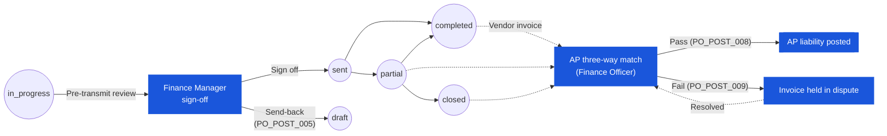

# Purchase Order — User Flow — Finance

## 1. Role in This Module

The **Finance** persona covers the **Finance Officer / Accounts Payable** clerk who runs the day-to-day invoice match and posts the AP liability, and the **Finance Manager** who exercises pre-transmission financial sign-off on high-value or FX-sensitive POs. Finance has **two distinct touch points** in the PO lifecycle, and they sit at opposite ends of the document: a **pre-transmission review** at the tail of approval (Finance Manager checks currency, exchange rate, tax codes, and line totals while the PO is still at `po_status = in_progress`, before the final-stage transition to `sent` under `PO_POST_004`), and a **post-receipt three-way match** after GRN posting (Finance Officer / AP receives the vendor invoice, looks up the PO and the matching GRN(s), and runs the match algorithm under `PO_POST_008` / `PO_POST_009`). The three-way match is the **key Finance activity** in the PO module — it is the control that converts a matched-but-unbilled accrual into a payable, clears the GRN accrual, and posts the AP liability on the linked vendor invoice. The PO itself is **not** transitioned by the three-way match (`PO_POST_008` is explicit on this); the PO retains whichever fulfilment status it reached (`partial`, `completed`, or `closed`) and the match outcome lives on the invoice record. On match failure, the discrepancy is flagged back to the **Purchaser** for resolution via amendment, credit note, or void, and the invoice is held in dispute until reconciled.

### Workflow position (Finance touch points highlighted)

### Permission Matrix — Touch point × Action (Finance sub-roles)

Finance has **no direct PO status mutation** outside the pre-transmission review (send-back at `in_progress`). The three-way match outcome lives on the invoice record, not on the PO.

| Action | Finance Manager (pre-transmit, PO at `in_progress`) | Finance Officer / AP (post-receipt, PO at `partial` / `completed` / `closed`) |
|---|---|---|
| View PO header / lines / Financial Details | ✅ | ✅ |
| Sign-off at the Finance approval stage (advance workflow) | ✅ (`PO_AUTH_003`) | ❌ |
| Send-back at the Finance stage (`PO_POST_005`) | ✅ | ❌ |
| Capture vendor invoice | ❌ | ✅ |
| Run three-way match (qty / price / product / currency) | ❌ | ✅ |
| Post AP liability on match success (`PO_POST_008`) | ❌ | ✅ |
| Hold invoice in dispute on match failure (`PO_POST_009`) | ❌ | ✅ |
| Auto-pass price variance within tolerance | ❌ | ✅ (config-driven) |
| Flag discrepancy back to Purchaser via `tb_purchase_order_comment` | ❌ | ✅ |
| Edit PO header / lines / vendor / qty | ❌ | ❌ |
| Approve at final stage / Transmit | ❌ (FM signs off, then chain proceeds; final transmit per `PO_AUTH_006`) | ❌ |
| Void / Early-close PO | ❌ (PM only) | ❌ (PM only) |
| Re-match after dispute resolution | ❌ | ✅ |

> ℹ️ **PO status unchanged by three-way match:** The PO retains its receipt-side status (`partial`, `completed`, or `closed`) regardless of match outcome. AP success / failure / dispute lives entirely on the linked invoice record (`PO_POST_008` / `PO_POST_009`).

## 2. Entry Point and Primary Flow

Finance has two flows, addressed separately below.

### 2.1. Pre-transmission review (Finance Manager)

**Entry point:** Finance Manager is assigned as an approver on a workflow stage configured for financial review (typically the last stage before final approval, or as a co-approver at the high-value gate). Entry is via the **review queue notification** when the PO is at `po_status = in_progress` and the workflow stage cursor lands on the Finance stage.

**Primary flow (4 steps):**

1. **Open the PO from the review queue.** The screen shows the **Financial Details** tab (`FinancialDetailsTab`) and the **General Info** tab; authorization is the standard `PO_AUTH_003` approver check against `workflow_current_stage`.
2. **Check the financial header** — verify `currency_id` against the vendor's contracted currency, `exchange_rate` against the tenant's FX policy (rate source, refresh window, rounding), payment terms, and any prepayment / deposit flag. Confirm `total_amount` in transaction currency and the base-currency equivalent are within the high-value threshold the Finance Manager is signing off against.
3. **Check the line-level financials** — line subtotals follow the calculation chain from carmen/docs § 1.4 (`Item Subtotal → Discount → Net Amount → Tax → Item Total`); verify each line's `tax_id` / tax rate matches the product's tax profile and the vendor's tax registration, that discounts have a documented reason, and that no line is rounded inconsistently. Tally the per-line totals against the header roll-up (`PO_CALC_008`–`PO_CALC_011`).
4. **Sign off or send-back.**
   - **Sign off:** post the stage approval; the workflow advances to the next stage (or to final approval, which triggers `PO_POST_004`: `in_progress → sent` and transmission to the vendor).
   - **Send-back:** post a send-back with reason text under `PO_POST_005`; the PO returns to `draft` for the Purchaser to correct. The send-back comment is written to `tb_purchase_order_comment` and the workflow cursor is reset.

### 2.2. Three-way match (Finance Officer / AP)

**Entry point:** Vendor invoice arrives (paper, PDF, or EDI feed). The Finance Officer opens the AP capture screen and indexes the invoice against the PO via the vendor's reference and the `po_no` printed on the invoice.

**Primary flow (7 steps):**

1. **Capture the vendor invoice** — record invoice number, invoice date, vendor, currency, line items (product, qty, unit price), tax, and total. The invoice is held in **pending match** state until the three-way match runs.
2. **Look up the PO by reference number.** The captured `po_no` resolves to the `tb_purchase_order` row; the PO must be at `po_status ∈ {partial, completed, closed}` for matching (a PO at `sent` with no GRN cannot match — see Decision Branches). Verify that the invoice vendor matches `tb_purchase_order.vendor_id` and the invoice currency matches `tb_purchase_order.currency_id`.
3. **Look up the matching GRN(s).** Carmen retrieves all GRNs posted against the PO (the GRN-to-PO link is on the GRN side and visible on the `GoodsReceiveNoteTab` of the PO). For each invoice line, the system identifies the GRN line(s) covering the invoiced product on the same PO line.
4. **Run the three-way match algorithm** (`PO_POST_008`). For each invoice line, the match compares:
   - **Quantity:** invoice qty ↔ GRN `accepted_qty` (or `received_qty` per tenant policy) — within the configured qty tolerance.
   - **Price:** invoice unit price ↔ PO `unit_price` — within the configured price tolerance.
   - **Product / line identity:** invoice product matches the PO/GRN product on the same PO line.
   The match is line-by-line; the overall invoice match is **success** only if every line matches.
5. **On match success (`PO_POST_008`):** AP module **clears the GRN accrual** (reverses the inventory-receipt accrual entry against the goods-received-not-invoiced account) and **posts the AP liability** against the vendor — debit inventory accrual / credit vendor payable, in transaction currency with the FX revaluation against base currency captured at invoice date. The matched invoice is moved to **approved for payment** state. The PO is **not** status-changed by this event (per `PO_POST_008`); it retains its receipt-side status. The PO progresses to its terminal commercial position — the procurement commitment is now a payable.
6. **On match failure (`PO_POST_009`):** AP holds the invoice in **dispute** state. A `system` comment is appended to `tb_purchase_order_comment` recording the failure (which line, which dimension — qty / price / product), and a deviation record is opened on the vendor / vendor-pricelist side for tracking. The discrepancy is **flagged back to the Purchaser** via the standard activity-log notification. The PO is not auto-voided; resolution is manual.
7. **Reconcile and re-match (failure path only).** Once the Purchaser resolves the discrepancy — amendment, credit note from the vendor, supplementary GRN, or write-off via PO close (`PO_POST_011`) — the invoice is re-presented to the match. On clean re-match, step 5 fires.

## 3. Decision Branches

- **Clean match — post AP** (`PO_POST_008`): all lines pass qty and price tolerance against the matching GRN and PO; AP module clears the GRN accrual, posts the AP liability in transaction currency with the FX entry against base currency at invoice date, and moves the invoice to approved-for-payment. The PO is unchanged; the matched-but-unbilled position on the PO is now zero.
- **Quantity discrepancy — flag back to Purchaser** (`PO_POST_009`): invoice qty exceeds GRN `accepted_qty` (or undershoots, depending on direction) outside tolerance. Invoice held in dispute; comment written; Purchaser is notified to pursue either a credit note (over-invoicing) or a supplementary GRN against an additional vendor shipment (under-receipt). PO status unchanged; line-level pending balance unchanged.
- **Price discrepancy within tolerance — auto-pass:** invoice unit price differs from PO `unit_price` but the absolute / percentage difference falls inside the tenant's price-tolerance configuration. The line passes; AP posting proceeds at the invoiced price; the variance is captured as a price-variance entry on the AP posting (debit / credit purchase price variance account). The PO line price remains the contracted price.
- **Price discrepancy outside tolerance — flag back to Purchaser** (`PO_POST_009`): invoice unit price is outside the price-tolerance band. Invoice held in dispute; comment written; Purchaser pursues either a credit note (over-billing) or a price amendment on the PO under `PO_VAL_016` (price changes post-`sent` are restricted and require the appropriate authority).
- **Missing GRN — await receipt or bounce-back:** the captured invoice has no matching GRN on the PO. Two sub-branches:
  - **Vendor delivered but GRN not yet posted:** invoice is parked in pending-match; Finance notifies the Receiver / Purchaser to chase the GRN posting. Once posted, the match re-runs automatically.
  - **Vendor invoiced ahead of delivery (or for non-delivered goods):** Finance bounces the invoice back to the vendor with a non-receipt notice; Purchaser is notified. PO status unchanged.
- **Currency mismatch between PO and invoice — FX adjustment posting:** invoice currency differs from `tb_purchase_order.currency_id`. If the variance is permitted by tenant policy (e.g., contracted dual-currency vendor), AP posts the invoice in the invoice currency and captures an FX adjustment entry against the PO's contracted currency at the invoice-date rate. If not permitted, the invoice is bounced back as a currency-mismatch dispute and flagged to the Purchaser for vendor correction.

## 4. Exit Point / Handoffs

Finance's involvement on a given PO–invoice pair ends on **AP posting** (success) or on **discrepancy resolution closure** (failure). From that point the state on Carmen is one of:

- **AP posted, PO terminal:** invoice approved for payment; GRN accrual cleared; PO unchanged at its fulfilment status (`partial`, `completed`, or `closed`). The PO has reached the end of its commercial / accounting lifecycle for the matched portion. For a partially-fulfilled PO, Finance re-enters the flow for each subsequent invoice against the same PO until the cumulative receipt is fully invoiced or the PO is closed.
- **Discrepancy flagged, PO held at current state:** invoice held in dispute (`PO_POST_009`); PO retains its current `po_status`; ownership of resolution sits with the **Purchaser** (amendment / credit-note loop) or, where a void is required, with the **Procurement Manager** under `PO_POST_010`. Once resolved, Finance re-runs the match and the success path fires.
- **Pre-transmission send-back, PO returns to draft:** the Finance Manager's send-back during the review stage routes the PO from `in_progress → draft` under `PO_POST_005`; ownership returns to the **Purchaser** to correct the flagged financial issue and resubmit.

The persona handoffs are: Finance Manager ↔ Purchaser (pre-transmission send-back loop) and Finance Officer ↔ Purchaser / Procurement Manager (post-receipt discrepancy loop). The PO terminal commercial state for a clean run is `completed` (or `partial` / `closed` if the receipt side ended that way) with all matched invoices posted.

## 5. References

- Parent overview: [03-user-flow.md](./03-user-flow.md) — global PO state machine and cross-persona handoff table; the Finance row sits at the right-hand end (post-`completed`, post-`closed`, post-`partial`).
- Sibling: [03-user-flow-receiver.md](./03-user-flow-receiver.md) — upstream internal persona that posts the GRN this flow matches against; the GRN drives `received_qty` and `accepted_qty` that the three-way match consumes.
- Sibling: [03-user-flow-purchaser.md](./03-user-flow-purchaser.md) — bounce-back target on three-way match failure (qty / price / currency discrepancy); owns the amendment / credit-note resolution loop.
- Sibling: [03-user-flow-procurement-manager.md](./03-user-flow-procurement-manager.md) — holds void / close override authority where a discrepancy can only be resolved by `PO_POST_010` / `PO_POST_011`.
- Sibling: [03-user-flow-vendor.md](./03-user-flow-vendor.md) — external party that issues the invoice this flow captures and matches.
- Sibling: [02-business-rules.md](./02-business-rules.md) § 5 (Posting Rules) — `PO_POST_004` (final approval / transmission), `PO_POST_005` (send-back), `PO_POST_008` (three-way match success), `PO_POST_009` (three-way match failure), and `PO_POST_011` (close with cancelled remainder) for the rules referenced above.
- Related: [[good-receive-note]] — upstream module whose posting creates the matched-but-unbilled accrual that AP clears on match success.
- Related: [[inventory]] — the inventory accrual cleared on match success is owned by the inventory / GL integration; the PO contributes only the on-order pipeline quantity until GRN.
- `../carmen/docs/purchase-order-management/purchase-order-module.md` — primary carmen/docs source for the PO module business analysis, Finance integration, and the three-way-match flow.
