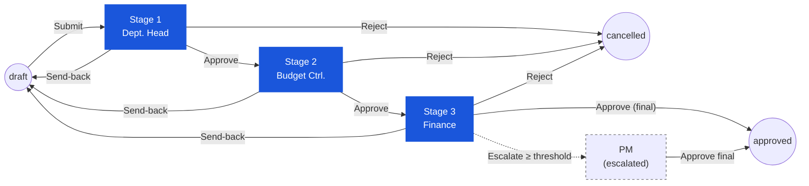

# Purchase Request — User Flow — Approver

## 1. Role in This Module

The **Approver** is the umbrella persona that covers the three intermediate decision-makers in the PR approval chain — **Department Head** (Stage 1 approve), **Budget Controller** (Stage 2), and **Finance Officer / Manager** (Stage 3) — all of whom share the same review-and-decide UI but apply it to different concerns (departmental justification, budget availability, and financial-impact correctness respectively). At each stage the Approver opens a submitted PR, reviews the header and lines, optionally adjusts `approved_qty` per line, and chooses one of four actions: **Approve** (advance to the next stage), **Send Back** (return to the Requestor at `draft`), **Reject** (terminate the document), or **Split-Reject** (per-line accept / reject so the surviving lines continue while the rejected ones are recorded with `current_stage_status = rejected`). The document state remains `in_progress` for every intermediate approval — `pr_status` only flips to `approved` when the **final** approve stage clears (see `PR_POST_004` / `PR_POST_005` in [02-business-rules.md](./02-business-rules.md)). Approvers are not part of vendor allocation or PO conversion — those rights belong to the Procurement Manager / Purchaser persona under `enum_stage_role = purchase` (`PR_AUTH_008`).

### Workflow position (Approver chain highlighted)

### Permission Matrix — Action × Stage Role (Approver)

All three sub-roles share the same review-and-decide UI and the same action set. Differences come from scope (department visibility) and the policy each stage is meant to enforce. Edit rights are scoped to the **line-level Approved Qty / approved unit** fields per `PR_VAL_013`; vendor and pricing fields are read-only at every approve stage (`PR_AUTH_008` reserves those for the `purchase` stage).

| Action | Dept. Head (Stage 1) | Budget Controller (Stage 2) | Finance (Stage 3) |
|---|---|---|---|
| View own-dept PRs | ✅ | ✅ (all departments) | ✅ (all departments) |
| View Items / Budget Impact / Activity Log | ✅ | ✅ | ✅ |
| Approve (advance stage) | ✅ | ✅ | ✅ |
| Send-back (with reason) | ✅ | ✅ | ✅ |
| Reject — header level (terminate to `cancelled`) | ✅ | ✅ | ✅ |
| Split-Reject — line level | ✅ | ✅ | ✅ |
| Adjust `approved_qty` / `approved_unit` (per `PR_VAL_013`) | ✅ | ✅ | ✅ |
| Add Comments | ✅ | ✅ | ✅ |
| Edit vendor / unit price / discount / tax / FOC | ❌ | ❌ | ❌ |
| Delete PR | ❌ | ❌ | ❌ |
| Convert to PO | ❌ | ❌ | ❌ |
| Override prior-stage send-back | ❌ | ❌ | ❌ (Procurement Manager only) |

> ⚠️ **Discrepancy — bulk-toolbar vs row-level actions (BRD FR-PR-005A):** The BRD specifies per-row standalone **Approve / Reject / Send for Review** buttons in the PR list / detail header. The current live UI exposes these only as **bulk toolbar actions** inside Edit Mode (via the Select All dropdown → bulk action toolbar). Confirmed bulk actions: Approve, Reject, Send for Review (BRD "Return Selected"), Split. Standalone row-level buttons remain absent. Source: `Test_case/Purchase_Request/Approver/INDEX.md` (capture date 2026-04-19). Verification status: confirmed HOD; assumed for FC / GM / Owner.

## 2. Entry Point and Primary Flow

**Entry point:** Email / in-app notification "Purchase Request [PR-ID] Awaiting Your Approval" → click the deep link, which lands directly on the PR detail page. Alternatively: Sidebar → **Purchase Request** module → **My Approvals** queue (filtered to PRs where the current user appears in `tb_purchase_request.user_action.execute[]` for the current stage).

**Primary flow (happy path) — single stage perspective:**

1. From the **My Approvals** queue (or notification link), pick the PR awaiting decision. The queue shows `pr_no`, requestor, department, grand total in transaction and base currency, current workflow stage, and the time the PR has been waiting. Click into the PR to open the detail page in read-mostly mode (header and lines are non-editable for the Approver except for `approved_qty` and line-level decision flags).
2. Review the **header**: PR type (`General Purchase` / `Market List` / `Asset`), requestor and department, `pr_date`, required delivery date, currency and exchange rate, `workflow_name`, description / justification, and attachments. Use the **Activity Log** panel to read prior comments (Requestor notes, previous-stage approver comments, system events).
3. Open the **Items** tab and walk each line. For each line confirm product, store location, `requested_qty`, unit of measure, estimated unit price, FOC quantity, discount, tax treatment, line delivery date, and any line notes. The Approver also sees the inventory context (on-hand, on-order, reorder level, average monthly usage, last purchase price) pulled live from [[inventory]] and the preferred-vendor / pricelist context pulled from [[vendor-pricelist]].
4. Open the **Budget Impact** panel. The system shows availability per department / cost-centre / budget category for the relevant period: total budget, current soft-commitments from this PR and other open PRs / POs, hard commitments, and the resulting `availableBudget`. Budget Controllers (Stage 2) pay closest attention to this panel, but every Approver can see it.
5. If a quantity needs to come down (e.g. budget is tight, requested qty exceeds policy, partial fulfilment is preferred), edit **`approved_qty`** on the affected line. Per `PR_VAL_013` the new value must be `> 0` and `≤ requested_qty` after UoM conversion; `approved_unit_id` and `approved_unit_conversion_factor` are persisted alongside. The header roll-up totals (`base_sub_total_amount`, `base_total_amount`, etc.) recompute on save.
6. Decide the **per-line disposition** if a split-reject is needed: mark individual lines as **accept** (default) or **reject**. Rejected lines must carry a reason. The remaining accepted lines continue through the workflow; the rejected lines stay on the document with `current_stage_status = rejected` and never reach PO conversion (`PR_AUTH_003`).
7. Choose the **header-level action** from the action bar: **Approve**, **Send Back**, **Reject**, or (when at least one line is marked reject and others accept) the system treats the Approve action as a **Split-Reject** commit. For Send Back and Reject the system prompts for a mandatory reason; for Approve a comment is optional.
8. Confirm the action in the dialog. The system runs authorization checks (`PR_AUTH_002` — current user must be in `user_action.execute[]` for the current stage; `PR_VAL_013` on any edited `approved_qty`).
9. On **Approve** at an intermediate stage: the system applies `PR_POST_004` — appends to `workflow_history`, updates `workflow_previous_stage` / `workflow_current_stage` / `workflow_next_stage`, sets `last_action = approved` and `last_action_by_*` to the current user, recomputes `user_action.execute[]` for the next stage from the threshold and routing rules in `tb_workflow`, and notifies the next-stage approver. `pr_status` stays `in_progress`. The soft budget commitment remains in place.
10. On **Approve** at the **final** approve stage: `PR_POST_005` flips `pr_status` from `in_progress` to `approved`, the workflow stepper marks the chain complete, notifications go to the Requestor ("Approved") and to the Purchaser queue, and the PR becomes eligible for PO conversion. The soft commitment persists until the Purchaser creates the PO, at which point it converts to a hard commitment (see [[purchase-order]]).
11. The Approver returns to the **My Approvals** queue, where the just-decided PR has dropped out. The action and any comment appear in the PR's `tb_purchase_request_comment` log immutably (`PR_POST_008`).

## 3. Decision Branches

- **If the Approver chooses Send Back** instead of Approve: the dialog requires a reason. On confirm the system applies `PR_POST_003` and moves `workflow_current_stage` one step back; because Stage 1 is the requestor-create stage, send-back from Stage 1 effectively returns the PR to `draft` for the Requestor to edit and resubmit, releasing the soft budget commitment. Send-back from Stage 2 or Stage 3 may return the PR to the prior approval stage or all the way to the Requestor depending on workflow configuration. A notification is fired to the user at the new (previous) stage. The Approver's involvement ends here.
- **If the Approver chooses Reject at header level** (entire PR is unjustified, duplicate, or otherwise unacceptable): the dialog requires a reason. On confirm `PR_AUTH_004` + `PR_POST_006` apply: `pr_status` moves to `cancelled` (terminal), the soft budget commitment is released, `workflow_history` is appended, and a `type = system` comment captures the rejection. The Requestor is notified and the chain ends — no further stages run.
- **If the Approver wants to accept some lines and reject others (Split-Reject)**: edit per-line disposition in Step 6 above, mark the affected lines as reject with a reason, then commit Approve at the header. The system records `current_stage_status = rejected` on each rejected line (`PR_AUTH_003`) and advances the PR to the next stage with only the accepted lines counting toward the next approval's budget and totals. Rejected lines stay visible on the document for audit and never convert to PO.
- **If the Approver adjusts `approved_qty` downward**: header roll-ups recompute, the new `base_total_amount` is what subsequent stages and the budget check see, and the soft budget commitment is rebalanced. If the new total crosses a threshold boundary defined in `tb_workflow`, the routing for the *next* stage may change (e.g. small-amount PRs may skip Stage 4 per `PR_AUTH_005`).
- **If the PR's `base_total_amount` exceeds a configured escalation threshold**: per `PR_AUTH_005`, additional stages or an escalation path to the **Procurement Manager** may be inserted. The Approver still completes their stage normally; the threshold logic fires automatically on the stage transition and reroutes the next notification. The Approver does not see threshold breaches as an error — the workflow engine handles them.
- **If the Approver is temporarily unavailable** and has delegated their stage: per `PR_AUTH_006` the delegate user inherits the same approve / send-back / reject / split-reject rights for the delegation window. `last_action_by_id` reflects the delegate while the audit comment captures the delegation source. From the delegate's UI perspective the flow is identical to Section 2.
- **If the Approver tries to act on a PR they are not authorised for** (not in `user_action.execute[]` for the current stage, or PR is already at a later stage): the action buttons are disabled and an inline message explains. `PR_AUTH_002` enforces this server-side as well.

## 4. Exit Point / Handoffs

The Approver's involvement ends at the moment they commit a header-level decision in Section 2 step 8. Where the document goes next depends on which decision was taken:

- **Intermediate-stage Approve** (Stage 1 or Stage 2, or Stage 3 when Stage 4 still runs): `pr_status` stays `in_progress`; `workflow_current_stage` advances; handoff is to the **next-stage Approver** (Budget Controller, Finance, or Procurement Manager respectively). The soft budget commitment remains.
- **Final-stage Approve** (last `approve` stage clears, before the `purchase` stage): `pr_status` flips to `approved` (`PR_POST_005`); handoff is to the **Purchaser / Procurement Manager** queue for vendor allocation and PO conversion. The PR remains in `approved` until every line is fully bridged to a PO or cancelled, at which point `pr_status` flips to `completed` (`PR_POST_007`). Soft commitment persists until PO creation converts it to a hard commitment.
- **Send Back** (any stage): `pr_status` stays `in_progress` but `workflow_current_stage` moves one step back; if that step is the Requestor's create stage, the document effectively returns to `draft` and the **Requestor** picks it up again at [03-user-flow-requestor.md](./03-user-flow-requestor.md) Section 2 step 2. The soft budget commitment is released until re-submission.
- **Header Reject** (any stage): `pr_status` flips to `cancelled` (terminal, `PR_POST_006`); the soft budget commitment is released; the **Auditor** reviews post-hoc but no further user action is possible. The Requestor sees the cancellation in their **My PRs** dashboard.
- **Threshold-driven escalation**: `pr_status` stays `in_progress`; the workflow engine inserts (or re-routes to) an additional stage owned by the **Procurement Manager**. The current Approver has already exited; the Procurement Manager picks up from their own My Approvals queue with the same Section 2 flow.

Document state on every transition is recorded by `enum_purchase_request_doc_status = { draft, in_progress, voided, approved, completed, cancelled }` and the workflow timeline in `workflow_history`. Voiding (`pr_status → voided`) is reserved for Finance or system-admin per `PR_AUTH_007` and is not part of the standard Approver flow.

## 5. References

- Parent overview: [03-user-flow.md](./03-user-flow.md)
- Authorization rules: [02-business-rules.md](./02-business-rules.md) Section 4 — `PR_AUTH_001`–`PR_AUTH_008`, stage chain, delegation, threshold routing
- Posting rules: [02-business-rules.md](./02-business-rules.md) Section 5 — `PR_POST_003` (send-back), `PR_POST_004` (intermediate approve), `PR_POST_005` (final approve), `PR_POST_006` (reject / void / cancel)
- `../carmen/docs/purchase-request-management/PR-User-Experience.md` — primary source for the approval-process sequence, Approver UI flow, and per-stage permission matrix
- `../carmen/docs/purchase-request-management/PR-Overview.md` — module overview, approver role definitions (Department Head, Budget Controller, Finance), and integration points
- `../carmen/docs/purchase-request-management/purchase-request-module-prd.md` — product requirements driving the multi-stage approval chain and threshold-based routing
- Sibling: [01-data-model.md](./01-data-model.md) — `tb_purchase_request.workflow_current_stage`, `stages_status`, `user_action`, `workflow_history`, `enum_purchase_request_doc_status`
- Sibling: [03-user-flow-requestor.md](./03-user-flow-requestor.md) — upstream persona; receives PRs returned via Send Back
- Sibling: [index.md](./index.md) Section 4 — canonical Approver role description and stage chain
