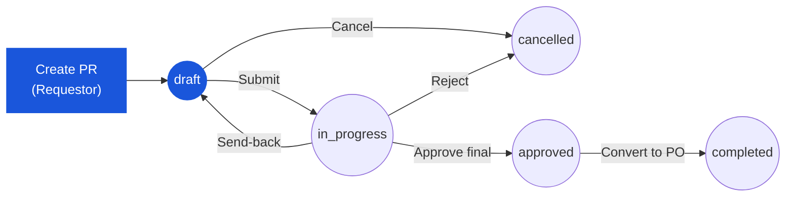

# Purchase Request — User Flow — Requestor

## 1. Role in This Module

The **Requestor** is the hotel or department staff member who originates a Purchase Request — the upstream demand signal that authorises procurement before any external commitment is made to a vendor. They own the PR while it is in `draft`: they fill the header (PR type — `General Purchase`, `Market List`, `Asset` — department, currency, requestor, request and required delivery dates, job/cost code, delivery point, description and justification), build the line list (product or free-text description, store location, requested quantity, FOC quantity, unit of measure, estimated unit price, discount, tax treatment, line delivery date), attach supporting documents (quotations, specs, photos), and submit when the request is ready for approval. Their involvement does not end at submit: when an approver chooses **Send Back** the PR returns to `draft` and the Requestor re-enters the flow to revise and resubmit, and at any time while the PR is still in `draft` they may cancel it. They cannot edit a PR after submission and they are not part of the approval, vendor-allocation, or PO-conversion steps — those belong to the Approver chain, the Purchaser, and the Procurement Manager respectively (see [index.md](./index.md) Section 4).

### Workflow position (Requestor highlighted)

### Permission Matrix — Status × Action (Requestor)

The Requestor is **the owner** of a PR only while it is in `draft`. Once it leaves `draft` (`in_progress`, `approved`, `completed`) or terminates (`cancelled`, `voided`) the Requestor retains view-only access. Action availability is enforced server-side by `PR_AUTH_001` and the state-machine guards.

| Action | draft (own) | in_progress | approved | completed | cancelled / voided |
|---|---|---|---|---|---|
| View PR | ✅ | ✅ | ✅ | ✅ | ✅ |
| Edit header / lines | ✅ | ❌ | ❌ | ❌ | ❌ |
| Add / remove items | ✅ | ❌ | ❌ | ❌ | ❌ |
| Add attachments / comments | ✅ | ✅ (comment only) | ✅ (comment only) | ✅ (comment only) | ❌ |
| Submit | ✅ (≥1 line + workflow selected) | ❌ | ❌ | ❌ | ❌ |
| Cancel | ✅ | ❌ | ❌ | ❌ | — |
| Resubmit (after Send-back) | ✅ (PR is in `draft` again) | ❌ | ❌ | ❌ | ❌ |

> ℹ️ **Send-back loop:** when an approver chooses *Send Back* the PR's `pr_status` returns to `draft` and the Requestor is once again the owner — every cell in the **draft (own)** column above re-applies. Revision history is preserved (`PR_POST_008`).

## 2. Entry Point and Primary Flow

**Entry point:** Sidebar → **Purchase Request** module → **PR list view** → **Create New PR** button (alternatively: **Create from Template** when reusing a saved template, or `Alt+N` from anywhere in the module).

**Primary flow (happy path):**

1. From the PR list view, click **Create New PR**. The system inserts a new header row with `pr_status = draft`, auto-generates the reference number, stamps `pr_date` with today's date, and pre-fills `requestor_id` from the logged-in user.
2. Fill the header: select **PR type** (`General Purchase`, `Market List`, or `Asset`), confirm or change `department_id`, set the required **delivery date**, choose **currency** (exchange rate is fetched automatically), enter the **description / justification**, and select the target **workflow_id** for `purchase-request` scope. Save the header (auto-save also runs on connection loss).
3. Open the **Items** tab and click **Add Item**. For each line: search the product catalog (or use the free-text description for non-catalog items), pick the **store location**, enter **requested quantity** and **unit of measure**, enter the **estimated unit price** (or accept the auto-filled pricelist price if the system has populated it), set any **FOC quantity**, line-level **discount**, **tax** treatment, and line **delivery date**. Add line notes if useful.
4. Repeat step 3 until every required line is on the PR. Inline validation flags missing required fields on each line (rule reference: `PR_VAL_006` requires at least one non-deleted line at submit; per-line validations are enforced before the line can be saved).
5. Review the **financial summary** on the header: subtotal, total discount, total tax, and grand total in both transaction and base currency. The system rolls these from line-level rounded values (3-dp quantity, 2-dp money, 5-dp exchange rate).
6. Open the **Attachments** tab and upload supporting documents — vendor quotations, product specs, photos, internal approvals. Add a description and visibility setting per file.
7. Optionally trigger **budget validation** from the header. The system runs an availability check against the requestor's department and cost-centre budget and surfaces an Available / Warning / Exceeded indicator with the breakdown (total budget, soft commitments from other PRs / open POs, hard commitments). The check is informational at this point — it does not block submit.
8. Review the full PR in the **Review** tab: header, all lines, totals, attachments, and the workflow stages that will run after submit. Fix any issues in place.
9. Click **Submit**. The system runs all submit-time validations (header required fields, at least one line, per-line validations, active workflow). On pass it transitions `pr_status` from `draft` to `in_progress`, advances `workflow_current_stage` to the first approval stage, creates the **soft budget commitment** on the relevant category, writes an audit entry, and routes notifications to the first approver (typically Department Head) and a copy back to the Requestor.
10. Track progress from the **My PRs** dashboard or the PR detail page — the workflow stepper shows which stage the PR is at, who is the current approver, and the cumulative action history. The Requestor's primary path ends here for the happy case; they re-enter only on send-back (Section 3).

## 3. Decision Branches

- **If a required header field is missing or invalid at submit** (e.g. no `department_id`, no `pr_date`, no `workflow_id`, invalid currency or exchange rate): the submit action is blocked, the form scrolls to the first offending field, and an inline error message is shown. The PR remains in `draft`. Fix the field and retry submit.
- **If the PR has no non-deleted lines at submit** (rule `PR_VAL_006`): submit is rejected with the message "At least one line is required". The PR remains in `draft`. Add at least one line and retry.
- **If budget validation reports `Warning` or `Exceeded`**: the system surfaces the budget impact but does **not** block submit (the budget check is informational at submission). The Requestor decides whether to (a) reduce quantities or estimated prices and re-validate, (b) split the request into a smaller PR, or (c) proceed and let the Budget Controller approve or reject downstream.
- **If an approver chooses Send Back** on a submitted PR (any stage): the PR transitions from `in_progress` back to `draft`, the soft budget commitment is released until re-submission, the approver's reason is attached to the activity log, and the Requestor is notified. The Requestor re-enters at Section 2 step 2 (revise header or lines per the comment) and resubmits at step 9. Revision history is preserved.
- **If the Requestor wants to cancel a PR they have not yet submitted**: from the PR detail page or list view, choose **Cancel** while the PR is still `draft`. The system transitions to `cancelled`, releases any in-progress edits, and terminates the document. Submitted PRs (`in_progress`, `approved`) cannot be cancelled by the Requestor — only the workflow can reject them (transitions to `cancelled`) or an administrator can void them (transitions to `voided`).
- **If the Requestor tries to edit a PR after submit** (`in_progress`, `approved`, `completed`, `voided`, `cancelled`): all edit controls are read-only. The only way to change the content is to ask the current approver to send the PR back to `draft`. Once back in `draft`, the Requestor regains edit rights and the flow resumes at Section 2 step 2.

## 4. Exit Point / Handoffs

The Requestor's primary involvement ends when the PR transitions from `draft` to `in_progress` at step 9 of Section 2. At that point the document leaves the Requestor's responsibility and is picked up by the first-stage approver in the configured workflow (typically Department Head; see [03-user-flow-approver.md](./03-user-flow-approver.md) when published). The document state at handoff is `in_progress` with `workflow_current_stage` pointing at the first approval stage and a soft budget commitment registered against the requestor's department.

A second handoff direction is **back to the Requestor on send-back**: any approver in the chain may return the PR to `draft` with a reason, releasing the soft commitment. This is not a true exit — the Requestor re-enters at Section 2 step 2 to revise the PR and resubmits. Cycles repeat until the PR is either approved (final stage), rejected (`cancelled`), or voided (`voided`).

Terminal exits for the Requestor (no further action possible by them) are:

- **Cancelled by Requestor in draft** — `pr_status = cancelled`, terminal.
- **Rejected by an approver** — `pr_status = cancelled`, terminal. Auditor reviews post-hoc.
- **Voided by System Administrator** — `pr_status = voided`, terminal. Auditor reviews post-hoc.
- **Approved and converted to PO** — `pr_status = completed`, terminal. The Purchaser owns the conversion; the Requestor sees the linked PO in the PR detail page for traceability.

## 5. References

- Parent overview: [03-user-flow.md](./03-user-flow.md)
- `../carmen/docs/purchase-request-management/PR-User-Experience.md` — primary source for the creation, submission, and send-back flows
- `../carmen/docs/purchase-request-management/PR-Overview.md` — module overview, requestor role definition, integration points
- `../carmen/docs/purchase-request-management/purchase-request-module-prd.md` — product requirements driving the Requestor flow
- Sibling: [01-data-model.md](./01-data-model.md) — `tb_purchase_request`, `tb_purchase_request_detail`, `enum_purchase_request_doc_status`
- Sibling: [02-business-rules.md](./02-business-rules.md) — `PR_VAL_006` (at-least-one-line) and other submit-time validations
- Sibling: [index.md](./index.md) Section 4 — canonical Requestor role description
