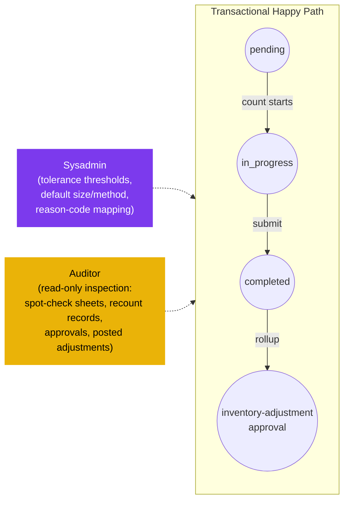

# Spot Check — User Flow — Audit / Config

## 1. Persona

This persona group collapses two roles whose touch on the spot-check module is observation or configuration:

- **Auditor** — independently reviews spot-check results, recount evidence, and posted adjustments to confirm controls are operating and shrinkage is being investigated. Observes a sample of spot checks in progress; inspects the full chain end-to-end (spot-check sheets, recount records, approvals, posted adjustments, journal entries) for compliance, segregation-of-duties, and policy adherence.
- **Sysadmin** (implicit — not explicitly listed in [[spot-check]] § 4 personas but inferred from the configuration surface) — configures tenant defaults: tolerance thresholds for variance flagging (`SPC_VAL_006`), default sampling `size`, default `method`, and reason-code mapping for `SPOT_CHECK_OVERAGE` / `SPOT_CHECK_SHORTAGE` (or aliased `COUNT_*` codes) in [[inventory-adjustment]].

> **Note:** Unlike physical-count, the spot-check module does **not** define an Approver / Finance Reviewer persona at this level — the rollup-adjustment approval lands on the [[inventory-adjustment]] document and is governed by `ADJ_AUTH_*`, not by spot-check rules. The Auditor / Sysadmin pair captures the audit-and-config surface specific to spot-check.

Authority anchor for `SPC_AUTH_003`.

### Position relative to the transactional flow (off-path observers)

### Permission Matrix — V6 Action × Sub-persona (Audit / Config)

Both sub-personas are non-transactional within the spot-check module — neither creates, edits, submits, or voids spot-check documents. Note: unlike Physical Count, there is no Approver / Finance persona at the spot-check level — rollup-adjustment approval lands on [[inventory-adjustment]] per `ADJ_AUTH_*`. Rows are derived from Section 3 (Primary Actions) of this file; rule citations refer to [[spot-check/02-business-rules]] § 4 / § 5.

| Action | Auditor | Sysadmin |
|---|---|---|
| View spot-check header / detail / comment threads (read-only) | ✅ (`SPC_AUTH_003`) | ✅ |
| View counter assignments (location-grants) and counted-by stamps | ✅ (`SPC_AUTH_003`) | ✅ |
| View rollup adjustment (`tb_stock_in` / `tb_stock_out`) in [[inventory-adjustment]] | ✅ | ✅ |
| Observe spot check in progress (sample-based; add observation comment) | ✅ (`SPC_AUTH_003`) | ❌ |
| Inspect full chain (spot-check sheet → recount → approvals → posted adj → inventory tx) | ✅ (`SPC_AUTH_003`) | ❌ |
| Verify SoD (submitter ≠ rollup approver) | ✅ (`SPC_AUTH_003`) | ❌ |
| Configure tolerance threshold (`SPC_VAL_006` default) | ❌ | ✅ (`SPC_AUTH_003`) |
| Configure default sample `size` | ❌ | ✅ (`SPC_AUTH_003`) |
| Configure default `method` (`enum_spot_check_method`) | ❌ | ✅ (`SPC_AUTH_003`) |
| Configure reason-code mapping (`SPOT_CHECK_OVERAGE` / `SPOT_CHECK_SHORTAGE` → GL account) | ❌ | ✅ (`SPC_AUTH_003`) |
| Create / edit / submit / void spot-check documents | ❌ | ❌ |

## 2. Entry Points

- **Audit log** — Auditor: read-only view across spot-check documents, recount comment threads, rollup adjustments, journal entries.
- **Configuration screens** — Sysadmin: tolerance / default-`size` / default-`method` / reason-code admin pages.
- **Approval queue (cross-reference)** — Approval of the rollup adjustment itself happens on the [[inventory-adjustment/03-user-flow-finance]] flow; Audit / Config personas here read the upstream spot-check chain to back-validate that approval.

## 3. Primary Actions

| Action | Persona | State precondition | State effect | Notes |
| ------ | ------- | ------------------ | ------------ | ----- |
| Observe spot check in progress | Auditor | Spot check in `in_progress` | (read) live `actual_qty` entries, counter assignments, recount flags | Sample-based; observation note stored as `tb_spot_check_comment`. |
| Inspect full chain | Auditor | Spot check `completed`; rollup adjustment `completed` | (read) spot-check sheet → recount records → approvals → posted adjustment → inventory transaction → journal entry | The full audit trail. |
| Verify SoD on rollup approval | Auditor | Rollup adjustment `completed` | (read) check `tb_stock_in.created_by_id` ≠ approval `last_action_by_id` | SoD: Inventory Controller (spot-check submitter) ≠ rollup approver. |
| Configure tolerance threshold | Sysadmin | (any) | New tenant default for `SPC_VAL_006` | Applied to future spot checks. |
| Configure default `size` | Sysadmin | (any) | New tenant default for sample size | Applied at sheet generation when not overridden. |
| Configure default `method` | Sysadmin | (any) | New tenant default for `enum_spot_check_method` | Applied at sheet generation when not overridden. |
| Configure reason-code mapping | Sysadmin | (any) | `tb_adjustment_type` rows for `SPOT_CHECK_OVERAGE` / `SPOT_CHECK_SHORTAGE` (or aliased `COUNT_*`) with `info.glAccount` | Per [[inventory-adjustment/01-data-model]] § 2.1. |

## 4. Decision Points

- **Auditor — observe early or inspect late.** Observation during `in_progress` catches process-discipline issues (counter bias, missed recounts); late inspection of `completed` spot check + adjustment chain verifies that documentation is intact for external audit.
- **Auditor — sample density.** Spot checks themselves are samples; how many spot checks the auditor independently re-samples is a function of risk appetite and prior-period findings.
- **Sysadmin — strictness vs operational friction.** Tighter tolerance (low %) catches more variance but creates more recount overhead; looser tolerance speeds spot checks but may mask shrinkage. Default `size` and `method` shift coverage emphasis (random for rotation, high_value for risk concentration).

> **TODO:** Source the exact configuration UI for tolerance / default-size / default-method admin from `../carmen-inventory-frontend/`; confirm whether tolerance is per-tenant, per-location, or per-category.

## 5. Exit / Handoff

| Trigger | Handoff to | Artefact |
| ------- | ---------- | -------- |
| Auditor completes inspection | (read-only, no state change) | Audit report (external artefact). |
| Auditor escalates a finding | Inventory Controller / Finance | Comment on `tb_spot_check` or on rollup `tb_stock_in` / `tb_stock_out` with finding note. |
| Sysadmin updates config | (configuration applied to next spot check) | Updated tenant default values. |

## 6. References

- **Primary (TODO):** carmen/docs source — does not exist for this module.
- **Frontend (TODO):** `../carmen-inventory-frontend/` — audit query and admin configuration screens.
- **E2E (TODO):** `../carmen-inventory-frontend-e2e/tests/` — no spot-check spec currently exists.
- Related: [[spot-check/03-user-flow]] (overview), [[spot-check/02-business-rules]] (`SPC_AUTH_003`, `SPC_VAL_006`, `SPC_POST_002`), [[physical-count/03-user-flow-audit-config]] (full-count counterpart audit/config flow with Approver/Finance also in scope), [[inventory-adjustment/03-user-flow-finance]] (rollup-side approver flow, where the variance adjustment actually gets approved), [[inventory-adjustment/03-user-flow-audit-config]] (parallel audit / config flow on the adjustment side).
