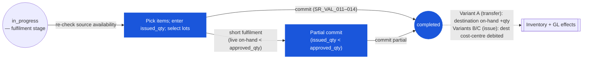

# Store Requisition (SR) — User Flow — Fulfiller

## 1. Role in This Module

The **Fulfiller** persona is the **Store Keeper / Warehouse Supervisor** at the source location who owns the irrevocable posting step — they receive the approved SR at the source warehouse, pick the items from the shelf, record `issued_qty` per line (which may be less than `approved_qty` if stock has dropped between approval and issue), select specific lots for lot-controlled items, and **commit** the SR (`in_progress → completed`). The commit is the single posting event for the SR: it fires the source on-hand decrement, the cost-layer consumption (per `[[costing]]` FIFO or moving-average for the source location), the destination on-hand increment (for `sr_type = transfer`) or the destination cost-centre debit (for `sr_type = issue`), and the journal-entry write. On entry the SR is at `doc_status = in_progress` with `workflow_current_stage` pointing at the fulfilment stage and the Fulfiller in `user_action.execute`; each line has `approved_qty > 0` (otherwise the SR would have moved to `cancelled` at approval) and the Approver's per-line signature is preserved on `tb_store_requisition_detail.approved_by_*`. The states owned by this persona are the fulfilment phase of `in_progress` (during which `issued_qty` is set and lots are selected without committing) and the `in_progress → completed` transition itself. Segregation of duties forbids the Approver from being the Fulfiller on the same SR (`SR_AUTH_012`) — the SR module enforces this at commit time; tenant config may relax this for low-value SRs below a threshold. Post-commit corrections are out of scope for the routine Fulfiller path; they go through `[[inventory-adjustment]]`.

### Workflow position (Fulfiller highlighted)

### Permission Matrix — V1 Status × Action (Fulfiller)

The Fulfiller acts at `doc_status = in_progress` while `workflow_current_stage` is at the fulfilment stage and the Fulfiller is in `user_action.execute`. The Fulfiller cannot exceed the Approver's `approved_qty` per line. Segregation of Duties (`SR_AUTH_012`) forbids the Approver of a line from being the same user who commits the SR; tenant config may relax this for low-value SRs.

| Action | `in_progress` (fulfilment stage) | `completed` |
|---|---|---|
| View SR and approved quantities | ✅ (`SR_AUTH_007`) | ✅ |
| Re-check live source availability | ✅ (`SR_VAL_013` pre-check) | — |
| Enter `issued_qty` per line (`≤ approved_qty`) | ✅ (`SR_AUTH_007`, `SR_VAL_008`) | ❌ |
| Select lots for lot-controlled items | ✅ (`SR_VAL_012`) | ❌ |
| Enter per-line comments / attachments | ✅ | ❌ |
| Commit SR (`in_progress → completed`) | ✅ (`SR_AUTH_007`, `SR_VAL_011`–`SR_VAL_014`) | ❌ |
| Short fulfilment (partial issue; `issued_qty < approved_qty`) | ✅ (`SR_POST_012`) | — |
| Commit where Fulfiller = line Approver | ❌ (SOD: `SR_AUTH_012`) | — |
| Edit header / line quantities above `approved_qty` | ❌ | ❌ |
| Void SR | ❌ | ❌ |

> ℹ️ **3-variant commit behaviour:** For `sr_type = transfer` (Variant A — INV → INV), the fulfilment and completion steps are auto-collapsed (Issue = Complete); no separate completion action is needed. For `sr_type = issue` (Variants B and C — INV → DIR and INV → CONS), the Fulfiller explicitly commits after recording `issued_qty`.

## 2. Entry Point and Primary Flow

**Entry point:** Two paths into the fulfilment action.

- **Fulfilment dashboard → Approved SRs awaiting pick** — list view filtered to `(doc_status = 'in_progress', workflow_current_stage = '<fulfilment-stage>', user_action.execute CONTAINS me, from_location_id IN my_locations)`; the Fulfiller picks an SR to start.
- **Notification → SR ready for fulfilment** — in-app notification on approval-complete deep-links to the SR detail; same fulfilment action surface.

**Primary flow (happy path, 10 steps):**

1. **Open the SR at the source.** The detail view shows the destination outlet, `sr_type`, expected date, requester, the approver's signature on each line (`approved_by_name`, `approved_date_at`, `approved_message`), and the lines with `approved_qty` (in the product's UoM). The Fulfiller verifies the destination, the urgency (`expected_date`), and any approver note.
2. **Re-check source availability at the moment of issue.** The screen surfaces the live `tb_inventory_status[from_location_id, product_id].quantity_on_hand` per line — this is the `SR_VAL_013` check that runs at commit. If the live on-hand for any line has fallen below `approved_qty` since approval, the Fulfiller will need to short-fulfil (decision branch below).
3. **Pick the items physically.** Walk the shelf with the printed / mobile pick list; count out the quantity to release. For lot-controlled items, identify the specific lot(s) using the location's standing rotation policy (FIFO by expiry for perishables, FIFO by receipt for non-perishables).
4. **Enter `issued_qty` per line.** What was actually picked, in the product's UoM. The screen enforces `0 ≤ issued_qty ≤ approved_qty` per `SR_VAL_008`; values above `approved_qty` are rejected.
5. **Select lots for lot-controlled items.** Open the lot-selection sub-form on the line; the screen lists active lots at source with `lot_no`, `expiry_date`, and remaining quantity. Pick one or more lots summing to `issued_qty`. Lot selection writes onto the linked `tb_inventory_transaction_detail` (not directly onto the SR line — lot info lives on the inventory transaction; `SR_VAL_012` checks this at commit).
6. **Capture additional context.** Per-line free-text comments (any condition issues, packaging notes, partial-fulfilment rationale); attachments (photos of picked goods, weight tickets); these write to `tb_store_requisition_detail_comment`.
7. **Stage the goods for release.** Move the picked items to the dispatch area; in transfer flows where a paired GRN at the destination is used (the `[[good-receive-note]]` paired pattern), tag the load with the SR `sr_no` so the destination Receiver can match.
8. **Commit the SR.** Click **Commit / Issue**. The system fires `SR_VAL_011`–`SR_VAL_014` in one transaction: at least one line with `approved_qty > 0` and a corresponding `issued_qty`, lot info present on linked inventory transactions for lot-controlled items, source on-hand covers every `issued_qty` (live check, not snapshot), posting date in an open period. SoD check `Approver ≠ Fulfiller` runs (`SR_AUTH_012`).
9. **Cross-module fan-out fires atomically.** Per `SR_POST_006`–`SR_POST_008`: for each line with `issued_qty > 0`, the system inserts a `tb_inventory_transaction` row (`inventory_doc_type = store_requisition`) plus its `tb_inventory_transaction_detail` child(ren) carrying `lot_no`, `expiry_date`, and the source-costed `cost_per_unit`; stamps the inserted id on `tb_store_requisition_detail.inventory_transaction_id`; decrements source on-hand by `issued_qty` (and `issued_base_qty` for UoM-differing flows); for `sr_type = transfer` writes the paired IN row at destination; for `sr_type = issue` debits the destination cost-centre's expense account. Journal entries balance per `SR_POST_007`. Variance events feed outlet reporting per `SR_POST_008`.
10. **Document state transitions.** `doc_status = in_progress → completed`; `last_action = approved` (or `submitted` per workflow); `last_action_at_date = now()`; `workflow_history` gets the commit entry; per-line `history` gets a final `issued` entry. The SR is now locked against further edits; downstream handoff goes to the destination Receiver. The Fulfiller is notified of commit success; any post-commit correction must go through `[[inventory-adjustment]]`.

## 3. Decision Branches

- **At-issue stock-out (live on-hand < `approved_qty`)** — the most common branch. The Fulfiller sees the live on-hand below `approved_qty` on one or more lines. Two options:
  - **Short fulfilment (partial commit)** — reduce `issued_qty` to `min(approved_qty, live_on_hand)` on the affected line, write a per-line system comment ("issued X of Y; Z short due to concurrent consumption"), and commit the SR with the partial. The closed SR shows `fulfilment_gap = approved_qty − issued_qty > 0` recorded; the requester sees the partial fulfilment and may raise a follow-up SR. Per `SR_POST_012` option (a).
  - **Skip the line, fulfil others** — set `issued_qty = 0` on the short line (note `approved_qty > 0` remains; the line stays with its approved value but the issue is zero), write a system comment, and commit the other lines normally. Per `SR_POST_012` option (b). The line is closed with a fulfilment gap of `approved_qty`.
- **Lot selection for lot-controlled items** — multiple eligible lots exist at source. The Fulfiller chooses lots per the location's rotation policy. For perishables, FIFO by `expiry_date` is the standard (oldest expiry first); for non-perishables, FIFO by receipt (oldest cost layer first). Lot selection writes onto `tb_inventory_transaction_detail` (one row per lot picked); multi-lot lines have one inventory transaction with multiple `_detail` rows summing to `issued_qty`.
- **Multi-lot split on a single line** — `issued_qty = 10` across two lots (`lot A = 6, lot B = 4`). The lot sub-form sums to `issued_qty`; sub-totals do not need to be equal across lots. The cost-layer consumption picks each lot's `cost_per_unit` from the linked `tb_inventory_transaction_cost_layer`; if the lots have different costs (FIFO with mixed receipts), the issued line carries a blended unit cost computed at commit.
- **Quality issue at pick (damaged stock)** — the Fulfiller pulls the goods and finds damage or expiry past date. The Fulfiller does not include the damaged stock in `issued_qty` (it stays as a quality reject on the source side, handled via the source's own inventory adjustment for damaged stock — out of scope here). The Fulfiller may need to short-fulfil if the rejected lot was the only available source; the same partial-commit pattern applies.
- **Wrong product on pick list** — the SR line specifies a product the source does not stock (rare, but possible after product-master changes between approval and issue). The Fulfiller cannot fulfil the line as-is; sets `issued_qty = 0`, writes a system comment, and commits the SR. The requester must raise a revised SR against a valid product. Post-commit the inventory-controller may post a correction.
- **Source location switching (rare)** — the named source has gone offline (system flag, audit hold) between approval and issue; another source can supply the same product. This is out of scope for the routine fulfiller path — it requires a new SR with the alternate source; the original SR is voided by the inventory controller (`SR_POST_010`).
- **Closed-period commit attempt** — `SR_VAL_014` blocks at commit because the posting date falls in a closed accounting period. The Fulfiller cannot bypass; the SR stays at `in_progress` until either Finance reopens the period or the Fulfiller advances the posting date (tenant config decides whether posting date is forward-looking or fixed at issue).
- **SoD violation at commit** (`SR_AUTH_012`) — the Fulfiller is the same user as the line's `approved_by_id`. Commit is blocked. The Fulfiller must hand off to a different user (different shift, escalation to a deputy fulfiller), or the inventory-controller may relax the SoD for low-value SRs per tenant config.

## 4. Exit Point / Handoffs

The Fulfiller's involvement on a given SR ends at one of three boundaries:

- **Commit succeeds (`in_progress → completed`)** — handoff to the **Receiver** at the destination outlet. The SR is locked; the source on-hand has decremented; the destination has received stock (for `transfer`) or absorbed cost (for `issue`); the inventory transactions carry lot and cost data for audit and trace. Any subsequent correction is via `[[inventory-adjustment]]`.
- **Commit succeeds with short fulfilment** — handoff to the **Receiver** plus a parallel notification to the **Inventory Controller** (variance review) and the **Requester** (so they know the partial outcome and can decide whether to raise a follow-up SR). The SR is `completed` with `fulfilment_gap > 0` on one or more lines recorded as the variance.
- **Pre-commit step interrupted (system / network / SoD failure)** — the SR stays at `in_progress`; the Fulfiller's per-line `issued_qty` and lot selections are saved (the lot sub-form persists as draft state, even pre-commit); a different user (deputy fulfiller for SoD, Sysadmin for tech issue) re-enters the flow and completes. No inventory or GL effect; the SR remains in the fulfiller queue.

Post-commit reversal of a `completed` SR is **not** part of the routine Fulfiller path — it requires a compensating adjustment in `[[inventory-adjustment]]` co-authored by the Inventory Controller and Finance, and is documented under the Audit / Config persona.

## 5. References

- Parent overview: [03-user-flow.md](./03-user-flow.md) — the canonical five-value lifecycle and the cross-persona handoff table; Section 4 row "Fulfiller → Receiver" anchors this persona's primary exit; the "Fulfiller hits at-issue stock-out → Receiver + Inventory Controller" row covers the partial-commit case.
- `../carmen/docs/store-requisitions/SR-User-Experience.md` § Processing a Store Requisition — carmen/docs source for the fulfiller (named "Maria Rodriguez, Warehouse Supervisor" in the persona narrative); journey steps map onto Section 2 above.
- `../carmen/docs/store-requisitions/SR-Overview.md` § User Roles → Fulfiller row — carmen/docs source for the persona's responsibility scope.
- `../carmen/docs/store-requisitions/Store Requisitions.md` § UC-69 (Approve Requisition and Record Stock as Issued) — use-case main success scenario for record-issue / commit.
- Sibling: [03-user-flow-approver.md](./03-user-flow-approver.md) — upstream persona; the Fulfiller's `approved_qty` cap is set by the Approver.
- Sibling: [03-user-flow-receiver.md](./03-user-flow-receiver.md) — downstream persona; the Receiver acknowledges physical receipt at the destination after the Fulfiller's commit.
- Sibling: [03-user-flow-audit-config.md](./03-user-flow-audit-config.md) — Inventory Controller monitors fulfilment variance (`fulfilment_gap`); Finance verifies the journal entries the Fulfiller's commit triggers; Sysadmin owns the RBAC that gates fulfilment authority and the SoD-relaxation thresholds.
- Sibling: [01-data-model.md](./01-data-model.md) — `tb_store_requisition_detail.issued_qty`, the `inventory_transaction_id` link, and the lot-data linkage via `tb_inventory_transaction_detail` (lot lives on the inventory transaction, NOT on the SR line — see §5 items 2, 6 of the data model).
- Sibling: [02-business-rules.md](./02-business-rules.md) — `SR_VAL_008` (quantity invariant `issued_qty ≤ approved_qty`), `SR_VAL_011`–`SR_VAL_014` (commit-time gates), `SR_AUTH_007` (Fulfiller authority), `SR_AUTH_012` (Approver ≠ Fulfiller SoD), `SR_POST_005`–`SR_POST_008` (commit posting effects), `SR_POST_012` (at-issue short fulfilment options).
- Related: [[inventory]] — the downstream module the commit fans out into; lot, expiry, and cost-layer data live on `tb_inventory_transaction_detail`.
- Related: [[costing]] — source-location FIFO / moving-average feeds the issued unit cost picked up at commit.
- Related: [[good-receive-note]] — paired GRN at destination for inter-warehouse transfers in tenants that use the paired pattern; the Fulfiller tags the load with `sr_no` for matching.
