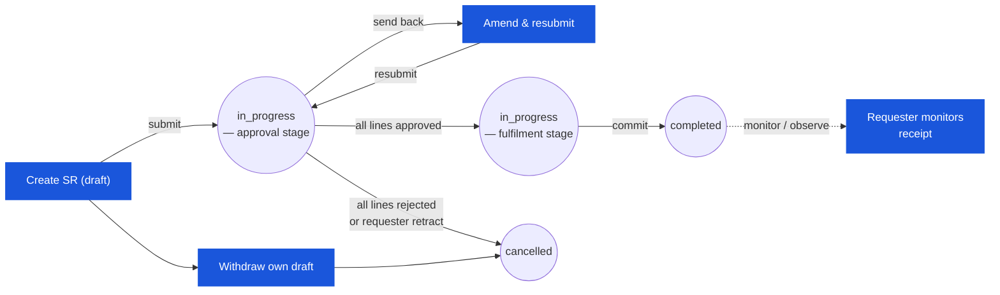

# Store Requisition (SR) — User Flow — Requester

> **At a Glance**
> **Persona:** Outlet Manager (consuming location) &nbsp;·&nbsp; **Module:** [[store-requisition]] &nbsp;·&nbsp; **Workflow stages:** draft → in_progress (first approval stage; retract / amend on send-back) &nbsp;·&nbsp; **Key permissions:** create / edit / submit draft, withdraw draft, retract at first stage, amend after send-back
> **What this persona does:** Raises the SR — picks source/destination + sr_type, adds lines with requested_qty, submits for approval, and amends on send-back.

## 1. Role in This Module

The **Requester** persona is the **Outlet Manager** (kitchen, bar, banquet, restaurant) — the person at the consuming location who identifies stock needs and raises the requisition against a source warehouse or central store. The Requester owns the editable `draft`: they pick the source location and destination outlet, choose the movement type (`sr_type = issue` for direct-cost consumption pulls, `sr_type = transfer` for moves into another inventory-holding location), add product lines with `requested_qty` and a required date (`expected_date`), attach supporting notes (recipe demand snapshot, banquet event detail, par-level rationale), and submit the document for approval. On entry the requester is logged in with create-SR permission and is a member of `tb_store_requisition.department_id`; the requester is permitted to act between the chosen `from_location_id` and `to_location_id`. The SR states owned by this persona are `draft` (full edit rights) and a sliver of `in_progress` — the requester can retract their own SR while the workflow is still at the first approval stage and no approver has yet acted (`SR_AUTH_004`), and can amend / resubmit when an approver sends the document back for correction (the requester stage is re-entered via the workflow). Segregation of duties forbids the requester from approving their own SR (`SR_AUTH_011`) — the SR module enforces this at the approve action.

### Workflow position (Requester highlighted)

### Permission Matrix — V1 Status × Action (Requester)

The Requester holds full edit rights at `draft` and re-enters `in_progress` only when an approver sends the document back for correction. Segregation of duties (`SR_AUTH_011`) forbids the Requester from approving their own SR — the module enforces this at the approve action.

| Action | `draft` | `in_progress` (send-back only) | `completed` | `cancelled` / `voided` |
|---|---|---|---|---|
| Create SR | ✅ (`SR_AUTH_001`) | — | — | — |
| Edit header (locations, dates, description, dimension) | ✅ (`SR_AUTH_002`) | ✅ send-back only | ❌ | ❌ |
| Add / edit / delete lines (`requested_qty`) | ✅ (`SR_AUTH_002`) | ✅ send-back only | ❌ | ❌ |
| Attach supporting evidence (comments / attachments) | ✅ | ✅ | ❌ | ❌ |
| Submit for approval (`draft → in_progress`) | ✅ (`SR_AUTH_003`) | — | — | — |
| Resubmit after send-back | — | ✅ (`SR_AUTH_003`) | — | — |
| Withdraw / cancel own draft | ✅ (`SR_AUTH_004`) | ✅ at first approval stage only (`SR_AUTH_004`) | ❌ | — |
| View SR (read-only) | ✅ | ✅ | ✅ | ✅ |
| Approve own SR | ❌ (SOD: Requester ≠ Approver per `SR_AUTH_011`) | ❌ | — | — |

> ℹ️ **Send-back loop:** When an Approver sends the SR back for correction, the SR remains at `doc_status = in_progress` but the `workflow_current_stage` returns to the requester stage. The Requester amends and resubmits; already-approved lines are not reversed.

## 2. Entry Point and Primary Flow

**Entry point:** Three paths into draft creation.

- **SR module → Create SR** — pick the destination outlet (defaults to the requester's home outlet), then the source location; choose `sr_type` (`issue` or `transfer`); start adding line items.
- **Auto-create from recipe demand** — `[[recipe]]` module computes ingredient quantities for an upcoming production / banquet event at the outlet and posts an SR `draft` for the requester to review; `info.recipe_id` carries the back-reference. The requester opens the pre-populated draft, adjusts quantities if needed, and continues from step 4 below.
- **Edit returned SR (send-back from approver)** — approver routed the document back to the requester stage with `review_message` per line; the requester re-enters the same workflow stage they originated, amends quantities / notes, and resubmits.

**Primary flow (happy path, 10 steps):**

1. **Identify the need.** Review the outlet's par levels, the upcoming production schedule (recipe demand, banquet event sheet), known stock-out points, and on-hand at the outlet. Decide the source location (typically the central store) and the destination (the requester's own outlet for `issue`, or another inventory store for `transfer`).
2. **Open the SR module → Create SR.** The system writes `tb_store_requisition` at `doc_status = draft`; `sr_no` is assigned per tenant numbering policy; `requestor_id` / `requestor_name` / `department_id` / `department_name` are populated from the logged-in user's profile.
3. **Pick the source location, destination location, and movement type.** Source is `from_location_id` (typically a `tb_location.location_type = 'inventory'` warehouse); destination is `to_location_id` (`direct` for `sr_type = issue`, `inventory` for `sr_type = transfer`). The screen surfaces the location-type / movement-type compatibility check from `SR_VAL_003`.
4. **Enter header detail.** `sr_date` (defaults to today), `expected_date` (the date the outlet needs the goods by — used for fulfilment prioritisation), `description` (free-text rationale: "weekly replenishment", "banquet event Friday", "emergency pull"), and the cost-dimension `dimension` JSON if the outlet splits across multiple cost-centres.
5. **Add line items.** Search the product catalog by name, code, or category; pick a product. The screen surfaces a UI-only enrichment block showing current on-hand at the source, on-order, last price, last vendor, and the product's category / barcode (these are **not** stored on the SR line — see [[store-requisition/01-data-model]] § 5 item 5). Enter `requested_qty` (in the product's UoM); the line writes one row to `tb_store_requisition_detail`. Repeat for each product needed.
6. **Split lines by cost-dimension if needed.** A single product on the same SR with two different cost-dimension allocations (e.g. 60% to Banquet, 40% to A-la-carte) is modelled as two separate lines, each with its own `dimension` JSON (per the unique index `SRT1_*`). Identical product+dimension is a duplicate (`SR_VAL_007`).
7. **Attach supporting evidence.** Recipe demand snapshot, event sheet, photos, par-level analysis, approval pre-clearance memo. Attachments are scoped to the SR header (via `tb_store_requisition_comment.attachments`) or to individual lines (via `tb_store_requisition_detail_comment.attachments`).
8. **Pre-submit validation review.** The screen surfaces the `SR_VAL_009` source-availability check (per tenant config: hard block or soft warn) — for each line, current source on-hand minus reservations from other open SRs is shown; lines breaching the cap are flagged. The requester adjusts `requested_qty` or accepts the soft warning.
9. **Submit for approval.** Click **Submit**; the system fires `SR_VAL_001`–`SR_VAL_009`, sets `doc_status = draft → in_progress`, advances the workflow to the first approval stage, populates `user_action.execute` from that stage's permitted users (typically the requester's Department Head), writes the `submitted` entry into `last_action` / `workflow_history`, and appends a `submit` entry to each line's `history` JSON. The requester is notified that the SR is now under approval; the document is no longer editable from the requester's hands (except via send-back).
10. **Track status until receipt.** The requester monitors progress: approver decisions land back as send-backs (returns to the requester stage) or advances (workflow moves on to the fulfilment stage); on commit, the requester is notified that the goods are issued and on their way; the Receiver at the destination logs receipt; any discrepancy is flagged for inventory-controller follow-up. The requester does NOT directly receive at the destination — that is the Receiver's role (which, in small outlets, may be the same physical user wearing two hats).

## 3. Decision Branches

- **Soft warning on source availability** (`SR_VAL_009` soft mode): the source on-hand is less than the requested quantity. The requester chooses to (a) reduce `requested_qty` to match the available stock, (b) submit anyway with the soft warning recorded (the approver will see the warning at approval time and decide whether to trim or approve as-is, accepting that the fulfiller may need to commit a partial), or (c) raise an additional SR against a different source location if multiple warehouses can supply the product.
- **Hard block on source availability** (`SR_VAL_009` hard mode): the submit is rejected. The requester must either (a) reduce `requested_qty` to within availability, (b) raise the SR against a different source, or (c) request the inventory controller to enable / widen the soft-warn config.
- **Split cost-dimension allocation**: the same product is requested with two different cost-centre splits (e.g. 60/40 between Banquet and A-la-carte). The requester adds two lines for the same `product_id`, each with its own `dimension` JSON (per the unique index `SRT1_*`). The two lines flow independently through approval and fulfilment.
- **Emergency / out-of-cycle SR**: the outlet has an immediate need outside the normal weekly replenishment cycle. The requester raises the SR with `description` flagged as emergency, sets `expected_date` to today / tomorrow, and may attach an emergency rationale memo; the approver and fulfiller see the urgency flag in their queues. There is no separate `emergency_flag` column on the schema — urgency is conveyed via `description` and `info` extension; the workflow may have an emergency-stage routing in tenant config.
- **Recipe-driven SR**: the recipe module pre-populates the SR with computed ingredient quantities. The requester reviews and may adjust quantities (downward only — upward changes invalidate the recipe assumption; the requester should instead amend the production plan and re-trigger recipe demand). On submit the SR carries `info.recipe_id` as the back-reference.
- **Send-back from approver**: the approver routes the SR back to the requester stage with `review_message` per affected line. The requester sees the document in their queue at `doc_status = in_progress` but at the requester workflow stage; they may edit `requested_qty` or `description`, address the reviewer's note, and resubmit (which re-routes the document to the approval stage). Note: the requester cannot bypass an active send-back — they must respond.
- **Withdraw own SR**: while the workflow is still at the first approval stage and no approver has yet acted, the requester may cancel their own SR (`in_progress → cancelled` per `SR_AUTH_004`) with a reason. Past that point, the requester must ask the approver to reject the document.

## 4. Exit Point / Handoffs

The Requester's involvement on a given SR ends at one of four boundaries:

- **Submit succeeds** — handoff to the **Approver** (Department Head) at the first approval stage. The document is now `in_progress` and held in the approver's queue; the requester is in monitor-only mode until either a send-back routes the document back or the approver's decision moves the workflow forward.
- **Send-back received** — temporary handoff **back to the Requester** at the requester workflow stage. The requester addresses the approver's `review_message`, edits as needed, and re-submits. This is a loop within `in_progress`, not a status change.
- **Cancellation (own withdrawal at first approval stage)** — `in_progress → cancelled` per `SR_AUTH_004`; document terminates; the requester may raise a new SR if the need persists.
- **All-lines-rejected at approval** — `in_progress → cancelled` automatic per `SR_POST_004`; the requester sees the document in `cancelled` with per-line `reject_message` explaining why; the requester may raise a revised SR with tighter quantities, different source, or additional justification.

After successful commit by the fulfiller, the Requester is in **observer / receiver-coordination mode**: they may monitor the destination Receiver's acknowledgement and flag any discrepancy back to the Receiver. In small outlets the Requester and Receiver are often the same person wearing two hats; in larger operations the Requester focuses on demand planning while the Receiver handles physical receipt at the dock.

## 5. References

- Parent overview: [03-user-flow.md](./03-user-flow.md) — the canonical five-value lifecycle (`draft / in_progress / completed / cancelled / voided`) on `enum_doc_status`, the global state machine that this persona's path traverses, and the cross-persona handoff table.
- `../carmen/docs/store-requisitions/SR-User-Experience.md` § Creating a Store Requisition — carmen/docs source for the requester (named "Alex Chen, Store Manager" in the persona narrative); journey steps map onto Section 2 above.
- `../carmen/docs/store-requisitions/SR-Overview.md` § User Roles → Requester row — carmen/docs source for the persona's responsibility scope.
- `../carmen/docs/store-requisitions/Store Requisitions.md` § UC-68 (Create and Manage Store Requisition) — use-case main success scenario for create / submit.
- Sibling: [03-user-flow-approver.md](./03-user-flow-approver.md) — downstream persona that picks up the SR after submit; handles the approve / trim / reject / send-back decisions.
- Sibling: [03-user-flow-fulfiller.md](./03-user-flow-fulfiller.md) — fulfilment persona; the Requester's outcome on the goods depends on the Fulfiller's `issued_qty` per line.
- Sibling: [03-user-flow-receiver.md](./03-user-flow-receiver.md) — destination acknowledgement; in small outlets often the same physical user as the Requester.
- Sibling: [03-user-flow-audit-config.md](./03-user-flow-audit-config.md) — Inventory Controller / Finance / Sysadmin oversight of the SR flow; variance review and config that bounds the requester's choices.
- Sibling: [01-data-model.md](./01-data-model.md) — canonical `enum_doc_status`, `enum_sr_type`, and the `tb_store_requisition_detail` columns the requester writes (`product_id`, `requested_qty`, `dimension`).
- Sibling: [02-business-rules.md](./02-business-rules.md) — `SR_VAL_001`–`SR_VAL_009` (submit-time gates the requester encounters), `SR_AUTH_001`–`SR_AUTH_004` (the requester's authority scope), `SR_AUTH_011` (Requester ≠ Approver SoD).
- Related: [[recipe]] — the auto-create path; recipe demand pre-populates an SR `draft` for the requester to review and submit.
- Related: [[inventory]] — source on-hand visibility at line-entry time (UI-only enrichment, not persisted on the SR line) and the downstream inventory-transaction write the SR triggers on commit.
