# Store Requisition (SR) — User Flow

## 1. Overview

This page is the **overview entry point** for the user-flow set of the `store-requisition` module. A Store Requisition (SR) is the document that records an **internal stock movement between locations** — a header row in `tb_store_requisition` together with one or more `tb_store_requisition_detail` lines. An SR may be a *consumption pull* (`sr_type = issue`, stock leaves inventory and lands as expense on the destination outlet's cost-centre) or an *inventory transfer* (`sr_type = transfer`, stock physically moves between two inventory-holding locations). The SR is the **system of record for internal stock movement**: until it commits, no inventory is decremented at source and no expense / inventory entry is raised at destination; once committed, the source on-hand falls, the destination either receives stock or absorbs cost, and the inventory transactions (with their lot, expiry, and cost-layer data) are written through the linked `tb_inventory_transaction`.

Section 2 below is the **global state machine** — the canonical list of legal transitions across the five values of `enum_doc_status` (`draft`, `in_progress`, `completed`, `cancelled`, `voided`), independent of who acts. Each per-persona file (linked from Section 3) describes that persona's *path through* the state machine — their entry point, the actions available to them, the decision branches they face, and the handoff that ends their involvement. Section 4 then summarises the cross-persona handoffs that stitch the individual paths together. Read this overview first to anchor the lifecycle, then drill into the persona file that matches your role.

A note on workflow stages: unlike GRN where approval and fulfilment are separate header statuses, the SR collapses both phases under the single `in_progress` value. The `workflow_current_stage` field is what distinguishes "awaiting approver" from "awaiting fulfiller" from "awaiting receiver acknowledgement". So the state machine in Section 2 lists only the legal `doc_status` moves; intra-`in_progress` stage advances (approve, send-back, route to fulfiller) are workflow-internal and do not change `doc_status`.

## 2. Document Lifecycle

The SR document status is stored on `tb_store_requisition.doc_status` and constrained to the five values declared in the shared `enum_doc_status`: `draft` (initial editable state, no stock or GL impact, line entry by requester), `in_progress` (submitted and under workflow control — approval + fulfilment phases live here; still no stock or GL impact until commit), `completed` (single posting event has fired — inventory decremented at source, cost-layer consumed, destination receives stock or expense, document locked), `cancelled` (user-initiated retraction or all-lines-rejected automatic move; no inventory or GL impact), and `voided` (administrative cancellation with no inventory or GL impact). The transitions below cover the legal moves between them; everything else is rejected by the workflow engine. Downstream effects (source on-hand decrement, destination on-hand increment for `transfer`, journal-entry write) fire on the `in_progress → completed` transition only — see [02-business-rules.md](./02-business-rules.md) Section 5 for posting rules.

```mermaid
stateDiagram-v2
    [*] --> draft: create (Requester — manual or recipe auto-create)
    draft --> in_progress: submit (Requester — SR_VAL_001–009 pass)
    draft --> cancelled: withdraw / cancel (Requester — own draft)
    draft --> voided: void admin (Inventory Controller / Sysadmin)
    in_progress --> in_progress: approve / trim / reject line (Approver — workflow-internal)
    in_progress --> in_progress: send back for correction (Approver → Requester stage)
    in_progress --> completed: commit issued_qty (Fulfiller — Variant A auto-complete · Variants B/C explicit)
    in_progress --> cancelled: all lines rejected / requester retract at first stage
    in_progress --> voided: void admin (Inventory Controller / Sysadmin)
    completed --> completed: discrepancy flag (Receiver — no status change; SR_POST_013)
    completed --> [*]
    cancelled --> [*]
    voided --> [*]

    note right of in_progress
        Variant A (INV→INV / sr_type=transfer): Issue = Complete, auto-complete
        Variant B (INV→DIR / sr_type=issue): explicit Complete by Fulfiller
        Variant C (INV→CONS / sr_type=issue): explicit Complete by Fulfiller
        Sub-stage tracked via workflow_current_stage, not doc_status
    end note
```

> ℹ️ **Note — intra-`in_progress` stages:** The `in_progress` self-loop covers two distinct workflow sub-stages — the approval phase and the fulfilment phase — both sharing the same `doc_status`. The actual sub-stage is tracked via `tb_store_requisition.workflow_current_stage`. For Variant A (INV → INV transfers), the fulfilment (Issue) and completion steps are auto-collapsed into a single transition; Variants B and C require an explicit Complete action by the Fulfiller.

| From state | Action | To state | Allowed for | Pre-conditions |
| ---------- | ------ | -------- | ----------- | -------------- |
| `(none)` | create | `draft` | Requester | Requester is a member of `department_id`; permitted to act between `from_location_id` and `to_location_id`; `sr_no` assigned per tenant numbering policy. Header may be partially populated; lines may be empty. |
| `(none)` | auto-create from recipe demand | `draft` | System (cross-ref [[recipe]]) | The recipe module computes ingredient quantities for a destination outlet's production / banquet event and posts an SR `draft` for the outlet's requester to review and submit. `info.recipe_id` carries the back-reference. |
| `draft` | edit / save | `draft` | Requester (owner) | Header and line validation rules in [02-business-rules.md](./02-business-rules.md) Section 2 pass at save (warn-only for some) or block on submit; document remains editable. |
| `draft` | submit | `in_progress` | Requester (owner) | All submit-time rules pass (`SR_VAL_001`–`SR_VAL_009`): source / destination locations set and compatible with `sr_type`, source-availability check passes (per tenant config: hard block or soft warn), at least one line with `requested_qty > 0`. Workflow engine routes to first approval stage and populates `user_action.execute`. |
| `draft` | withdraw / cancel | `cancelled` | Requester (own draft) | Reason text required; no inventory or GL impact; document terminates. |
| `draft` | void (admin) | `voided` | Inventory Controller, System Administrator | Reason text required; no inventory or GL impact; document terminates. |
| `in_progress` | approve line (workflow-internal) | `in_progress` | Approver at current stage | Approver is in `user_action.execute` for `workflow_current_stage`; `approved_qty ≤ requested_qty` per `SR_VAL_010`; SoD check `requester ≠ approver` per `SR_AUTH_011`. `workflow_current_stage` advances when all lines at the current stage have been actioned. |
| `in_progress` | reject line / send back (workflow-internal) | `in_progress` | Approver at current stage | Per-line reject sets `approved_qty = 0` and requires `reject_message`; send-back returns the document to an earlier stage (typically requester) with `review_message`. If all active lines are rejected (`Σ approved_qty = 0`), the document moves automatically to `cancelled`. |
| `in_progress` | requester retract at first approval stage | `cancelled` | Requester (own SR) | Allowed only while the workflow is still at the first approval stage and no approver has yet acted. Past that point, only an approver can reject the SR. Reason text required. |
| `in_progress` | record `issued_qty` + commit | `completed` | Fulfiller at fulfilment stage | All commit-time rules pass (`SR_VAL_011`–`SR_VAL_014`): at least one line with `approved_qty > 0`, lot info present on inventory transactions for lot-controlled items, source on-hand covers every `issued_qty`, posting date in an open period. SoD check `approver ≠ fulfiller` per `SR_AUTH_012`. **Triggers source on-hand decrement, cost-layer consumption, destination on-hand increment (for `transfer`) or destination cost-centre debit (for `issue`), journal-entry write.** |
| `in_progress` | void (admin) | `voided` | Inventory Controller, System Administrator | Reason text required; no inventory or GL impact (the SR never posted). Distinct from `cancelled` — `voided` is the audit / administrative path. |
| `completed` | post-commit discrepancy flag (no status change) | `completed` | Receiver | Receiver appends a discrepancy comment ("received less than issued", "wrong lot"); the flag writes a system comment but does NOT move `doc_status`. Resolution is via `[[inventory-adjustment]]`. |
| `completed` | (no further status transition) | `completed` | — | Terminal state for the fulfilment path. Corrections require a compensating adjustment in `[[inventory-adjustment]]`; the SR itself remains locked. |
| `cancelled` | (no further action) | `cancelled` | — | Terminal state. The cancelled document is retained for audit; any subsequent request must be raised as a new SR. |
| `voided` | (no further action) | `voided` | — | Terminal state. Retained for audit. |

## 3. Persona Index

Each persona below has a dedicated drill-down file describing their entry point, primary flow, decision branches, and exit point. Slugs match the persona role; clicking the link opens the per-persona view. The five-persona grouping collapses the six raw carmen/docs personas (Store Manager, Warehouse Supervisor, Department Head, Finance Manager, Inventory Controller, System Administrator + Auditor) into five operational roles.

- [Requester](./03-user-flow-requester.md) — Outlet Manager who identifies stock needs at the consuming location, creates the SR, adds items with `requested_qty` and required date, attaches supporting notes, submits the document for approval, and tracks status until receipt at the outlet.
- [Approver](./03-user-flow-approver.md) — Department Head who reviews submitted requisitions against operational need, par levels, and source availability; approves, trims `approved_qty` down from `requested_qty`, rejects lines with a reason, splits a request, or sends it back for correction. Per-line approval signature persisted directly on `tb_store_requisition_detail`.
- [Fulfiller](./03-user-flow-fulfiller.md) — Store Keeper at the source location who receives approved requisitions, picks items, records `issued_qty` per line (which may be less than `approved_qty` if stock is short at issue time), selects lots for lot-controlled items, commits the stock movement, and releases the goods.
- [Receiver](./03-user-flow-receiver.md) — Destination outlet representative who confirms physical receipt of the issued goods, flags discrepancies between issued and received quantities, and closes out the requisition from the outlet's perspective. Does not change `doc_status` directly but raises discrepancy events that may escalate to inventory-adjustment.
- [Audit / Config](./03-user-flow-audit-config.md) — Inventory Controller (variance review, period-end signoff, administrative void authority), Finance Team (cost-centre / journal-entry verification, period close, food-cost reconciliation), and System Administrator + Auditor (RBAC, approval thresholds, workflow configuration, signature / variance trace).

## 4. Cross-Persona Handoffs

The table below captures the moments where the SR moves from one persona's responsibility to another's. Each handoff is anchored to the document state (and where relevant the `workflow_current_stage`) at the point of transfer.

| From persona | Trigger | To persona | Document state at handoff |
| ------------ | ------- | ---------- | ------------------------- |
| Requester | Submit for approval | Approver | `in_progress` (first approval stage; `user_action.execute` populated with first-stage approvers) |
| Approver | Send back for correction | Requester | `in_progress` (workflow routed back to requester stage; per-line `review_message` written) |
| Approver | All lines approved at final approval stage | Fulfiller | `in_progress` (workflow advances to fulfilment stage; `user_action.execute` populated with fulfillers at source location) |
| Approver | All lines rejected (`Σ approved_qty = 0`) | (terminal — `cancelled`) | `cancelled` (automatic move via `SR_POST_004` tail) |
| Fulfiller | Records `issued_qty` and commits | Receiver | `completed` (source on-hand decremented; destination on-hand incremented for `transfer` or destination cost-centre debited for `issue`; lot data written on linked inventory transaction) |
| Fulfiller | Hits at-issue stock-out and commits partial | Receiver, Inventory Controller | `completed` (with `issued_qty < approved_qty` on one or more lines; `fulfilment_gap` recorded; system comment "could not fulfil — source stock-out") |
| Receiver | Discrepancy flag raised after commit | Inventory Controller | `completed` (with discrepancy comment; resolution via `[[inventory-adjustment]]`) |
| Inventory Controller | Period-end variance review | Audit / Config (Finance Team) | (no document state change; variance dashboard rolled up per outlet / per period) |
| Inventory Controller / Sysadmin | Pre-commit void on audit grounds | (terminal — `voided`) | `voided` (administrative cancellation; no inventory or GL impact; document terminates) |
| Recipe (auto-create) | Recipe demand computed for production / banquet | Requester | `draft` (pre-populated by the recipe module; `info.recipe_id` carries back-reference) |

## 5. References

- `../carmen/docs/store-requisitions/SR-User-Experience.md` — carmen/docs user-experience source: persona descriptions (Store Manager / Warehouse Supervisor / Department Head / Finance Manager), user journeys (Create / Approve / Process), and the legacy 6-state lifecycle diagram (`Draft → Submitted → UnderReview → Approved → InProcess → Fulfilled → Completed`) — note that diagram is **not** canonical here; this page follows the Prisma five-value `enum_doc_status` (`draft / in_progress / completed / cancelled / voided`).
- `../carmen/docs/store-requisitions/SR-Overview.md` — carmen/docs module overview: purpose, scope, audience, integration points; the Section 2 lifecycle and the Section 4 handoffs are aligned to the Prisma enum, not to the Overview's `In Process / Complete / Reject / Void / Draft` five-state which collapses into the Prisma enum as documented in [01-data-model.md](./01-data-model.md) Section 5 item 1.
- `../carmen/docs/store-requisitions/Store Requisitions.md` — Use cases UC-64 (Approve), UC-65 (Deny), UC-66 (Modify), UC-67 (Monitor), UC-68 (Create and Manage), UC-69 (Approve and Record Stock as Issued); the Requester, Approver, and Fulfiller persona files draw their primary-flow steps from these.
- Sibling: [01-data-model.md](./01-data-model.md) — canonical `enum_doc_status`, `enum_sr_type`, and the three-quantity invariant (`requested_qty / approved_qty / issued_qty`) referenced throughout Section 2.
- Sibling: [02-business-rules.md](./02-business-rules.md) Section 5 — posting effects and authorization gates referenced by each row of Section 2.
- Related modules: [[inventory]] (downstream — on commit the source's on-hand falls and the destination's rises for `transfer`; lot, expiry, and cost-layer data live on the linked inventory transaction), [[costing]] (source-location FIFO / moving-average feeds the issued unit cost), [[recipe]] (auto-create path for recipe-driven ingredient pulls), [[good-receive-note]] (inter-location transfers may pair an SR-OUT at source with a GRN-IN at destination), [[inventory-adjustment]] (post-commit corrections).
