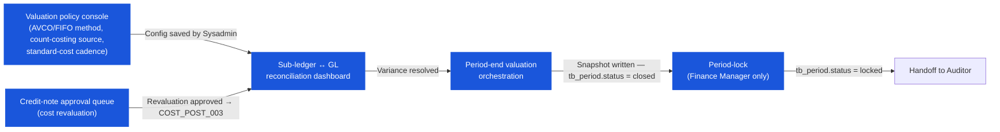

# การคำนวณต้นทุน — User Flow — Finance

> **At a Glance**
> **Persona:** Finance (Officer / Cost Controller / Finance Manager) &nbsp;·&nbsp; **Module:** [[costing]] &nbsp;·&nbsp; **Workflow stages:** นโยบาย Valuation &nbsp;·&nbsp; Sub-ledger ↔ GL reconciliation &nbsp;·&nbsp; อนุมัติ Credit-note revaluation &nbsp;·&nbsp; Period-end valuation &nbsp;·&nbsp; Period lock (`closed → locked`) &nbsp;·&nbsp; **Key permissions:** configure method (`COST_AUTH_001`), approve credit-note revaluation (`COST_AUTH_005`), advance period status (`COST_AUTH_006`)
> **ที่ persona นี้ทำ:** เป็นเจ้าของนโยบาย valuation อนุมัติ credit-note-amount revaluations กระทบยอด inventory sub-ledger กับ GL และเซ็นรับรอง period-end valuation จนถึง lock

## 1. บทบาทในโมดูลนี้

Persona **Finance** เป็น **valuation authority** ในโมดูล costing งานของ Finance ในโมดูลนี้ครอบคลุม 5 thread:

(1) **เป็นเจ้าของนโยบาย valuation** — เลือก `tb_business_unit.calculation_method` (FIFO vs `average` per business unit per `COST_AUTH_001`) เลือกแหล่ง valuation count-variance ผ่าน `enum_physical_count_costing_method` (`standard` / `last` / `average` / `last_receiving` per `COST_AUTH_002`) ตั้ง standard cost บน `tb_product.standard_cost` per `COST_AUTH_003` ตั้งค่า reconciliation tolerance และ period-end cadence Finance Officer / Cost Controller ขับเคลื่อนนโยบายประจำวัน; Finance Manager คือ elevated gate ที่ขอบเขต

(2) **กระทบยอด inventory sub-ledger กับ GL** — periodic (โดยปกติรายสัปดาห์หรือรายเดือน) reconciliation ของ `Σ tb_inventory_transaction_cost_layer.total_cost + Σ diff_amount` เทียบกับ net change ของ GL Inventory control account per `INV_XMOD_008` / `COST_XMOD_009` Costing-side variances surface ที่นี่

(3) **อนุมัติ credit-note-amount adjustments** — vendor concessions บน lot cost ของ posted GRN Finance อนุมัติ `tb_credit_note` document; โมดูล inventory fires cost-layer revaluation (`COST_POST_003` / `COST_CALC_005`) ซึ่งปรับ `cost_per_unit` ของ lot ต้นทางและ route `diff_amount` ไป GL ผ่าน Dr AP / Cr Inventory

(4) **รัน period-end valuation** — orchestrate close-of-period หลัง Inventory Controller variance sign-off ยืนยันการ math ของ cost-layer-to-snapshot rollup เซ็นรับรอง locked `closing_cost_per_unit` / `closing_total_cost`

(5) **Period-lock progression** ที่ระดับ Finance Manager — advance `tb_period.status = closed → locked` ตาม `COST_AUTH_006` / `INV_AUTH_006` หลัง audit window

ที่สำคัญ Finance **ไม่** แก้ `cost_per_unit` หรือ `average_cost_per_unit` โดยตรง per `COST_AUTH_010`; cost revaluation ไหลผ่าน credit-note-amount, compensating stock-in / stock-out, หรือ period-end rollforward เสมอ

### ตำแหน่ง Workflow (Finance highlighted)

Costing ไม่มี per-document state machine งาน costing ของ Finance anchor กับ **cost-layer lifecycle** และ **period valuation lifecycle**

### Permission Matrix — V5 Touchpoint × Action (Finance)

Finance คือ **valuation authority** ในโมดูล costing Costing ไม่มี doc-status enum; ไม่มี lifecycle GRN-style `draft → saved → committed` ให้ gate Rule citations อ้างถึง [[costing/02-business-rules]] §§ 4, 5

| Action | นโยบาย Valuation | Sub-ledger reconciliation | Credit-note revaluation | Period-end orchestration | Period-lock (Finance Manager) |
|---|---|---|---|---|---|
| อ่าน cost-layer ledger (`tb_inventory_transaction_cost_layer`) | ✅ (`COST_AUTH_004`) | ✅ (`COST_AUTH_004`) | ✅ (`COST_AUTH_004`) | ✅ (`COST_AUTH_004`) | ✅ (`COST_AUTH_004`) |
| อ่าน period snapshots (`tb_period_snapshot`) | ✅ (`COST_AUTH_004`) | ✅ (`COST_AUTH_004`) | ✅ (`COST_AUTH_004`) | ✅ (`COST_AUTH_004`) | ✅ (`COST_AUTH_004`) |
| ตั้งค่า `tb_business_unit.calculation_method` (AVCO ↔ FIFO) | ✅ (เป็น requester / co-approver; Sysadmin execute — `COST_AUTH_001`) | ❌ | ❌ | ❌ | ❌ |
| ตั้งค่า `enum_physical_count_costing_method` | ✅ (เป็น requester; Sysadmin execute — `COST_AUTH_002`) | ❌ | ❌ | ❌ | ❌ |
| อัปเดต `tb_product.standard_cost` | ✅ (เป็น requester; Sysadmin execute — `COST_AUTH_003`) | ❌ | ❌ | ❌ | ❌ |
| Post compensating GL journal (sub-ledger variance) | ❌ | ✅ (`COST_XMOD_009`) | ❌ | ❌ | ❌ |
| Route cost-layer variance ไป Inventory Controller | ❌ | ✅ (`COST_AUTH_004`) | ❌ | ❌ | ❌ |
| อนุมัติ `tb_credit_note` (vendor cost revaluation) | ❌ | ❌ | ✅ (`COST_AUTH_005`) | ❌ | ❌ |
| Fire period-end valuation run (close period) | ❌ | ❌ | ❌ | ✅ (`COST_POST_007` / `COST_POST_008`) | ❌ |
| Advance `tb_period.status = closed → locked` | ❌ | ❌ | ❌ | ❌ | ✅ (`COST_AUTH_006`) |
| Re-open `closed` period (exceptional) | ❌ | ❌ | ❌ | ❌ | ✅ (Finance Manager; audit-logged) |
| แก้ `cost_per_unit` หรือ `average_cost_per_unit` โดยตรงบน posted row | ❌ (`COST_AUTH_010`) | ❌ (`COST_AUTH_010`) | ❌ (`COST_AUTH_010`) | ❌ (`COST_AUTH_010`) | ❌ (`COST_AUTH_010`) |
| Re-open `locked` period | ❌ | ❌ | ❌ | ❌ | ❌ (ไม่มี role re-open locked period) |

> ℹ️ **ไม่มี doc-status transitions โดย Finance:** Costing ไม่มี `doc_status` enum Finance ไม่ transition document status ใด Cost corrections ไหลผ่าน (a) credit-note-amount approval, (b) compensating stock-in / stock-out, หรือ (c) period-end rollforward — ไม่เคยโดย direct cost-layer edit

## 2. Entry Point และ Primary Flow

**Entry points:** 5 paths แต่ละ anchor กับกิจกรรม Finance ที่ต่างกัน

- **Valuation policy console** — อ่าน / แก้ `tb_business_unit.calculation_method`, `enum_physical_count_costing_method` value, reconciliation tolerance, และ `tb_product.standard_cost` cadence ขับเคลื่อน Section 2.1
- **Cost-impact / variance reconciliation dashboard** — รัน periodic เทียบ cost-layer activity กับ GL Inventory control account ขับเคลื่อน Section 2.2
- **Credit-note approval queue** — `tb_credit_note` documents ที่ `pending` รอ Finance approval ขับเคลื่อน Section 2.3
- **Period-end valuation orchestration dashboard** — period-close run จากมุมมอง costing ขับเคลื่อน Section 2.4
- **Period-lock dashboard** (Finance Manager) — view ของ `closed` periods ผ่าน audit window รอ `closed → locked` advance

### 2.1 Valuation policy flow (config change / cadence, 4 ขั้นตอน)

1. **เปิด valuation policy console** Render `calculation_method` ปัจจุบัน per business unit, `physical_count_costing_method` ปัจจุบัน, reconciliation tolerance, และ standard-cost-update cadence Read-only สำหรับ Finance Officer; editable สำหรับ Sysadmin ภายใต้ `COST_AUTH_001`–`COST_AUTH_003` พร้อม Finance Officer เป็น requester / co-approver
2. **ระบุความต้องการตั้งค่า** Triggers: method change ที่ fiscal-year boundary (FIFO ↔ WA), count-method change, tolerance adjustment, standard-cost batch refresh (รายเดือน)
3. **ส่ง change request ไป Sysadmin** สำหรับ `calculation_method` change, Finance ยังตรวจสอบ **drain pre-condition** ตาม `COST_VAL_009`: ไม่มี product ที่ business unit สามารถมี non-zero on-hand Finance ประสานงานกับ Inventory Controller และ Store Keepers เพื่อ drain stock
4. **ยืนยัน effective** เมื่อ Sysadmin บันทึก Finance ตรวจสอบว่า inbound / outbound ถัดไปที่ business unit หยิบ rule ใหม่ Configuration-history บันทึก change สำหรับ Auditor review

### 2.2 Sub-ledger ↔ GL reconciliation flow (periodic, 6 ขั้นตอน)

1. **เปิด reconciliation dashboard** Render สำหรับ open period ปัจจุบัน sum ของ cost-layer activity group ตาม location ประเภท `inventory` และ `transaction_type` ฝั่งขวา render net change ของ GL Inventory control account สำหรับ period เดียวกัน
2. **คำนวณ variance** สำหรับแต่ละ cost-centre / location, variance = `sub_ledger_net_change − GL_net_change` ต่ำกว่า tolerance — สะอาด สูงกว่า tolerance — investigate
3. **เจาะลึก variances** จาก location-level summary เข้า cost-layer row list สาเหตุที่พบบ่อย: credit-note-amount `diff_amount` ที่ post ไป cost layer แต่ GL journal Dr AP / Cr Inventory พลาด, outbound cost-pick ที่ผลิต `cost_per_unit` นอกแถบที่คาดหวัง
4. **แก้ไข variance** **Sub-ledger right, GL gap** — post compensating GL journal **GL right, sub-ledger gap** — investigate missed cost-layer write route ไป Inventory Controller สำหรับ corrective stock-in / stock-out
5. **บันทึก reconciliation** แต่ละ variance ที่แก้ไขบันทึกพร้อมจำนวน variance, resolution path, และ actor
6. **Carry forward ไป period close** Clean reconciliation pass unblock period-end run; variance ที่ไม่แก้ไขถือ period ที่ `open`

### 2.3 Credit-note-amount approval flow (vendor concession, 5 ขั้นตอน)

1. **เปิด credit-note approval queue** List `tb_credit_note` documents ที่ `pending` พร้อม reference GRN ต้นทาง, lot ที่ได้รับผลกระทบ, `diff_amount` ที่เสนอ
2. **เปิด credit-note เฉพาะ** Screen render: `cost_per_unit` ปัจจุบันของ lot ที่ได้รับผลกระทบ, credit-note `diff_amount`, lot cost ที่คำนวณใหม่ Cross-check: หลักฐาน credit-note สนับสนุน concession หรือไม่?
3. **ตัดสิน outcome** **อนุมัติ** สำหรับ vendor concessions ที่มีเอกสารพร้อมหลักฐานถูกต้อง **ปฏิเสธ** พร้อมคอมเมนต์สำหรับเอกสารที่ขาด **Investigate** สำหรับ patterns ที่ชี้ปัญหา vendor pricing เชิงระบบ
4. **อนุมัติ fires revaluation** เมื่อ Finance approve: credit-note `doc_status = approved`; inventory module fires `INV_POST_007` ซึ่ง invoke costing engine's `COST_POST_003` เขียน cost-layer row ใหม่ GL: Dr AP / Cr Inventory ที่ขนาด `diff_amount`
5. **ปฏิเสธคืนไปยังต้นทาง** Credit-note คืนไปยังต้นทางพร้อมคอมเมนต์; revaluation ไม่ fire

### 2.4 Period-end valuation orchestration flow (close trigger, 7 ขั้นตอน)

1. **รอ Inventory Controller sign-off** Dashboard list pre-period-end variance sign-off ของ Controller Period close ไม่สามารถเริ่มโดยไม่มี
2. **ตรวจสอบ pre-close checklist clear** ทุก open `tb_credit_note` / `tb_stock_in` / `tb_stock_out` / `tb_count_stock` / GRN / SR documents ใน period อยู่ที่ terminal state
3. **รัน final reconciliation** Section 2.2 flow run เป็น final pass
4. **ตรวจสอบ cost-layer-to-snapshot rollup preview** Dashboard render per-`(period, location, product, lot)` cost-layer rollup Finance cross-check
5. **Fire period-end job** คลิก **Close period** System รัน `INV_POST_009` + `INV_POST_010` chained ซึ่ง invoke `COST_POST_007` และ `COST_POST_008`
6. **ตรวจสอบ snapshot — มุมมอง costing** Per-location / per-product closing valuation summary
7. **Period closed — valuation locked into snapshot** `tb_period_snapshot.closing_total_cost` คือ audit-anchored ending-inventory balance-sheet figure สำหรับ closed period

### 2.5 Period-lock flow (Finance Manager only, 3 ขั้นตอน)

1. **รอ audit window** เหมือนฝั่ง inventory — โดยปกติ 30–60 วันหลัง close
2. **ตรวจสอบ audit sign-off ที่ได้รับ** External / internal audit เซ็นรับรอง valuation ของ period
3. **Lock period** คลิก **Lock period** `tb_period.status = closed → locked`; `closing_cost_per_unit` / `closing_total_cost` ของ costing snapshot permanent immutable

## 3. Decision Branches

- **FIFO vs WA ที่ business unit** เลือก FIFO เมื่อ products เน่าเสีย และต้องการ per-lot tracking สำหรับ expiry / recall เลือก WA เมื่อ products เป็นโภคภัณฑ์
- **Count-costing method (`standard` / `last` / `average` / `last_receiving`)** `standard` สำหรับ tenants ที่ standard-cost cadence robust
- **Reconciliation variance: within tolerance vs investigate vs resolve** Within tolerance — accept and document. Above tolerance — drill and resolve. Persistent — escalate
- **Credit-note approve vs reject vs investigate** Approve เมื่อ cost defensible Reject สำหรับ evidence ที่ขาด Investigate สำหรับ patterns
- **Period close gate vs hold** Close เมื่อ Controller signed off variance Hold เมื่อ gate ใด ๆ open
- **Period re-open ภายใน audit window** Re-open เมื่อ external audit identify การ adjustment ที่จำเป็น
- **Period lock — ไม่มี re-open path** Lock เฉพาะเมื่อ audit window ผ่านสะอาด
- **Method-change ที่มี non-zero on-hand** **Blocked** ตาม `COST_VAL_009`

## 4. Exit Point / Handoffs

การเกี่ยวข้องของ Finance ใน thread costing จบที่หนึ่งในห้า boundaries:

- **Valuation policy applied** Sysadmin save config change
- **Reconciliation variance resolved** Compensating journal / corrective adjustment posts; reconciliation pass clean
- **Credit-note revaluation approved and posted** Cost-layer revaluation row เขียน
- **Period closed (valuation rollup complete)** `tb_period_snapshot.closing_cost_per_unit` / `closing_total_cost` เขียน
- **Period locked** `tb_period.status = locked`; valuation permanently immutable Handoff ไป **Auditor**

## 5. References

- Parent overview: [03-user-flow.md](./03-user-flow.md)
- Sibling: [03-user-flow-inventory-controller.md](./03-user-flow-inventory-controller.md)
- Sibling: [03-user-flow-auditor.md](./03-user-flow-auditor.md)
- Sibling: [01-data-model.md](./01-data-model.md)
- Sibling: [02-business-rules.md](./02-business-rules.md)
- Sibling: [calculation-methods.md](./calculation-methods.md)
- Related: [[inventory/03-user-flow-finance]]
- Related: [[good-receive-note]]
- Related: [[inventory-adjustment]]
