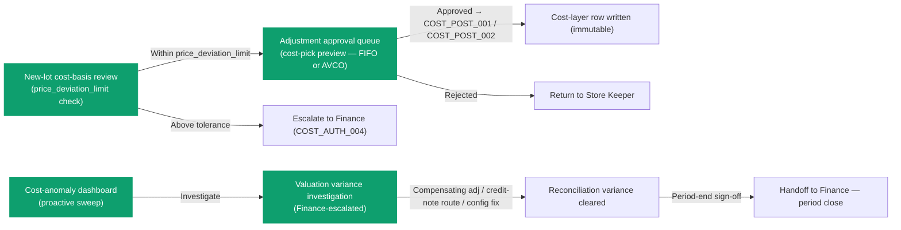

# การคำนวณต้นทุน — User Flow — Inventory Controller

> **At a Glance**
> **Persona:** Inventory Controller &nbsp;·&nbsp; **Module:** [[costing]] &nbsp;·&nbsp; **Workflow stages:** Upstream ของ Finance — ตรวจสอบ lot-date / receipt-cost / adjustment-cost-basis &nbsp;·&nbsp; ทบทวน Cost-pick preview ที่ stock-out approval &nbsp;·&nbsp; ตรวจสอบ Valuation variance &nbsp;·&nbsp; **Key permissions:** อนุมัติ adjustment post ต่ำกว่า Finance threshold; ไม่สามารถอนุมัติ credit-note revaluation (`COST_AUTH_005` Finance) หรือแก้ cost-layer rows (`COST_AUTH_010`)
> **ที่ persona นี้ทำ:** มั่นใจว่า inputs ของ costing engine สะอาดและป้องกันได้ และตรวจสอบ variances ที่ Finance surface ระหว่าง reconciliation

## 1. บทบาทในโมดูลนี้

Persona **Inventory Controller** เป็นเจ้าของ **ความสะอาดของ inputs ของ costing engine** Engine เป็น system service ที่ run ภายใต้ RBAC ของ actor บนแต่ละ inventory transaction post (per `COST_AUTH_009`); ความรับผิดชอบของ Controller คือมั่นใจว่า inputs ที่ไหลเข้า engine ถูกต้องและป้องกันได้:

- **Lot dates** (กำหนดที่ inbound, ขับเคลื่อน FIFO `lot_seq_no` — back-dated GRN สามารถ shuffle FIFO order)
- **Receipt costs** (inbound unit cost หลัง extra-cost allocation ที่กลายเป็น `cost_per_unit` บน layer ใหม่)
- **Adjustment cost bases** (cost-per-unit บน `tb_stock_in` rows)
- **Waste write-off cost bases** (`tb_stock_out` outbound rows)
- **Standard cost** บน `tb_product` ตามที่ Controller มี request authority

ความรับผิดชอบที่เกี่ยวข้องกับ costing อื่น ๆ ของ Controller คือ **valuation variance investigation** — Finance surface variances ที่เกิน tolerance ระหว่าง sub-ledger ↔ GL reconciliation และ Controller เจาะลึก cost-layer ledger เพื่อระบุ row ที่มีปัญหา

ที่สำคัญ Controller **ไม่** อนุมัติ credit-note-amount revaluations (Finance's `COST_AUTH_005`) **ไม่** ล็อก period (Finance Manager's `COST_AUTH_006`) **ไม่** configure `calculation_method` (Sysadmin's `COST_AUTH_001`) และ **ไม่เคย** แก้ cost-layer rows โดยตรง per `COST_AUTH_010`

### ตำแหน่ง Workflow (Inventory Controller highlighted)

Inventory Controller ทำงาน **upstream** ของ Finance ในโมดูล costing — มั่นใจว่า inputs ของ engine สะอาดก่อน cost-layer rows กลายเป็น immutable

### Permission Matrix — V1 Action × Approval Threshold (Inventory Controller)

| Action | Controller authority | Constraint |
|---|---|---|
| ดู cost-layer ledger (อ่าน) | ✅ (`COST_AUTH_007`) | Read-only ผ่าน cost-pick preview |
| ดู cost-pick preview (FIFO lot walk / AVCO average) บน outbound `tb_stock_out` | ✅ (`COST_AUTH_007`) | Preview screen เท่านั้น; ไม่สามารถ override picked cost |
| อนุมัติ `tb_stock_in` (inbound adjustment — new lot cost-basis) | ✅ — ภายใน `price_deviation_limit` tolerance | เหนือ tolerance: escalate ไป Finance (`COST_AUTH_004`) |
| อนุมัติ `tb_stock_out` (outbound adjustment — FIFO/AVCO cost-pick fires บน approval) | ✅ — ภายใน Controller cost-impact threshold | เหนือ threshold: escalate ไป Finance |
| ปฏิเสธ `tb_stock_in` / `tb_stock_out` (คืนไป Store Keeper) | ✅ | ไม่สามารถแก้ cost แทน Store Keeper (SoD preservation) |
| ตรวจสอบ Finance-escalated valuation variance (cost-layer drill) | ✅ (`COST_AUTH_007`) | Read-only drill |
| Draft compensating stock-in / stock-out (corrective cost fix) | ✅ | Route ผ่าน normal approval flow |
| Route credit-note revaluation ไป Finance | ✅ (initiator) | Finance อนุมัติ (`COST_AUTH_005`); Controller ไม่อนุมัติ credit-notes |
| ตั้งค่า `tb_business_unit.calculation_method` | ❌ (`COST_AUTH_001` — Sysadmin only) | Controller สามารถ request ผ่าน Finance |
| ตั้งค่า `enum_physical_count_costing_method` | ❌ (`COST_AUTH_002` — Sysadmin only) | Controller สามารถ flag concern ไป Finance |
| อนุมัติ credit-note-amount revaluation | ❌ (`COST_AUTH_005` — Finance only) | Controller สามารถ initiate; Finance อนุมัติ |
| Lock period / advance period status | ❌ (`COST_AUTH_006` — Finance Manager only) | Controller เซ็นรับรอง cost-side pre-condition; Finance Manager execute |
| แก้ `cost_per_unit` หรือ `average_cost_per_unit` โดยตรงบน posted row | ❌ (`COST_AUTH_010`) | ไม่มี role สามารถแก้ posted cost-layer row โดยตรง |

> ℹ️ **SR cost-pick เป็น pass-through — ไม่อยู่ใน costing queue ของ Controller** Store Requisitions invoke cost engine (`COST_POST_002`, `COST_XMOD_003`) เพื่อเลือก existing layer cost ที่ source location แต่ AVCO ไม่ re-average และไม่สร้าง FIFO layer ใหม่ — consume existing layer ที่ existing cost SR cost-pick preview ไม่ปรากฏใน adjustment queue ของ Controller

## 2. Entry Point และ Primary Flow

**Entry points:** 4 paths ทั้งหมดเป็นผลที่ตามมาของ activity ที่ route เข้า costing-relevant queue ของ Controller หรือ Finance escalation ปลายน้ำ

- **Adjustment approval queue (cost-aware view)** — `tb_stock_in` และ `tb_stock_out` documents ที่ `doc_status = in_progress` พร้อม cost-pick preview แสดงสำหรับ outbound
- **New-lot cost-basis review queue** — `tb_stock_in` documents ที่สร้าง lot ใหม่
- **Valuation variance investigation queue** — Finance-flagged variances จาก sub-ledger ↔ GL reconciliation
- **Cost-anomaly dashboard** — periodic sweep บน cost-layer activity ล่าสุดเน้น outliers

### 2.1 Cost-aware adjustment approval flow (Store Keeper-initiated, 5 ขั้นตอน)

1. **เปิด adjustment approval queue** List `tb_stock_in` และ `tb_stock_out` documents ที่ `in_progress` พร้อม cost-pick preview
2. **เปิด document เฉพาะ** สำหรับ **inbound** (`tb_stock_in`): screen render `cost_per_unit` ของ layer ใหม่; สำหรับ **outbound** (`tb_stock_out`): engine's cost-pick preview Checklist ของ Controller (cost-specific): (a) สำหรับ inbound new-lot, cost match vendor pricelist last-price ภายใน tolerance หรือไม่? (b) สำหรับ inbound existing-lot, cost ใหม่ reconcile กับ existing lot's cost? (c) สำหรับ outbound, picked cost สะท้อน basis ที่สมเหตุสมผล?
3. **ตัดสิน outcome — cost dimension** **อนุมัติ** เมื่อ cost basis ป้องกันได้ **ปฏิเสธ** พร้อมคอมเมนต์เมื่อ inbound cost ผิดปกติเทียบ pricelist, outbound picked cost surface ปัญหา **Escalate ไป Finance** สำหรับ cost-impacts เหนือ Controller threshold
4. **อนุมัติ fires post — engine เขียน cost-layer** เมื่อ Controller approve ที่ threshold ของ Controller: `tb_stock_in.doc_status = completed` / `tb_stock_out.doc_status = completed`; inventory transaction writes per `INV_POST_001` / `INV_POST_002`; costing engine เขียน cost-layer row per `COST_POST_001` / `COST_POST_002`
5. **ปฏิเสธคืนไปยัง Store Keeper** เมื่อ Controller ปฏิเสธ: `doc_status = draft` พร้อม cost-related comment

### 2.2 New-lot cost-basis review flow (cost-control gate, 4 ขั้นตอน)

1. **เปิด new-lot review queue** List stock-in documents ที่ introduce lot ใหม่ที่ `(location, product)`
2. **Cross-reference vendor pricelist** Screen แสดง `tb_pricelist_detail` price ล่าสุดสำหรับ product ที่ active vendor; deviation ระหว่าง proposed stock-in cost และ pricelist last-price; tolerance band `tb_product.price_deviation_limit` ของ product
3. **ตัดสิน** **อนุมัติที่ vendor-pricelist-reconciled cost** ถ้าภายใน tolerance **ปฏิเสธ** ไป Store Keeper ถ้าเหนือ tolerance **Escalate ไป Finance** ถ้า cost เหนือ tolerance มาก
4. **เมื่ออนุมัติ, lot เข้า cost-layer ledger** `cost_per_unit` สดใหม่สำหรับ lot ใหม่เป็นส่วนของ FIFO sequence

### 2.3 Valuation variance investigation flow (Finance-escalated, 6 ขั้นตอน)

1. **รับ escalation จาก Finance reconciliation** Reference ของ variance ระบุ cost-layer row(s) หรือ cost-aggregate range
2. **เจาะลึก cost-layer ledger** ตรวจสอบ suspect rows: `cost_per_unit`, `transaction_type`, `at_period`, `lot_no`, `from_lot_no`, `diff_amount`
3. **ระบุ root cause** สาเหตุที่พบบ่อยที่ Controller surface: (a) cost ผิดบน lot ใหม่, (b) cost ผิดบน outbound, (c) count-variance cost mis-resolved, (d) credit-note revaluation effect, (e) transfer cost mismatch
4. **ตัดสิน resolution path** **Compensating stock-in / stock-out** ที่ corrected cost **Credit-note route** ถ้า root cause เป็น vendor concession **Configuration fix** ถ้า root cause เป็น misconfigured count-costing method
5. **Coordinate fix** Post compensating adjustment ภายใต้ Controller authority หรือ hand off ไป Finance
6. **บันทึก investigation** Activity log บันทึก root cause, corrective action, และ reconciliation pass

### 2.4 Cost-anomaly dashboard (proactive sweep, 3 ขั้นตอน)

1. **เปิด cost-anomaly dashboard** Render สำหรับ open period ปัจจุบัน outliers ข้าม cost-layer ledger
2. **Triage แต่ละ anomaly** **Dismiss** สำหรับ one-off legitimate variation **Investigate** สำหรับ root cause ที่ไม่ชัด **Route ไป Sysadmin / Finance** สำหรับ systemic
3. **Close loop** Anomalies investigated และ resolved หรือ dismissed; dashboard cleanup

## 3. Decision Branches

- **อนุมัติ cost-pick preview vs ปฏิเสธ** อนุมัติเมื่อ picked cost สะท้อน operational expectation ปฏิเสธเมื่อ cost surface ปัญหา
- **New-lot cost within tolerance vs above** Within `price_deviation_limit` — อนุมัติภายใต้ Controller authority Above tolerance — ปฏิเสธ pending vendor verification หรือ escalate ไป Finance
- **Valuation variance — corrective adjustment vs credit-note vs config fix** **Corrective adjustment** สำหรับ clerical-error cost mistakes **Credit-note** สำหรับ vendor concessions **Config fix** สำหรับ systemic mis-resolution
- **Cost-anomaly — dismiss vs investigate vs systemic** Dismiss สำหรับ one-off legitimate variation Investigate สำหรับ non-obvious root cause Systemic สำหรับ recurring patterns

## 4. Exit Point / Handoffs

การเกี่ยวข้องของ Inventory Controller ใน thread costing จบที่หนึ่งใน 4 boundaries:

- **Approval ที่ picked cost — cost-layer row เขียน** Picked cost เป็นส่วนของ immutable cost-layer ledger; การเกี่ยวข้องของ Controller บน document นี้เสร็จ
- **ปฏิเสธ / escalation ไป Finance สำหรับ cost-impact review** Above-Controller-threshold cost-impact ย้ายไป Finance per `COST_AUTH_004` / `COST_AUTH_005`
- **Variance investigation resolved** Root cause identified, corrective action posted, reconciliation variance ลดลงภายใน tolerance Handoff กลับไป **Finance**
- **Period-end variance sign-off (cost-side)** Controller's variance sign-off รวม cost-side gate Handoff ไป **Finance** สำหรับ period-end valuation orchestration

## 5. References

- Parent overview: [03-user-flow.md](./03-user-flow.md)
- Sibling: [03-user-flow-finance.md](./03-user-flow-finance.md)
- Sibling: [03-user-flow-auditor.md](./03-user-flow-auditor.md)
- Sibling: [01-data-model.md](./01-data-model.md)
- Sibling: [02-business-rules.md](./02-business-rules.md)
- Sibling: [calculation-methods.md](./calculation-methods.md)
- Related: [[inventory/03-user-flow-inventory-controller]]
- Related: [[good-receive-note]]
- Related: [[physical-count]] / [[spot-check]]
- Related: [[inventory-adjustment]]
- Related: [[vendor-pricelist]]
