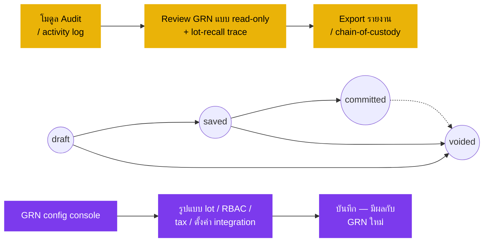

# ใบรับสินค้า (Goods Receive Note) — User Flow — Audit & Config

> **At a Glance**
> **Persona:** Audit / Config (Auditor + System Administrator) &nbsp;·&nbsp; **โมดูล:** [[good-receive-note]] &nbsp;·&nbsp; **ขั้น workflow:** ผู้สังเกตการณ์นอกเส้นทาง — Sysadmin เป็นเจ้าของรูปแบบเลข lot, RBAC, tax/currency/reason code, การ wire integration; Auditor อ่านชุดข้อมูล GRN ทั้งหมดและรันคิวรี recall และ lot-trace &nbsp;·&nbsp; **สิทธิ์สำคัญ:** Sysadmin ตั้งค่ากติกา (`GRN_AUTH_001`–`GRN_AUTH_011`); Auditor read-only (ไม่มีการเขียน transaction)
> **persona นี้ทำอะไร:** ตั้งค่ากติกาและพื้นผิว integration ของโมดูล GRN (Sysadmin); ตรวจสอบ audit trail ทั้งหมดและรัน trace สำหรับ lot-recall (Auditor)

## 1. บทบาทในโมดูลนี้

Persona **Audit / Config** รวมสอง role ที่ไม่ใช่ transaction เข้าใน flow เดียว เพราะทั้งคู่ไม่ได้เข้าร่วมใน state machine ของเอกสาร GRN และ index GRN ของ carmen-wiki ไม่ได้ลิสต์ Auditor แยก sub-persona **System Administrator** ดูแลรูปแบบ generate เลข lot ที่ Receiver ใช้ตอน `draft → saved` ตั้งค่า RBAC และเกณฑ์การอนุมัติที่ gate ทุก action `GRN_AUTH_001`–`GRN_AUTH_011` (โดยเฉพาะการบังคับ segregation-of-duties บน transition `saved → committed` ตาม `GRN_AUTH_010`) จัดการรหัสภาษี อัตราแลกเปลี่ยน และ reason code สำหรับการ cancel และ reject และดูแลการ wire integration ระหว่างโมดูล GRN กับ [[purchase-order]], [[inventory]], Finance / AP และโมดูล Vendor sub-persona **Auditor** (รวมเข้ามา) เป็น **read-only เคร่งครัด** บนชุดข้อมูล GRN ทั้งหมด — กิจกรรมรับของ comment variance ผลลัพธ์ three-way-match การเชื่อมต่อ credit note การ sign-off ปิดงวด และ JSON `workflow_history` ที่อยู่เบื้องหลังบน `tb_good_received_note` — และรันการสอบสวน lot-tracing ระหว่าง workstream เรียกคืนสินค้าหรือเหตุการณ์คุณภาพ โดยเดิน linkage `tb_inventory_transaction_detail.lot_no` ย้อนกลับจากสต๊อกคงคลังและไปข้างหน้าจาก GRN `committed` sub-persona ทั้งสองไม่เคยปรากฏใน flow transaction: การแก้ของ Sysadmin เปลี่ยนกติกาที่ apply กับ GRN **ในอนาคต** (GRN in-flight เก็บ snapshot กติกาที่บังคับใช้ตอน save) และคิวรีของ Auditor return ข้อมูลโดยไม่เขียน state ใด ๆ สิ่งสำคัญ: การบังคับ segregation-of-duties (`GRN_AUTH_010` Receiver ≠ Purchaser, มี mirror เป็น `PO_AUTH_010` ฝั่ง PO) และกฎ void แบบ elevated หลัง commit (`GRN_POST_010` — การ void GRN `committed` เป็นข้อห้าม และการ reverse หลัง commit ต้องการ co-authorisation Inventory Manager + Finance ผ่าน credit note หรือการปรับชดเชย) อยู่ในชั้น RBAC และ posting-rule ที่ persona นี้เป็นเจ้าของการตั้งค่า

### ตำแหน่ง Workflow (Audit / Config highlighted — ผู้สังเกตการณ์นอกเส้นทาง)

### Permission Matrix — Action × Sub-persona (Audit / Config)

ทั้งสอง sub-persona ไม่ได้เข้าร่วมใน state machine ของเอกสาร GRN **Auditor** เป็น read-only เคร่งครัดบนชุดข้อมูล GRN ทั้งหมด **System Administrator** ตั้งค่ากติกาที่ governs GRN ในอนาคตแต่ไม่ execute transaction บนเอกสาร GRN ตรง ๆ

| Action | Auditor | System Administrator |
|---|---|---|
| ดู GRN ใด ๆ (ทุกสถานะ) | ✅ — ชุดข้อมูลทั้งหมด read-only | ✅ — ผ่าน impact preview ของ config console |
| อ่าน JSON `workflow_history` | ✅ | ❌ (ไม่ใช่ action config ตามรูทีน) |
| อ่านการแก้บรรทัด comment thread ผลลัพธ์ match | ✅ | ❌ |
| อ่านการเชื่อม credit note การ sign-off ปิดงวด | ✅ | ❌ |
| รัน lot-recall trace (`lot_no` → GRN → movement ปลายทาง) | ✅ | ❌ |
| Export activity log (plain — ไม่มี cost / PII) | ✅ (ไม่ต้อง secondary approval) | ❌ |
| Export activity log (sensitive — unit cost, vendor terms, PII) | ✅ (ต้อง secondary approval จาก Controller / DPO) | ❌ |
| ตั้งค่ารูปแบบเลข lot | ❌ | ✅ |
| ตั้งค่า role RBAC และเกณฑ์การอนุมัติ | ❌ | ✅ |
| ตั้งค่าการบังคับ segregation-of-duties `GRN_AUTH_010` | ❌ | ✅ |
| ตั้งค่ารหัสภาษี / อัตรา | ❌ | ✅ |
| ตั้งค่า feed อัตราแลกเปลี่ยน | ❌ | ✅ |
| ตั้งค่า reason code สำหรับ cancel / reject | ❌ | ✅ |
| ตั้งค่า endpoint integration (PO / Inventory / Finance / Vendor) | ❌ | ✅ |
| เปลี่ยน `doc_status` ของ GRN | ❌ | ❌ |
| Void / reverse GRN `committed` | ❌ | ❌ (ทำหน้าที่เพียง gate co-auth — `GRN_POST_010`) |

> ℹ️ **กติกา snapshot GRN in-flight:** การเปลี่ยน config ของ Sysadmin (รหัสภาษี reason code RBAC) apply กับ GRN **ใหม่** ที่สร้างหลัง timestamp มีผลเท่านั้น GRN in-flight ที่ `draft` / `saved` เก็บ snapshot config ที่บังคับใช้ตอนสร้าง การพยายาม retire ค่า config ที่ GRN in-flight อ้างอิงอยู่จะถูก block โดย impact preview

> ℹ️ **TBC — การ generate เลข lot:** `Test_case/System_Process/tx-01-grn.md` Step 2 ระบุว่าเลข lot อาจ generate โดยระบบหรือผู้ขาย provide (`TBC`) panel ตั้งค่ารูปแบบ lot ของ Sysadmin ครอบคลุมเส้นทางที่ระบบ generate; เส้นทางที่ผู้ขาย provide override ยังไม่ระบุ ที่มา: `Test_case/System_Process/tx-01-grn.md` (capture date 2026-04-27)

## 2. Entry Point และ Primary Flow

**Entry point:** เฉพาะ sub-persona ไม่ทับซ้อนกับมุมมอง list GRN ของ transaction

- **Auditor — โมดูล Audit / activity log ของ GRN** — หน้าจอ read-only ที่ surface แถว `workflow_history` จาก `tb_good_received_note` join กับการแก้ระดับบรรทัด comment ผลลัพธ์ three-way-match การเชื่อม credit note และข้อมูล lot จาก `tb_inventory_transaction_detail` ตัวกรอง facet: ช่วงวันที่ vendor หมายเลข lot หมายเลข PO หมายเลข GRN ผู้ใช้ ประเภท action
- **Sysadmin — GRN configuration console** — หน้าจอผู้ดูแลระบบที่ scope ตาม tenant พร้อม panel สำหรับรูปแบบเลข lot, RBAC role และเกณฑ์การอนุมัติ, รหัสภาษี / สกุลเงิน / reason code และ endpoint integration (PO / Inventory / Finance / Vendor)

### 2.1 Auditor flow (read-only, lot-recall trace) — 5 ขั้นตอน

1. **เปิดโมดูล audit หรือ GRN activity log** scope ตามงวดที่กำลัง review หน้าจอรวบรวม `tb_good_received_note.workflow_history` ประวัติการแก้บรรทัด comment thread (note variance ของ Receiver log การแก้ปัญหาของ Purchaser ผลลัพธ์ match ของ Finance) การ booking credit note และ sign-off ปิดงวด ลงใน feed เรียงตามเวลา
2. **กรองตามวันที่ / vendor / lot / PO** narrow feed ให้อยู่ในขอบเขตการสอบสวน — ตัวกรองทั่วไปได้แก่ ช่วงเวลาของ lot ที่ต้องสงสัย vendor ที่ recall หรือ PO chain ที่กำลัง trace chain of custody Auditor แก้ผลลัพธ์ตัวกรองไม่ได้; หน้าจอ render-only
3. **เจาะลงไปยัง GRN เฉพาะและ audit trail ของมัน** เปิด GRN แบบ read-only และเดิน audit chain ทั้งหมด: ใครสร้าง (`created_by_id`) ใคร save ใคร commit (พร้อมหลักฐาน segregation check ของ `GRN_AUTH_010`) ใครแก้ extra-cost allocation ก่อน AP posting ผลลัพธ์ three-way-match credit note ใด ๆ ที่ book กับ GRN และ sign-off ปิดงวดที่ปิดการรับ
4. **Optional: lot-recall trace** สำหรับการสอบสวน recall ใส่ `lot_no` ที่กระทบและรัน trace — ระบบเดิน `tb_inventory_transaction_detail.lot_no` ข้ามทุกแถวของ `tb_inventory_transaction` ระบุ GRN `committed` ทุกใบที่นำ lot เข้ามา (ผ่าน `tb_good_received_note_detail_item.inventory_transaction_id`) และระบุ movement ปลายทางทุก movement (issue, transfer, adjustment, sale, consumption) ที่ดึงจาก lot นั้น trace สร้าง chain-of-custody สำหรับขอบเขตการ recall รองรับทั้ง forward-trace และ backward-trace (forward จากการรับไปจนถึงการ consume; backward จากสต๊อกคงคลังย้อนกลับไปการรับ)
5. **Export รายงาน** Export ผลลัพธ์ตัวกรอง activity-log หรือผลลัพธ์ lot-trace เป็น CSV / PDF สำหรับ recall file binder ของ external auditor หรือรายงาน incident response การ export ฟิลด์ sensitive (เช่น unit cost, vendor terms) ต้อง secondary approval — ดู Decision Branches

### 2.2 Sysadmin flow (เปลี่ยน configuration) — 6 ขั้นตอน

1. **ระบุความจำเป็นของ configuration** Trigger ได้แก่ การอัปเดตนโยบาย tenant (อัตราภาษีใหม่ reason code ใหม่) การเปลี่ยน endpoint integration (cutover Finance ERP, refresh Vendor master) การเปลี่ยนรูปแบบเลข lot ที่ขับเคลื่อนโดยข้อกำหนดผู้กำกับดูแลหรือ vendor หรือการปรับ RBAC (role ใหม่ เปลี่ยนเกณฑ์ ยืนยันกฎ segregation อีกครั้งหลังเปลี่ยนบุคลากร) ความจำเป็นมักมาในรูป service ticket หรือคำขอของ controller
2. **เปิด GRN configuration console** และไปยัง panel ที่เกี่ยวข้อง: **รูปแบบเลข lot** (prefix, separator, ความกว้าง sequence, การ encode วันหมดอายุ), **RBAC** (นิยาม role, สิทธิ์ action, เกณฑ์การอนุมัติ, การบังคับ segregation-of-duties บน `GRN_AUTH_010`), **รหัสภาษี / สกุลเงิน / reason code** (list รหัสภาษีพร้อมอัตราและวันมีผล, feed อัตราสกุลเงิน, taxonomy reason code ของ cancel และ reject) หรือ **integration** (link โมดูล PO, endpoint cost-layer Inventory, map GL account ของ Finance, sync Vendor master)
3. **ปรับ configuration** แก้ฟิลด์ที่เกี่ยวข้องด้วยค่าใหม่; console บังคับ shape validation (เช่น อัตราภาษี ≤ 100%, รหัสสกุลเงิน ISO-4217, ความ unique ของ reason code ภายใน tenant, ไวยากรณ์ token ของรูปแบบ lot)
4. **Preview และวิเคราะห์ผลกระทบ** ก่อน save console รัน impact preview: GRN in-flight `draft` / `saved` กี่ใบที่อ้างอิง config ที่กระทบ three-way match ปลายทางของ GRN `committed` ใด ๆ ขึ้นกับ tax / GL mapping ที่กระทบหรือไม่ และ session ผู้ใช้ใดถือ RBAC role ที่กระทบ Preview ยัง flag ว่าการเปลี่ยน block การสร้าง GRN ใหม่ระหว่างการ migration หรือไม่ (เช่น การ rename RBAC role)
5. **Save การเปลี่ยน** Config บันทึกพร้อม timestamp มีผลตั้งแต่; เวอร์ชันก่อนหน้าเก็บไว้ใน configuration history สำหรับ audit การเปลี่ยนสะท้อนทันทีสำหรับ GRN **ใหม่** ที่สร้างหลัง save; GRN in-flight ที่ `draft` หรือ `saved` เก็บ snapshot ของ configuration ที่บังคับใช้ตอนสร้าง (รูปแบบเลข lot รหัสภาษี reason code RBAC ตอนสร้าง) เว้นแต่ผู้ใช้จะ recompute ฟิลด์ชัดเจน
6. **มีผลกับ GRN ใหม่** การสร้าง GRN ใหม่หยิบ configuration ใหม่ activity log บน configuration history surface การเปลี่ยนสำหรับ Auditor review ภายใต้ audit-trail ของ Sysadmin

## 3. Decision Branches

- **การสอบสวน lot-recall ของ Auditor** (read-only escalate): Auditor ระบุ chain of custody สำหรับ lot ที่กระทบและส่งต่อให้ Quality / Recall lead — ไม่แก้เอกสารใด ๆ ไม่ initiate การ book recall และไม่เขียนใด ๆ ลง GRN การ execute recall อยู่ใน workstream แยก (โดยทั่วไป [[inventory-adjustment]] สำหรับ write-off และ return-to-vendor นำโดย Purchaser บน `[[purchase-order]]` / `credit note`); สิ่งส่งมอบของ Auditor คือ trace report
- **การเปลี่ยนของ Sysadmin ถูก block โดย GRN in-flight (กติกา snapshot)**: ความพยายาม retire รหัสภาษี reason code หรือ RBAC role ที่ GRN `draft` หรือ `saved` อ้างอิงอยู่ถูก reject โดย impact preview ในขั้น 4 เส้นทางการแก้: (a) รอ GRN in-flight commit หรือ void; (b) bulk-recompute GRN ที่กระทบโดยเปิดและ save ใหม่กับ config ใหม่; หรือ (c) soft-deprecate รหัสเดิม (mark inactive เก็บอ่านได้บน GRN ที่มีอยู่) และต้องใช้รหัสใหม่บน GRN ใหม่ทั้งหมด GRN `committed` เก็บ snapshot ประวัติเสมอ — audit chain บน GRN ที่ post แล้ว immutable
- **การเปลี่ยน RBAC ของ Sysadmin กระทบ session ที่ active**: การเปลี่ยน RBAC ที่ revoke หรือลดสิทธิ์ที่ผู้ใช้ที่ login อยู่ถืออยู่ ไม่ cancel transaction ที่ผู้ใช้ส่งไปแล้วย้อนหลัง; มีผลกับ action ถัดไปที่ผู้ใช้พยายามทำ console เตือน Sysadmin ว่ามี **N** ผู้ใช้ถือ role ที่กระทบและให้ตัวเลือก revoke session (บังคับ re-login) การเปลี่ยนกฎ segregation-of-duties (เช่น tighten `GRN_AUTH_010` ให้ห้าม AP Clerk ที่ key invoice ไม่ให้ commit GRN ด้วย) มีผลที่ transition `saved → committed` ครั้งถัดไป; GRN in-flight ที่ `saved` ถูกประเมินกับกฎใหม่ ณ ขณะ commit ไม่ใช่ขณะ save
- **การ export ฟิลด์ sensitive ของ Auditor ต้องการ secondary approval**: การ export ที่รวม unit cost, vendor payment terms, หรือ PII (รายละเอียดติดต่อ vendor, อัตลักษณ์ผู้ใช้ภายในเกิน role) ต้องการ secondary approval จาก Controller หรือ Data Protection Officer ตามนโยบาย tenant คำขอ export ถูก log บน audit trail ของโมดูล audit เอง และไฟล์ผลลัพธ์ถูก watermark ด้วย requester / approver / timestamp การ export activity-log plain (status transition จำนวนบรรทัด role ผู้ใช้ที่ anonymize) ไม่ต้องการ secondary approval
- **การ void elevated หลัง commit ของ Sysadmin (ข้อห้าม — escalate ไป reversal workflow)**: ความพยายามของ Sysadmin หรือ Inventory Manager ในการ void GRN `committed` ถูก reject ตรง ๆ ตาม `GRN_POST_010` — `committed` เป็น terminal และ `voided` ใช้ก่อน commit เท่านั้น Reversal workflow ต้องการ co-authorisation Inventory Manager + Finance และรันเป็น `tb_credit_note` กับ GRN (reverse AP accrual หรือหนี้ AP-Trade ขึ้นกับ state ของ three-way-match) บวก ถ้าสต๊อกย้ายไปแล้ว ก็เป็น [[inventory-adjustment]] ชดเชย role ของ Sysadmin ใน branch นี้คือ ensure ว่าชั้น RBAC gate co-authorisation ถูกต้อง (ลายเซ็น Inventory Manager + Finance บันทึกบน `workflow_history` ของ credit-note); Sysadmin ไม่ execute reversal
- **การ cutover endpoint integration ของ Sysadmin**: การตัด endpoint integration (เช่น migration Finance ERP, swap service cost-layer Inventory) รัน dual-write window ที่ทั้ง endpoint เก่าและใหม่รับ fan-out ของ GRN-commit ตามด้วยการ reconcile และ hard cutover ระหว่าง dual-write window Auditor monitor reconciliation report สำหรับ fan-out mismatch; mismatch ถูกแก้ก่อน hard cutover ไม่มีการเปลี่ยน state ของเอกสาร GRN ระหว่าง cutover

## 4. Exit Point / Handoff

การเข้าร่วมของ persona Audit / Config บน GRN หรือการเปลี่ยน configuration ใด ๆ จบที่หนึ่งใน 3 ขอบเขต:

- **Auditor — รายงานหรือ recall trace ถูก generate** การ export activity-log หรือรายงาน lot-trace ส่งต่อให้ requester (external auditor, Quality / Recall lead, Controller, Data Protection Officer) Auditor ไม่แก้ GRN ใด ๆ ไม่ initiate เอกสารปลายทางใด ๆ (credit note, inventory adjustment, การ book recall); สิ่งส่งมอบคือ artefact read-only handoff ตามต่อจากรายงาน (เช่น การ book recall, การขึ้น blacklist vendor, posting reversal) อยู่บน flow ของ persona เจ้าของ — Receiver / Purchaser / Finance
- **Sysadmin — configuration บันทึก มีผลกับ GRN ใหม่** Configuration ใหม่บันทึกพร้อม timestamp มีผลตั้งแต่; configuration history บันทึกการเปลี่ยนสำหรับ audit การสร้าง GRN ใหม่หยิบกติกาใหม่; GRN in-flight `draft` / `saved` เก็บ snapshot กติกาที่บังคับใช้ตอนสร้างเว้นแต่ recompute ชัดเจน; GRN `committed` immutable Sysadmin แจ้งชุมชนผู้ใช้ที่กระทบ (Receiver, Inventory Manager, Finance, Purchaser) ของการเปลี่ยนกติกาผ่าน channel release-note มาตรฐาน
- **Sysadmin — การเปลี่ยนถูก reject โดย impact preview escalate** เมื่อ impact preview block การเปลี่ยน (session active, GRN in-flight, dependency endpoint integration) Sysadmin escalate ไปยัง controller หรือ change board ข้ามโมดูลเพื่อจัดตาราง migration window ขอเส้นทาง soft-deprecate หรือ roll back การเปลี่ยนที่ขอ โมดูล GRN เองไม่ transition; configuration คงอยู่ที่ state ก่อนเปลี่ยนจนกว่าแผน migration จะได้รับอนุมัติ

## 5. แหล่งอ้างอิง

- ภาพรวมแม่: [03-user-flow.md](./03-user-flow.md) — วงจรชีวิตสี่สถานะ canonical (`draft / saved / committed / voided`) บน `enum_good_received_note_status`, state machine global ที่ persona นี้สังเกตการณ์ (โดยไม่เปลี่ยน) และตั้งค่า gate ของ RBAC / posting-rule
- พี่น้อง: [03-user-flow-receiver.md](./03-user-flow-receiver.md) — persona ที่ transition `draft → saved → committed` เขียน activity-log entry ที่ Auditor อ่าน และการกรอกเลข lot ของพวกเขาตามรูปแบบที่ Sysadmin ดูแล
- พี่น้อง: [03-user-flow-purchaser.md](./03-user-flow-purchaser.md) — persona ที่ comment การแก้ variance และการแก้ PO feed การ review variance และผลงาน vendor ของ Auditor; การบังคับ segregation-of-duties ตาม `GRN_AUTH_010` / `PO_AUTH_010` ถูกตั้งค่าโดย Sysadmin ใน panel RBAC
- พี่น้อง: [03-user-flow-finance.md](./03-user-flow-finance.md) — persona ที่ผลลัพธ์ three-way-match การ post AP การ book credit note และ sign-off ปิดงวด feed การ reconcile และ review ปิดงวดของ Auditor; map GL account และ configuration tolerance ของ match ถูกตั้งค่าโดย Sysadmin
- พี่น้อง: [01-data-model.md](./01-data-model.md) — `tb_good_received_note.workflow_history` (array activity-log JSON ที่ Auditor อ่าน), `tb_inventory_transaction_detail.lot_no` (linkage ของ lot-trace) และตาราง configuration ที่ Sysadmin ดูแล (รหัสภาษี สกุลเงิน reason code RBAC role)
- พี่น้อง: [02-business-rules.md](./02-business-rules.md) — Section 4 Authorization Rules (`GRN_AUTH_001`–`GRN_AUTH_011` กฎ RBAC และ segregation ที่ Sysadmin ตั้งค่า) และ Section 6 Cross-Module Rules (`GRN_XMOD_001`–`GRN_XMOD_010` การ wire integration ที่ Sysadmin ดูแล) พร้อมกับ `GRN_POST_010` (ข้อห้าม void หลัง commit ที่ Sysadmin บังคับใช้ผ่าน co-authorisation ในเส้นทาง reversal ของ credit-note / inventory-adjustment)
- เกี่ยวข้อง: [[purchase-order]] — ต้นน้ำ audit chain ทั้งหมด; Auditor เดินย้อนกลับจาก GRN ไป PO ไป PR สำหรับ audit trail procure-to-pay ที่สมบูรณ์ และ Sysadmin ตั้งค่า endpoint integration PO ↔ GRN และ mirror `PO_AUTH_010` ของกฎ segregation-of-duties
- เกี่ยวข้อง: [[inventory]] — ปลายทาง lot-trace; trace recall ของ Auditor เดินไปข้างหน้าจาก GRN `committed` ผ่านแถว `tb_inventory_transaction` ไปยังสต๊อกคงคลังและ issue / transfer / adjustment / consumption ปลายทาง
- เกี่ยวข้อง: [[inventory-adjustment]] — เส้นทางแก้สต๊อกจริงหลัง commit ที่ RBAC ของ Sysadmin governs สำหรับ reversal workflow และเอกสารที่ Auditor review พร้อมกับ credit note เมื่อ reconstruct chain การ write-off recall
- เกี่ยวข้อง: credit note — เส้นทางแก้ทางการเงินหลัง commit ที่ต้องการ co-authorisation Inventory Manager + Finance ตาม `GRN_POST_010`; Sysadmin ตั้งค่าเกณฑ์ RBAC สำหรับ co-authorisation นี้
- `../carmen/docs/good-recive-note-managment/GRN-Overview.md` — ภาพรวมโมดูลของ carmen/docs: role System Administrator (รูปแบบ generate เลข lot, สิทธิ์ผู้ใช้, เกณฑ์การอนุมัติ, รหัสภาษี, อัตราสกุลเงิน, reason code, integration กับ PO / Inventory / Finance / Vendor) และความสามารถรายงาน audit-trail / variance-analysis ที่ underpin sub-persona Auditor
