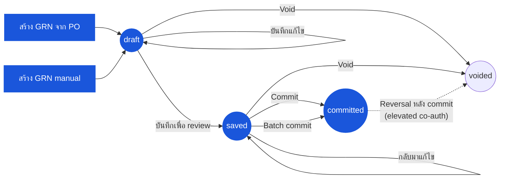

# ใบรับสินค้า (Goods Receive Note) — User Flow — Receiver

> **At a Glance**
> **Persona:** Receiver (Store Keeper / Receiving Clerk + Store / Inventory Manager) &nbsp;·&nbsp; **โมดูล:** [[good-receive-note]] &nbsp;·&nbsp; **ขั้น workflow:** `(none) → draft` (สร้างกับ PO หรือ manual) &nbsp;·&nbsp; `draft → saved` (กรอกบรรทัดเสร็จ) &nbsp;·&nbsp; `saved → committed` (Inventory Manager — fire การเพิ่ม inventory + การเขียน cost-layer + การเลื่อน PO + AP accrual) &nbsp;·&nbsp; `draft / saved → voided` &nbsp;·&nbsp; **สิทธิ์สำคัญ:** สร้าง / แก้ draft (Store Keeper); commit (Inventory Manager); SoD — commit GRN กับ PO ของตัวเองไม่ได้
> **persona นี้ทำอะไร:** บันทึกการรับที่ dock จับ lot / expiry จากนั้น commit GRN ที่เพิ่ม inventory และเขียน cost layer

## 1. บทบาทในโมดูลนี้

Persona **Receiver** ครอบคลุม **Store Keeper / Receiving Clerk** ที่ dock และ **Store Manager / Inventory Manager** ที่ดูแลการรับ Store Keeper เป็นเจ้าของ draft ที่แก้ไขได้ — พวกเขาสร้าง GRN กับ PO ต้นทาง (หรือ manual สำหรับการรับ ad-hoc) นับและตรวจสอบการส่งของจริงเทียบกับ PO และใบส่งของจากผู้ขาย บันทึก `received_qty` และ `accepted_qty` ต่อบรรทัด จับหมายเลข lot และวันหมดอายุผ่าน inventory transaction ที่ link (`tb_inventory_transaction_detail` เข้าจาก GRN detail_item ผ่าน `inventory_transaction_id`) แนบใบส่งของและหลักฐานคุณภาพ และบันทึกเอกสารเพื่อ review Inventory Manager เป็นเจ้าของขั้นตอน posting ที่ไม่อาจย้อนคืนได้ — พวกเขา review `saved` GRN เทียบกับสต๊อกที่รับจริง รัน commit (`saved → committed`) บนเอกสารแต่ละใบหรือ batch-commit หลาย `saved` GRN ที่สิ้นกะ / สิ้นงวด และเป็น persona เดียวภายในการเจาะลึกนี้ที่ได้รับอนุญาตให้ fire การเพิ่ม inventory การเขียน cost-layer และการเลื่อน `received_qty` ของบรรทัด PO เมื่อเข้า flow นี้ PO source อยู่ที่ `po_status ∈ {sent, partial}` สถานะ GRN ที่ persona นี้เป็นเจ้าของคือ `draft` และ `saved` (Store Keeper) และ transition `saved → committed` (Inventory Manager); `voided` ถึงได้จาก `draft` หรือ `saved` โดย sub-persona ใดก็ได้พร้อมเหตุผลและไม่มีผลกระทบ inventory ขณะที่ reversal หลัง commit ของ GRN `committed` ต้องการ co-authorisation ที่เลื่อนกับ Finance และอยู่นอกขอบเขตของเส้นทาง Receiver ปกติ การแยกหน้าที่ห้ามผู้ใช้ที่สร้างหรือ transmit PO ต้นทาง post GRN กับมัน (สืบทอดจาก `PO_AUTH_010` ของ persona PO)

### ตำแหน่ง Workflow (Receiver highlighted)

### ตารางสิทธิ์ — Status × Action with Sub-roles (Receiver)

Persona Receiver ครอบคลุมสอง sub-role: **Store Keeper / Receiving Clerk** (สร้างและแก้ GRN เจ้าของ `draft` และ `saved`) และ **Inventory Manager / Store Manager** (commit GRN, `saved → committed`) ทั้งสอง sub-role ทำงานบน GRN ข้ามทั้งเส้นทางสร้าง PO-sourced และ manual RBAC ฝั่ง server (`GRN_AUTH_001`–`GRN_AUTH_011`) บังคับใช้กฎการแยกหน้าที่ตอน commit: ผู้ใช้ที่ commit GRN ต้องไม่เป็นผู้ใช้คนเดียวกันที่สร้างหรือ transmit PO ต้นทาง

| Action | draft | saved | committed | voided | Store Keeper | Inventory Manager |
|---|---|---|---|---|---|---|
| สร้าง GRN (จาก PO) | ✅ → สร้าง `draft` | ❌ | ❌ | ❌ | ✅ | ❌ |
| สร้าง GRN (manual) | ✅ → สร้าง `draft` | ❌ | ❌ | ❌ | ✅ | ❌ |
| แก้ไข header (vendor, currency, วันที่) | ✅ | ✅ | ❌ | ❌ | ✅ | ✅ (กลับเป็น `draft` เมื่อเปลี่ยนแปลงสำคัญ) |
| เพิ่ม / แก้บรรทัดและ detail_item | ✅ | ✅ | ❌ | ❌ | ✅ | ✅ |
| ใส่ `received_qty` ต่อบรรทัด | ✅ | ✅ | ❌ | ❌ | ✅ | ✅ |
| ใส่ `accepted_qty` ต่อบรรทัด | ✅ | ✅ | ❌ | ❌ | ✅ | ✅ |
| บันทึก lot / expiry (ผ่าน inventory transaction ที่ link) | ✅ | ✅ | ❌ | ❌ | ✅ | ✅ |
| แนบใบส่งของ / หลักฐาน | ✅ | ✅ | ✅ | ✅ | ✅ | ✅ |
| บันทึกเพื่อ review (`draft → saved`) | ✅ | ❌ | ❌ | ❌ | ✅ | ❌ |
| กลับมาแก้ไข (ยังที่ `saved`) | ❌ | ✅ | ❌ | ❌ | ✅ | ✅ |
| Commit (`saved → committed`) | ❌ | ✅ | ❌ | ❌ | ❌ ตาม `GRN_AUTH_005` (เว้นแต่ self-commit ต่ำกว่า threshold) | ✅ |
| Batch commit | ❌ | ✅ (หลาย GRN) | ❌ | ❌ | ❌ | ✅ |
| Void (`draft → voided` หรือ `saved → voided`) | ✅ | ✅ | ❌ | ❌ | ✅ (เอกสารตัวเอง) | ✅ |
| เพิ่ม comment | ✅ | ✅ | ✅ | ✅ | ✅ | ✅ |
| View (read only) | ✅ | ✅ | ✅ | ✅ | ✅ | ✅ |

> ℹ️ **Reversal หลัง commit:** Void GRN `committed` ต้องการ co-authorisation ที่เลื่อนโดย Inventory Manager **และ** Finance (หรือ System Administrator); อยู่นอกขอบเขตของเส้นทาง Receiver ปกติและไม่ใช่ action ที่ sub-role ใด trigger เดี่ยวได้ ดู `GRN_POST_010` และ `GRN_AUTH_008`

## 2. Entry Point และ Flow หลัก

**Entry point:** สามเส้นทางที่เทียบเท่าสู่การสร้าง draft พร้อม variant ปลายทางหนึ่ง:

- **โมดูล GRN → Create GRN → From Purchase Order** — เลือก vendor จากนั้นเลือก PO เปิด (หรือรวมหลาย PO เมื่อ vendor / currency / สถานที่ส่งตรงกัน); แถว detail GRN populate ล่วงหน้าจาก `tb_purchase_order_detail` ด้วย `pending_qty` (`= order_qty − received_qty − cancelled_qty`) เป็น `received_qty` ที่แก้ได้เริ่มต้น
- **โมดูล PO → Receive against PO** — เปิด PO ที่ `po_status ∈ {sent, partial}` และคลิก **Receive** บน header; deep-link เข้าโมดูล GRN พร้อม PO ที่เลือกล่วงหน้า screen และผลกระทบเหมือนกัน
- **โมดูล GRN → Create GRN → Manual** — `doc_type = manual`; vendor, currency, exchange rate และวันที่รับใส่โดยตรง; ไม่มี `purchase_order_detail_id` เขียนบนบรรทัดใด ใช้สำหรับการรับฉุกเฉิน / ไม่มี PO

**Flow หลัก (happy path, 10 ขั้นตอน):**

1. **เปิด PO** (หรือเริ่มการรับ manual) ที่ dock พร้อมการส่งของจริง screen แสดง `order_qty` ของแต่ละบรรทัด `received_qty` ที่ running, `cancelled_qty` และยอด pending คงเหลือ
2. **ยืนยันการส่งจริงเทียบกับ PO และใบส่งของจาก vendor** — จับคู่ใบส่ง / packing list กับบรรทัด PO นับกล่อง ระบุการส่งขาด การส่งเกิน สินค้าผิด หรือปัญหาคุณภาพที่มองเห็น **ก่อน** เปิด GRN
3. **เริ่ม GRN** ระบบเขียน `tb_good_received_note` ที่ `doc_status = draft` (สถานะแก้ไขได้เริ่มต้น ไม่มีผลกระทบสต๊อกหรือ GL); ฟิลด์ header สืบทอดจาก snapshot PO (`vendor_id`, `currency_id`, `exchange_rate`) หรือใส่โดยตรงสำหรับการรับ manual
4. **ใส่ `received_qty` ต่อบรรทัด** — สิ่งที่มาถึงจริงใน order UoM screen ยอมรับค่าที่เท่ากับ น้อยกว่า หรือ (ขึ้นกับ over-delivery tolerance ของ tenant) มากกว่ายอด pending
5. **ใส่ `accepted_qty` ต่อบรรทัด** — สิ่งที่ผ่านการตรวจคุณภาพ / spec ที่ dock และจะรับเข้า inventory `accepted_qty ≤ received_qty`; ช่องว่าง (`received_qty − accepted_qty`) คือ variance การปฏิเสธคุณภาพที่อยู่กับ vendor สำหรับการคืน / credit note
6. **บันทึกหมายเลข lot และวันหมดอายุสำหรับสินค้าที่ติดตาม lot** ข้อมูล lot **ไม่** เก็บโดยตรงบนบรรทัด GRN — แถว `detail_item` ของ GRN link ไปยัง `tb_inventory_transaction` (ผ่าน `inventory_transaction_id`) ซึ่งลูก `tb_inventory_transaction_detail` บรรจุ `lot_no`, `expiry_date` และปริมาณต่อ lot หมายเลข lot ที่สร้างอัตโนมัติอาจยอมรับหรือเขียนทับด้วยมือ; รองรับหลาย lot ต่อบรรทัดโดยเพิ่มแถว inventory transaction detail
7. **แนบใบส่งของและหลักฐานสนับสนุน** — ใบส่ง, รูปกล่องเสียหาย, note การตรวจคุณภาพ, ลายเซ็น vendor ที่ใช้ได้ Attachment ถูก scope กับ header GRN หรือบรรทัดแต่ละบรรทัด
8. **บันทึก GRN เพื่อ review** (`draft → saved`) Validation ระดับบรรทัดรันตอน save — กฎ `GRN_VAL_006`–`GRN_VAL_010` ทั้งหมดต้องผ่าน; เอกสารกลายเป็นมองเห็นโดย Inventory Manager และ Finance เพื่อ review ขณะยังแก้ไขได้โดย Receiver ในฐานะเจ้าของ ยังไม่มีผลกระทบ inventory หรือ GL
9. **Review สรุป variance** Receiver (และ Inventory Manager) review dashboard variance ต่อบรรทัด: short-ship, over-ship, quality-reject, FX exposure และ price variance เทียบกับ vendor pricelist Variance comment ถูกเขียนบนบรรทัด; GRN ที่ flag มองเห็นโดย Purchaser และ Department Manager parallel
10. **Inventory Manager commit** (`saved → committed`) กฎ commit-time `GRN_VAL_011`–`GRN_VAL_014` ประเมินใน transaction เดียว: มีอย่างน้อยหนึ่ง detail_item ข้อมูล lot อยู่บน inventory transaction สำหรับ inventory-tracked item สถานะ PO source ยัง valid (`sent` หรือ `partial`) extra cost allocate เมื่อสำเร็จ ระบบ: (a) เขียนการเคลื่อนไหวสต๊อกเข้าและ post `tb_inventory_transaction` ต่อบรรทัด, (b) เพิ่ม `InventoryStatus.QuantityOnHand` อัปเดต `LastUnitCost` refresh `TotalCost`, (c) สร้าง FIFO cost layer ใหม่หรือคำนวณ `AverageCostTracking` ใหม่ตามวิธี costing ของสินค้า, (d) เลื่อน `tb_purchase_order_detail.received_qty` ตามปริมาณ GRN line และอาจพลิก `po_status` ของ PO source จาก `sent → partial` หรือ `sent → completed` / `partial → completed`, (e) ขึ้น AP accrual และ (f) ล็อก GRN ไม่ให้แก้ไขต่อ เอกสารตอนนี้เป็น anchor หลักฐานสำหรับ three-way match (PO ↔ GRN ↔ invoice)

## 3. Decision Branch

- **ส่งของขาด** (`received_qty < pending_balance`): บันทึก GRN ด้วยสิ่งที่มาถึงจริง; commit เมื่อพร้อม PO source transition (หรือยังที่) `partial`; ยอดคงเหลือที่ไม่สำเร็จยังเปิดสำหรับ GRN ตามมากับ PO เดียวกัน Variance comment เขียนบนบรรทัดและ Purchaser ถูกแจ้งผ่าน activity log เพื่อตาม vendor สำหรับส่วนที่เหลือ Receiver อาจกลับเข้า flow นี้เมื่อ shipment ถัดไปมา
- **ส่งของเกิน** (`received_qty > pending_balance`): screen GRN gate รายการกับ over-delivery tolerance ของ tenant **ภายใน tolerance** — `received_qty` ยอมรับ GRN commit `received_qty` บนบรรทัด PO เกิน `order_qty − cancelled_qty` และ PO พลิกเป็น `completed` **นอก tolerance** — screen block save; Receiver cap `received_qty` ที่ pending balance และปฏิเสธส่วนเกินที่ dock โดยไม่มีบันทึกระบบสำหรับส่วนที่ปฏิเสธ; Purchaser log ข้อพิพาทฝั่ง vendor บน PO
- **ปัญหาคุณภาพ** (`accepted_qty < received_qty`): บันทึกทั้งสองค่าบนบรรทัด; บันทึก (และตามอำนาจ Inventory Manager) commit ยอด pending ของบรรทัด PO ลดด้วย `received_qty` แต่ inventory on-hand เพิ่มเฉพาะ `accepted_qty`; variance ถูกถือเป็นปริมาณคืน / credit-note บน GRN และ feed metric vendor-performance Purchaser ได้รับ variance สำหรับการแก้ฝั่ง vendor (คืน, credit note, แทน) — ไม่มี auto-correction บน PO เอง
- **สินค้าผิด** (การส่งไม่ตรงกับสินค้าใน PO): **อย่าบันทึก GRN line** สำหรับสินค้าผิด ปฏิเสธสินค้าผิดที่ dock และ escalate ไปยัง Purchaser ที่ log ความผิดพลาดฝั่ง vendor บน PO สำหรับการส่งผสม (สินค้าถูก + ผิด) บันทึก GRN เฉพาะบรรทัดที่ถูก; PO ยังที่ `sent` หรือย้ายเป็น `partial` ตามที่รับถูก
- **GRN บางส่วนตอนนี้ ส่วนที่เหลือทีหลัง**: บันทึกและ commit GRN วันนี้สำหรับสิ่งที่มาถึง; PO กลายเป็น `partial` เมื่อ shipment ถัดไปมา repeat flow หลักกับ PO เดียวกัน; PO ยังที่ `partial` หรือไปสู่ `completed` เมื่อยอดสุดท้าย clear GRN `committed` หลายใบอาจมีกับ PO เดียว
- **Batch commit ที่สิ้นกะ**: แทนการ commit `saved` GRN แต่ละใบรายตัว Inventory Manager เปิด screen batch-commit ที่สิ้นกะ / สิ้นงวดและเลือกหลาย `saved` GRN แต่ละ GRN ใน batch ประเมินกับชุดกฎ commit-time เดียวกันใน transaction เดียว; ความล้มเหลว batch บางส่วน rollback เฉพาะ GRN ที่ล้มเหลว — GRN สำเร็จใน batch เดียวกันยัง commit ใช้ได้เมื่อมีการส่งของเล็ก ๆ หลายครั้งผ่านทั้งวันและ commit รายตัวจะ fragment การเขียน cost-layer

## 4. Exit Point / Handoff

ความเกี่ยวข้องของ Receiver บน GRN ที่กำหนดจบที่หนึ่งในสี่ขอบเขต:

- **Commit สำเร็จ (`saved → committed`)** — handoff ไปยัง **Finance** สำหรับ three-way match (PO ↔ GRN ↔ ใบกำกับ vendor) และ AP posting GRN ล็อก; การแก้ไขใด ๆ ตามมาผ่าน credit note กับ GRN หรือการปรับชดเชยใน `[[inventory-adjustment]]` Purchaser ก็ถูกแจ้งใหม่ถ้าบรรทัดใดมี variance comment ตอน commit
- **Variance flag บน saved หรือ committed GRN** — handoff ไปยัง **Purchaser** สำหรับการตามฝั่ง vendor (ตาม short-ship, เจรจา credit / replacement, ขออนุญาตคืน, ทดแทน) Department Manager review cost-centre price variance บนบรรทัด flag เดียวกัน parallel GRN เองไม่ rollback — การแก้อยู่บนเอกสารตอบสนองของ vendor (credit note, replacement GRN)
- **ปฏิเสธคุณภาพการส่งของทั้งหมด** — สองเส้นทาง (1) ถ้า GRN ยังเป็น `draft` หรือ `saved` Receiver / Inventory Manager void ด้วยเหตุผล (`draft → voided` หรือ `saved → voided`); ไม่มีผลกระทบ inventory หรือ GL เอกสารจบ (2) ถ้าบรรทัดเฉพาะปฏิเสธคุณภาพแต่ส่วนที่เหลือของการส่งของยอมรับ `accepted_qty` ลดบนบรรทัดเหล่านั้นและ GRN commit พร้อม variance การปฏิเสธบันทึกสำหรับการคืน vendor / credit note
- **ต้องการ Reversal หลัง commit** — อยู่นอกขอบเขตของกิจกรรม Receiver ปกติ ต้องการ **co-authorisation ที่เลื่อน** โดย Inventory Manager **และ** Finance (หรือ System Administrator ตามฐาน audit); fire การกลับด้านชดเชยของ inventory transaction, cost layer, การลด `received_qty` ของ PO line และ AP entry ที่กลับด้าน พร้อม GRN transition เป็น `voided` Receiver อาจขึ้น GRN แทนถ้าจะบันทึกการรับใหม่

## 5. แหล่งอ้างอิง

- ภาพรวม parent: [03-user-flow.md](./03-user-flow.md) — วงจรชีวิตทางการ 4 สถานะ (`draft / saved / committed / voided`) บน `enum_good_received_note_status` state machine ส่วนกลางที่เส้นทาง persona นี้เดินทางและตาราง handoff ข้าม persona
- `../carmen/docs/good-recive-note-managment/GRN-User-Experience.md` — แหล่ง carmen/docs สำหรับ persona Receiving Clerk และ Inventory Manager, user flow GRN หลัก และ flow การสร้าง PO-anchored (model `DRAFT / PENDING_APPROVAL / APPROVED / REJECTED / CANCELLED` เก่าที่ใช้ที่นั่น **ไม่ใช่** ทางการ; หน้านี้ตาม Prisma enum 4 สถานะ)
- `../carmen/docs/good-recive-note-managment/GRN-Overview.md` — ภาพรวมโมดูล carmen/docs: การรับเป็น anchor three-way-match จุด integration กับโมดูล PO, Inventory, Finance และ Vendor การติดตาม lot / batch และประตู quality control
- Sibling: [03-user-flow-purchaser.md](./03-user-flow-purchaser.md) — persona ปลายทางที่รับ variance handoff (ตาม short-ship, ประสาน credit-note / คืน, vendor performance)
- Sibling: [03-user-flow-finance.md](./03-user-flow-finance.md) — persona ปลายทางสำหรับ three-way match หลัง commit (PO ↔ GRN ↔ invoice) การจัดสรร extra-cost การ post AP และ co-authorisation ที่เลื่อนใน reversal หลัง commit
- Sibling: [03-user-flow-audit-config.md](./03-user-flow-audit-config.md) — System Administrator (รูปแบบหมายเลข lot, RBAC สำหรับ commit / void authority, sweep auto-commit ที่ schedule) และ Auditor (read-only review ของเหตุการณ์ commit และ reversal)
- Sibling: [01-data-model.md](./01-data-model.md) — `enum_good_received_note_status` ทางการและ inventory-transaction linkage (`tb_good_received_note_detail_item.inventory_transaction_id` → `tb_inventory_transaction_detail.lot_no / expiry_date`) ใช้ในขั้นตอน 6 และ 10
- Sibling: [02-business-rules.md](./02-business-rules.md) — กฎ validation `GRN_VAL_006`–`GRN_VAL_010` (save-time) และ `GRN_VAL_011`–`GRN_VAL_014` (commit-time) อ้างใน flow หลัก
- Related: [[purchase-order]] — โมดูลต้นทาง; ตอน commit GRN เลื่อน `tb_purchase_order_detail.received_qty` และอาจพลิก `po_status` (`sent → partial → completed`); ดู `03-user-flow-receiver.md` ของโมดูล PO สำหรับผลกระทบฝั่ง PO ที่กระจกที่นี่
- Related: [[inventory]] — โมดูลปลายทาง; ตอน commit `tb_inventory_transaction` บรรจุข้อมูล lot, expiry และ cost-layer และ `InventoryStatus.QuantityOnHand` เพิ่มด้วย `accepted_qty`
- Related: [[costing]] — การสร้าง FIFO / average-cost layer บนการเปลี่ยน `saved → committed`
