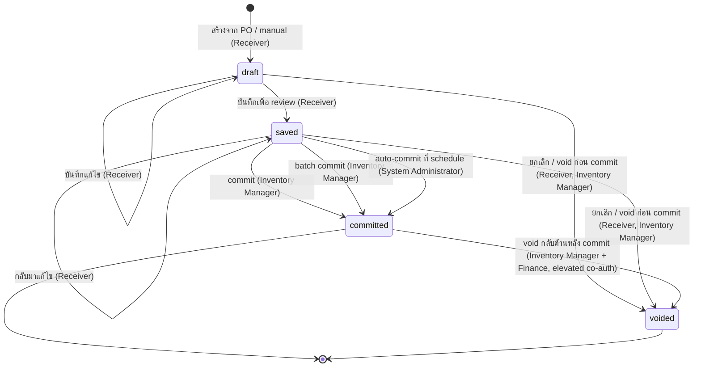

# ใบรับสินค้า (Goods Receive Note) — User Flow

> **At a Glance**
> **โมดูล:** [[good-receive-note]] &nbsp;·&nbsp; **Persona:** Receiver (Store Keeper + Inventory Manager) &nbsp;·&nbsp; Purchaser (review-only) &nbsp;·&nbsp; Finance (AP / Controller) &nbsp;·&nbsp; Audit / Config (Auditor + Sysadmin)
> **วงจรชีวิต workflow:** `draft → saved → committed → (voided)` ตาม `enum_good_received_note_status` เหตุการณ์ posting `saved → committed` fire การเพิ่ม inventory การเขียน cost-layer การเลื่อน `received_qty` ของบรรทัด PO และการขึ้น AP accrual
> **เจาะลึก view ต่อ persona ด้านล่างสำหรับรายละเอียดระดับ action**

## 1. ภาพรวม

หน้านี้เป็น **จุดเข้าภาพรวม** สำหรับชุด user-flow ของโมดูล `good-receive-note` Goods Receive Note (GRN) คือเอกสารที่บันทึก **การรับสินค้าจริง** จากผู้ขาย — แถว header ใน `tb_good_received_note` พร้อมหนึ่งหรือมากกว่าหนึ่งบรรทัด `tb_good_received_note_detail` และแถวลูกเหตุการณ์รับ `tb_good_received_note_detail_item` GRN อาจขึ้นกับ Purchase Order ต้นทาง (`doc_type = purchase_order` เส้นทางมาตรฐาน) หรือเป็นการรับด้วยมือที่ไม่มี PO (`doc_type = manual` เช่นการซื้อ ad-hoc / ฉุกเฉิน) GRN คือ **anchor หลักของ three-way match** ใน procure-to-pay: จนกว่า GRN จะ commit ไม่มี inventory เพิ่มและไม่มี AP liability ขึ้น; เมื่อ commit แล้ว `received_qty` ของบรรทัด PO ต้นทางเลื่อน FIFO / average-cost layer ถูกเขียน และ GRN กลายเป็นเอกสารหลักฐานที่ใบกำกับจากผู้ขายถูกจับคู่ด้วย

ส่วน 2 ด้านล่างคือ **state machine ส่วนกลาง** — list ทางการของ transition ที่ legal ข้ามค่าทั้งสี่ของ `enum_good_received_note_status` (`draft`, `saved`, `committed`, `voided`) ไม่ขึ้นกับว่าใครเป็นผู้ทำ ไฟล์ต่อ persona (link จากส่วน 3) บรรยาย *เส้นทาง* ของ persona นั้นผ่าน state machine — entry point ของพวกเขา action ที่มี การตัดสินใจที่พวกเขาเผชิญ และ handoff ที่จบความเกี่ยวข้องของพวกเขา ส่วน 4 จากนั้นสรุป handoff ข้าม persona ที่เย็บเส้นทางแต่ละเส้นเข้าด้วยกัน อ่านภาพรวมนี้ก่อนเพื่อตั้งหลักวงจรชีวิต จากนั้นเจาะเข้าไฟล์ persona ที่ตรงกับบทบาทของคุณ

## 2. วงจรชีวิตของเอกสาร

สถานะเอกสาร GRN เก็บใน `tb_good_received_note.doc_status` และจำกัดที่สี่ค่าที่ประกาศใน `enum_good_received_note_status`: `draft` (สถานะแก้ไขได้เริ่มต้น ไม่มีผลกระทบสต๊อกหรือ GL), `saved` (กรอกบรรทัดเสร็จและบันทึกเพื่อ review ยังแก้ไขได้ ยังไม่มีผลกระทบสต๊อกหรือ GL), `committed` (เหตุการณ์ posting เดียวเกิดขึ้น — inventory เพิ่ม cost layer เขียน PO line เลื่อน เอกสารล็อก) และ `voided` (ยกเลิกบริหารโดยไม่มีผลกระทบ inventory หรือ GL หรือกลับด้านหลัง commit ผ่านเส้นทางสิทธิ์เลื่อน) transition ด้านล่างครอบคลุมการเคลื่อนไหวที่ legal ระหว่างพวกมัน; อื่น ๆ ทั้งหมดถูกปฏิเสธโดย workflow engine ผลกระทบปลายทางที่ขับเคลื่อนการรับ (`sent → partial → completed` บน PO ต้นทาง การสร้าง FIFO / average-cost layer ใน [[costing]]) fire เฉพาะที่ transition `saved → committed` — ดู [02-business-rules.md](./02-business-rules.md) ส่วน 5 สำหรับกฎ posting

| จากสถานะ | Action | ไปสถานะ | อนุญาตสำหรับ | เงื่อนไขก่อน |
| ---------- | ------ | -------- | ----------- | -------------- |
| `(none)` | create (กับ PO) | `draft` | Receiver | `doc_type = purchase_order`; PO source มี `po_status ∈ {sent, partial}` และอย่างน้อยหนึ่งบรรทัดที่ pending; ฟิลด์ header populate จาก snapshot PO (`vendor_id`, `currency_id`, `exchange_rate`) |
| `(none)` | create (manual) | `draft` | Receiver | `doc_type = manual`; vendor / currency / วันที่รับใส่โดยตรง; ไม่มี `purchase_order_detail_id` เขียนบนบรรทัดใด |
| `draft` | save (edit) | `draft` | Receiver (เจ้าของ) | กฎ validation header และบรรทัดใน [02-business-rules.md](./02-business-rules.md) ส่วน 2 ผ่านตอน save (กฎ header) หรือเป็น warn-only (กฎบรรทัด); เอกสารยังแก้ไขได้ |
| `draft` | save for review | `saved` | Receiver (เจ้าของ) | กฎระดับบรรทัด `GRN_VAL_006`–`GRN_VAL_010` ผ่านทั้งหมด; บันทึกเหตุการณ์รับบนทุกบรรทัด; เอกสารตอนนี้มองเห็นโดย Inventory Manager และ Finance เพื่อ review |
| `saved` | resume edit | `saved` | Receiver (เจ้าของ) | เอกสารยังไม่ commit; แก้ไขเขียนใน place; ยังอยู่ที่ `saved` |
| `saved` | commit | `committed` | Inventory Manager (และ subset Receiver ที่ RBAC อนุญาต) | กฎ commit-time ทั้งหมดผ่าน (`GRN_VAL_011`–`GRN_VAL_014`): อย่างน้อยหนึ่ง detail_item ข้อมูล lot อยู่บน inventory transaction สำหรับ inventory item สถานะ PO valid extra cost allocate **Trigger การเพิ่ม inventory การเขียน cost-layer การเลื่อน `received_qty` ของ PO line การขึ้น AP accrual** |
| `saved` | batch commit | `committed` | Inventory Manager | Commit หลาย `saved` GRN ตอนสิ้นกะใน transaction เดียว; แต่ละ GRN ประเมินกับชุดกฎ commit-time เดียวกัน; ความล้มเหลว batch บางส่วน rollback เฉพาะ GRN ที่ล้มเหลว |
| `draft` | cancel (void ก่อน commit) | `voided` | Receiver (draft ตัวเอง), Inventory Manager | ต้องการ reason text; ไม่มีผลกระทบ inventory หรือ GL; เอกสารจบ |
| `saved` | cancel (void ก่อน commit) | `voided` | Receiver (เอกสารตัวเอง), Inventory Manager | ต้องการ reason text; ไม่มีผลกระทบ inventory หรือ GL; เอกสารจบ |
| `committed` | void (กลับด้านหลัง commit) | `voided` | Inventory Manager + Finance (elevated co-authorisation), System Administrator | ต้องการ reason text; **ต้อง trigger การกลับด้านชดเชยของ inventory transaction การกลับด้าน cost-layer การลด `received_qty` ของ PO line และ AP entry ที่กลับด้าน** ปกติจัดการผ่าน workflow credit-note กับ GRN |
| `saved` | auto-commit (schedule) | `committed` | System Administrator (scheduled job) | การ sweep สิ้นงวดครอบคลุม `saved` GRN ที่ค้างนานกว่า grace window ของ tenant; ชุดกฎ commit-time เดียวกันใช้; ความล้มเหลว log และ route ไปยัง Inventory Manager เพื่อแก้ด้วยมือ |
| `voided` | (ไม่มี action ต่อ) | `voided` | — | สถานะ terminal เอกสารที่ void เก็บไว้สำหรับ audit; การรับต่อไปต้องขึ้นเป็น GRN ใหม่ |
| `committed` | (ไม่มี action ต่อ) | `committed` | — | สถานะ terminal สำหรับเส้นทางการรับ การแก้ไขต้องการ `tb_credit_note` กับ GRN นี้หรือการปรับชดเชยใน [[inventory-adjustment]]; GRN เองยังล็อก |

## 3. สารบัญ Persona

แต่ละ persona ด้านล่างมีไฟล์เจาะลึกที่บรรยาย entry point flow หลัก decision branch และ exit point ของพวกเขา slug ตรงกับบทบาท persona; คลิก link เพื่อเปิด view ต่อ persona

- [Receiver](./03-user-flow-receiver.md) — Receiver / Store Keeper (และ subset Inventory Manager ที่ทำ commit) สร้าง GRN ที่ dock กับ PO หรือ manual นับและตรวจสินค้า บันทึกข้อมูล lot / expiry (ผ่าน inventory transaction ที่ link ไม่ตรงบน GRN line) บันทึกเพื่อ review และเมื่อได้รับอนุญาต — commit เอกสารเพื่อ post inventory และขึ้น AP
- [Purchaser](./03-user-flow-purchaser.md) — เจ้าของ PO ต้นทาง Review ข้อมูลการรับเมื่อ GRN `saved` หรือ `committed` สอบสวน variance qty / price / quality ที่ Receiver flag ประสานการแก้กับผู้ขาย (short-ship, substitution, return) Department Manager review cost-centre variance บน GRN ที่ flag เดียวกัน
- [Finance](./03-user-flow-finance.md) — Finance Officer / AP + Finance Manager รัน three-way match (PO ↔ GRN ↔ invoice) บน `committed` GRN จัดสรร extra cost (freight, duty, ส่วนประกอบ landed-cost) post AP liability บริหาร FX revaluation และจัดการปิดงวด
- [Audit / Config](./03-user-flow-audit-config.md) — System Administrator (การกำหนดรูปแบบหมายเลข lot, RBAC สำหรับ commit / void authority, การ integrate ไปยัง ERP / GL) และ Auditor (read-only review ของประวัติ GRN เหตุการณ์ commit และ reversal หลัง commit)

## 4. Handoff ข้าม Persona

ตารางด้านล่างจับช่วงที่ GRN ย้ายจากความรับผิดชอบของ persona หนึ่งไปอีก แต่ละ handoff ถูก anchor ที่สถานะเอกสาร ณ จุดถ่ายโอน

| จาก persona | Trigger | ไปยัง persona | สถานะเอกสารที่ handoff |
| ------------ | ------- | ---------- | ------------------------- |
| Receiver | บันทึกเพื่อ review (commit-ready) | Inventory Manager | `saved` (ข้อมูลบรรทัดสมบูรณ์; รอ commit) |
| Receiver / Inventory Manager | Commit post | Finance | `committed` (inventory เพิ่ม AP accrual ขึ้น พร้อมสำหรับ three-way match) |
| Receiver | บันทึกพร้อม flag variance บนบรรทัด | Purchaser, Inventory Manager | `saved` (เขียน variance comment; รอประสาน vendor) |
| Inventory Manager | Commit พร้อม flag variance บนบรรทัด | Purchaser | `committed` (บันทึก variance; ต้องตาม vendor ต่อแต่ inventory post แล้ว) |
| Finance | Three-way match discrepancy (price / qty ไม่ตรงกับ invoice) | Purchaser | `committed` (GRN ไม่เปลี่ยน; การแก้อาจต้องใช้ credit note หรือ reversal หลัง commit) |
| Inventory Manager + Finance | Reversal หลัง commit ได้รับอนุญาต | Receiver (เพื่อขึ้น GRN แทนถ้าจำเป็น) | `voided` (พร้อมการกลับด้าน inventory transaction และ AP entry บันทึก) |
| System Administrator | sweep auto-commit ที่ schedule รัน | Finance, Inventory Manager | `committed` (`saved` GRN ที่ค้าง sweep; exception route กลับ Inventory Manager) |
| System Administrator | การเปลี่ยนแปลง lot-format / RBAC / integration ใช้แล้ว | persona ทั้งหมด | (ไม่มีการเปลี่ยนสถานะเอกสาร; กฎใหม่ใช้ prospectively สำหรับ GRN ต่อ ๆ ไป) |

## 5. แหล่งอ้างอิง

- `../carmen/docs/good-recive-note-managment/GRN-User-Experience.md` — แหล่ง user-experience ของ carmen/docs: คำอธิบาย persona และ flow ผู้ใช้หลัก (หมายเหตุ: model 5 สถานะเก่า `DRAFT / PENDING_APPROVAL / APPROVED / REJECTED / CANCELLED` **ไม่ใช่** ทางการที่นี่; หน้านี้ตาม Prisma enum 4 สถานะ)
- `../carmen/docs/good-recive-note-managment/GRN-User-Flow-Diagram.md` — diagram flow ของ carmen/docs (lifecycle, integration, mobile); reference สำหรับรูปร่างเท่านั้น ค่าสถานะปรับใหม่ให้ตรงกับ Prisma enum
- `../carmen/docs/good-recive-note-managment/GRN-Overview.md` — ภาพรวมโมดูล carmen/docs: วัตถุประสงค์ ขอบเขต ผู้ใช้ จุด integration
- Sibling: [01-data-model.md](./01-data-model.md) — `enum_good_received_note_status` ทางการ (enum 4 สถานะที่ใช้ในส่วน 2) และความแตกต่างของ carmen/docs (ส่วน 5 ของ data model)
- Sibling: [02-business-rules.md](./02-business-rules.md) ส่วน 5 — ผลกระทบ posting และประตู authorization ที่อ้างโดยแต่ละแถวของส่วน 2
- โมดูลที่เกี่ยวข้อง: [[purchase-order]] (PO ต้นทาง; commit เลื่อน `received_qty` ของ PO และอาจพลิกสถานะ PO `sent → partial → completed`), [[inventory]] (ปลายทาง — inventory transaction คือที่ที่ข้อมูล lot, expiry และ cost-layer อยู่), [[costing]] (การสร้าง FIFO / average-cost layer ตอน commit), [[inventory-adjustment]] (การแก้ไขหลัง commit), [[vendor-pricelist]] (การตรวจ price-variance กับราคา GRN ต่อหน่วย)
