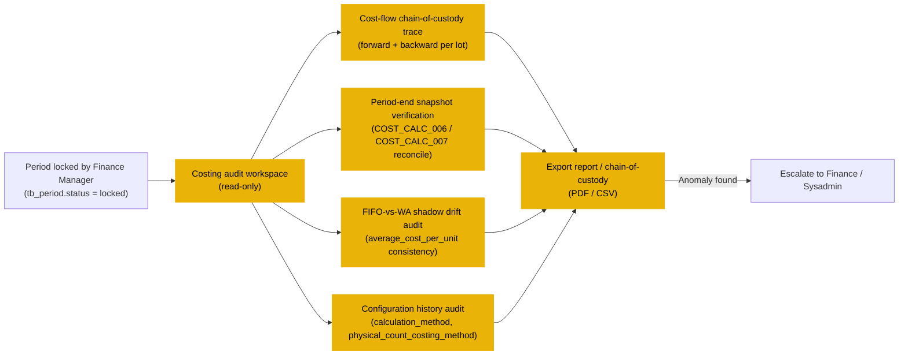

# การคำนวณต้นทุน (Costing) — User Flow — Auditor

> **At a Glance**
> **Persona:** Auditor &nbsp;·&nbsp; **Module:** [costing](/th/inventory/costing) &nbsp;·&nbsp; **Workflow stages:** Post-lock observer — รัน cost-flow chain-of-custody traces, period-snapshot verification, FIFO-vs-WA shadow drift audits, configuration-history audits &nbsp;·&nbsp; **Key permissions:** read-only (`COST_AUTH_008`); no edit, no approve, no period advance
> **ที่ persona นี้ทำ:** ตรวจสอบว่า costed COGS และ ending inventory tie กลับไปยัง source receipts และวิธี costing ถูกใช้อย่างสม่ำเสมอข้ามงวด

## 1. บทบาทในโมดูลนี้

Persona **Auditor** **read-only แท้ ๆ** ข้าม costing surface — `tb_inventory_transaction_cost_layer` (canonical cost-flow ledger), `tb_inventory_transaction_detail.cost_per_unit` (per-line cost), `tb_period_snapshot.closing_cost_per_unit` / `closing_total_cost` (period-locked valuation), `tb_business_unit.calculation_method` (configured method และ history), `tb_product.standard_cost` (reference cost และ update history) งานของ Auditor ครอบคลุม 3 audit threads:

(1) **ตรวจสอบว่า costed COGS tie กลับไปยัง source receipts** — cost-flow chain-of-custody trace: เดินไปข้างหน้าจาก `committed` GRN's inbound cost-layer row ผ่านทุก outbound ปลายน้ำที่ consume จาก lot ที่ introduce (ภายใต้ FIFO) หรือถูก cost เทียบ running average ที่ receipt contribute to (ภายใต้ WA); ตรวจสอบว่า outbound แต่ละ row's `cost_per_unit` ตรงกับสิ่งที่ engine จะเลือกที่ post timestamp ภายใต้ method ที่ตั้งค่า

(2) **ตรวจสอบว่า ending inventory tie กลับ** — สำหรับ period-end `tb_period_snapshot.closing_total_cost` ใด ๆ, เจาะลึก cost-layer rows ที่ประกอบ, ตรวจสอบว่า closing balance reconcile กับ cost-layer sum ที่ period boundary, และตรวจสอบว่า `close_period` / `open_period` rollforward รักษา cost ข้ามขอบเขต

(3) **Costing-method consistency audit ข้ามงวด** — ตรวจสอบว่า business unit's `calculation_method` ไม่ถูกเปลี่ยนเงียบ ๆ ระหว่าง period ที่มี non-zero on-hand; ตรวจสอบว่า FIFO-vs-WA-shadow drift อยู่ภายใน expected bounds; ตรวจสอบว่า credit-note-amount revaluations ส่งผลกระทบเฉพาะ lot ต้นทาง's `cost_per_unit` อย่างถูกต้อง

Deliverable ของ Auditor คือ audit report หรือ chain-of-custody trace — ไม่เคย write Auditor **ไม่** แก้ cost-layer row (terminal ตาม `COST_AUTH_010`) **ไม่** อนุมัติ credit-notes (Finance ตาม `COST_AUTH_005`) **ไม่** advance period state (Finance Manager ตาม `COST_AUTH_006`) และ **ไม่** configure costing method (Sysadmin ตาม `COST_AUTH_001`)

### ตำแหน่งเทียบกับ transactional flow (off-path observers)

Auditor **read-only แท้ ๆ** และ **off transactional path** — ไม่ปรากฏใน inventory หรือ cost-layer write sequence ใด Entry point ของ Auditor คือ **หลัง** Finance Manager ล็อก period

### Permission Matrix — V6 Audit Action × Read Scope (Auditor)

Auditor **read-only แท้ ๆ** ข้าม full costing surface

| Action | Auditor |
|---|---|
| อ่าน `tb_inventory_transaction_cost_layer` (full dataset) | ✅ (`COST_AUTH_008`) |
| อ่าน `tb_inventory_transaction_detail.cost_per_unit` (per-line cost) | ✅ (`COST_AUTH_008`) |
| อ่าน `tb_period_snapshot` (period-locked valuation) | ✅ (`COST_AUTH_008`) |
| อ่าน `tb_business_unit.calculation_method` และ change history | ✅ (`COST_AUTH_008`) |
| อ่าน `enum_physical_count_costing_method` config และ change history | ✅ (`COST_AUTH_008`) |
| อ่าน `tb_product.standard_cost` และ update history | ✅ (`COST_AUTH_008`) |
| รัน cost-flow chain-of-custody trace (forward + backward per lot) | ✅ (`COST_AUTH_008`) |
| รัน period-end snapshot verification (cost-layer sum vs snapshot) | ✅ (`COST_AUTH_008`) |
| รัน FIFO-vs-WA shadow drift audit (`average_cost_per_unit` consistency) | ✅ (`COST_AUTH_008`) |
| รัน configuration history audit | ✅ (`COST_AUTH_008`) |
| Export activity log (plain — no cost / PII fields) | ✅ (ไม่มี secondary approval) |
| Export activity log (sensitive — unit costs, vendor terms, PII) | ✅ (secondary approval จาก Controller / DPO required) |
| Escalate anomaly ไป Finance / Sysadmin (read-only initiator) | ✅ (initiates; ไม่ resolve) |
| แก้ cost-layer row ใด | ❌ (`COST_AUTH_010`) |
| อนุมัติ credit-note revaluation | ❌ (`COST_AUTH_005` — Finance only) |
| Advance period status | ❌ (`COST_AUTH_006` — Finance Manager only) |
| Configure costing method หรือ count-costing method | ❌ (`COST_AUTH_001` / `COST_AUTH_002` — Sysadmin only) |

> ℹ️ **SR cost-flow invariant for audit** SR cost-pick เป็น pass-through — consume existing layer ที่ existing cost ไม่มี AVCO re-average หรือ FIFO layer ใหม่

> ℹ️ **Spot Check cost-flow invariant for audit** Spot Checks **ไม่** post QOH, lot, หรือ cost-layer changes ในปัจจุบัน (status: PENDING)

## 2. Entry Point และ Primary Flow

**Entry points:** 3 audit-workspace paths บวก external-audit-cycle path

- **Costing audit workspace** — read-only screen ที่ surface `tb_inventory_transaction_cost_layer` rows
- **Cost-flow chain-of-custody trace tool** — รับ lot number และผลิต forward + backward trace
- **Period-end snapshot verification tool** — สำหรับ closed หรือ locked period รัน reconciliation query
- **External audit cycle** — ขับเคลื่อนโดย external auditor's request schedule

### 2.1 Cost-flow chain-of-custody trace (forward + backward, 6 ขั้นตอน)

1. **เปิด chain-of-custody trace tool** รับ `lot_no` (พบบ่อยที่สุด) GRN reference หรือ `(product_id, location_id, period)` triple
2. **รัน backward trace** จาก `lot_no` ระบุทุก inventory transaction ที่ **introduce** lot — โดยทั่วไป `transaction_type = good_received_note` inbound cost-layer row พร้อม `lot_no = X`
3. **รัน forward trace** จาก `lot_no` ระบุทุก cost-layer row ปลายน้ำที่ **consume** จาก lot — `transaction_type ∈ {issue, transfer_out, adjustment_out, credit_note_quantity}` พร้อม `from_lot_no = X` และ `out_qty > 0`
4. **ระบุ revaluations และ reconciliation events** Backward + forward traces รวมทุก `credit_note_amount` revaluations และ period-end `close_period` / `open_period` anchor rows
5. **ตรวจสอบ cost-pick-method consistency** สำหรับแต่ละ downstream consumption row, Auditor ตรวจสอบว่า cost ถูกเลือกภายใต้ **then-configured** `calculation_method`
6. **Export chain-of-custody report** PDF / CSV พร้อม forward + backward trace, revaluation history, method-consistency verification

### 2.2 Period-end snapshot verification (defensive reconciliation, 5 ขั้นตอน)

1. **เปิด period-end verification tool** scoped กับ closed หรือ locked period
2. **อ่าน `tb_period_snapshot`** Render สำหรับแต่ละ `(period_id, location_id, product_id, lot_no, lot_index)` key
3. **Reconstruct จาก cost-layer แบบอิสระ** สำหรับแต่ละ snapshot row, รัน aggregation อิสระบน `tb_inventory_transaction_cost_layer` Closing arithmetic ควรตรงตาม `COST_CALC_006`
4. **ตรวจสอบ rollforward continuity** Closing snapshot row's `closing_qty / closing_cost_per_unit` ควรเท่ากับงวดถัดไป's `opening_qty / opening_cost_per_unit` ตาม `COST_CALC_007`
5. **Export verification report** Per-key reconciliation table

### 2.3 FIFO-vs-WA shadow drift audit (algorithmic invariant, 4 ขั้นตอน)

1. **เปิด shadow-drift tool** scoped กับ period และ set ของ products / locations
2. **อ่าน cost-layer rows ของ FIFO-configured business unit** สำหรับแต่ละ cost-layer row ที่ FIFO product, `average_cost_per_unit` shadow column carry post-movement WA equivalent
3. **Recompute WA equivalent แบบอิสระ** สำหรับแต่ละ timestamp คำนวณว่า running WA จะเป็นอะไรถ้า WA in force ตั้งแต่ inbound แรก เทียบกับ shadow Drift ควร near-zero
4. **Export drift report** Per-product / per-location WA-shadow vs recomputed-WA delta

### 2.4 Configuration history audit (method consistency, 4 ขั้นตอน)

1. **เปิด configuration history feed** List ทุก change ของ `tb_business_unit.calculation_method`, `enum_physical_count_costing_method` config value, `tb_product.standard_cost`
2. **Per-change verification** สำหรับแต่ละ `calculation_method` change ตรวจสอบ **drain pre-condition** ตาม `COST_VAL_009`
3. **Audit period boundary** ตรวจสอบว่าไม่มี `calculation_method` change cross period boundary mid-period
4. **Export consistency report** Per-change verification status

## 3. Decision Branches

- **Trace returns clean chain vs surfaces gap** Clean chain — deliverable คือ trace report เท่านั้น Surfaces gap — escalate ไป **Finance** และ **Sysadmin**
- **Snapshot verification clean vs drift** Clean — ไม่มี follow-up Drift — escalate
- **Shadow-drift within tolerance vs above** Within tolerance — accept Above tolerance — escalate
- **Configuration-history clean vs anomaly** Clean — deliverable คือ consistency report Anomaly — escalate ไป Sysadmin + Finance
- **Sensitive-field export — secondary approval required** Cost-flow exports ที่รวม vendor cost detail, per-product cost variance, หรือ PII ต้องการ Controller หรือ DPO co-approval

## 4. Exit Point / Handoffs

การเกี่ยวข้องของ Auditor ใน thread costing จบที่หนึ่งใน 3 boundaries:

- **Trace / report generated, no anomaly** Chain-of-custody / snapshot verification / shadow-drift / configuration-history report คือ deliverable
- **Anomaly surfaced — escalation** Trace gap, snapshot mismatch, shadow drift, หรือ configuration anomaly route ไป persona ที่เป็นเจ้าของ
- **External audit cycle complete** External auditor's request schedule fulfilled

## 5. References

- Parent overview: [03-user-flow.md](./03-user-flow.md)
- Sibling: [03-user-flow-finance.md](./03-user-flow-finance.md)
- Sibling: [03-user-flow-inventory-controller.md](./03-user-flow-inventory-controller.md)
- Sibling: [01-data-model.md](./01-data-model.md)
- Sibling: [02-business-rules.md](./02-business-rules.md)
- Sibling: [calculation-methods.md](./calculation-methods.md)
- Related: [inventory/03-user-flow-audit-config](/th/inventory/inventory/03-user-flow-audit-config)
- Related: [good-receive-note](/th/inventory/good-receive-note)
- Related: [store-requisition](/th/inventory/store-requisition)
- Related: [physical-count](/th/inventory/physical-count) / [spot-check](/th/inventory/spot-check)
