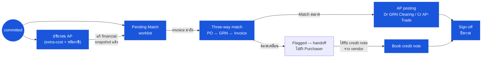

# ใบรับสินค้า (Goods Receive Note) — User Flow — Finance

> **At a Glance**
> **Persona:** Finance (Officer / AP Clerk + Manager / Controller) &nbsp;·&nbsp; **โมดูล:** [good-receive-note](/th/inventory/good-receive-note) &nbsp;·&nbsp; **ขั้น workflow:** หลัง `committed` — review การจัดสรร extra-cost &nbsp;·&nbsp; แก้รหัสภาษี &nbsp;·&nbsp; three-way match (PO ↔ GRN ↔ invoice) &nbsp;·&nbsp; AP posting &nbsp;·&nbsp; sign-off ปิดงวด &nbsp;·&nbsp; **สิทธิ์สำคัญ:** แก้วิธีจัดสรรหลัง commit (`GRN_AUTH_007`); post AP journal (`GRN_POST_008`); flag ความคลาดเคลื่อนของ match (`GRN_POST_009`); reconcile ปิดงวด
> **persona นี้ทำอะไร:** ปรับการเงินหลัง commit รัน three-way match post AP และ reconcile inventory-to-GL ปิดงวด

## 1. บทบาทในโมดูลนี้

Persona **Finance** ครอบคลุม **Finance Officer / AP Clerk** ที่แนวหน้า (การ three-way matching และ AP posting ประจำวัน) และ **Finance Manager / Controller** ที่ขอบเขต sign-off (ปิดงวด reconcile GL แก้ปัญหา dispute) Finance เป็นผู้เข้าร่วม **หลัง commit** — พวกเขา **ไม่** สร้าง save หรือ commit GRN; การเข้าสู่ flow นี้สันนิษฐานว่า Inventory Manager ได้ fire transition `saved → committed` บนเส้นทาง Receiver แล้ว ซึ่งได้สร้าง inventory accrual (`Dr Inventory / Cr GRN Clearing`, `GRN_POST_006`) และเพิ่มสต๊อกคงคลังไปแล้ว มีสองกิจกรรมที่ชัดเจนภายใต้ persona นี้ **แรก** *การปรับการเงินก่อน AP* บน GRN `committed` ขณะที่ใบกำกับจาก vendor ยังไม่มาถึง — review การจัดสรร extra-cost ที่ Inventory Manager finalize ตอน commit แก้วิธีจัดสรร (`manual`, `by_value`, `by_qty` — `enum_allocate_extra_cost_type` สามโหมดเป็น canonical; list ห้าโหมด legacy ไม่ใช่) แก้การกำหนดรหัสภาษีบนบรรทัดที่ receiver เดาอัตราผิด และบันทึก financial snapshot ที่แก้แล้ว การแก้การจัดสรรในช่วงนี้อนุญาตโดยชัดเจนตาม `GRN_AUTH_007`; การแก้หลัง AP post แล้วต้องใช้ `tb_credit_note` แทน **สอง** *three-way match* เมื่อใบกำกับจาก vendor มาถึง — match invoice กับ PO ต้นทางและ GRN `committed` บน qty และราคาภายใน tolerance ของ tenant post journal ฝั่ง AP เมื่อสำเร็จ (`Dr GRN Clearing / Cr AP-Trade`, `GRN_POST_008`) และ flag ความคลาดเคลื่อนกลับให้ Purchaser เมื่อล้มเหลว (`GRN_POST_009`) ในรอบปิดงวด Finance Manager รัน *sign-off ปิดงวด*: reconcile inventory sub-ledger กับบัญชี GL inventory control ยืนยันว่า GRN `committed` ทุกใบในงวดได้ match กับ invoice หรือถูกถือใน GRN Clearing accrual อย่างถูกต้อง age ยอด GRN Clearing เปิด และ sign off กิจกรรมการรับสำหรับงวด สิ่งสำคัญ: **enum `doc_status` ของ GRN ไม่ถูก transition โดย Finance** — `saved → committed` เป็น posting event เดียวที่เอกสารผ่าน และผลลัพธ์ match หลัง commit อยู่บน match flag แยก ไม่อยู่บน enum สี่สถานะ ความคลาดเคลื่อนไม่ roll GRN ย้อนกลับ; มันอยู่เป็น entry ใน activity-log และไหลกลับให้ Purchaser แก้ฝั่ง vendor

### ตำแหน่ง Workflow (Finance highlighted)

### Permission Matrix — Touchpoint × Action (Finance)

Finance ดำเนินงานข้ามสอง touchpoint บน GRN `committed`: **AP capture + three-way match** (จาก invoice มาถึงจนผลลัพธ์ match) และ **Accrual / close-out review** (reconcile ปิดงวดของยอด GRN Clearing และ inventory sub-ledger) Finance มี **การเปลี่ยนสถานะ GRN โดยตรงเป็นศูนย์** — `enum_good_received_note_status` สี่สถานะไม่ถูก transition โดย Finance; ผลลัพธ์ match อยู่บน match flag แยก

| Action | AP capture + three-way match | Accrual / close-out review |
|---|---|---|
| ดู GRN ที่ committed (read) | ✅ — Pending Match worklist และ PO Receiving History | ✅ — dashboard ปิดงวด |
| Review การจัดสรร extra-cost | ✅ — ปรับก่อน AP ตาม `GRN_AUTH_007` | ✅ (review ประวัติเท่านั้น) |
| ปรับวิธีจัดสรร extra-cost (`manual` / `by_value` / `by_qty`) | ❌ — `GRN_AUTH_007` จำกัดการปรับการจัดสรรเฉพาะ `doc_status ∈ {draft, saved}`; เมื่อ `committed` แล้วการจัดสรร freeze (แก้ผ่าน `tb_credit_note`) | ❌ (freeze หลัง AP post) |
| ปรับรหัสภาษี / อัตราต่อบรรทัด | ✅ — override `is_tax_adjustment` ก่อน AP | ❌ (freeze หลัง AP post) |
| รัน three-way match (PO ↔ GRN ↔ invoice) | ✅ | ❌ |
| Post AP เมื่อ match สะอาด (`Dr GRN Clearing / Cr AP-Trade`) | ✅ — `GRN_POST_008` | ❌ |
| Flag ความคลาดเคลื่อน (handoff ไปยัง Purchaser) | ✅ — `GRN_POST_009` | ❌ |
| Book credit note กับ GRN | ✅ — เส้นทางผ่อนผันของ vendor | ✅ (แก้หลังปิดงวด) |
| Reconcile inventory sub-ledger กับ GL | ❌ | ✅ — Finance Manager |
| Age ยอด GRN Clearing เปิด | ❌ | ✅ — Finance Manager |
| Sign-off ปิดงวด | ❌ | ✅ — Finance Manager |
| เปลี่ยน `doc_status` ของ GRN | ❌ | ❌ |
| Void / reverse GRN (co-auth) | ❌ — `GRN_AUTH_008` จำกัด void เฉพาะ `{draft, saved}` เท่านั้น; การ void GRN `committed` ไม่อนุญาตโดยกฎ GRN ใด ๆ (การแก้หลัง commit ใช้ `tb_credit_note` หรือ [inventory-adjustment](/th/inventory/inventory-adjustment)) | ❌ |

> ℹ️ **สถานะ GRN immutable โดย Finance:** Finance ไม่เคย transition `doc_status` ผลลัพธ์ three-way match จับบน match flag แยก (`unmatched` → `matched` / `flagged` / `partially_matched`) `doc_status` คง `committed` ตลอด lifecycle ของ Finance — match สะอาด คลาดเคลื่อน credit note และปิดงวด

## 2. Entry Point และ Primary Flow

**Entry point:** สามเส้นทางเทียบเท่า โดยแต่ละเส้นทาง gate ด้วย `doc_status = committed`:

- **โมดูล GRN → Pending Match worklist** — list ที่กรองล่วงหน้าของ GRN ที่ `doc_status = committed` พร้อม match flag `unmatched` เรียงตามวัน commit ใช้เป็นคิว AP ประจำวัน
- **โมดูล AP → การรับใบกำกับ** — เมื่อใบกำกับจาก vendor ถูก key เข้า (หรือ auto-ingest จาก EDI / e-invoice intake) หน้าจอ AP ค้นหา GRN เปิดสำหรับ `(vendor_id, po_no)` เดียวกันและ deep-link เข้าสู่หน้าจอ match ของ GRN พร้อมแนบ invoice ล่วงหน้า
- **Dashboard ปิดงวด** — มุมมองของ Finance Manager ที่ list aging ของ GRN Clearing variance ระหว่าง sub-ledger กับ GL และจำนวน GRN ที่ unmatched สำหรับงวดที่กำลังปิด

### 2.1 ปรับก่อน AP (GRN committed ใบกำกับยังไม่มา) — 5 ขั้นตอน

1. **เปิด GRN ที่ committed** จาก Pending Match worklist หรือจาก tab Receiving History ของโมดูล PO Header เป็น read-only บนฟิลด์ที่กระทบสต๊อก (vendor สกุลเงิน อัตราแลกเปลี่ยน วันที่รับ ปริมาณบรรทัด) แต่ panel extra-cost และรหัสภาษียังแก้ได้ตาม `GRN_AUTH_007` จนกว่า AP post
2. **Review บรรทัด extra-cost** หน้าจอ list ทุกแถว `tb_extra_cost` ที่ผูกกับ GRN นี้ (freight, duty, brokerage, ส่วนประกอบ landed-cost) พร้อม `allocate_extra_cost_type` net amount tax และการจัดสรรต่อบรรทัดที่ Inventory Manager finalize ตอน commit ตรวจสอบหลักฐานต้นทุน (invoice ผู้ขนส่ง customs entry) ที่แนบกับแต่ละแถว
3. **ปรับวิธีจัดสรรถ้าจำเป็น** Enum ของ Prisma มีสามโหมด — `manual` (จำนวนต่อบรรทัดที่ผู้ใช้กรอก; sum ต้องเท่า `tb_extra_cost.net_amount` ภายใน `0.01`) `by_value` (pro-rata ตาม `line.net_amount`) `by_qty` (pro-rata ตาม `line.received_base_qty` ใน UoM ฐาน) การ switch โหมด recompute snapshot การจัดสรรต่อบรรทัดตาม `GRN_CALC_009`–`GRN_CALC_011`; บรรทัดสุดท้ายดูดส่วนเหลือจากการปัดเศษ
4. **Review รหัสภาษีต่อบรรทัด** ตรวจสอบ `tax_rate` ระดับบรรทัดและ `is_tax_adjustment` กับ tax profile ของ vendor, tax class ของสินค้า และเขตอำนาจการรับ Override ที่บรรทัดถ้า receiver เลือกอัตราผิด; `is_tax_adjustment = true` บันทึกค่า override ตาม `GRN_VAL_010` การ recompute tax ทำตาม `GRN_CALC_003` (tax-exclusive) หรือ `GRN_CALC_004` (tax-inclusive)
5. **Save financial snapshot ที่ปรับ** Roll-up recompute ตาม `GRN_CALC_007` และ `GRN_CALC_008`; GL accrual ที่บันทึกตอน commit (`GRN_POST_006`) ถูกปรับด้วย entry ชดเชยสำหรับ delta ใน inventory cost และ input-tax `doc_status` ของ GRN คง `committed`; แค่ financial snapshot ย้าย Activity log บันทึกการปรับพร้อม user timestamp และ delta amount

### 2.2 Three-way match (ใบกำกับจาก vendor มาถึง) — 7 ขั้นตอน

1. **ใบกำกับมาถึง** ผ่าน AP intake (key, EDI หรือ e-invoice) ระบบจับ invoice number invoice date vendor currency รายการระดับบรรทัด item / qty / price tax และบรรทัด freight หรือ surcharge ฝั่ง vendor ใด ๆ
2. **ค้นหา GRN เปิด** AP scope ชุด candidate ด้วย `(vendor_id, po_no, invoice_no)` กับ GRN `committed` ที่ match flag เป็น `unmatched` หรือ `partially_matched` Invoice ใบเดียวอาจ match GRN ใบเดียว (1:1) GRN หลายใบกับ PO เดียวกัน (1:N รวมการรับบางส่วน) หรือ GRN ใบเดียวกับ invoice หลายใบ (N:1 split-billing หลาย invoice)
3. **รัน match** สำหรับแต่ละบรรทัดบน invoice ระบบจับคู่กับบรรทัด GRN (ผ่าน `purchase_order_detail_id` สำหรับ GRN PO-sourced) และเปรียบเทียบ: **qty** (qty invoice เทียบ `received_qty` ของ GRN — ต้องเท่าเป๊ะ ไม่มี tolerance ทางลบ) และ **ราคา** (unit price invoice เทียบ `base_price`, tax และ discount ของ GRN) ภายใน price tolerance ที่ tenant ตั้ง (โดยทั่วไปเป็น percent หรือ absolute amount ตาม `GRN_POST_007`) Three-way match ยัง re-check กับ `order_qty` และ `order_unit_price` ของบรรทัด PO เพื่อตรวจจับ drift ต้นน้ำ
4. **แก้ผลลัพธ์ match** **Match สะอาด** (qty และราคาภายใน tolerance ทุกบรรทัด): ไปขั้น 5 **คลาดเคลื่อน** (qty mismatch หรือ price gap นอก tolerance หรือ GRN ขาด หรือบรรทัด invoice ขาด): ไปขั้น 6
5. **Post AP เมื่อสำเร็จ** สอง journal leg รัน atomically: (a) **Dr Inventory / Cr GRN Clearing** ถูก post แล้วโดย event การรับตอน commit (`GRN_POST_006`); match ตอนนี้ (b) post **Dr GRN Clearing / Cr AP-Trade** ที่ amount ที่ match clearing accrual กับหนี้ AP ของ vendor (`GRN_POST_008`) Tax accrual บนบัญชี input-tax control reconcile กับ tax ของ invoice Match flag ของ GRN flip `unmatched → matched`; invoice post ไปยัง AP สำหรับรอบการจ่าย Entry inventory sub-ledger ที่เขียนตอน commit ยังอยู่; ไม่ต้องปรับ inventory
6. **Flag ความคลาดเคลื่อนเมื่อล้มเหลว** AP ถือ invoice ใน state `disputed` Comment `system` ถูก append บน GRN และ PO บันทึกประเภทคลาดเคลื่อน (qty / price / line-coverage) gap amount และ invoice reference Match flag flip เป็น `flagged` GRN เองคงอยู่ที่ `doc_status = committed` — ไม่มี enum transition เมื่อ match ล้มเหลว (`GRN_POST_009`); enum สี่สถานะไม่สะท้อนผลลัพธ์ match
7. **Handoff ความคลาดเคลื่อน** Route GRN ที่ flag กลับไปยัง **Purchaser** สำหรับการแก้ฝั่ง vendor (เจรจา credit-note ขอแก้ invoice book replacement-shipment) Finance **ไม่** แก้ GRN เพื่อแก้ความคลาดเคลื่อน — การแก้อยู่บน `tb_credit_note` กับ GRN (สำหรับการผ่อนผันของ vendor) บน invoice vendor ที่แก้ใหม่ (re-key ใน AP) หรือบนการปรับ inventory ชดเชยใน `[inventory-adjustment](/th/inventory/inventory-adjustment)` สำหรับการแก้สต๊อกจริง

## 3. Decision Branches

- **Match สะอาด** (qty เท่ากัน ราคาภายใน tolerance ทุกบรรทัด GRN ครอบคลุม ทุกบรรทัด invoice ครอบคลุม): post AP ตามขั้น 5; flip match flag เป็น `matched` GL accrual ของ GRN ถูก clear เต็ม; หนี้ AP ถูก recognise สำหรับการจ่าย
- **คลาดเคลื่อน qty** (qty invoice ≠ `received_qty` ของ GRN บนบรรทัดใด): flag กลับ Purchaser สอง sub-case: invoice เก็บเงินเกินการรับ — vendor ถูกขอให้ credit ส่วนเกิน; invoice เก็บเงินน้อยกว่าการรับ — vendor ถูกขอให้ออก invoice ส่วนเหลือ หรือ GRN นั่งที่ `partially_matched` จน invoice ใบที่สองมา `received_qty` ของ GRN คือแหล่งความจริง; AP ไม่ปรับ GRN
- **คลาดเคลื่อนราคาภายใน tolerance** (gap ≤ tolerance ของ tenant ระบุเป็น percent หรือ absolute amount): auto-pass การ match; post AP ที่ราคา invoice price gap ถูกดูดเข้าบัญชี price-variance (หรือ capitalise เข้า inventory ตามนโยบาย tenant) โดย posting variance อยู่บน leg AP-clearing ไม่มี handoff Purchaser
- **คลาดเคลื่อนราคานอก tolerance**: flag กลับ Purchaser Vendor ถูกขอให้ออก credit (gap ลง) หรือ invoice ใหม่ (gap ขึ้น); Purchaser อาจขอแก้ `[vendor-pricelist](/th/inventory/vendor-pricelist)` เพื่อให้ PO ในอนาคตกำหนดราคาถูก GRN ถือที่ `committed` พร้อม match flag ที่ `flagged`
- **GRN ขาด** (invoice มาก่อนที่ GRN ใด ๆ สำหรับ PO commit): ถือ invoice ที่ AP ใน `awaiting_receipt`; ไม่รัน match Re-poll ทุก GRN commit กับ PO เดียวกัน โมดูล AP กวาด invoice awaiting-receipt ตาม schedule
- **Match บางส่วนแล้วเต็มหลาย invoice** กับ GRN เดียวกัน: invoice แรกครอบคลุม subset ของบรรทัดหรือ qty ของ GRN — match flag flip เป็น `partially_matched` post AP-clearing บางส่วน (`Dr GRN Clearing / Cr AP-Trade` ที่ amount ที่ match เท่านั้น); ยอด GRN Clearing คงค้างเปิด Invoice ตามมา match ส่วนที่เหลือ; ที่ match สุดท้าย flag flip เป็น `matched` และส่วนค้าง clear
- **Gate ปิดงวด** (Finance Manager): งวดปิดไม่ได้จนกว่า (a) ยอด inventory sub-ledger reconcile กับบัญชี GL inventory control (b) ทุกยอด GRN Clearing ทั้ง match ภายในงวด หรือ age ไปงวดถัดไปพร้อมเหตุผลที่เอกสาร (c) รายงาน GRN unmatched ถูก review และ sign off Exception เปิด roll ไปข้างหน้าและ feed Pending Match worklist ของงวดถัดไป

## 4. Exit Point / Handoff

การเข้าร่วมของ Finance บน GRN ใด ๆ จบที่หนึ่งใน 4 ขอบเขต:

- **Match สะอาด — AP posted** Journal match success (`Dr GRN Clearing / Cr AP-Trade`) clear accrual; match flag ของ GRN flip เป็น `matched`; invoice เข้ารอบการจ่าย `doc_status` ของ GRN คง `committed`; **ไม่มี enum transition** Inventory sub-ledger และ GL reconcile สำหรับการรับนี้
- **Match ล้มเหลว — ความคลาดเคลื่อน handoff ไป Purchaser** Match flag flip เป็น `flagged`; GRN คงที่ `doc_status = committed` Handoff ไป **Purchaser** ([03-user-flow-purchaser.md](./03-user-flow-purchaser.md)) สำหรับการแก้ฝั่ง vendor (เจรจา credit-note แก้ invoice book replacement-shipment) Finance กลับเข้าสู่ flow เมื่อเอกสารตอบสนองของ vendor มาถึง (book credit note กับ GRN, key invoice ที่แก้เข้า AP)
- **การแก้ทางการเงินหลัง commit ผ่าน credit note** เมื่อ vendor ยอมให้ credit สำหรับสินค้าเสียหาย short-ship หรือคลาดเคลื่อนราคา (มาจาก handoff Purchaser) Finance book `credit note` กับ AP accrual หรือหนี้ AP-Trade ที่ post ของ GRN; GRN เองไม่ถูกแก้ Posting credit-note reverse ยอด GRN Clearing สัดส่วนหรือยอด AP-Trade ขึ้นกับว่าการ match AP post แล้วหรือยัง
- **Sign-off ปิดงวด — handoff ไป Controller** ที่สิ้นงวด Finance Manager รัน reconciliation inventory-sub-ledger-vs-GL age ยอด GRN Clearing review รายการ exception GRN unmatched และ sign off กิจกรรมการรับสำหรับงวด Sign-off handoff ไป **Controller** สำหรับ journal ปิดและรอบรายงานตามกฎหมายสิ้นงวด Exception เปิด roll ไปงวดถัดไป

## 5. แหล่งอ้างอิง

- ภาพรวมแม่: [03-user-flow.md](./03-user-flow.md) — วงจรชีวิตสี่สถานะ canonical (`draft / saved / committed / voided`) บน `enum_good_received_note_status`, state machine global ที่ persona นี้สังเกตการณ์ (โดยไม่เปลี่ยน) และตารางการ handoff ข้าม persona (Receiver → Finance ตอน commit; Finance ↔ Purchaser ตอนคลาดเคลื่อน)
- พี่น้อง: [03-user-flow-receiver.md](./03-user-flow-receiver.md) — persona ต้นน้ำที่สร้าง save และ commit GRN ที่ dock; transition `saved → committed` สร้าง inventory accrual ที่ three-way match ของ persona นี้ clear
- พี่น้อง: [03-user-flow-purchaser.md](./03-user-flow-purchaser.md) — เป้าหมาย bounce-back สำหรับความคลาดเคลื่อนทุกอย่างที่ flag Purchaser เป็นเจ้าของการแก้ฝั่ง vendor (เจรจา credit-note แก้ invoice book replacement-shipment) สำหรับ short-ship สินค้าเสียหาย ของผิด และความคลาดเคลื่อนราคาที่ surface ที่ three-way match
- พี่น้อง: [03-user-flow-audit-config.md](./03-user-flow-audit-config.md) — System Administrator (ตั้งค่า tax-profile, ตั้งค่า match tolerance, ควบคุม period-lock) และ Auditor (review read-only การ post AP, credit note และ sign-off ปิดงวด)
- พี่น้อง: [01-data-model.md](./01-data-model.md) — `enum_good_received_note_status` canonical (สี่ค่า), `enum_allocate_extra_cost_type` (สามค่า: `manual`, `by_value`, `by_qty`), `tb_extra_cost` และ catalogue divergence ที่ชี้แจงว่า enum จัดสรรห้าโหมด legacy ไม่ได้ implement ที่ระดับ schema
- พี่น้อง: [02-business-rules.md](./02-business-rules.md) — Section 5 Posting Rules (`GRN_POST_006` accrual ตอน commit, `GRN_POST_007` match anchor, `GRN_POST_008` match success, `GRN_POST_009` match failure) และ Section 6 Cross-Module Rules (`GRN_XMOD_007` Finance / three-way match) — การอ้างอิง canonical สำหรับ journal leg และการจัดการ match-failure ในขั้น 5 และ 6 ของ primary flow
- เกี่ยวข้อง: [purchase-order](/th/inventory/purchase-order) — leg ที่สามของ three-way match; `order_qty` และ `order_unit_price` ของ PO ถูก re-check ที่เวลา match เพื่อตรวจจับ drift ต้นน้ำ
- เกี่ยวข้อง: [inventory](/th/inventory/inventory) — inventory sub-ledger ที่ reconciliation ปิดงวด balance กับบัญชี GL inventory control; แถว `tb_inventory_transaction` ที่เขียนตอน GRN commit feed sub-ledger
- เกี่ยวข้อง: [costing](/th/inventory/costing) — feed landed-cost (จัดสรร extra-cost ตาม `GRN_CALC_009`–`GRN_CALC_011`) ไหลเข้า FIFO / average-cost layer บน `tb_inventory_transaction_cost_layer.cost_per_unit`; การปรับ extra-cost ของ Finance ในขั้น 3–5 ของเส้นทาง pre-AP อัปเดต feed นี้ผ่าน journal entry ชดเชย
- เกี่ยวข้อง: credit note — เอกสารปลายทางที่ book การผ่อนผันของ vendor สำหรับความคลาดเคลื่อนที่ flag; เส้นทางแก้หลัง commit สำหรับทั้ง AP-pending (offset GRN Clearing) และ AP-posted (offset AP-Trade) GRN
- `../carmen/docs/good-recive-note-managment/GRN-User-Experience.md` — ที่มา carmen/docs สำหรับ persona Finance Officer (เป้าหมาย: ensure บันทึกการเงินถูกต้อง ยืนยันการคำนวณ cost และ tax reconcile GRN กับ invoice vendor ดำเนินการจ่ายอย่างมีประสิทธิภาพ; pain point: บริหารอัตราแลกเปลี่ยน จัดสรร cost เพิ่ม จัดการความซับซ้อนของภาษี reconcile ความคลาดเคลื่อนราคา)
- `../carmen/docs/good-recive-note-managment/GRN-Overview.md` — ภาพรวมโมดูล carmen/docs: integration การเงิน (journal entry, landed cost, การคำนวณภาษี, การแปลงสกุลเงิน), integration AP (matching invoice, การจ่าย) และบทบาทของ GRN เป็น leg การรับของ three-way match
