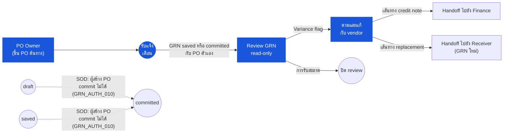

# ใบรับสินค้า (Goods Receive Note) — User Flow — Purchaser

> **At a Glance**
> **Persona:** Purchaser / Procurement Officer (+ subset Department Manager) &nbsp;·&nbsp; **โมดูล:** [good-receive-note](/th/inventory/good-receive-note) &nbsp;·&nbsp; **ขั้น workflow:** ได้รับแจ้งเตือนบน `saved` / `committed` กับ PO ตัวเอง — review เฉพาะอ่านของการรับเทียบ PO ข้อมูล lot ใบส่งของ comment variance; ตามฝั่ง vendor (chase / credit-note / substitution / re-negotiation) &nbsp;·&nbsp; **สิทธิ์สำคัญ:** read-only บนเอกสาร GRN; SoD (`PO_AUTH_010`) ห้าม post GRN กับ PO ตัวเอง
> **persona นี้ทำอะไร:** Review GRN ของ PO ตัวเองสำหรับ variance การรับและขับเคลื่อนการแก้ฝั่ง vendor; ไม่เปลี่ยนสถานะเอกสาร GRN

## 1. บทบาทในโมดูลนี้

Persona **Purchaser** ครอบคลุม **Purchaser / Procurement Officer** ที่ขึ้น PO ต้นทาง และ subset **Department Manager** ที่เป็นเจ้าของ cost-centre ที่ GRN post เข้าไป ในโมดูล GRN Purchaser เป็น **ผู้เข้าร่วม review-only** — พวกเขา **ไม่** สร้าง GRN ที่ dock **ไม่** บันทึกรายการบรรทัด และ **ไม่** post commit การแยกหน้าที่ (`PO_AUTH_010` สืบทอดจาก persona PO ต้นทาง) ห้ามผู้ใช้ที่สร้างหรือ transmit PO ชัดเจน post GRN กับมัน; การเปลี่ยน `saved → committed` สงวนสำหรับ Inventory Manager บนเส้นทาง Receiver Purchaser ได้รับแจ้งเตือนเมื่อ GRN ไปที่ `saved` หรือ `committed` กับ PO ของพวกเขา เปิดเอกสารใน read mode เพื่อ review ข้อมูลการรับเทียบกับ PO ที่ตนเป็นเจ้าของ (`received_qty` vs `order_qty`, `accepted_qty` vs `received_qty`, ข้อมูล lot / expiry บน `tb_inventory_transaction_detail` ที่ link, ใบส่งของและหลักฐานคุณภาพแนบ และ comment variance ใด ๆ ที่ Receiver เขียน) และเป็นเจ้าของ **การตามฝั่ง vendor** สำหรับ variance ทุกอย่างที่ flag บน GRN — ตาม short-ship, เจรจา credit-note / replacement สำหรับสินค้าเสียหาย, ทดแทนสำหรับสินค้าผิด และเจรจาใหม่เมื่อราคา GRN ต่อหน่วยเบี่ยงเบนจาก vendor pricelist active subset Department Manager review GRN ที่กระทบ cost-centre ของแผนกตน ยืนยันว่าสิ่งที่รับตรงกับที่สั่งสำหรับแผนก และติดตามความคลาดเคลื่อนของราคาเทียบ `[vendor-pricelist](/th/inventory/vendor-pricelist)` สำหรับการควบคุมงบ ทั้งสอง sub-persona ไม่เปลี่ยนสถานะเอกสาร GRN — การแก้ของพวกเขาอยู่บนเอกสารตอบสนอง vendor (credit note, replacement GRN) หรือบน PO ต้นทางผ่าน amendment

### ตำแหน่ง Workflow (Purchaser highlighted)

### ตารางสิทธิ์ — Status × Action (Purchaser)

Purchaser เป็นผู้เข้าร่วม **review-only** ในโมดูล GRN การแยกหน้าที่ (`GRN_AUTH_010` กระจก `PO_AUTH_010`) ห้ามผู้ใช้ที่สร้างหรือ transmit PO ต้นทาง commit GRN กับมันชัดเจน Purchaser สังเกตทุกสถานะที่ไม่ใช่ `voided` และเป็นเจ้าของการแก้ฝั่ง vendor; ไม่เปลี่ยนสถานะเอกสาร

| Action | draft | saved | committed | voided |
|---|---|---|---|---|
| View GRN (read) | ❌ (ยังไม่มองเห็นโดย Purchaser) | ✅ | ✅ | ✅ (audit เท่านั้น) |
| รับแจ้งเตือน (GRN saved / committed) | ❌ | ✅ | ✅ | ❌ |
| Review `received_qty` vs `order_qty` | ❌ | ✅ | ✅ | ❌ |
| Review `accepted_qty` vs `received_qty` | ❌ | ✅ | ✅ | ❌ |
| Review ข้อมูล lot / expiry (read-only) | ❌ | ✅ | ✅ | ❌ |
| Review ใบส่งของ / หลักฐานแนบ | ❌ | ✅ | ✅ | ❌ |
| ตรวจการเบี่ยงเบน vendor pricelist | ❌ | ✅ | ✅ | ❌ |
| เพิ่ม comment / log การแก้ vendor | ❌ | ✅ | ✅ | ❌ |
| แก้ไข header (vendor, currency, lines) | ❌ | ❌ | ❌ | ❌ |
| บันทึก GRN / บันทึกเพื่อ review | ❌ | ❌ | ❌ | ❌ |
| Commit GRN (`saved → committed`) | ❌ | ❌ (`GRN_AUTH_010`) | ❌ | ❌ |
| Void GRN | ❌ | ❌ | ❌ | ❌ |
| ขึ้น PO amendment / ยกเลิกบรรทัด | ❌ | ❌ (PO ตัวเอง ไม่ใช่ GRN) | ✅ (PO ตัวเอง ไม่ใช่ GRN) | ❌ |
| Handoff reference credit note ไปยัง Finance | ❌ | ❌ | ✅ | ❌ |

> ⚠️ **ความคลาดเคลื่อน — GRN แบบ standalone (ไม่มี PO reference):** `Test_case/System_Process/tx-01-grn.md` BR-01 เอกสารว่า GRN สามารถสร้างอย่างอิสระโดย Receiver โดยไม่มี PO reference (`doc_type = manual`) สำหรับ GRN manual ไม่มี Purchaser ต้นทาง — entry point "My POs filter" และ "Receiving History tab" ไม่เปิดเผย GRN manual และ Purchaser ไม่มีสิทธิ์รับแจ้งเตือน Tester ควรยืนยันว่า GRN manual ไม่ถูก route ไปยังคิวแจ้งเตือน Purchaser Source: `Test_case/System_Process/tx-01-grn.md` (วันที่จับ 2026-04-27)

## 2. Entry Point และ Flow หลัก

**Entry point:** สามเส้นทางที่เทียบเท่าไปยัง screen review read-only — ไม่มีเส้นทางใดเปิด GRN ใน mode แก้ไขสำหรับ persona นี้

- **แจ้งเตือนจาก activity log** — การเปลี่ยน `draft → saved` ของ Receiver (เมื่อ variance comment เขียนบนบรรทัดใด) และการเปลี่ยน `saved → committed` ของ Inventory Manager ทั้งคู่ fire แจ้งเตือนไปยังเจ้าของ PO; คลิกแจ้งเตือน deep-link เข้า view อ่าน GRN scope ที่บรรทัดที่เป็นของ PO ของ Purchaser
- **โมดูล PO → tab Receiving History** — เปิด PO ที่ `po_status ∈ {sent, partial, completed}`; tab Receiving History list ทุก GRN (`saved` และ `committed`) ที่ reference PO นี้ผ่าน `tb_good_received_note_detail.purchase_order_detail_id` พร้อมผลรวม running `received_qty` / `accepted_qty` ต่อบรรทัด; คลิกแถวเพื่อเปิด view อ่าน GRN
- **โมดูล GRN → My POs filter** — list GRN pre-filter โดย `purchase_order_detail.created_by = current_user` เปิดเผยทุก GRN (สถานะใดยกเว้น `voided`) ที่ Purchaser เป็นเจ้าของ PO source

**Flow หลัก (เส้นทาง review-and-resolve, 7 ขั้นตอน):**

1. **รับแจ้งเตือน** ว่า GRN กับ PO ของ Purchaser ไปที่ `saved` (review-while-uncommitted, flag variance) หรือ `committed` (review หลัง posting ต้องตาม vendor ถ้ามี comment variance) Payload แจ้งเตือนบรรจุหมายเลข GRN หมายเลข PO source และ flag สรุป (`clean` / `short` / `over` / `quality-reject` / `price-variance` / `wrong-item`)
2. **เปิด GRN ใน read mode** จากแจ้งเตือนหรือจาก tab Receiving History ของโมดูล PO Header แสดง `doc_status`, `vendor_id`, `receipt_date`, currency และ exchange rate; บรรทัดแสดง `order_qty`, `received_qty`, `accepted_qty`, ยอด pending running บน PO source และ comment variance ที่ Receiver เขียน
3. **Review variance เทียบกับ PO** สำหรับแต่ละบรรทัด: เปรียบเทียบ `received_qty` กับ `pending_qty` (`= order_qty − received_qty − cancelled_qty`) ตอน GRN ถูกบันทึก เปรียบเทียบ `accepted_qty` กับ `received_qty` เพื่ออ่าน variance การปฏิเสธคุณภาพ เปิด `tb_inventory_transaction_detail` ที่ link เพื่อตรวจหมายเลข lot, วันหมดอายุและปริมาณต่อ lot และเปิด list attachment เพื่อ view ใบส่งของและรูปความเสียหาย
4. **ตรวจการเบี่ยงเบน vendor pricelist** screen render ราคาต่อหน่วยที่มีผลของ GRN line ข้างราคา `[vendor-pricelist](/th/inventory/vendor-pricelist)` active สำหรับ window vendor / item / receipt-date; flag price-variance fire เมื่อราคา GRN เบี่ยงเบนเกิน tolerance ของ tenant (subset Department Manager review panel เดียวกัน scope ที่บรรทัดบน cost-centre ของแผนก)
5. **ตัดสินใจเส้นทางการแก้** ถ้าทุกบรรทัดสะอาด (`received_qty = pending_qty`, `accepted_qty = received_qty`, ราคาภายใน tolerance ไม่มี comment คุณภาพ): ปิด ticket review และหยุด — ไม่ต้องติดต่อ vendor ถ้าบรรทัดใด flag: ดำเนินการขั้นตอน 6
6. **ติดต่อ vendor** ขึ้นการสนทนาฝั่ง vendor กับประเภท variance — ตาม short-ship สำหรับยอดที่ไม่สำเร็จ, เจรจา credit / replacement สำหรับสินค้าเสียหายหรือปฏิเสธคุณภาพ, ขออนุญาตคืนสำหรับการส่งสินค้าผิด, หรือเจรจาราคาใหม่สำหรับการเบี่ยงเบน pricelist การสนทนาอยู่นอกเอกสาร GRN (email, vendor portal, phone log)
7. **Log การแก้บน activity log ของ GRN** เขียน comment ฝั่ง Purchaser กลับไปยัง GRN บันทึกการตอบสนอง vendor (หมายเลข credit-note, ETA replacement shipment, reference อนุญาตคืน, การแก้ไข pricelist) และเมื่อใช้ได้ handoff ไปยัง Finance สำหรับการ book credit-note หรือขึ้น PO amendment เพื่อครอบคลุมปริมาณ replacement เอกสาร GRN เอง **ไม่** ถูกแก้ไข — audit trail อยู่ใน activity log และบนเอกสาร PO ต้นทาง / credit-note ปลายทาง

## 3. Decision Branch

- **การรับสะอาด** (`received_qty = pending_qty`, `accepted_qty = received_qty`, ราคา GRN ต่อหน่วยภายใน tolerance pricelist, ไม่มี comment variance ที่ Receiver เขียน): ปิด ticket review ของ Purchaser; ไม่ต้องติดต่อ vendor, ไม่ handoff ไปยัง Finance บรรทัด PO เปลี่ยนสถานะตามธรรมชาติตอน commit (`sent → partial → completed`); ความเกี่ยวข้องของ Purchaser จบที่นี่
- **การรับขาด** (`received_qty < pending_qty`): ตาม vendor สำหรับส่วนที่เหลือ PO source ยังที่ `po_status = partial` พร้อมยอดไม่สำเร็จเปิด; ไม่ต้องใช้ PO amendment — shipment ถัดไปจะสร้าง GRN `committed` ที่สองกับ PO เดียวกันและปิดยอด ถ้า vendor ไม่สามารถทำให้ shortfall สำเร็จ ขึ้นการยกเลิกบรรทัด PO (จัดการบน flow `[purchase-order](/th/inventory/purchase-order)`) เพื่อปล่อย commitment เปิด
- **สินค้าเสียหาย** (`accepted_qty < received_qty` พร้อม comment คุณภาพ): เจรจา credit note หรือ replacement กับ vendor สอง sub-เส้นทาง: (a) **credit note** — handoff ไปยัง Finance พร้อม reference credit-note สำหรับ AP offset กับ GRN ที่ commit; ช่องว่างปริมาณที่ปฏิเสธยังอยู่บน GRN เป็นภาระ vendor และ feed metric vendor-performance (b) **Replacement** — ขึ้น PO amendment ตามมา (หรือ PO ใหม่) สำหรับปริมาณ replacement; shipment replacement สร้าง GRN ของตัวเองเมื่อรับ
- **สินค้าผิด** (การส่งของปฏิเสธที่ dock — ไม่มี GRN line บันทึกสำหรับสินค้าผิดโดย Receiver): log ความผิดพลาดฝั่ง vendor บน activity log ของ PO ขออนุญาตคืนถ้าสินค้าผิดมาถึงจริง และแก้ไข PO ด้วย substitution line (ถ้า vendor เสนอสินค้าเทียบเท่า) หรือปล่อย commitment เปิด ไม่มี action ฝั่ง GRN — Receiver ไม่เคยบันทึกสินค้าผิด
- **Price variance vs vendor pricelist** (ราคา GRN ต่อหน่วย ≠ ราคา pricelist active เกิน tolerance): เจรจาใหม่กับ vendor สอง sub-เส้นทาง: (a) **vendor ยอม** — vendor ออก credit note สำหรับช่องว่างราคา; handoff ไปยัง Finance สำหรับ AP offset ไม่มีการเปลี่ยน PO (b) **Pricelist ไม่ทันสมัย** — ขึ้น amendment pricelist บน `[vendor-pricelist](/th/inventory/vendor-pricelist)` เพื่อให้ PO ในอนาคตราคาถูกต้อง; ราคา GRN ปัจจุบันคงอยู่ subset Department Manager trigger branch เดียวกันเมื่อ variance กระทบ cost-centre ของพวกเขา
- **Review cost-centre Department Manager** (subset Department Manager): อิสระจาก variance — สำหรับทุก `committed` GRN ที่ post ไปยัง cost-centre ของแผนก review ว่าสินค้าที่รับตรงกับที่สั่งสำหรับแผนก ยืนยันสถานที่ inventory / การจัดสรร cost-centre แผนก และเซ็นบนบรรทัด price-variance ที่เปิดเผยโดยการตรวจ pricelist ความขัดแย้งเกี่ยวกับการจัดสรร cost-centre escalate ไปยัง Finance สำหรับ re-allocation ผ่านการปรับ journal; GRN เองไม่ถูกแก้ไข

## 4. Exit Point / Handoff

ความเกี่ยวข้องของ Purchaser บน GRN ที่กำหนดจบที่หนึ่งในสี่ขอบเขต:

- **Review สะอาด — ticket ปิด** ไม่มี variance ไม่ต้องติดต่อ vendor; Purchaser ปิด ticket review และ GRN ดำเนินต่อไปยัง Finance บนเส้นทาง three-way-match ปกติ Review การรับสะอาดของ Department Manager ปิดในลักษณะเดียวกันพร้อมเซ็น cost-centre เขียนไปยัง activity log
- **Variance แก้ด้วย credit note — handoff ไปยัง Finance** Vendor ยอม credit สำหรับสินค้าเสียหาย, short-ship หรือ price variance; Purchaser log reference credit-note บน activity log GRN และ handoff ไปยัง **Finance** สำหรับการ book credit-note กับ AP accrual ที่ขึ้นตอน commit Finance ทำ offset บน three-way match (ดู [03-user-flow-finance.md](./03-user-flow-finance.md))
- **Variance แก้ด้วย replacement — handoff ไปยัง vendor และกลับไปยัง Receiver** Vendor ตกลง shipment replacement สำหรับสินค้าเสียหาย / ผิด / short-ship; Purchaser ขึ้น PO amendment (หรือ PO ตามมา) ครอบคลุมปริมาณ replacement Shipment replacement เมื่อมาถึง เข้า flow Receiver ใหม่ ([03-user-flow-receiver.md](./03-user-flow-receiver.md)) และสร้าง GRN ของตัวเอง GRN ต้นฉบับยังที่ `committed` พร้อม variance บันทึก; audit trail ปิดโดย GRN replacement
- **เซ็น cost-centre Department Manager** subset Department Manager เซ็นการจัดสรร cost-centre สำหรับทุก `committed` GRN ที่กระทบแผนก พร้อม comment บน activity log GRN บันทึกผลกระทบงบ ความขัดแย้งเรื่องการจัดสรร cost-centre handoff ไปยัง Finance สำหรับ journal re-allocation; GRN เองไม่ถูกแก้ไข

## 5. แหล่งอ้างอิง

- ภาพรวม parent: [03-user-flow.md](./03-user-flow.md) — วงจรชีวิตทางการ 4 สถานะ (`draft / saved / committed / voided`) บน `enum_good_received_note_status` state machine ส่วนกลางที่ persona นี้สังเกต (โดยไม่เปลี่ยนแปลง) และตาราง handoff ข้าม persona
- Sibling: [03-user-flow-receiver.md](./03-user-flow-receiver.md) — persona ต้นทางที่สร้าง บันทึก และ commit GRN ที่ dock; flag variance บนบรรทัดที่ลงในคิวแจ้งเตือนของ Purchaser
- Sibling: [03-user-flow-finance.md](./03-user-flow-finance.md) — persona ปลายทางที่ book credit note ประสานโดย Purchaser รัน three-way match (PO ↔ GRN ↔ invoice) และ offset AP accrual บน variance ที่แก้
- Sibling: [03-user-flow-audit-config.md](./03-user-flow-audit-config.md) — System Administrator (RBAC รักษาการแยกหน้าที่ `PO_AUTH_010` ระหว่างเจ้าของ PO และ commit GRN) และ Auditor (read-only review ของ activity log การแก้ variance)
- Sibling: [01-data-model.md](./01-data-model.md) — `tb_good_received_note_detail.purchase_order_detail_id` (link ที่ filter "My POs" ของ Purchaser และ tab Receiving History ของ PO ตาม) และฟิลด์ variance (`received_qty`, `accepted_qty`) review ในขั้นตอน 3
- Sibling: [02-business-rules.md](./02-business-rules.md) — กฎ tolerance price-variance และกฎตรวจ pricelist อ้างในขั้นตอน 4 ของ flow หลัก
- Related: [purchase-order](/th/inventory/purchase-order) — โมดูลต้นทางที่ persona นี้เป็นเจ้าของ; แหล่งของ `pending_qty`, `po_status` และ activity log ที่จับการแก้ฝั่ง vendor (ตาม, amendment, ยกเลิก)
- Related: [vendor-pricelist](/th/inventory/vendor-pricelist) — reference ราคา active ใช้ในขั้นตอน 4 เพื่อตรวจการเบี่ยงเบนราคา GRN ต่อหน่วยและบนทุก review cost-centre Department Manager
- Related: credit note — เอกสารปลายทางที่ book AP offset เมื่อ Purchaser ได้รับ credit จาก vendor สำหรับการรับเสียหาย / short / price-variance
- `../carmen/docs/good-recive-note-managment/GRN-User-Experience.md` — แหล่ง carmen/docs สำหรับ persona Procurement Manager (เป้าหมาย: ติดตาม performance vendor วิเคราะห์ metric จัดซื้อ รับประกัน compliance นโยบาย) และ user flow การจัดการ variance
- `../carmen/docs/good-recive-note-managment/GRN-Overview.md` — ภาพรวมโมดูล carmen/docs: PO reconciliation เป็นวัตถุประสงค์ของ GRN การติดตาม performance vendor บนผลการรับ และจุด integration ระหว่างโมดูล GRN และ Purchase Order / Vendor Management
