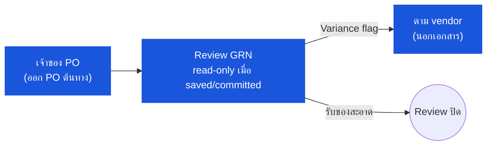

# ใบรับสินค้า (Goods Receive Note) — User Flow — Purchaser

> **At a Glance**
> **Persona:** Purchaser / Procurement Officer (+ subset Department Manager) &nbsp;·&nbsp; **โมดูล:** [good-receive-note](/th/inventory/good-receive-note) &nbsp;·&nbsp; **ขั้น workflow:** ได้รับแจ้งเมื่อ GRN เป็น `saved` หรือ `committed` บน PO ของตัวเอง — review อ่านอย่างเดียวของการรับเทียบกับ PO, ข้อมูล lot, ใบส่งของ; ตาม vendor (chase / replacement) สำหรับ variance &nbsp;·&nbsp; **สิทธิ์สำคัญ:** read-only บนเอกสาร GRN
> **persona นี้ทำอะไร:** Review GRN บน PO ของตัวเองสำหรับ variance การรับและขับเคลื่อนการแก้ไขฝั่ง vendor; ไม่เปลี่ยนสถานะเอกสาร GRN
> **แก้ไขในรอบนี้ (2026-07-15):** เวอร์ชันก่อนหน้าของหน้านี้อ้างอิงฟิลด์ `accepted_qty` (ไม่มีฟิลด์นี้อยู่ — ดู [01-data-model.md](./01-data-model.md)), กฎการแยกหน้าที่ที่บังคับใช้ในโค้ด (ยังไม่ยืนยัน — ไม่พบ guard ที่ตรงกัน) และ handoff Finance/three-way-match สำหรับ credit note (ยังไม่ยืนยัน — ดู [03-user-flow-finance.md](./03-user-flow-finance.md)) การแก้ไขอยู่ในเนื้อหาด้านล่าง

## 1. บทบาทในโมดูลนี้

Persona **Purchaser** ครอบคลุม **Purchaser / Procurement Officer** ที่ออก PO ต้นทางและ subset **Department Manager** ที่เป็นเจ้าของ cost-centre ที่ GRN post เข้า ภายในโมดูล GRN Purchaser เป็นผู้เข้าร่วมแบบ **review-only** — พวกเขา **ไม่** สร้าง GRN ที่ dock, **ไม่** บันทึกรายการบรรทัด (การ save คือสิ่งที่ post inventory และเลื่อน PO — ดู [03-user-flow-receiver.md](./03-user-flow-receiver.md)) และ **ไม่** commit Purchaser เปิดเอกสารในโหมด read เพื่อ review ข้อมูลการรับเทียบกับ PO ที่ตนเป็นเจ้าของ (`received_qty` เทียบ `order_qty`, ข้อมูล lot / expiry บน `tb_inventory_transaction_detail` ที่ link, ใบส่งของที่แนบ และ comment ใดๆ ที่ Receiver เขียน) และเป็นเจ้าของ **การตามฝั่ง vendor** สำหรับ variance ที่ flag — ตาม short-ship, ทดแทนสำหรับสินค้าผิด Department Manager subset review GRN ที่กระทบ cost-centre ของแผนกและยืนยันว่าสิ่งที่รับตรงกับที่สั่งสำหรับแผนก sub-persona ทั้งสองไม่เปลี่ยนสถานะเอกสาร GRN

**ยังไม่ยืนยันในรอบนี้:**
- **การแยกหน้าที่ (Receiver ≠ Purchaser):** การค้นหาทั่ว `good-received-note.service.ts` และ `good-received-note.logic.ts` สำหรับการตรวจ `buyer_id` cross-check ไม่พบอะไรเลย — ไม่พบโค้ดที่ห้ามเจ้าของ PO จาก save/commit GRN กับ PO ของตัวเองด้วย ตรงกับข้อสรุปเดียวกันที่ยืนยันแล้วสำหรับ `PO_AUTH_010` ของโมดูล PO ให้ถือว่านี่เป็นเจตนาควบคุม ไม่ใช่กฎที่บังคับใช้
- **ความคลาดเคลื่อนของราคาเทียบกับ vendor pricelist:** ไม่พบโค้ด lookup pricelist ภายในโมดูล GRN ในรอบนี้ (ดู [02-business-rules.md](./02-business-rules.md) `GRN_XMOD_008`) — การค้นหาทั่ว backend/frontend ของ GRN สำหรับ `pricelist` ให้ผลศูนย์รายการ
- **Handoff Finance / credit note สำหรับสินค้าเสียหายหรือความคลาดเคลื่อนของราคา:** ไม่พบฟีเจอร์ three-way match หรือ AP — ดู [03-user-flow-finance.md](./03-user-flow-finance.md)

### ตำแหน่ง Workflow (Purchaser highlighted)

```mermaid
graph LR
    poOwner["เจ้าของ PO<br/>(ออก PO ต้นทาง)"]:::current --> review["Review GRN<br/>read-only เมื่อ saved/committed"]:::current
    review -->|"Variance flag"| resolve["ตาม vendor<br/>(นอกเอกสาร)"]:::current
    review -->|"รับของสะอาด"| done(("Review ปิด"))
    classDef current fill:#1a56db,color:#fff,stroke:#1a56db;
```

### ตารางสิทธิ์ — Status × Action (Purchaser)

Purchaser เป็นผู้เข้าร่วมแบบ **review-only** ในโมดูล GRN — พวกเขาสังเกตทุกสถานะที่ไม่ใช่ `voided` และเป็นเจ้าของการแก้ไขฝั่ง vendor นอกเอกสาร

| Action | draft | saved | committed | voided |
|---|---|---|---|---|
| View GRN (read) | ❌ (ยังไม่มองเห็น) | ✅ | ✅ | ✅ (audit เท่านั้น) |
| Review `received_qty` เทียบ `order_qty` | ❌ | ✅ | ✅ | ❌ |
| Review ข้อมูล lot / expiry (read-only) | ❌ | ✅ | ✅ | ❌ |
| Review ใบส่งของ / หลักฐานที่แนบ | ❌ | ✅ | ✅ | ❌ |
| เพิ่ม comment | ❌ | ✅ | ✅ | ✅ |
| แก้ไข header (vendor, currency, บรรทัด) | ❌ | ❌ | ❌ | ❌ |
| Save / commit / void GRN | ❌ | ❌ | ❌ | ❌ |
| ขึ้น PO amendment / ยกเลิกบรรทัด | ❌ | ✅ (PO ตัวเอง ไม่ใช่ GRN) | ✅ (PO ตัวเอง ไม่ใช่ GRN) | ❌ |

## 2. Entry Point และ Flow หลัก

**Entry point:** ไม่มีเส้นทางใดที่เปิด GRN ในโหมดแก้ไขได้สำหรับ persona นี้

- **โมดูล PO → Receiving History tab** — เปิด PO ที่ `po_status ∈ {sent, partial, completed}`; list ทุก GRN (`saved` และ `committed`) ที่ reference PO นี้ผ่าน `tb_good_received_note_detail.purchase_order_detail_id` พร้อม running total ของ `received_qty` ต่อบรรทัด; คลิกแถวเพื่อเปิด GRN read view
- **โมดูล GRN → list กรองตาม PO ที่เป็นเจ้าของ** — list GRN ที่ scope ตาม PO ที่ Purchaser เป็นเจ้าของ

**Flow หลัก (review path, 5 ขั้นตอน):**

1. **เปิด GRN ในโหมด read** จาก Receiving History tab ของโมดูล PO หรือ list GRN header แสดง `doc_status`, `vendor_id`, `receipt_date`, currency; บรรทัดแสดง `order_qty`, `received_qty` และยอด pending คงเหลือบน PO ต้นทาง
2. **Review variance เทียบกับ PO** สำหรับแต่ละบรรทัด: เทียบ `received_qty` กับ `pending_qty` (`= order_qty − received_qty − cancelled_qty`) ณ ขณะ GRN ถูก save เปิด `tb_inventory_transaction_detail` ที่ link เพื่อตรวจหมายเลข lot และวันหมดอายุ และเปิด list attachment เพื่อดูใบส่งของ
3. **ตัดสินใจเส้นทางแก้ไข** ถ้าทุกบรรทัดสะอาด (`received_qty = pending_qty`): ไม่ต้องติดต่อ vendor ถ้าบรรทัดใดขาดหรือสินค้าผิด: ไปขั้นตอน 4
4. **ติดต่อ vendor** ขึ้น conversation ฝั่ง vendor ตาม variance type — ตาม short-ship สำหรับยอดคงเหลือที่ไม่สำเร็จ ขออนุญาต return-shipment สำหรับการส่งสินค้าผิด conversation อยู่นอกเอกสาร GRN (อีเมล, vendor portal, โทร) — ไม่พบ screen สื่อสารกับ vendor เฉพาะทางในโมดูล GRN
5. **บันทึกผลการแก้ไขบน activity log ของ GRN** (comment) บันทึกการตอบสนองของ vendor และถ้าเกี่ยวข้อง ขึ้น PO amendment เพื่อครอบคลุมปริมาณทดแทน เอกสาร GRN เอง **ไม่** ถูกแก้ไข

## 3. Decision Branch

- **รับของสะอาด** (`received_qty = pending_qty` ไม่มี Receiver-written variance comment): ไม่ต้องติดต่อ vendor บรรทัด PO เลื่อนโดยธรรมชาติตอน Receiver save (`sent → partial → completed`); ความเกี่ยวข้องของ Purchaser จบที่นี่
- **รับของขาด** (`received_qty < pending_qty`): ตาม vendor สำหรับยอดคงเหลือ PO source ยังที่ `po_status = partial` พร้อมยอดคงเหลือที่ไม่สำเร็จเปิดอยู่; shipment ถัดไปสร้าง GRN ที่สองกับ PO เดียวกัน ถ้า vendor ไม่สามารถส่งส่วนที่ขาดได้ ขึ้นการยกเลิกบรรทัด PO บน flow `[purchase-order](/th/inventory/purchase-order)`
- **สินค้าผิด** (การส่งของถูกปฏิเสธที่ dock — ไม่มีบรรทัด GRN บันทึกโดย Receiver): log ความผิดพลาดฝั่ง vendor บน activity log ของ PO และแก้ไข PO ด้วยบรรทัดทดแทนหรือปล่อย commitment ที่เปิดอยู่
- **การ review cost-centre ของ Department Manager** (subset Department Manager): แยกจาก variance — สำหรับทุก GRN ที่ post เข้า cost-centre ของแผนก review ว่าสิ่งที่รับตรงกับที่สั่งสำหรับแผนก **ยังไม่ยืนยัน:** ไม่พบ screen override หรือ signoff cost-centre allocation เฉพาะทางในซอร์สปัจจุบัน; บริบทแผนก/cost-centre อยู่ใน JSON array `dimension` ของ header (ดู [01-data-model.md](./01-data-model.md)) ไม่ใช่ฟิลด์ workflow ที่มีโครงสร้าง

## 4. Exit Point / Handoff

- **Review สะอาด** — ไม่มี variance ไม่ต้องติดต่อ vendor
- **Variance ถูกตามกับ vendor แล้ว** — Purchaser บันทึกการตอบสนองของ vendor บน activity log ของ GRN; shipment ทดแทน (ถ้ามี) กลับเข้า flow ของ Receiver ([03-user-flow-receiver.md](./03-user-flow-receiver.md)) และสร้าง GRN ของตัวเอง GRN เดิมไม่เปลี่ยนแปลง

## 5. แหล่งอ้างอิง

- ภาพรวม parent: [03-user-flow.md](./03-user-flow.md) — วงจรชีวิตทางการ 4 สถานะและตาราง handoff ข้าม persona
- Sibling: [03-user-flow-receiver.md](./03-user-flow-receiver.md) — persona ต้นทางที่การ save โพสต์การรับและ flag variance บนบรรทัด
- Sibling: [03-user-flow-finance.md](./03-user-flow-finance.md) — หน้าแก้ไข: เหตุผลที่ไม่พบ handoff three-way-match / credit note
- Sibling: [03-user-flow-audit-config.md](./03-user-flow-audit-config.md) — หน้าแก้ไข
- Sibling: [01-data-model.md](./01-data-model.md) — `tb_good_received_note_detail.purchase_order_detail_id` (link ที่ Receiving History tab ของ PO ใช้)
- Sibling: [02-business-rules.md](./02-business-rules.md) — กฎ validation และ posting ที่อ้างข้างต้น; `GRN_AUTH_010` (การแยกหน้าที่ — ทำเครื่องหมายว่ายังไม่ยืนยันในรอบนี้)
- Related: [purchase-order](/th/inventory/purchase-order) — โมดูลต้นทางที่ persona นี้เป็นเจ้าของ; ต้นทางของ `pending_qty`, `po_status` และ activity log
- `../carmen/docs/good-recive-note-managment/GRN-User-Experience.md` — แหล่ง carmen/docs สำหรับ persona Procurement Manager และ flow การจัดการ variance (ถือเป็นเจตนาการออกแบบ ไม่ใช่พฤติกรรมที่ยืนยันแล้ว สำหรับสิ่งใดที่เกินกว่า read-only review)
