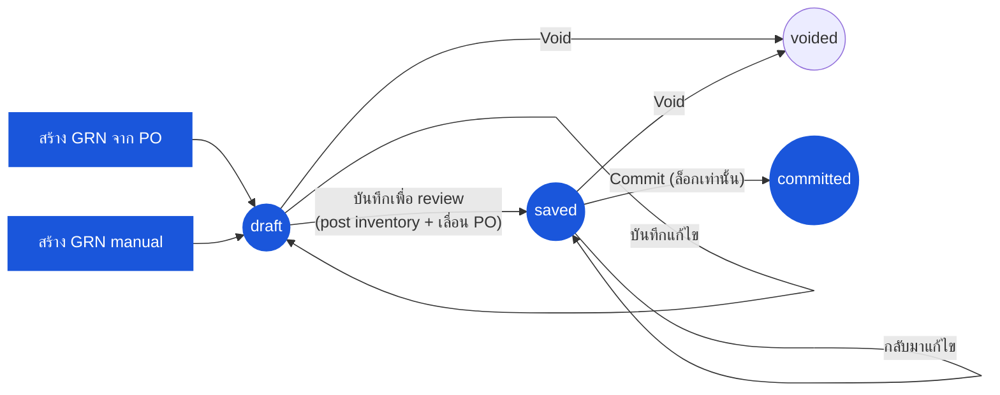

# ใบรับสินค้า (Goods Receive Note) — User Flow — Receiver

> **At a Glance**
> **Persona:** Receiver (Store Keeper / Receiving Clerk + Store / Inventory Manager) &nbsp;·&nbsp; **โมดูล:** [good-receive-note](/th/inventory/good-receive-note) &nbsp;·&nbsp; **ขั้น workflow:** `(none) → draft` (สร้างกับ PO หรือ manual) &nbsp;·&nbsp; `draft → saved` — **เหตุการณ์ posting** (การเพิ่ม inventory + การเขียน cost-layer + การเลื่อน `received_qty` ของ PO) &nbsp;·&nbsp; `saved → committed` (Inventory Manager — ล็อกเอกสาร; ไม่พบ posting เพิ่มเติม) &nbsp;·&nbsp; `draft / saved → voided` &nbsp;·&nbsp; **สิทธิ์สำคัญ:** สร้าง / แก้ draft (Store Keeper); commit (Inventory Manager)
> **persona นี้ทำอะไร:** บันทึกการรับที่ dock จับ lot / expiry บันทึกเพื่อ review (ซึ่ง post การเคลื่อนไหวสต๊อก) จากนั้น commit เพื่อล็อกเอกสาร
> **แก้ไขในรอบนี้ (2026-07-15):** เวอร์ชันก่อนหน้าของหน้านี้บรรยาย commit เป็นเหตุการณ์ posting, ฟิลด์ `accepted_qty` แยกจาก `received_qty` สำหรับประตู "quality inspection" ต่อบรรทัด, screen batch-commit, และ handoff Finance/AP ตอน commit ทั้งหมดนี้ไม่ตรงกับซอร์สปัจจุบัน — ดูการแก้ไขในเนื้อหาด้านล่างและ [02-business-rules.md](./02-business-rules.md) §1

## 1. บทบาทในโมดูลนี้

Persona **Receiver** ครอบคลุม **Store Keeper / Receiving Clerk** ที่ dock และ **Store Manager / Inventory Manager** ที่ดูแลการรับ Store Keeper เป็นเจ้าของ draft ที่แก้ไขได้ — พวกเขาสร้าง GRN กับ PO ต้นทาง (หรือ manual สำหรับการรับ ad-hoc) นับการส่งของจริงเทียบกับ PO และใบส่งของจากผู้ขาย บันทึก `received_qty` (และสำหรับ FOC bundle มี `foc_qty` แยกต่างหาก) ต่อเหตุการณ์รับ จับหมายเลข lot และวันหมดอายุผ่าน inventory transaction ที่ link (`tb_inventory_transaction_detail` เข้าจาก GRN detail_item ผ่าน `inventory_transaction_id`) แนบใบส่งของ และบันทึกเอกสารเพื่อ review **การบันทึก (save) คือขั้นตอน posting**: `GoodReceivedNoteLogic.save()` เขียนแถว `tb_inventory_transaction` สร้าง FIFO cost layer (หรือคำนวณ weighted average ใหม่) และเลื่อน `received_qty` (พร้อม `po_status`) ของบรรทัด PO ต้นทาง — ทั้งหมดก่อนที่ Inventory Manager จะแตะเอกสารด้วยซ้ำ Commit ที่ตามมา (`saved → committed`) ของ Inventory Manager เพียงเปลี่ยน `doc_status` และล็อกเอกสารจากการแก้ไขต่อ — ไม่พบผลกระทบต่อ inventory, PO หรือ GL เพิ่มเติมใน `commit()` ในซอร์สปัจจุบัน `voided` เข้าได้จาก `draft` หรือ `saved` โดย sub-persona ใดก็ได้พร้อมเหตุผล; endpoint `/void` ฝั่ง backend ไม่มีเงื่อนไข `doc_status` ของตัวเองนอกจาก "ยังไม่ voided" แต่ frontend แสดง action Void เฉพาะเมื่อ GRN ยังไม่ `committed`

**ยังไม่ยืนยัน / ตัดออกในรอบนี้:** ฟิลด์ `accepted_qty` ต่อบรรทัดที่แยกจาก `received_qty` (ขั้นตอน "quality inspection" ที่ Store Keeper บันทึกสิ่งที่รับมาเทียบกับสิ่งที่ผ่านการตรวจ) ไม่มีอยู่ทั้งใน schema หรือโค้ดแอปพลิเคชัน — การค้นหาทั่ว Prisma schema และซอร์สทั้ง frontend และ backend สำหรับ `accepted_qty` ให้ผลศูนย์รายการ ความคลาดเคลื่อนหรือการปฏิเสธในการรับของถูกบันทึกเพียงแค่กรอก `received_qty` ให้น้อยกว่าที่สั่ง; ไม่มีปริมาณการยอมรับแยกต่างหาก screen "batch commit" (Inventory Manager commit หลาย `saved` GRN พร้อมกัน) และ scheduled "end-of-period auto-commit" ก็ไม่พบใน backend เช่นกัน (ไม่มี batch endpoint ไม่มี cron job) — ให้ถือว่าทั้งสองเป็นเจตนาการออกแบบ ไม่ใช่พฤติกรรมที่ implement แล้ว การแยกหน้าที่ (Receiver ≠ Purchaser บน PO เดียวกัน) ก็ยังไม่ยืนยันเช่นกัน — ไม่พบการตรวจ `buyer_id` cross-check ใน `save()` หรือ `commit()`

### ตำแหน่ง Workflow (Receiver highlighted)

### ตารางสิทธิ์ — Status × Action with Sub-roles (Receiver)

Persona Receiver ครอบคลุมสอง sub-role: **Store Keeper / Receiving Clerk** (สร้างและแก้ GRN เจ้าของ `draft` และ `saved`) และ **Inventory Manager / Store Manager** (commit GRN, `saved → committed`) ทั้งสอง sub-role ทำงานบน GRN ข้ามทั้งเส้นทางสร้าง PO-sourced และ manual

| Action | draft | saved | committed | voided | Store Keeper | Inventory Manager |
|---|---|---|---|---|---|---|
| สร้าง GRN (จาก PO) | ✅ → สร้าง `draft` | ❌ | ❌ | ❌ | ✅ | ❌ |
| สร้าง GRN (manual) | ✅ → สร้าง `draft` | ❌ | ❌ | ❌ | ✅ | ❌ |
| แก้ไข header (vendor, currency, วันที่) | ✅ | ✅ | ❌ | ❌ | ✅ | ✅ |
| เพิ่ม / แก้บรรทัดและ detail_item | ✅ | ✅ | ❌ | ❌ | ✅ | ✅ |
| ใส่ `received_qty` ต่อเหตุการณ์รับ | ✅ | ✅ | ❌ | ❌ | ✅ | ✅ |
| บันทึก lot / expiry (ผ่าน inventory transaction ที่ link) | ✅ | ✅ | ❌ | ❌ | ✅ | ✅ |
| แนบใบส่งของ / หลักฐาน | ✅ | ✅ | ✅ | ✅ | ✅ | ✅ |
| บันทึกเพื่อ review (`draft → saved` post inventory) | ✅ | ❌ | ❌ | ❌ | ✅ | ❌ |
| กลับมาแก้ไข (ยังที่ `saved`) | ❌ | ✅ | ❌ | ❌ | ✅ | ✅ |
| Commit (`saved → committed` ล็อกเท่านั้น) | ❌ | ✅ | ❌ | ❌ | ❌ ตาม `GRN_AUTH_005` | ✅ |
| Void (`draft → voided` หรือ `saved → voided`) | ✅ | ✅ | ❌ | ❌ | ✅ (เอกสารตัวเอง) | ✅ |
| เพิ่ม comment | ✅ | ✅ | ✅ | ✅ | ✅ | ✅ |
| View (read only) | ✅ | ✅ | ✅ | ✅ | ✅ | ✅ |

> ℹ️ **Void ไม่มี guard สถานะฝั่ง server** endpoint `/void` (`GoodReceivedNoteService.voidGrnById`) ปฏิเสธเฉพาะการ void ซ้ำ GRN ที่ `voided` แล้ว — ไม่ตรวจ `doc_status` อื่นใด frontend ซ่อนปุ่ม Void เมื่อ `doc_status = committed` (`canEdit = !isCommitted && !isVoid` ใน `grn-header.tsx`) จึงเป็นข้อจำกัดฝั่ง client มากกว่ากฎที่ endpoint เองบังคับใช้; ทั้ง `/void` และ `/reject` ไม่ reverse inventory transaction, cost layer หรือการเลื่อน PO ใดๆ ที่เขียนไปแล้วตอน save ดู `GRN_POST_010`

## 2. Entry Point และ Flow หลัก

**Entry point:** สองเส้นทางที่เทียบเท่าสู่การสร้าง draft:

- **โมดูล GRN → Create GRN → From Purchase Order** — เลือก vendor จากนั้นเลือก PO เปิด (รองรับการรวมหลาย PO เมื่อ PO ที่เลือกทั้งหมดมีผู้ขายและสกุลเงินเดียวกัน; wizard สร้างปฏิเสธการเลือกที่มีสกุลเงินต่างกัน); แถว detail GRN populate ล่วงหน้าจาก `tb_purchase_order_detail` ด้วย `pending_qty` (`= order_qty − received_qty − cancelled_qty`) เป็น `received_qty` ที่แก้ได้เริ่มต้น
- **โมดูล GRN → Create GRN → Manual** — `doc_type = manual`; vendor, currency, exchange rate และวันที่รับใส่โดยตรง; ไม่มี `purchase_order_detail_id` เขียนบนบรรทัดใด ใช้สำหรับการรับฉุกเฉิน / ไม่มี PO

**Flow หลัก (happy path, 8 ขั้นตอน):**

1. **เปิด PO** (หรือเริ่มการรับ manual) ที่ dock พร้อมการส่งของจริง screen แสดง `order_qty` ของแต่ละบรรทัดและ `received_qty` / `cancelled_qty` ที่ running
2. **ยืนยันการส่งจริงเทียบกับ PO และใบส่งของจาก vendor** — จับคู่ใบส่ง / packing list กับบรรทัด PO นับกล่อง ระบุการส่งขาด การส่งเกิน หรือสินค้าผิด **ก่อน** เปิด GRN
3. **เริ่ม GRN** ระบบเขียน `tb_good_received_note` ที่ `doc_status = draft` (สถานะแก้ไขได้เริ่มต้น ไม่มีผลกระทบสต๊อกหรือ GL); ฟิลด์ header สืบทอดจาก snapshot PO (`vendor_id`, `currency_id`, `exchange_rate`) หรือใส่โดยตรงสำหรับการรับ manual
4. **ใส่ `received_qty` ต่อเหตุการณ์รับ** — สิ่งที่มาถึงจริงใน receiving UoM ส่วนขาดหรือการปฏิเสธถูกบันทึกเป็น `received_qty` ที่ต่ำกว่า (ไม่มีฟิลด์ปริมาณการยอมรับแยกต่างหาก)
5. **บันทึกหมายเลข lot และวันหมดอายุสำหรับสินค้าที่ติดตาม lot** ข้อมูล lot **ไม่** เก็บโดยตรงบนบรรทัด GRN — แถว `detail_item` ของ GRN link ไปยัง `tb_inventory_transaction` (ผ่าน `inventory_transaction_id`) ซึ่งลูก `tb_inventory_transaction_detail` บรรจุ `lot_no`, `expiry_date` และปริมาณต่อ lot หมายเลข lot สร้างอัตโนมัติในรูปแบบตายตัว `RC{YY}{MM}{ลำดับ 4 หลัก}` และเขียนทับด้วยมือได้
6. **แนบใบส่งของและหลักฐานสนับสนุน** — ใบส่ง, รูปกล่องเสียหาย Attachment ถูก scope กับ header GRN หรือบรรทัดแต่ละบรรทัด
7. **บันทึก GRN เพื่อ review** (`draft → saved`) นี่คือขั้นตอน posting: กฎระดับบรรทัดต้องผ่าน และเมื่อสำเร็จระบบเขียนแถว `tb_inventory_transaction` สร้าง FIFO cost layer (หรือคำนวณ weighted average ใหม่) และเลื่อน `received_qty` ของบรรทัด PO ต้นทาง — พลิก `po_status` ไปทาง `partial` หรือ `completed` เอกสารกลายเป็นมองเห็นโดย Inventory Manager เพื่อ review ขณะยังแก้ไขได้โดย Receiver ในฐานะเจ้าของ
8. **Inventory Manager commit** (`saved → committed`) นี่ล็อกเอกสารจากการแก้ไขต่อ **แก้ไขในรอบนี้:** ไม่พบผลกระทบต่อ inventory, PO หรือ GL เพิ่มเติมใน `commit()` เกินกว่าการเปลี่ยนสถานะ — ผลกระทบต่อสต๊อกและ PO เกิดขึ้นแล้วที่ขั้นตอน 7

## 3. Decision Branch

- **ส่งของขาด** (`received_qty < pending_balance`): บันทึก GRN ด้วยสิ่งที่มาถึงจริง PO source transition (หรือยังที่) `partial`; ยอดคงเหลือที่ไม่สำเร็จยังเปิดสำหรับ GRN ตามมากับ PO เดียวกัน Receiver อาจกลับเข้า flow นี้เมื่อ shipment ถัดไปมา
- **ส่งของเกิน** (`received_qty > pending_balance`): screen GRN gate รายการกับ over-receipt tolerance ของ tenant **ภายใน tolerance** — `received_qty` ยอมรับ การ save post และ `po_status` อาจพลิกเป็น `completed` ถ้าทุกบรรทัดรับครบแล้ว **นอก tolerance** — การ save ถูกปฏิเสธ; Receiver cap `received_qty` ที่ pending balance
- **สินค้าผิด** (การส่งไม่ตรงกับสินค้าใน PO): อย่าบันทึก GRN line สำหรับสินค้าผิด สำหรับการส่งผสม (สินค้าถูก + ผิด) บันทึก GRN เฉพาะบรรทัดที่ถูก
- **GRN บางส่วนตอนนี้ ส่วนที่เหลือทีหลัง**: บันทึก GRN วันนี้สำหรับสิ่งที่มาถึง; PO กลายเป็น `partial` เมื่อ shipment ถัดไปมา repeat flow หลักกับ PO เดียวกัน; GRN ที่ `committed` หลายใบอาจมีกับ PO เดียว
- **ปฏิเสธการส่งของก่อน save**: ถ้าการส่งของทั้งหมดถูกปฏิเสธที่ dock อย่าสร้าง GRN — ไม่มีอะไรต้องบันทึก ถ้ามี GRN ที่ `draft` หรือ `saved` อยู่แล้วและต้องยกเลิก ให้ void พร้อมเหตุผล (`draft → voided` หรือ `saved → voided` ไม่มีผลกระทบ inventory/GL สำหรับ GRN ที่ยัง `draft`; inventory และ PO ที่ post ไปแล้วของ GRN `saved` **ไม่** ถูกชดเชยกลับโดยการ void — ดูหมายเหตุด้านบน)

## 4. Exit Point / Handoff

ความเกี่ยวข้องของ Receiver บน GRN ที่กำหนดจบที่หนึ่งในสองขอบเขต:

- **Save สำเร็จ (`draft → saved`)** — inventory post แล้วและ PO เลื่อนแล้ว; เอกสารรอ Inventory Manager commit (ล็อก) **ยังไม่ยืนยัน:** ไม่พบ handoff ไปยัง Finance / AP ทั้งตอน save หรือ commit — ดู [03-user-flow-finance.md](./03-user-flow-finance.md) สำหรับการค้นหาที่ยืนยันเรื่องนี้
- **Commit สำเร็จ (`saved → committed`)** — เอกสารถูกล็อก การแก้ไขใด ๆ ตามมาผ่าน `tb_credit_note` กับ GRN (เอกสารจริงที่ implement แยกต่างหาก — ดู [purchase-order/credit-note](/th/inventory/purchase-order/credit-note)) หรือการปรับชดเชยใน [inventory-adjustment](/th/inventory/inventory-adjustment)
- **Variance flag บน saved หรือ committed GRN** — Purchaser อาจได้รับแจ้งผ่าน comment สำหรับการตาม vendor (ตาม short-ship, replacement); การประสานนี้เกิดขึ้นนอกเอกสาร (อีเมล, vendor portal) — ไม่พบ screen workflow variance เฉพาะทางในซอร์สปัจจุบัน

## 5. แหล่งอ้างอิง

- ภาพรวม parent: [03-user-flow.md](./03-user-flow.md) — วงจรชีวิตทางการ 4 สถานะ (`draft / saved / committed / voided`) บน `enum_good_received_note_status` แก้ไขในรอบนี้ให้แสดง save ไม่ใช่ commit เป็น transition ที่ posting
- `../carmen/docs/good-recive-note-managment/GRN-User-Experience.md` — แหล่ง carmen/docs สำหรับ persona Receiving Clerk และ Inventory Manager (model `DRAFT / PENDING_APPROVAL / APPROVED / REJECTED / CANCELLED` เก่าที่ใช้ที่นั่น **ไม่ใช่** ทางการ; หน้านี้ตาม Prisma enum 4 สถานะ)
- `../carmen/docs/good-recive-note-managment/GRN-Overview.md` — ภาพรวมโมดูล carmen/docs
- Sibling: [03-user-flow-purchaser.md](./03-user-flow-purchaser.md) — persona ปลายทางที่ review variance และประสานฝั่ง vendor
- Sibling: [03-user-flow-finance.md](./03-user-flow-finance.md) — หน้าแก้ไข: เหตุผลที่ไม่พบ handoff Finance / three-way-match หลัง save หรือ commit
- Sibling: [01-data-model.md](./01-data-model.md) — `enum_good_received_note_status` ทางการและ inventory-transaction linkage (`tb_good_received_note_detail_item.inventory_transaction_id` → `tb_inventory_transaction_detail.lot_no` / `expiry_date`) ใช้ในขั้นตอน 5
- Sibling: [02-business-rules.md](./02-business-rules.md) — กฎ validation และตาราง posting-rule ส่วน 5 ที่แก้ไขแล้ว (save คือเหตุการณ์ posting; commit เพียงล็อก)
- Related: [purchase-order](/th/inventory/purchase-order) — โมดูลต้นทาง; ตอน save GRN เลื่อน `tb_purchase_order_detail.received_qty` และอาจพลิก `po_status` (ไปทาง `partial` / `completed`)
- Related: [inventory](/th/inventory/inventory) — โมดูลปลายทาง; ตอน save `tb_inventory_transaction` บรรจุข้อมูล lot, expiry และ cost-layer และ on-hand เพิ่มด้วย `received_qty`
- Related: [costing](/th/inventory/costing) — การสร้าง FIFO / average-cost layer บนการเปลี่ยน `draft → saved`
