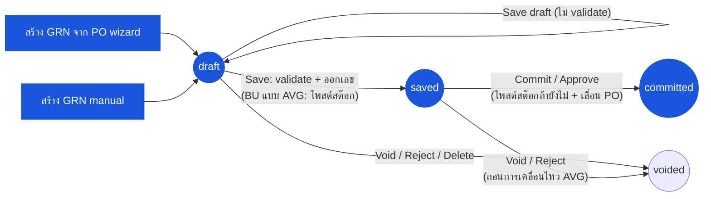

# ใบรับสินค้า (Goods Receive Note) — User Flow — Receiver

> **At a Glance**
> **Persona:** Receiver (Store Keeper / Receiving Clerk + Store / Inventory Manager) &nbsp;·&nbsp; **โมดูล:** [good-receive-note](/th/inventory/good-receive-note) &nbsp;·&nbsp; **ขั้น workflow:** `(none) → draft` (สร้างจาก PO wizard หรือด้วยมือ) &nbsp;·&nbsp; `draft → draft` (save draft ไม่ validate) &nbsp;·&nbsp; `draft → saved` (validate + ออก `grn_no`; **BU แบบ average โพสต์สต๊อกที่นี่**) &nbsp;·&nbsp; `saved → committed` — **เหตุการณ์โพสต์** (สต๊อกถ้ายังไม่ + เลื่อน `received_qty` ของ PO) &nbsp;·&nbsp; `draft / saved → voided` &nbsp;·&nbsp; **สิทธิ์สำคัญ:** `procurement.goods_received_note.create` / `.update` / `.commit` / `.delete` (`constant/permissions.ts:68-73`); gateway guard `goodReceivedNote.create|update|commit|delete|reject|approve`
> **persona นี้ทำอะไร:** บันทึกการรับที่ dock กรอกปริมาณที่รับ / FOC ราคาที่รับ และ expiry ต่อบรรทัด save แล้ว commit — ซึ่งโพสต์สต๊อก (BU แบบ FIFO) และเลื่อน PO
> **ตรวจสอบซ้ำ 2026-09-22:** เวอร์ชัน 2026-07-15 บอกว่า save โพสต์สต๊อกและ commit เพียงล็อก backend ได้ย้ายการโพสต์ไปที่ commit แล้ว (`c815d67ce`) และทำให้ BU แบบ average โพสต์สต๊อกตอน save (`7d6556dd0`) ยังไม่มีในโค้ด: `accepted_qty`, batch commit, auto-commit, handoff Finance/AP, segregation of duties

## 1. บทบาทในโมดูลนี้

Persona **Receiver** ครอบคลุม **Store Keeper / Receiving Clerk** ที่ dock และ **Store Manager / Inventory Manager** ที่กำกับดูแลการรับ Store Keeper เป็นเจ้าของ draft ที่แก้ไขได้ — สร้าง GRN กับ PO ต้นทาง (หนึ่งใบหรือมากกว่า หรือด้วยมือสำหรับการรับแบบ ad-hoc) นับการส่งของจริงเทียบกับ PO และใบส่งของจาก vendor บันทึก `received_qty` และ `foc_qty` ต่อเหตุการณ์รับ ราคาต่อหน่วยที่รับจริง (`received_price` — บังคับเมื่อใดก็ตามที่ `received_qty > 0`) และ `expired_at` ของ lot แนบใบส่งสินค้า และเลือกที่จะ **save draft** (เก็บตามที่เป็น ไม่ validate — `use-grn-form-actions.ts:400-411`) หรือ **save** เอกสาร (`draft → saved`) save รัน checklist ของ server — เพดาน deviation ต่อสินค้าบนปริมาณและราคาเทียบบรรทัด PO และเพดานที่ส่วนลดและภาษีต้องไม่เกินมูลค่าบรรทัด — และใช้เลข running จริง **บน business unit แบบ average save ยังโพสต์การเคลื่อนไหวสต๊อกด้วย** (`GoodReceivedNoteLogic.save()` → `postGrnLedger(…, atSave = true)`, `logic.ts:105-143`) เพื่อให้ average ของสินค้าขยับทันที; บน BU แบบ FIFO ไม่โพสต์ **commit** ของ Inventory Manager (`saved → committed`, `PATCH …/commit`; `POST …/approve` เป็นจุดเข้าเทียบเท่า) คือ **เหตุการณ์โพสต์**: `postReceipt()` เขียน ledger ถ้ายังไม่มี และเลื่อน junction row ของ PO, `tb_purchase_order_detail.received_qty` และ `po_status` (`logic.ts:228-270,500-570`) draft สามารถ commit ได้ในคลิกเดียว — UI ไล่เรียก `PATCH → /save → /commit` (`use-grn-form-actions.ts:486-513`) `voided` เข้าได้จาก `draft` หรือ `saved` ผ่าน **Void** (`DELETE …/void`) หรือ **Reject** (`POST …/reject`); ตอนนี้ server ปฏิเสธการ void GRN ที่ `committed` (`GRN_COMMITTED_NOT_VOIDABLE`) และบน BU แบบ average จะถอนการเคลื่อนไหวที่โพสต์ตอน save ออก เว้นแต่ lot ที่รับถูกเบิกไปแล้ว (`GRN_RECEIPT_ALREADY_CONSUMED`)

**ไม่มีในโค้ด (ตรวจซ้ำ 2026-09-22):** `accepted_qty` หรือสถานะการตรวจคุณภาพต่อบรรทัด (การขาดถูกบันทึกด้วยการกรอก `received_qty` ที่ต่ำกว่า); ฟิลด์หมายเลข lot แบบกรอกเอง (lot ถูกสร้างตอนโพสต์เป็น `<location_code><YYMM><run>`); batch commit หรือ scheduled auto-commit sweep; การตรวจ segregation-of-duties ระหว่างผู้ซื้อของ PO กับผู้รับ; over-receipt tolerance ระดับ tenant (เพดานคือ `tb_product.qty_deviation_limit` / `price_deviation_limit`)

### ตำแหน่ง Workflow (Receiver highlighted)

### ตารางสิทธิ์ — Status × Action (Receiver)

Persona Receiver ครอบคลุมสอง sub-role เชิงหน้าที่: **Store Keeper / Receiving Clerk** (สร้างและแก้ draft) และ **Inventory Manager / Store Manager** (commit) ในโค้ดไม่มีการแยก role — แต่ละ action ถูก gate ด้วย permission key เดียว และ `PATCH …/save` กับ `PATCH …/commit` ใช้ guard เดียวกัน (`goodReceivedNote.commit`, `good-received-notes.controller.ts:1369,1626`) ดังนั้นใครที่ save ได้ก็ commit ได้ด้วย

| Action | draft | saved | committed | voided | Permission key |
|---|---|---|---|---|---|
| สร้าง GRN (จาก PO wizard / manual) | ✅ → สร้าง `draft` | ❌ | ❌ | ❌ | `…create` |
| แก้ header / บรรทัด / extra cost (`PATCH …/:id`) | ✅ | ⚠️ UI ซ่อนการแก้ไข (`canEdit = !isCommitted && !isVoid && !isSaved`); server รับ PATCH แต่ endpoint detail ปฏิเสธ | ❌ | ❌ | `…update` |
| Save draft (ไม่ validate) | ✅ | ❌ | ❌ | ❌ | `…update` |
| Save (`draft → saved`; BU แบบ AVG โพสต์สต๊อก) | ✅ | ❌ (`GRN_ONLY_DRAFT_SAVABLE`) | ❌ | ❌ | `…commit` |
| Commit / Approve (`saved → committed` โพสต์ + เลื่อน PO) | ✅ ผ่านลูกโซ่ UI `PATCH → /save → /commit` | ✅ | ❌ (`GRN_ONLY_SAVED_COMMITTABLE`) | ❌ | `…commit` (`goodReceivedNote.approve` สำหรับ `/approve`) |
| Void (`DELETE …/void`) | ✅ | ✅ (ถอนการเคลื่อนไหว AVG; 409 ถ้าถูกใช้แล้ว) | ❌ (`GRN_COMMITTED_NOT_VOIDABLE`) | ❌ (`GRN_ALREADY_VOIDED`) | `…delete` |
| Reject (`POST …/reject` แจ้งเตือนผู้สร้าง) | ✅ | ✅ | ❌ | ❌ | `goodReceivedNote.reject` |
| Delete (soft) | ✅ | ❌ | ❌ | ❌ | `…delete` |
| แนบใบส่งสินค้า / comment | ✅ | ✅ | ✅ | ✅ | endpoint comment |
| View, export, print, แท็บ Stock Movement | ✅ | ✅ | ✅ (แท็บ Stock Movement แสดงเฉพาะที่นี่) | ✅ | `…view` |

> ℹ️ **guard ของ Void ตอนนี้อยู่ฝั่ง server แล้ว** `voidGrnById()` (`good-received-note.service.ts:2231-2270`) ปฏิเสธ GRN ที่ `committed` และ `voided`; UI ยังซ่อน Void / Commit เพิ่มเติมเมื่อ committed แล้ว (`grn-footer-action.tsx:27`) เนื่องจาก PO ถูกเลื่อนเฉพาะตอน commit การ void GRN ที่ `saved` จึงไม่มีวันทิ้งปริมาณ PO ค้างไว้ ดู `GRN_POST_010`

## 2. Entry Point และ Flow หลัก

**Entry point:** สองเส้นทางที่เทียบเท่าสู่การสร้าง draft:

- **list GRN → New → From Purchase Order** — เปิด wizard สองขั้นที่ `/procurement/goods-receive-note/from-po` (`from-po/step-select-vendor.tsx`, `from-po-content.tsx`): ขั้น 1 เลือก vendor ที่มี PO ที่รับได้ (`GET …/purchase-orders/grn/vendors`) ขั้น 2 เลือก PO ของ vendor นั้นได้หลายใบที่ `approved` / `sent_or_print` / `partial` (แถวที่ backend ทำเครื่องหมาย `can_use: false` แสดงเป็นสีเทา, `grn-po-usable.ts`); Confirm ปฏิเสธการเลือกที่มีสกุลเงินต่างกัน เก็บการเลือกใน `sessionStorage` (`grn-wizard-data`) และ navigate ไป `/procurement/goods-receive-note/new?doc_type=purchase_order` ที่บรรทัดถูกเติมล่วงหน้าด้วย `order_qty`, `order_price` และปริมาณคงเหลือของ PO เป็น `received_qty` ที่แก้ไขได้
- **list GRN → New → Manual** — `/procurement/goods-receive-note/new`; `doc_type = manual`; vendor, currency, exchange rate และ `grn_date` กรอกโดยตรง; ไม่มี `purchase_order_detail_id` และไม่มี `order_price` จึงไม่มีการตรวจ price-deviation

**Flow หลัก (happy path, 8 ขั้นตอน):**

1. **เปิด PO** (หรือเริ่มการรับ manual) ที่ dock พร้อมการส่งของจริง แต่ละบรรทัดที่เติมล่วงหน้าแสดง `order_qty`, `order_price` และปริมาณ pending
2. **ยืนยันการส่งจริงเทียบกับ PO และใบส่งของจาก vendor** — นับกล่อง ระบุการส่งขาด ส่งเกิน หรือสินค้าผิด **ก่อน** save
3. **สร้าง GRN** ระบบเขียน `tb_good_received_note` ที่ `doc_status = draft` พร้อมเลข placeholder `draft-{seq}` ประทับ `received_by_*` จากผู้เรียก และส่งการแจ้งเตือน "GRN created"; ไม่กระทบสต๊อกหรือ PO เอกสารที่ยังไม่ครบสามารถพักไว้ด้วย **Save draft** (ไม่ validate ฟอร์ม)
4. **กรอก `received_qty`, `foc_qty` และ `received_price` ต่อเหตุการณ์รับ** — สิ่งที่มาถึงจริงในหน่วยที่รับ (หน่วยต้องเป็นหนึ่งใน order unit ของสินค้า; conversion factor ถูก resolve ฝั่ง server) การขาดถูกบันทึกเป็น `received_qty` ที่ต่ำกว่า; frontend บังคับกรอกราคาต่อหน่วยเมื่อใดก็ตามที่มีปริมาณรับ
5. **บันทึกวันหมดอายุ** (`expired_at`) สำหรับบรรทัดที่เน่าเสียง่าย — ไม่บังคับและจงใจไม่ตรวจสอบเทียบกับ `grn_date` **ไม่มี** ฟิลด์หมายเลข lot: lot ถูกสร้างเมื่อการรับถูกโพสต์ (`<location_code><YYMM><run>`) และมองเห็นภายหลังบนแท็บ Stock Movement
6. **กรอก extra cost** (freight, duty…) บน panel extra-cost พร้อมโหมดการจัดสรร (`by_qty` = ส่วนเท่ากันต่อบรรทัด, `by_value` = ถ่วงตามปริมาณสต๊อก; `manual` ไม่จัดสรรอะไร) และแนบใบส่งสินค้า / รูปถ่าย (comment ระดับ header หรือระดับบรรทัด)
7. **Save** (`draft → saved`) server รัน checklist ของการ save — เพดาน deviation ปริมาณ / ราคาต่อสินค้า ส่วนลด / ภาษีไม่เกินมูลค่าบรรทัด — และออก `grn_no` จริง **BU แบบ average:** การเคลื่อนไหวสต๊อกถูกโพสต์ตอนนี้ (`grn_date` ต้องอยู่ในงวดเปิด) เพื่อให้ average ของสินค้าขยับทันที **BU แบบ FIFO:** ยังไม่มีอะไรโพสต์ PO ไม่ถูกแตะ เอกสารกลายเป็น read-only บน UI
8. **Commit** (`saved → committed`; **เหตุการณ์โพสต์**) server ตรวจงวดเปิดซ้ำ เขียน ledger ถ้ายังไม่มี (BU แบบ FIFO) เลื่อน junction row ของ PO และ `tb_purchase_order_detail.received_qty` (ปริมาณจ่ายเงินและ FOC) คำนวณ `po_status` ใหม่ (`partial` / `completed`) และล็อกเอกสาร จาก `draft` UI รันขั้น 7 และ 8 ต่อเนื่องกัน; หาก `grn_date` อยู่นอกงวดเปิดปัจจุบัน dialog commit จะถามว่าจะคงวันที่หรือย้ายไปวันแรกของงวด (`PeriodDateChoice`)

## 3. Decision Branch

- **ส่งของขาด** (`received_qty < order_qty`): ไม่มีวันถูกบล็อก (`percentOverage` ให้คะแนนการขาดเป็น 0) ตอน commit PO ต้นทางกลายเป็น (หรือคงอยู่ที่) `partial`; ยอดคงเหลือยังเปิดสำหรับ GRN ใบถัดไปกับ PO เดียวกัน
- **ส่งของเกิน / ราคาเกิน**: ควบคุมตอน **save** โดย product master — `qty_deviation_limit` (เปอร์เซ็นต์ที่เกิน `order_base_qty`) และ `price_deviation_limit` (เปอร์เซ็นต์ที่เกิน `order_price` ต่อหน่วยฐาน); `0` / `NULL` หมายถึงไม่มีเพดาน การเกินอย่างใดอย่างหนึ่งปฏิเสธ **ทั้งเอกสาร** ด้วย `GRN_DEVIATION_LIMIT_EXCEEDED` โดยแสดงทุกบรรทัดที่ผิด ไม่มี tolerance ระดับ tenant และไม่มีการ cap ที่ยอดคงเหลือของ PO `POST …/verify` ด้วย `verify_state = save` รายงานผลเดียวกันโดยไม่มีผลข้างเคียง
- **ส่วนลดหรือภาษีมากกว่าบรรทัด**: ถูกปฏิเสธตอน save (`GRN_DISCOUNT_EXCEEDS_LINE_AMOUNT` / `GRN_TAX_EXCEEDS_LINE_AMOUNT`)
- **วันที่รับอยู่นอกงวดสินค้าคงคลังที่เปิด**: การเคลื่อนไหวโพสต์ไม่ได้ — `GRN_DATE_OUTSIDE_OPEN_PERIOD` (422) ตอน save (BU แบบ average), commit หรือ approve; UI เสนอให้ย้าย `grn_date` เข้างวดปัจจุบันก่อน commit
- **สินค้าผิด** (การส่งไม่ตรงกับสินค้าใน PO): อย่ารับบรรทัดสำหรับสินค้าที่ผิด; สำหรับการส่งแบบผสม ให้รับเฉพาะบรรทัดที่ถูกต้อง
- **GRN บางส่วนตอนนี้ ส่วนที่เหลือทีหลัง**: commit GRN ของวันนี้สำหรับสิ่งที่มาถึง; PO กลายเป็น `partial` เมื่อของรอบถัดไปมาถึง ทำ flow ซ้ำกับ PO เดียวกัน; อาจมี GRN ที่ `committed` หลายใบกับ PO เดียว
- **ปฏิเสธการส่งของก่อนโพสต์**: ถ้าการส่งของทั้งหมดถูกปฏิเสธที่ dock อย่าสร้าง GRN `draft` ที่ไม่ต้องการลบได้; GRN ที่ `draft` หรือ `saved` void หรือ reject ได้พร้อมเหตุผล บน BU แบบ average การเคลื่อนไหวที่โพสต์ตอน save ถูกถอนออกอัตโนมัติ — เว้นแต่สต๊อกจากมันถูกเบิกไปแล้ว ในกรณีนั้น void ถูกปฏิเสธ (409) และ credit note / adjustment คือเส้นทางแก้ไข

## 4. Exit Point / Handoff

ความเกี่ยวข้องของ Receiver บน GRN ที่กำหนดจบที่หนึ่งในสองขอบเขต:

- **Save สำเร็จ (`draft → saved`)** — เอกสารมีเลขแล้วและ read-only; บน BU แบบ average สต๊อกอยู่ในคลังแล้ว รอ commit ไม่มี handoff Finance / AP — ดู [03-user-flow-finance.md](./03-user-flow-finance.md)
- **Commit สำเร็จ (`saved → committed`)** — สต๊อกถูกโพสต์ PO ถูกเลื่อน แท็บ Stock Movement แสดง lot และเอกสารถูกล็อก การแก้ไขใด ๆ ตามมาผ่าน `tb_credit_note` กับ GRN (หนึ่ง credit ต่อสินค้าต่อ GRN — ดู [purchase-order/credit-note](/th/inventory/purchase-order/credit-note)) หรือการปรับชดเชยใน [inventory-adjustment](/th/inventory/inventory-adjustment)
- **Variance flag บน saved หรือ committed GRN** — Purchaser อาจได้รับแจ้งผ่าน comment สำหรับการตาม vendor (ตาม short-ship, replacement); การประสานนี้เกิดขึ้นนอกเอกสาร (อีเมล, vendor portal) — ไม่พบ screen workflow variance เฉพาะทางในซอร์สปัจจุบัน

## 5. แหล่งอ้างอิง

- ภาพรวม parent: [03-user-flow.md](./03-user-flow.md) — วงจรชีวิตทางการ 4 สถานะ (`draft / saved / committed / voided`) บน `enum_good_received_note_status` ตรวจสอบซ้ำ 2026-09-22 (commit โพสต์; BU แบบ average โพสต์สต๊อกตอน save)
- `../carmen/docs/good-recive-note-managment/GRN-User-Experience.md` — แหล่ง carmen/docs สำหรับ persona Receiving Clerk และ Inventory Manager (model `DRAFT / PENDING_APPROVAL / APPROVED / REJECTED / CANCELLED` เก่าที่ใช้ที่นั่น **ไม่ใช่** ทางการ; หน้านี้ตาม Prisma enum 4 สถานะ)
- `../carmen/docs/good-recive-note-managment/GRN-Overview.md` — ภาพรวมโมดูล carmen/docs
- Sibling: [03-user-flow-purchaser.md](./03-user-flow-purchaser.md) — persona ปลายทางที่ review variance และประสานฝั่ง vendor
- Sibling: [03-user-flow-finance.md](./03-user-flow-finance.md) — หน้าแก้ไข: เหตุผลที่ไม่พบ handoff Finance / three-way-match หลัง save หรือ commit
- Sibling: [01-data-model.md](./01-data-model.md) — `enum_good_received_note_status` ทางการ, `expired_at` / `received_price` / `order_price` บนเหตุการณ์รับ และ link lot ฝั่ง ledger (`tb_inventory_transaction_detail.good_received_note_detail_item_id`) ที่ใช้ในขั้น 5
- Sibling: [02-business-rules.md](./02-business-rules.md) — กฎ validation (`GRN_VAL_002`, `006`–`008`) และตาราง posting-rule ส่วน 5 (commit โพสต์สต๊อกและ PO; BU แบบ average โพสต์สต๊อกตอน save)
- Related: [purchase-order](/th/inventory/purchase-order) — โมดูลต้นทาง; ตอน commit GRN เลื่อน `tb_purchase_order_detail.received_qty` และเปลี่ยน `po_status` เป็น `partial` / `completed`
- Related: [inventory](/th/inventory/inventory) — โมดูลปลายทาง; ledger บรรจุข้อมูล lot และ cost-layer และ on-hand เพิ่มด้วย `received_base_qty + foc_base_qty`
- Related: [costing](/th/inventory/costing) — การสร้าง FIFO / average cost-layer ตอน commit (หรือตอน save บน BU แบบ average) โดย landed cost รวม extra cost ที่จัดสรร
- Frontend: `../carmen-inventory-frontend-react/routes/procurement/goods-receive-note/` — `use-grn-form-actions.ts`, `grn-header.tsx`, `grn-footer-action.tsx`, `grn-stock-table.tsx`, `from-po/`
