# ใบรับสินค้า (Goods Receive Note) — User Flow

> **At a Glance**
> **โมดูล:** [good-receive-note](/th/inventory/good-receive-note) &nbsp;·&nbsp; **Persona:** Receiver (Store Keeper + Inventory Manager) &nbsp;·&nbsp; Purchaser (review-only) &nbsp;·&nbsp; Finance (หน้าแก้ไข — ไม่พบฟีเจอร์ที่ตรงกัน) &nbsp;·&nbsp; Audit / Config (หน้าแก้ไข — ไม่พบฟีเจอร์ที่ตรงกัน)
> **วงจรชีวิต workflow:** `draft → saved → committed` หรือ `voided` จาก `draft`/`saved` ตาม `enum_good_received_note_status` **ตรวจสอบซ้ำ 2026-09-22:** เหตุการณ์โพสต์คือ **`saved → committed`** (`commit()` / `approve()` → `postReceipt()`, `good-received-note.logic.ts:228-270`) — เขียน ledger บวกเลื่อน `received_qty` ของ PO บน business unit แบบ average ครึ่ง ledger เกิดขึ้นแล้วตอน **`draft → saved`** (`logic.ts:105-143`); ครึ่ง PO ไม่เคยเกิดตอนนั้น ไม่มี AP accrual ที่ใด; โมดูล GL ที่มีอยู่ตอนนี้ไม่ถูกเรียกจากโค้ด GRN
> **เจาะลึก view ต่อ persona ด้านล่างสำหรับรายละเอียดระดับ action**

## 1. ภาพรวม

หน้านี้เป็น **จุดเข้าภาพรวม** สำหรับชุด user-flow ของโมดูล `good-receive-note` Good Receive Note (GRN) คือเอกสารที่บันทึก **การรับสินค้าจริง** จาก vendor — แถว header ใน `tb_good_received_note` พร้อมบรรทัด `tb_good_received_note_detail` หนึ่งบรรทัดขึ้นไปและแถวเหตุการณ์รับลูก `tb_good_received_note_detail_item` GRN อาจถูกออกกับ Purchase Order ต้นทางหนึ่งใบหรือมากกว่าที่ `approved` / `sent_or_print` / `partial` (`doc_type = purchase_order` ผ่าน wizard **Create from PO** สองขั้นที่ `/procurement/goods-receive-note/from-po` ซึ่งส่งการเลือกไปยังฟอร์ม `/new` ผ่าน `sessionStorage`) หรือเป็นการรับด้วยมือที่ไม่มี PO (`doc_type = manual`) **ตรวจสอบซ้ำ 2026-09-22 (กลับการอ่านของ 2026-07-15):** ขั้นที่เปลี่ยนแปลงระบบคือ **`saved → committed`** — `commit()` (และคู่แฝด `approve()`) เขียนแถว inventory transaction และ FIFO / average cost layer ถ้ายังไม่มี แล้วเลื่อน junction row, `received_qty` และ `po_status` ของ PO ต้นทาง ทั้งหมดในธุรกรรมเดียว `draft → saved` ตรวจสอบเอกสาร (เพดาน deviation, เพดานส่วนลด/ภาษี) ออกเลข GRN จริง และ **เฉพาะบน business unit แบบ average** ยังโพสต์การเคลื่อนไหวสต๊อกล่วงหน้าเพื่อให้ average ของสินค้าขยับทันที **ยังไม่ยืนยัน / ไม่พบ:** การบันทึกใบกำกับผู้ขาย การโพสต์หนี้ AP three-way match — ไม่มีเลย; ส่วน `routes/accounting` ของ frontend เป็น mock data ให้ถือว่าข้อความลักษณะนี้บนหน้านี้หรือหน้าย่อยเป็นเจตนาการออกแบบ ไม่ใช่พฤติกรรมที่ implement แล้ว

ส่วน 2 ด้านล่างคือ **state machine ส่วนกลาง** — list ทางการของ transition ที่ legal ข้ามค่าทั้งสี่ของ `enum_good_received_note_status` (`draft`, `saved`, `committed`, `voided`) ไม่ขึ้นกับว่าใครเป็นผู้ทำ ไฟล์ต่อ persona (link จากส่วน 3) บรรยาย *เส้นทาง* ของ persona นั้นผ่าน state machine — entry point ของพวกเขา action ที่มี การตัดสินใจที่พวกเขาเผชิญ และ handoff ที่จบความเกี่ยวข้องของพวกเขา ส่วน 4 จากนั้นสรุป handoff ข้าม persona ที่เย็บเส้นทางแต่ละเส้นเข้าด้วยกัน อ่านภาพรวมนี้ก่อนเพื่อตั้งหลักวงจรชีวิต จากนั้นเจาะเข้าไฟล์ persona ที่ตรงกับบทบาทของคุณ

## 2. วงจรชีวิตของเอกสาร

สถานะเอกสาร GRN เก็บใน `tb_good_received_note.doc_status` และจำกัดที่สี่ค่าที่ประกาศใน `enum_good_received_note_status`: `draft` (แก้ไขได้ เก็บแบบไม่ครบได้ เลข placeholder `draft-{seq}`; ไม่กระทบสต๊อกหรือ PO), `saved` (ผ่านการตรวจสอบและมีเลขแล้ว; read-only บน UI; **บน BU แบบ average การเคลื่อนไหวสต๊อกถูกโพสต์แล้ว** บน BU แบบ FIFO ยังไม่มีอะไร), `committed` (**เหตุการณ์โพสต์** — เขียน ledger ถ้ายังไม่ได้เขียน เลื่อน PO; ล็อก; void ไม่ได้) และ `voided` (การยกเลิกจาก `draft` หรือ `saved`; การเคลื่อนไหวที่โพสต์ตอน save จะถูกถอนออก) transition ด้านล่างครอบคลุมการเคลื่อนไหวที่ถูกต้องระหว่างสถานะเหล่านี้ ผลปลายน้ำที่ขับโดยการรับของ (การเลื่อน `received_qty` ของ PO และความคืบหน้าของ `po_status`, การสร้าง FIFO / average cost-layer ใน [costing](/th/inventory/costing)) ถูกจัด catalog ไว้ใน [02-business-rules.md](./02-business-rules.md) ส่วน 5

```mermaid
stateDiagram-v2
    [*] --> draft: สร้างจาก PO wizard / manual (Receiver)
    draft --> draft: save draft (Receiver) — ไม่ validate
    draft --> saved: save (Receiver) — validate + ออกเลข; BU แบบ AVG โพสต์สต๊อก
    draft --> voided: void / reject
    draft --> [*]: delete (soft)
    saved --> committed: commit หรือ approve — โพสต์สต๊อก (ถ้ายังไม่) + เลื่อน PO
    saved --> voided: void / reject — ถอนการเคลื่อนไหว AVG (409 ถ้า lot ถูกใช้แล้ว)
    committed --> [*]
    voided --> [*]
```

**แก้ไข 2026-09-22:** diagram เวอร์ชัน 2026-07-15 แสดง save เป็น transition ที่โพสต์และ commit เป็นเพียงการล็อก; backend ย้ายการโพสต์ไปที่ commit (`c815d67ce`) แล้วทำให้ BU แบบ average โพสต์สต๊อกตอน save (`7d6556dd0`) "Batch commit", "auto-commit ตามกำหนด" และ "committed → voided" ยังคงไม่มีอยู่

| จากสถานะ | Action | ไปสถานะ | อนุญาตสำหรับ | เงื่อนไขก่อน |
| ---------- | ------ | -------- | ----------- | -------------- |
| `(none)` | create (กับ PO) | `draft` | `procurement.goods_received_note.create` | `doc_type = purchase_order`; PO ต้นทางที่ `po_status ∈ {approved, sent_or_print, partial}` ที่มี vendor และสกุลเงินเดียวกัน (wizard `from-po-content.tsx`); header populate จาก snapshot ของ PO; แต่ละบรรทัดบรรจุ `purchase_order_detail_id`, `order_qty`, `order_price` wizard เองไม่ได้สร้างอะไร — ฟอร์มที่ `/new` เป็นผู้สร้าง |
| `(none)` | create (manual) | `draft` | เดียวกัน | `doc_type = manual`; vendor / สกุลเงิน / `grn_date` กรอกโดยตรง; ไม่มี `purchase_order_detail_id` บนบรรทัดใด; `order_price = NULL` จึงไม่มีการตรวจ price-deviation |
| `draft` | save draft | `draft` | `…update` | **ไม่มีการ validate ฟอร์ม** (`use-grn-form-actions.ts:400-411`, `b67c6a38`): receiver ที่ยังไม่รู้ราคาหรือเลขใบกำกับสามารถเก็บสิ่งที่มีได้ server ยัง resolve reference และคำนวณฟิลด์เงินใหม่ |
| `draft` | save | `saved` | `…commit` (gateway guard `goodReceivedNote.commit` บน `PATCH …/save`) | zod schema ของ frontend ผ่าน (product, location, unit, unit price, invoice no/date, vendor, currency, ≥1 บรรทัด); checklist save ของ server ผ่าน (เพดาน deviation `GRN_VAL_006`/`007`, เพดานจำนวนเงิน `GRN_VAL_008`); ออก `grn_no` จริง **BU แบบ average:** `grn_date` ต้องอยู่ในงวดเปิด; โพสต์การเคลื่อนไหวสต๊อกพร้อม `posted_at_save` **BU แบบ FIFO:** ไม่เขียน ledger PO ไม่ถูกแตะ |
| `saved` | edit | `saved` | — (UI ซ่อนการแก้ไข; `PATCH` ยังรับฝั่ง server) | endpoint detail เป็น `draft`-only; การ PATCH header บน GRN สถานะ `saved` ของ BU แบบ average ที่เปลี่ยน qty/cost จะ void และโพสต์การเคลื่อนไหวใหม่ (`GRN_POST_013`) |
| `saved` | commit / approve — **เหตุการณ์โพสต์** | `committed` | `…commit` (`PATCH …/commit`) หรือ `goodReceivedNote.approve` (`POST …/approve`) | `doc_status = saved`; `grn_date` อยู่ในงวดเปิด (ตรวจซ้ำที่นี่แม้ตรวจตอน save แล้ว) `postReceipt()` เขียน ledger ถ้าไม่มีเหตุการณ์รับใดบรรจุ `inventory_transaction_id` เลื่อน `received_qty` ของ junction/detail ของ PO (+ FOC ที่รับ) และ `po_status` ประทับ `po_receiving_applied` `draft` สามารถ commit ได้ในคลิกเดียว — client รัน `PATCH → /save → /commit` และหากวันที่อยู่นอกงวดเปิด จะเสนอให้ย้ายไปวันแรกของงวด |
| `draft` | void / reject | `voided` | `…delete` (`DELETE …/void`) / `goodReceivedNote.reject` (`POST …/reject`) | ไม่มีอะไรต้องถอน reject แจ้งเตือนผู้สร้างด้วย |
| `saved` | void / reject | `voided` | เดียวกัน | **BU แบบ average:** การเคลื่อนไหวที่โพสต์ตอน save ถูก soft-delete ล้าง `inventory_transaction_id` ประทับ average ของสินค้าใหม่ — ปฏิเสธด้วย `GRN_RECEIPT_ALREADY_CONSUMED` (409) หาก lot ที่รับใดถูกเบิกไปแล้ว **BU แบบ FIFO:** ไม่มีอะไรต้องถอน PO ไม่ถูกแตะ (ไม่เคยเลื่อนก่อน commit) |
| `draft` | delete | (soft-deleted) | `…delete` (`DELETE …/:id`) | เฉพาะ `draft` (`GRN_POST_011`) |
| `voided` | (ไม่มี action ต่อ) | `voided` | — | Terminal การรับของครั้งต่อไปเป็น GRN ใหม่ |
| `committed` | (ไม่มี action ต่อ) | `committed` | — | Terminal `DELETE …/void` คืน `GRN_COMMITTED_NOT_VOIDABLE` การแก้ไขต้องใช้ `tb_credit_note` กับ GRN นี้ (หนึ่ง credit ต่อสินค้าต่อ GRN, `findFullyCreditedGrnIds`) หรือการปรับชดเชยใน [inventory-adjustment](/th/inventory/inventory-adjustment) ไม่มี batch commit, auto-commit หรือ post-commit reversal |

## 3. สารบัญ Persona

แต่ละ persona ด้านล่างมีไฟล์เจาะลึกที่บรรยาย entry point flow หลัก decision branch และ exit point ของพวกเขา slug ตรงกับบทบาท persona; คลิก link เพื่อเปิด view ต่อ persona

- [Receiver](./03-user-flow-receiver.md) — Receiver / Store Keeper (และ subset Inventory Manager ที่ทำ commit) สร้าง GRN ที่ dock กับ PO หรือด้วยมือ นับสินค้า บันทึกปริมาณที่รับ ปริมาณ FOC ราคาที่รับ และ expiry ต่อบรรทัด save (ตรวจสอบ + ออกเลข; BU แบบ average โพสต์สต๊อกที่นี่) และ — เมื่อได้รับอนุญาต — commit ซึ่งโพสต์สต๊อก (BU แบบ FIFO) และเลื่อน PO
- [Purchaser](./03-user-flow-purchaser.md) — เจ้าของ PO ต้นทาง Review ข้อมูลการรับเมื่อ GRN `saved` หรือ `committed` สอบสวน variance qty / price ที่ Receiver flag ประสานการแก้กับผู้ขาย (short-ship, substitution, return) Department Manager review cost-centre variance บน GRN ที่ flag เดียวกัน
- [Finance](./03-user-flow-finance.md) — **หน้าแก้ไข** ไม่พบฟีเจอร์ three-way match, การ post AP หรือบทบาท Finance สำหรับโมดูลนี้ในซอร์สปัจจุบัน
- [Audit / Config](./03-user-flow-audit-config.md) — **หน้าแก้ไข** ไม่พบ "GRN configuration console" เฉพาะทาง (ตัวแก้ไขรูปแบบเลข lot, panel RBAC, การเชื่อมต่อ integration) หรือเครื่องมือ lot-recall ในซอร์สปัจจุบัน

## 4. Handoff ข้าม Persona

ตารางด้านล่างจับช่วงที่ GRN ย้ายจากความรับผิดชอบของ persona หนึ่งไปอีก แต่ละ handoff ถูก anchor ที่สถานะเอกสาร ณ จุดถ่ายโอน **แก้ไขในรอบนี้:** แถวที่บรรยาย handoff ไปยัง Finance, sweep auto-commit ที่ schedule และ post-commit reversal ถูกทำเครื่องหมายว่ายังไม่ยืนยัน / ยังไม่ implement — ดู [03-user-flow-finance.md](./03-user-flow-finance.md) และ [03-user-flow-audit-config.md](./03-user-flow-audit-config.md) สำหรับการค้นหาที่ยืนยันเรื่องนี้

| จาก persona | Trigger | ไปยัง persona | สถานะเอกสารที่ handoff |
| ------------ | ------- | ---------- | ------------------------- |
| Receiver | Save (ตรวจสอบ + ออกเลข; BU แบบ average โพสต์สต๊อก) | Inventory Manager | `saved` (BU แบบ FIFO: ยังไม่โพสต์อะไร; BU แบบ average: โพสต์สต๊อกแล้ว PO ยังไม่เลื่อน; รอ commit) |
| Receiver / Inventory Manager | Commit / approve โพสต์การรับของและเลื่อน PO | [purchase-order](/th/inventory/purchase-order) (`po_status → partial / completed`), [inventory](/th/inventory/inventory) (แท็บ Stock Movement แสดงแล้ว), [costing](/th/inventory/costing) (layer พร้อม landed cost + `extra_cost_amount`) | `committed` (ไม่มี handoff Finance / GL — ดูหน้าแก้ไข Finance) |
| Receiver | บันทึกพร้อมหมายเหตุ variance บนบรรทัด (เช่น การรับของขาด) | Purchaser | `saved` หรือ `committed` (เขียน comment; การประสานฝั่ง vendor เป็นการทำนอกเอกสารด้วยมือ) |
| System Administrator | การเปลี่ยนแปลง RBAC / running-code ใช้แล้ว | persona ทั้งหมด | (ไม่มีการเปลี่ยนสถานะเอกสาร; กฎใหม่ใช้ prospectively สำหรับ GRN ต่อ ๆ ไป) |

## 5. แหล่งอ้างอิง

- `../carmen/docs/good-recive-note-managment/GRN-User-Experience.md` — แหล่ง user-experience ของ carmen/docs: คำอธิบาย persona และ flow ผู้ใช้หลัก (หมายเหตุ: model 5 สถานะเก่า `DRAFT / PENDING_APPROVAL / APPROVED / REJECTED / CANCELLED` **ไม่ใช่** ทางการที่นี่; หน้านี้ตาม Prisma enum 4 สถานะ)
- `../carmen/docs/good-recive-note-managment/GRN-User-Flow-Diagram.md` — diagram flow ของ carmen/docs (lifecycle, integration, mobile); reference สำหรับรูปร่างเท่านั้น ค่าสถานะปรับใหม่ให้ตรงกับ Prisma enum
- `../carmen/docs/good-recive-note-managment/GRN-Overview.md` — ภาพรวมโมดูล carmen/docs: วัตถุประสงค์ ขอบเขต ผู้ใช้ จุด integration
- Sibling: [01-data-model.md](./01-data-model.md) — `enum_good_received_note_status` ทางการ (enum 4 สถานะที่ใช้ในส่วน 2) และความแตกต่างของ carmen/docs (ส่วน 5 ของ data model)
- Sibling: [02-business-rules.md](./02-business-rules.md) ส่วน 5 — ผลกระทบ posting และประตู authorization ที่แต่ละแถวของส่วน 2 อ้างอิง (ตรวจสอบซ้ำ 2026-09-22: commit โพสต์สต๊อกและ PO; BU แบบ average โพสต์สต๊อกตอน save)
- โมดูลที่เกี่ยวข้อง: [purchase-order](/th/inventory/purchase-order) (PO ต้นทาง; commit เลื่อน `received_qty` ของ PO และเปลี่ยน `po_status` เป็น `partial`/`completed`), [inventory](/th/inventory/inventory) (ปลายทาง — inventory transaction คือที่ที่ข้อมูล lot และ cost-layer อยู่), [costing](/th/inventory/costing) (การสร้าง FIFO / average cost-layer ตอน commit หรือตอน save บน BU แบบ average), [inventory-adjustment](/th/inventory/inventory-adjustment) (การแก้ไขหลัง commit)
