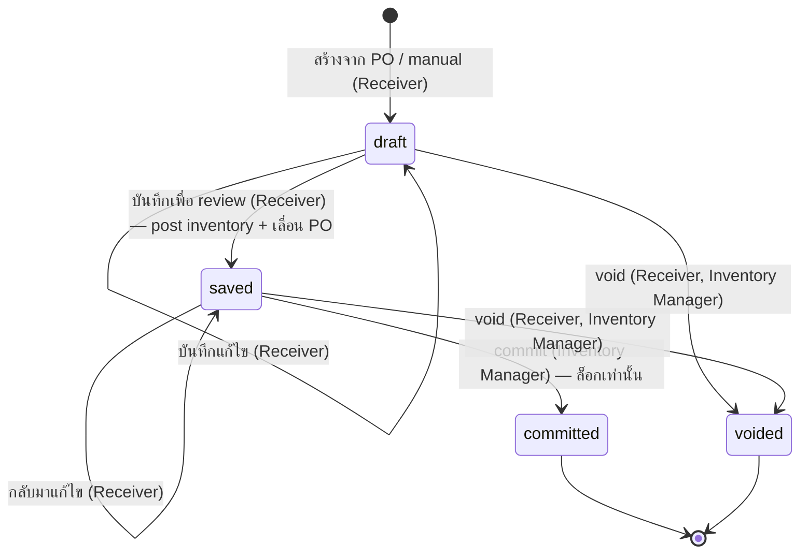

# ใบรับสินค้า (Goods Receive Note) — User Flow

> **At a Glance**
> **โมดูล:** [good-receive-note](/th/inventory/good-receive-note) &nbsp;·&nbsp; **Persona:** Receiver (Store Keeper + Inventory Manager) &nbsp;·&nbsp; Purchaser (review-only) &nbsp;·&nbsp; Finance (หน้าแก้ไข — ไม่พบฟีเจอร์ที่ตรงกัน) &nbsp;·&nbsp; Audit / Config (หน้าแก้ไข — ไม่พบฟีเจอร์ที่ตรงกัน)
> **วงจรชีวิต workflow:** `draft → saved → committed` หรือ `voided` จาก `draft`/`saved` ตาม `enum_good_received_note_status` **แก้ไขในรอบนี้:** เหตุการณ์ posting คือ `draft → saved` (การเพิ่ม inventory, การเขียน cost-layer, การเลื่อน `received_qty` ของบรรทัด PO ทั้งหมด fire ที่นั่น) — `saved → committed` เพียงล็อกเอกสาร ไม่พบ AP accrual ใดในซอร์สปัจจุบัน
> **เจาะลึก view ต่อ persona ด้านล่างสำหรับรายละเอียดระดับ action**

## 1. ภาพรวม

หน้านี้เป็น **จุดเข้าภาพรวม** สำหรับชุด user-flow ของโมดูล `good-receive-note` Goods Receive Note (GRN) คือเอกสารที่บันทึก **การรับสินค้าจริง** จากผู้ขาย — แถว header ใน `tb_good_received_note` พร้อมหนึ่งหรือมากกว่าหนึ่งบรรทัด `tb_good_received_note_detail` และแถวลูกเหตุการณ์รับ `tb_good_received_note_detail_item` GRN อาจขึ้นกับ Purchase Order ต้นทาง (`doc_type = purchase_order` เส้นทางมาตรฐาน) หรือเป็นการรับด้วยมือที่ไม่มี PO (`doc_type = manual` เช่นการซื้อ ad-hoc / ฉุกเฉิน) **แก้ไขในรอบนี้:** ขั้นตอนที่เปลี่ยนแปลงระบบคือ `draft → saved` — `GoodReceivedNoteLogic.save()` สร้างแถว inventory transaction เขียน FIFO / average-cost layer และเพิ่ม `received_qty` ของบรรทัด PO ต้นทาง ทั้งหมดในธุรกรรมเดียว `saved → committed` เพียงเปลี่ยน `doc_status` และล็อกเอกสาร — ไม่พบผลกระทบต่อ inventory หรือ PO เพิ่มเติมใน `commit()` **ยังไม่ยืนยัน:** ไม่พบฟีเจอร์การบันทึกใบกำกับผู้ขาย, การขึ้นภาระ AP หรือ three-way match (PO ↔ GRN ↔ invoice) ใน frontend หรือ backend ปัจจุบันเลย — การค้นหาทั่ว repo สำหรับ `three-way`, `vendor_invoice`, และ `tb_invoice` ให้ผลศูนย์รายการ (ตรงกับข้อสรุปเดียวกันที่ยืนยันแล้วในโมดูล `purchase-order`) ให้ถือว่าข้อความลักษณะนี้ในหน้านี้หรือหน้าย่อยเป็นเจตนาการออกแบบ ไม่ใช่พฤติกรรมที่ implement แล้ว

ส่วน 2 ด้านล่างคือ **state machine ส่วนกลาง** — list ทางการของ transition ที่ legal ข้ามค่าทั้งสี่ของ `enum_good_received_note_status` (`draft`, `saved`, `committed`, `voided`) ไม่ขึ้นกับว่าใครเป็นผู้ทำ ไฟล์ต่อ persona (link จากส่วน 3) บรรยาย *เส้นทาง* ของ persona นั้นผ่าน state machine — entry point ของพวกเขา action ที่มี การตัดสินใจที่พวกเขาเผชิญ และ handoff ที่จบความเกี่ยวข้องของพวกเขา ส่วน 4 จากนั้นสรุป handoff ข้าม persona ที่เย็บเส้นทางแต่ละเส้นเข้าด้วยกัน อ่านภาพรวมนี้ก่อนเพื่อตั้งหลักวงจรชีวิต จากนั้นเจาะเข้าไฟล์ persona ที่ตรงกับบทบาทของคุณ

## 2. วงจรชีวิตของเอกสาร

สถานะเอกสาร GRN เก็บใน `tb_good_received_note.doc_status` และจำกัดที่สี่ค่าที่ประกาศใน `enum_good_received_note_status`: `draft` (สถานะแก้ไขได้เริ่มต้น ไม่มีผลกระทบสต๊อกหรือ GL), `saved` (**เหตุการณ์ posting** — inventory เพิ่ม cost layer เขียน PO line เลื่อน; เอกสารยังแก้ไขได้), `committed` (เอกสารถูกล็อกจากการแก้ไขต่อ; ไม่พบผลกระทบ inventory/PO/GL เพิ่มเติม) และ `voided` (ยกเลิกบริหารจาก `draft` หรือ `saved`; UI ไม่เปิดให้ void เมื่อ `committed` แล้ว แม้ endpoint `/void` ฝั่ง backend เองจะไม่มีเงื่อนไขสถานะนอกจาก "ยังไม่ voided" — ดู [02-business-rules.md](./02-business-rules.md) `GRN_POST_010`) transition ด้านล่างครอบคลุมการเคลื่อนไหวที่ legal ระหว่างพวกมัน; อื่น ๆ ทั้งหมดถูกปฏิเสธโดย workflow engine ผลกระทบปลายทางที่ขับเคลื่อนการรับ (การเลื่อน `received_qty` ของ PO และความคืบหน้า `po_status` การสร้าง FIFO / average-cost layer ใน [costing](/th/inventory/costing)) fire ที่ transition `draft → saved` — ดู [02-business-rules.md](./02-business-rules.md) ส่วน 5 สำหรับกฎ posting

**แก้ไขในรอบนี้:** diagram และตารางเวอร์ชันก่อนหน้าแสดง `saved → committed` เป็น transition ที่ posting บวก "batch commit", "auto-commit ที่ schedule" และ edge "committed → voided post-commit reversal" ทั้งสี่อย่างไม่ตรงกับซอร์สปัจจุบัน — ดูการแก้ไขทีละแถวด้านล่าง

| จากสถานะ | Action | ไปสถานะ | อนุญาตสำหรับ | เงื่อนไขก่อน |
| ---------- | ------ | -------- | ----------- | -------------- |
| `(none)` | create (กับ PO) | `draft` | Receiver | `doc_type = purchase_order`; PO source มี `po_status ∈ {sent, partial}` และอย่างน้อยหนึ่งบรรทัดที่ pending; ฟิลด์ header populate จาก snapshot PO (`vendor_id`, `currency_id`, `exchange_rate`) |
| `(none)` | create (manual) | `draft` | Receiver | `doc_type = manual`; vendor / currency / วันที่รับใส่โดยตรง; ไม่มี `purchase_order_detail_id` เขียนบนบรรทัดใด |
| `draft` | save (edit) | `draft` | Receiver (เจ้าของ) | กฎ validation header และบรรทัดใน [02-business-rules.md](./02-business-rules.md) ส่วน 2 ผ่านตอน save (กฎ header) หรือเป็น warn-only (กฎบรรทัด); เอกสารยังแก้ไขได้ |
| `draft` | save for review — **เหตุการณ์ posting** | `saved` | Receiver (เจ้าของ) | กฎระดับบรรทัดผ่าน; บันทึกเหตุการณ์รับบนทุกบรรทัด **Trigger การเพิ่ม inventory, การเขียน cost-layer (FIFO / average ตามวิธี costing ของ tenant), และการเลื่อน `received_qty` ของบรรทัด PO** (`GoodReceivedNoteLogic.save()`) เอกสารยังแก้ไขได้โดย Receiver ในฐานะเจ้าของ |
| `saved` | resume edit | `saved` | Receiver (เจ้าของ) | เอกสารยังไม่ commit; แก้ไขเขียนใน place; ยังอยู่ที่ `saved` |
| `saved` | commit | `committed` | Inventory Manager (และ subset Receiver ที่ RBAC อนุญาต) | **แก้ไขในรอบนี้:** commit เพียงเปลี่ยน `doc_status`/`doc_version` และล็อกเอกสารจากการแก้ไขต่อ — ไม่พบผลกระทบต่อ inventory, PO หรือ GL ใน `GoodReceivedNoteLogic.commit()` เกินกว่าการเปลี่ยนสถานะ (ผลกระทบเหล่านั้นเกิดขึ้นตอน save แล้ว) |
| `draft` | void | `voided` | Receiver (draft ตัวเอง), Inventory Manager | ไม่มีผลกระทบ inventory หรือ GL — ยังไม่มีอะไร post |
| `saved` | void | `voided` | Receiver (เอกสารตัวเอง), Inventory Manager | ไม่ชดเชยอะไรกลับโดยอัตโนมัติ: inventory transaction, cost layer และการเพิ่ม `received_qty` ของ PO ที่เขียนไปแล้วตอน save **ไม่ถูก** ชดเชยโดย endpoint `/void` ในซอร์สปัจจุบัน (`voidGrnById()` เพียงตั้ง `doc_status = voided`) ให้ถือว่า "void ชดเชยการรับ" เป็นเรื่องที่ยังไม่ยืนยัน |
| `voided` | (ไม่มี action ต่อ) | `voided` | — | สถานะ terminal เอกสารที่ void เก็บไว้สำหรับ audit; การรับต่อไปต้องขึ้นเป็น GRN ใหม่ |
| `committed` | (ไม่มี action ต่อ) | `committed` | — | สถานะ terminal การแก้ไขต้องการ `tb_credit_note` กับ GRN นี้หรือการปรับชดเชยใน [inventory-adjustment](/th/inventory/inventory-adjustment); GRN เองยังล็อก **ยังไม่ยืนยัน:** "batch commit", "end-of-period auto-commit" และเส้นทาง "committed → voided post-commit reversal พร้อม elevated co-authorisation" ล้วนถูกบรรยายไว้ในตารางเวอร์ชันก่อนหน้า — ไม่พบ batch-commit endpoint, scheduled job หรือโค้ด reversal-workflow ใดใน `carmen-turborepo-backend-v2` ในรอบนี้ endpoint `/void` เองไม่มีเงื่อนไข `doc_status` นอกจาก "ยังไม่ voided" (ดู [02-business-rules.md](./02-business-rules.md) `GRN_POST_010`) แต่ frontend แสดง action Void เฉพาะเมื่อ `doc_status ∉ {committed, voided}` จึงเข้าถึงเส้นทางนี้ผ่าน UI ที่สร้างขึ้นปัจจุบันไม่ได้ |

## 3. สารบัญ Persona

แต่ละ persona ด้านล่างมีไฟล์เจาะลึกที่บรรยาย entry point flow หลัก decision branch และ exit point ของพวกเขา slug ตรงกับบทบาท persona; คลิก link เพื่อเปิด view ต่อ persona

- [Receiver](./03-user-flow-receiver.md) — Receiver / Store Keeper (และ subset Inventory Manager ที่ทำ commit) สร้าง GRN ที่ dock กับ PO หรือ manual นับสินค้า บันทึกข้อมูล lot / expiry (ผ่าน inventory transaction ที่ link ไม่ตรงบน GRN line) บันทึกเพื่อ review — ซึ่ง post inventory และเลื่อน PO — และเมื่อได้รับอนุญาต commit เพื่อล็อกเอกสาร
- [Purchaser](./03-user-flow-purchaser.md) — เจ้าของ PO ต้นทาง Review ข้อมูลการรับเมื่อ GRN `saved` หรือ `committed` สอบสวน variance qty / price ที่ Receiver flag ประสานการแก้กับผู้ขาย (short-ship, substitution, return) Department Manager review cost-centre variance บน GRN ที่ flag เดียวกัน
- [Finance](./03-user-flow-finance.md) — **หน้าแก้ไข** ไม่พบฟีเจอร์ three-way match, การ post AP หรือบทบาท Finance สำหรับโมดูลนี้ในซอร์สปัจจุบัน
- [Audit / Config](./03-user-flow-audit-config.md) — **หน้าแก้ไข** ไม่พบ "GRN configuration console" เฉพาะทาง (ตัวแก้ไขรูปแบบเลข lot, panel RBAC, การเชื่อมต่อ integration) หรือเครื่องมือ lot-recall ในซอร์สปัจจุบัน

## 4. Handoff ข้าม Persona

ตารางด้านล่างจับช่วงที่ GRN ย้ายจากความรับผิดชอบของ persona หนึ่งไปอีก แต่ละ handoff ถูก anchor ที่สถานะเอกสาร ณ จุดถ่ายโอน **แก้ไขในรอบนี้:** แถวที่บรรยาย handoff ไปยัง Finance, sweep auto-commit ที่ schedule และ post-commit reversal ถูกทำเครื่องหมายว่ายังไม่ยืนยัน / ยังไม่ implement — ดู [03-user-flow-finance.md](./03-user-flow-finance.md) และ [03-user-flow-audit-config.md](./03-user-flow-audit-config.md) สำหรับการค้นหาที่ยืนยันเรื่องนี้

| จาก persona | Trigger | ไปยัง persona | สถานะเอกสารที่ handoff |
| ------------ | ------- | ---------- | ------------------------- |
| Receiver | บันทึกเพื่อ review (post สต๊อกแล้ว) | Inventory Manager | `saved` (inventory เพิ่มแล้ว, PO เลื่อนแล้ว; รอ commit เพื่อล็อก) |
| Receiver / Inventory Manager | Commit ล็อกเอกสาร | — | `committed` (ไม่พบ handoff ข้ามโมดูลเพิ่มเติม — ดูหน้าแก้ไข Finance) |
| Receiver | บันทึกพร้อมหมายเหตุ variance บนบรรทัด (เช่น การรับของขาด) | Purchaser | `saved` หรือ `committed` (เขียน comment; การประสานฝั่ง vendor เป็นการทำนอกเอกสารด้วยมือ) |
| System Administrator | การเปลี่ยนแปลง RBAC / running-code ใช้แล้ว | persona ทั้งหมด | (ไม่มีการเปลี่ยนสถานะเอกสาร; กฎใหม่ใช้ prospectively สำหรับ GRN ต่อ ๆ ไป) |

## 5. แหล่งอ้างอิง

- `../carmen/docs/good-recive-note-managment/GRN-User-Experience.md` — แหล่ง user-experience ของ carmen/docs: คำอธิบาย persona และ flow ผู้ใช้หลัก (หมายเหตุ: model 5 สถานะเก่า `DRAFT / PENDING_APPROVAL / APPROVED / REJECTED / CANCELLED` **ไม่ใช่** ทางการที่นี่; หน้านี้ตาม Prisma enum 4 สถานะ)
- `../carmen/docs/good-recive-note-managment/GRN-User-Flow-Diagram.md` — diagram flow ของ carmen/docs (lifecycle, integration, mobile); reference สำหรับรูปร่างเท่านั้น ค่าสถานะปรับใหม่ให้ตรงกับ Prisma enum
- `../carmen/docs/good-recive-note-managment/GRN-Overview.md` — ภาพรวมโมดูล carmen/docs: วัตถุประสงค์ ขอบเขต ผู้ใช้ จุด integration
- Sibling: [01-data-model.md](./01-data-model.md) — `enum_good_received_note_status` ทางการ (enum 4 สถานะที่ใช้ในส่วน 2) และความแตกต่างของ carmen/docs (ส่วน 5 ของ data model)
- Sibling: [02-business-rules.md](./02-business-rules.md) ส่วน 5 — ผลกระทบ posting และประตู authorization ที่อ้างโดยแต่ละแถวของส่วน 2 (แก้ไขในรอบนี้ให้แสดง save ไม่ใช่ commit เป็นเหตุการณ์ posting)
- โมดูลที่เกี่ยวข้อง: [purchase-order](/th/inventory/purchase-order) (PO ต้นทาง; save เลื่อน `received_qty` ของ PO และอาจพลิก `po_status` ไปทาง `partial`/`completed`), [inventory](/th/inventory/inventory) (ปลายทาง — inventory transaction คือที่ที่ข้อมูล lot, expiry และ cost-layer อยู่), [costing](/th/inventory/costing) (การสร้าง FIFO / average-cost layer ตอน save), [inventory-adjustment](/th/inventory/inventory-adjustment) (การแก้ไขหลัง commit)
