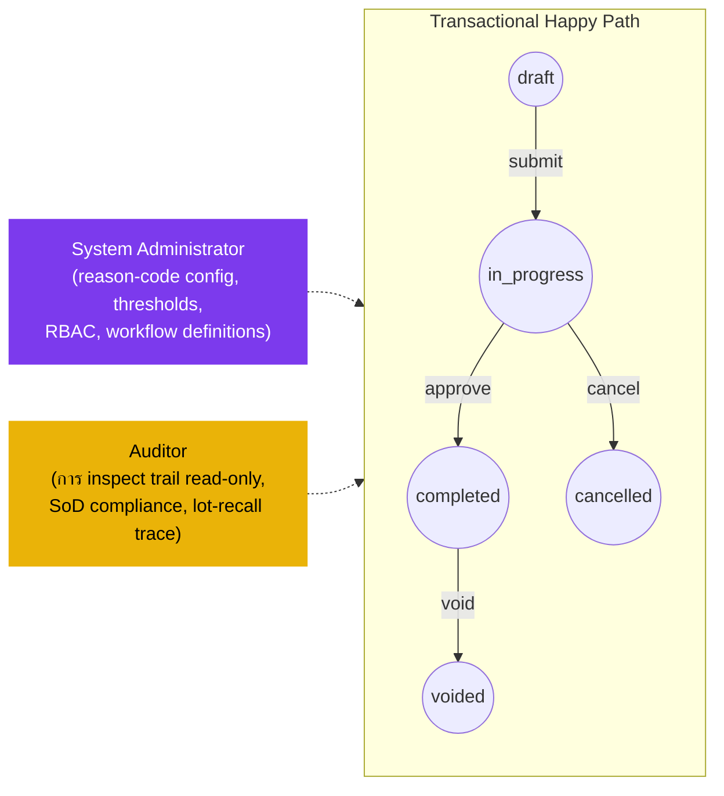

# การปรับสต๊อก (Inventory Adjustment) — User Flow — Audit & Config

> **At a Glance**
> **Persona:** Audit / Config (Auditor + System Administrator) &nbsp;·&nbsp; **โมดูล:** [inventory-adjustment](/th/inventory/inventory-adjustment) &nbsp;·&nbsp; **ขั้น workflow:** ผู้สังเกตการณ์นอกเส้นทาง — Sysadmin เป็นเจ้าของ list reason-code (`tb_adjustment_type`), thresholds, RBAC, period config; Auditor อ่านชุดข้อมูล adjustment เต็มรวม soft-deleted compensating reversals &nbsp;·&nbsp; **สิทธิ์สำคัญ:** Sysadmin กำหนดค่ากฎและ thresholds; Auditor read-only (ไม่เขียนสถานะเอกสาร)
> **persona นี้ทำอะไร:** กำหนดค่ากฎ / thresholds / reason codes ของโมดูล adjustment (Sysadmin); audit trails ของเอกสารและ chains compensating-reversal (Auditor)

### ตำแหน่งสัมพันธ์กับ transactional flow (ผู้สังเกตการณ์นอกเส้นทาง)

### Permission Matrix — V6 Action × Sub-persona (Audit / Config)

Sub-personas ทั้งสองเป็น non-transactional — พวกเขาไม่สร้าง, อนุมัติ, แก้ไข, post หรือ void เอกสาร adjustment งานของพวกเขาอยู่บนขอบเขต: การกำหนดค่า (System Administrator) และการ inspect read-only (Auditor) แถวมาจาก Section 2 (Entry Point and Primary Flow) ของไฟล์นี้; การอ้างอิงกฎหมายถึง [inventory-adjustment/02-business-rules](/th/inventory/inventory-adjustment/02-business-rules) § 4 (กฎ Authorization) และ § 5 (กฎ Posting)

| Action | System Administrator | Auditor |
|---|---|---|
| ดู `tb_stock_in` / `tb_stock_out` ทั้งหมด (สถานะใด ๆ รวม soft-deleted) | ✅ | ✅ (`ADJ_AUTH_009`) |
| ดู `workflow_history`, `last_action_by_id`, ลายเซ็นอนุมัติ | ✅ | ✅ (`ADJ_AUTH_009`) |
| ดู attachments (รูปถ่าย, รายงานความเสียหาย, recall notices) | ✅ | ✅ (`ADJ_AUTH_009`) |
| ดู inventory transaction และผลกระทบ cost-layer | ✅ | ✅ |
| Export ฟิลด์อ่อนไหว (cost-per-unit, vendor terms) | ✅ | ✅ (รูปแบบ audit การอนุมัติรอง) |
| CRUD บน `tb_adjustment_type` reason codes (`ADJ_AUTH_008`) | ✅ (`ADJ_AUTH_008`) | ❌ |
| Set `info.glAccount`, `info.requiresDocument`, `info.requiresQualityCheck` | ✅ (`ADJ_AUTH_008`) | ❌ |
| กำหนดค่า threshold ladder (auto-approve / Controller / Finance / SoD) | ✅ (`ADJ_AUTH_008`) | ❌ |
| จัดการ scope `tb_user_location` และ RBAC | ✅ | ❌ |
| Define stages `tb_workflow` สำหรับเอกสาร adjustment | ✅ | ❌ |
| การตรวจสอบ SoD compliance (`ADJ_AUTH_010` — receiver ≠ adjuster) | ❌ | ✅ — flag การละเมิดในรายงาน audit |
| ตรวจสอบ void chains (compensating reversal มีอยู่ตาม `ADJ_POST_004`) | ❌ | ✅ — orphaned voids เป็น findings audit hard-fail |
| Lot-recall trace (receipt → consumption → adjustment → void chain) | ❌ | ✅ — ผ่าน `tb_inventory_transaction` join ร่วม |
| สร้าง / อนุมัติ / void เอกสาร adjustment | ❌ (`ADJ_AUTH_008` — config เท่านั้น) | ❌ |

> ℹ️ **Scope การกำหนดค่า:** การเปลี่ยนแปลงของ System Administrator apply **prospective** — เอกสาร draft ใหม่และอนาคต inherit reason codes, thresholds และ workflow stages ที่อัปเดต เอกสาร `draft` / `in_progress` ที่มีอยู่คง config ที่ active ที่เวลา submit ของพวกเขา เอกสาร `completed` เป็น immutable และคง snapshot ของ reason-code ตาม [inventory-adjustment/01-data-model](/th/inventory/inventory-adjustment/01-data-model) § 3

> ℹ️ **Export ฟิลด์อ่อนไหว:** Single-Auditor export ของ cost-per-unit และข้อมูล vendor-pricelist ที่ join ต้องการขั้นการอนุมัติรองตามรูปแบบ audit นี่บังคับใช้ที่ platform layer ไม่ใช่ภายในโมดูล adjustment เอง

## 1. บทบาทในโมดูลนี้

Persona group **Audit / Config** พับสองบทบาทของ carmen/docs — **Auditor** และ **System Administrator** — ที่แชร์คุณสมบัติของการเป็น **non-transactional** ในโมดูล adjustment ทั้งคู่ไม่สร้าง, อนุมัติ, แก้ไข, post หรือ void เอกสาร adjustment; งานของพวกเขาอยู่บน **ขอบเขต** ของ transactional flow (การ inspect read-only, การกำหนดค่า master-data, integration)

**ความรับผิดชอบของ Auditor:**

- การเข้าถึง read-only ของเอกสาร `tb_stock_in` / `tb_stock_out` ทั้งหมดทั่ว property รวม soft-deleted (`deleted_at` non-null), `cancelled` และเอกสาร `voided` ตาม `ADJ_AUTH_009`
- การ inspect end-to-end ของ adjustment trail: reason codes (และ mappings `info.glAccount` ของพวกเขาที่เวลา post — ผ่าน cost-layer snapshot), attachments (รูปถ่าย, vendor RMAs, recall notices, supervisor sign-offs), ลายเซ็นอนุมัติ (`workflow_history`, `last_action_by_id`, `last_action_at_date`), journal entries (resolve ผ่าน inventory transaction → cost-layer ledger join → Finance subsystem) และ **void chains** (ลำดับ compensating-reversal ตาม `ADJ_POST_004`)
- การตรวจสอบ SoD compliance ตาม `ADJ_AUTH_010` — flag กรณีที่ผู้ใช้เดียวกันปรากฏเป็นทั้งผู้รับและ adjuster สำหรับ lot เดียวกันเหนือ SoD threshold
- Lot-recall trace รวมเอกสาร adjustment กับการรับ [good-receive-note](/th/inventory/good-receive-note) และ data การบริโภค / ผลต่างของ [store-requisition](/th/inventory/store-requisition) / [physical-count](/th/inventory/physical-count) ผ่าน `tb_inventory_transaction` join ร่วม
- การ Export ข้อมูลฟิลด์อ่อนไหว (cost-per-unit, vendor terms ผ่านเอกสารต้นทางที่ join) ภายใต้รูปแบบ audit การอนุมัติรอง

**ความรับผิดชอบของ System Administrator:**

- Master data CRUD บน `tb_adjustment_type` (reason codes) ตาม `ADJ_AUTH_008`:
    - `code`, `name`, `description`
    - `type` (`STOCK_IN` หรือ `STOCK_OUT`) — ตัวกรองทิศทาง
    - flag `is_active`
    - `info.glAccount` — การ map บัญชี GL ที่ขับเคลื่อน journal entry ของ post
    - `info.requiresDocument` — flag บังคับการ require attachment ตาม `ADJ_VAL_010`
    - `info.requiresQualityCheck` — flag ข้าม auto-approve และบังคับ Controller review
- การ tenant-config ของ threshold ladder: threshold auto-approve ของ Store-Keeper, Inventory Controller threshold, Finance threshold, SoD threshold ตาม `ADJ_AUTH_010`
- Mapping `tb_user_location` — scope Store Keepers ใดสามารถดำเนินการบน locations ใด
- RBAC: ผู้ใช้ใดถือบทบาท Store Keeper / Inventory Controller / Finance / Auditor / Sysadmin และพารามิเตอร์ threshold ของพวกเขา
- Endpoints integration — การเชื่อมต่อกับ Finance GL subsystem (สำหรับ journal entries ตอน post), document-management subsystem (สำหรับการ storage attachment), workflow engine
- นิยาม Workflow — แถว `tb_workflow` ที่อ้างอิงโดย `tb_stock_in.workflow_id` / `tb_stock_out.workflow_id` ที่ขับเคลื่อนการ route การอนุมัติ stage-by-stage

ทั้งสองบทบาทไม่สามารถ post / approve / void / edit เอกสาร adjustment โดยตรง การเปลี่ยนแปลงการกำหนดค่า apply prospective (เอกสาร `draft` / `in_progress` ที่มีอยู่ inherit config ที่เวลา submit; เอกสาร `completed` เป็น immutable) การดำเนินงาน Sysadmin อ่อนไหว (การเปลี่ยน GL-account ของ reason-code, การเปลี่ยน threshold) ถูก audit-log

## 2. จุดเข้าและ Primary Flow

### 2.1 Flow ของ Auditor

**จุดเข้า:** สี่ประตูเข้าสู่งาน Auditor บน adjustments

- **โมดูล Audit → รายงาน Adjustment Trail** — review ตามรอบ (โดยทั่วไปหลัง period-lock) ของ adjustments `completed` / `voided` ทั้งหมดในงวด Filters default: period, location, reason ขับเคลื่อนโดยรอบ external audit
- **โมดูล Audit → รายงาน SoD Compliance** — รันการตรวจสอบ SoD ข้าม `tb_stock_out` write-offs ทั้งหมดในงวด flag กรณีที่ผู้ใช้เดียวกันปรากฏเป็นทั้ง `tb_good_received_note.created_by_id` (ผู้รับ) และ `tb_stock_out.created_by_id` (adjuster) สำหรับ lot เดียวกันเหนือ SoD threshold
- **โมดูล Audit → Lot Recall Trace** — chain-of-custody query สำหรับ lot เฉพาะ: receipt (GRN) → consumption (SR / stock-out) → adjustments (stock-in / stock-out) → void chains
- **Reactive — การสืบสวนที่จุดชนวนโดย Finance หรือ external audit** — drill เข้าเอกสารเฉพาะ, งวด, location หรือผู้ใช้

**Primary flow ของ Auditor (Adjustment Trail review สำหรับ audit window, 7 ขั้น):**

1. **เปิดรายงาน Adjustment Trail** โมดูล Audit → Adjustment Trail → `<ช่วงงวด>` รายงาน aggregate: total stock-in cost (งวด), total stock-out cost (งวด), ตาม reason, ตาม location, ตาม department, ตามผู้ใช้
2. **Filter ไปยังผู้สมัคร anomaly** Apply filters สำหรับ high-cost-impact, repeat-offender users, repeat-offender locations, void chains, เอกสารที่ SoD-flag
3. **Drill เข้าเอกสารเฉพาะ** สำหรับแต่ละผู้สมัคร detail view แสดง chain เต็ม: header (ผู้สร้าง, ผู้อนุมัติ, reason, location, department), บรรทัด (product, qty, lot, cost), attachments (download เป็น evidence pack), `workflow_history` (การเปลี่ยน stage-by-stage ด้วย actor / timestamp), แถว `tb_inventory_transaction` ที่เกิดขึ้นพร้อมผลกระทบ cost-layer และ (สำหรับเอกสารที่ post) journal entries GL
4. **ตรวจสอบลายเซ็นอนุมัติ** Cross-check ว่าเอกสารดำเนินตาม threshold ladder อย่างถูกต้อง: ต่ำกว่า threshold auto-approved, เหนือ threshold Controller-approved, เหนือ Controller-threshold Finance-approved เอกสารที่ route ผิด (เช่น เหนือ threshold auto-approved เนื่องจากช่อง threshold-config ที่เวลา submit) ถูก flag
5. **ตรวจสอบ SoD compliance** สำหรับแต่ละ write-off ขนาดใหญ่ (เหนือ SoD threshold), ยืนยันว่า adjuster ไม่ใช่ผู้รับของ lot ตาม `ADJ_AUTH_010` การละเมิด flag ด้วยคู่ที่ผิด (IDs ผู้รับ / adjuster)
6. **ตรวจสอบ void chains** สำหรับแต่ละเอกสาร `voided`, ยืนยันว่า compensating reversal มีอยู่ตาม `ADJ_POST_004` (มองหา `tb_stock_in` / `tb_stock_out` ที่จับคู่ด้วย `info.voidsAdjustmentId = <original>`) Orphaned voids (สถานะ `voided` โดยไม่มี compensating reversal) ถูก flag
7. **Compile รายงาน audit** Export trail (พร้อม attachments ที่ authorize) Findings ติดตามใน workflow รายงาน audit นอกโมดูล adjustment

**Flow รอง Auditor — Lot Recall Trace (4 ขั้น):**

1. **เปิดหน้าจอ Lot Recall Trace** กรอก `lot_no` และ `product_id`
2. **Forward trace** การเคลื่อนไหวทั้งหมดที่บริโภคจาก lot: SR issues (ผ่าน [store-requisition](/th/inventory/store-requisition) join), stock-out write-offs (`tb_stock_out_detail` join ผ่าน `current_lot_no` บนฝั่ง inventory), การปรับปริมาณ credit-note, transfer-outs
3. **Backward trace** GRN ต้นทาง (หรือ compensating reversal สำหรับ lot ที่ stock-in introduce) — การรับที่สร้างแถว cost-layer แรกของ lot
4. **Render chain-of-custody** ทั้งสองทิศทางในรายงานเดียว — วันที่รับ, ผู้รับ, การเคลื่อนไหวปลายน้ำทั้งหมดพร้อมวันที่ / actors / qtys / ผลกระทบต้นทุน ไม่มี write operations; read-only

### 2.2 Flow ของ System Administrator

**จุดเข้า:** สี่ประตูเข้าสู่งานการกำหนดค่า Sysadmin สำหรับ adjustments

- **โมดูล Admin → Adjustment Types** — CRUD บน `tb_adjustment_type` reason codes Exercise โดย E2E spec `031-adjustment-type.spec.ts`
- **โมดูล Admin → Thresholds** — หน้าจอ tenant-config สำหรับ threshold ladder (Store-Keeper auto-approve, Inventory Controller, Finance, SoD)
- **โมดูล Admin → RBAC** — mappings ผู้ใช้ → role, การกำหนด scope ตาม `tb_user_location`, การ override พารามิเตอร์ threshold ต่อผู้ใช้ / แผนก
- **โมดูล Admin → Workflows** — นิยาม `tb_workflow` สำหรับเอกสาร adjustment (การ route การอนุมัติ stage-by-stage)

**Primary flow ของ Sysadmin (เพิ่ม reason code adjustment-type ใหม่, 7 ขั้น):**

1. **เปิดหน้าจอ admin Adjustment Types** โมดูล Admin → Master Data → Adjustment Types → New
2. **กรอกข้อมูล reason code** `code` (เช่น `INSURANCE_WRITE_OFF`), `name` (ชื่อแสดง), `description`, `type` (`STOCK_OUT` สำหรับ write-offs), `is_active = true`
3. **Set JSON `info`** ฟิลด์สำคัญ:
    - `glAccount`: บัญชี GL expense / loss สำหรับ reason (เช่น `6535 — Insurance-claimable Losses`)
    - `requiresDocument`: โดยทั่วไป `true` สำหรับ insurance-claimable losses (ต้องการการอ้างอิง claim / รูปถ่าย)
    - `requiresQualityCheck`: โดยทั่วไป `true` (ข้าม auto-approve เพื่อบังคับ Controller review)
4. **Save** Server validate `ADJ_VAL_001`-equivalent (code uniqueness บน `tb_adjustment_type`), `info.glAccount` resolve ไปยังบัญชี GL ที่ valid, code-and-name ไม่ว่าง
5. **Audit log การอนุมัติ Sysadmin** การเปลี่ยนแปลงบันทึกใน audit log ของ platform (แยกจาก workflow history ของ adjustment) — actor, timestamp, before / after JSON
6. **Communicate ไปยังผู้ใช้** Reason code ใหม่พร้อมใช้ทันทีใน picker Store Keeper / Controller / Finance สำหรับเอกสารใหม่ (draft / in-progress documents ที่มีอยู่คง reason เดิม) การอัปเดต documentation นอกระบบ
7. **Backfill (หายาก)** ถ้าชุด adjustments ประวัติที่ mis-classify ก่อนหน้านี้ควร re-classify ภายใต้ reason ใหม่ นั่นต้องการรอบ void + compensating-reversal บนแต่ละเอกสารที่ได้รับผลกระทบ — Finance-coordinated, ไม่ใช่ mass-update ของ Sysadmin

**Flow รอง Sysadmin — การเปลี่ยน Threshold:**

เปลี่ยน thresholds auto-approve / Controller / Finance / SoD Audit-logged Apply prospective ที่เวลา submit — เอกสารที่อยู่ที่ `in_progress` แล้วคงการ route threshold ที่พวกเขาเข้ามาด้วย; submits ใหม่ใช้ threshold ใหม่

## 3. การตัดสินใจ

### Auditor

- **Soft-fail vs hard-fail บน audit findings** Soft-fail (บันทึกใน audit report, ไม่ใช่การละเมิดการควบคุม): outliers cost-anomaly, reason-code mismatches กับหลักฐานที่ Controller อาจ rationalise Hard-fail (การละเมิดการควบคุม, รายงานไปยัง compliance): การละเมิด SoD, orphaned void chains, ลายเซ็นอนุมัติที่ขาดบน above-threshold posts, การ post เข้างวด closed (ไม่ควรเกิดหลัง `ADJ_VAL_011` แต่ instances ประวัติอาจปรากฏ)
- **Export ฟิลด์อ่อนไหว — การอนุมัติรอง** Export ข้อมูล cost-per-unit และ vendor-pricelist ที่ join ต้องการการอนุมัติ Auditor ที่สองตามรูปแบบ audit; single-Auditor export ถูกจำกัด
- **Scope ของ recall trace** จำกัดถึงประวัติของ lot; การ trace ข้าม lot (เช่น lots ทั้งหมดจาก vendor) คือ query ต่างที่ platform รองรับแต่ถือว่าเป็น audit object ต่าง

### System Administrator

- **เพิ่ม reason vs แก้ไขที่มีอยู่** เพิ่ม reason ใหม่สำหรับ business cases ใหม่ (insurance claim, write-off category ใหม่) แก้ไขที่มีอยู่เฉพาะสำหรับการ clarify (rename, การอัปเดต description, การแก้ไข `info.glAccount`); ไม่ repurpose reason ที่มีอยู่เลย (จะ corrupt การรายงานประวัติ)
- **การเปลี่ยน GL-account บน active reason** Forward-only — เอกสารที่ post แล้วที่มีอยู่คง mapping เดิมผ่านรูปแบบ snapshot cost-layer Sysadmin ต้องประสานกับ Finance เพื่อให้แน่ใจว่า mapping ใหม่สอดคล้องกับการเปลี่ยน chart-of-accounts (เช่น การ restructure แผนก)
- **Scope การเปลี่ยน threshold** Tenant-wide (global) vs department-specific vs user-specific (override) User-specific overrides สงวนสำหรับกรณีแคบ (เช่น Store Keeper เฉพาะที่ trust ด้วย auto-approve threshold สูงกว่า); department-specific เป็น scope ทั่วไป
- **การ deactivate reason** `is_active = false` ซ่อน reason จาก picker ของเอกสารใหม่แต่ไม่ทำให้เอกสารประวัติ invalid Soft-delete (`deleted_at`) เข้มกว่า — ใช้เมื่อ reason ถูกสร้างผิดและไม่ควรปรากฏในการรายงาน; หายาก

## 4. จุดออก / Handoffs

การมีส่วนร่วมของ persona Audit / Config บน adjustment / การกำหนดค่าที่กำหนดสิ้นสุดที่ขอบเขตต่อไปนี้:

- **Auditor — read-only review เสร็จ** Findings บันทึกใน audit report; ไม่มีการเปลี่ยนสถานะบนเอกสาร adjustment ใด ๆ Handoffs เป็น out-of-band — ไปยัง Compliance / Finance / Internal Audit committee ไม่กลับเข้าโมดูล adjustment
- **Sysadmin — การกำหนดค่า save** แถว `tb_adjustment_type` ใหม่ / อัปเดต, การเปลี่ยน threshold, การเปลี่ยน RBAC, การเปลี่ยน workflow Apply prospective ที่ submit; เอกสาร in-flight ที่มีอยู่คง config เดิม ไม่มี handoff สำหรับการกำหนดค่าเอง; personas ปลายน้ำ (Store Keeper / Controller / Finance) inherit ที่ submit / approval ถัดไป
- **Sysadmin — การขอ backfill** เมื่อข้อผิดพลาดการกำหนดค่าถูกค้นพบ post-hoc ที่ต้องการการแก้ไขประวัติ (หายาก) Sysadmin ประสานกับ Finance / Inventory Controller เพื่อสร้างรอบ void + compensating-reversal ที่แก้ไขตาม `ADJ_POST_004` — แต่ Sysadmin ไม่ริเริ่มเอกสารเหล่านั้นโดยตรง

## 5. แหล่งอ้างอิง

- ภาพรวม parent: [03-user-flow.md](./03-user-flow.md) — วงจรชีวิตเอกสาร canonical และตาราง handoff ข้าม persona (การเปลี่ยนการกำหนดค่า Sysadmin → ทุก personas; Auditor read-only review)
- Sibling: [03-user-flow-store-keeper.md](./03-user-flow-store-keeper.md) — Sysadmin กำหนดค่า reasons `tb_adjustment_type` และ scope `tb_user_location` ที่ Store Keeper เลือกจาก
- Sibling: [03-user-flow-inventory-controller.md](./03-user-flow-inventory-controller.md) — Sysadmin กำหนดค่า Controller threshold; Auditor review ประวัติการอนุมัติของ Controller สำหรับ findings SoD และ reason-code-mismatch
- Sibling: [03-user-flow-finance.md](./03-user-flow-finance.md) — Sysadmin กำหนดค่า Finance threshold และ mappings `info.glAccount` ที่ Finance ตรวจสอบ; Auditor review trail adjustment ปลายงวดที่ Finance sign-off
- Sibling: [01-data-model.md](./01-data-model.md) — รูปทรง `tb_adjustment_type` (เป้า CRUD ของ Sysadmin), `tb_user_location` (เป้า scoping ของ Sysadmin), reference `tb_workflow`, JSON `workflow_history` (เป้าอ่านหลักของ Auditor)
- Sibling: [02-business-rules.md](./02-business-rules.md) — `ADJ_AUTH_008` (scope การกำหนดค่า Sysadmin), `ADJ_AUTH_009` (scope การอ่าน Auditor), `ADJ_AUTH_010` (SoD — เป้าการตรวจสอบหลักของ Auditor), `ADJ_VAL_002` (การจับคู่ทิศทาง reason — ข้อจำกัดการออกแบบ Sysadmin), `ADJ_VAL_010` (flag requiresDocument), `ADJ_POST_004` (void chain — เป้าการตรวจสอบหลักของ Auditor)
- ที่เกี่ยวข้อง: [inventory](/th/inventory/inventory) — `INV_AUTH_008` (scope การกำหนดค่า Sysadmin span นิยาม location-type / costing-method / period นอกเหนือจาก adjustment-type), `INV_AUTH_009` (scope การอ่าน Auditor span ข้อมูล inventory ทั้งหมด)
- ที่เกี่ยวข้อง: [good-receive-note](/th/inventory/good-receive-note) — lot-recall trace ของ Auditor join adjustments กับการรับ GRN ผ่าน inventory transaction ที่แชร์; รูปแบบ Auditor flow สะท้อน [good-receive-note/03-user-flow-audit-config](/th/inventory/good-receive-note/03-user-flow-audit-config)
- ที่เกี่ยวข้อง: [physical-count](/th/inventory/physical-count) / [spot-check](/th/inventory/spot-check) — Auditor review variance-rollup auto-posts (ริเริ่มโดย `ADJ_POST_006` บน count commit) สำหรับความสมเหตุสมผลและ SoD compliance
- E2E: [`../carmen-inventory-frontend-e2e/tests/031-adjustment-type.spec.ts`](../../../carmen-inventory-frontend-e2e/tests/031-adjustment-type.spec.ts) — spec CRUD Sysadmin canonical สำหรับ `tb_adjustment_type`; ครอบคลุม uniqueness ของ reason-code, การ validate code-and-name, list / search / pagination, กรณี security
