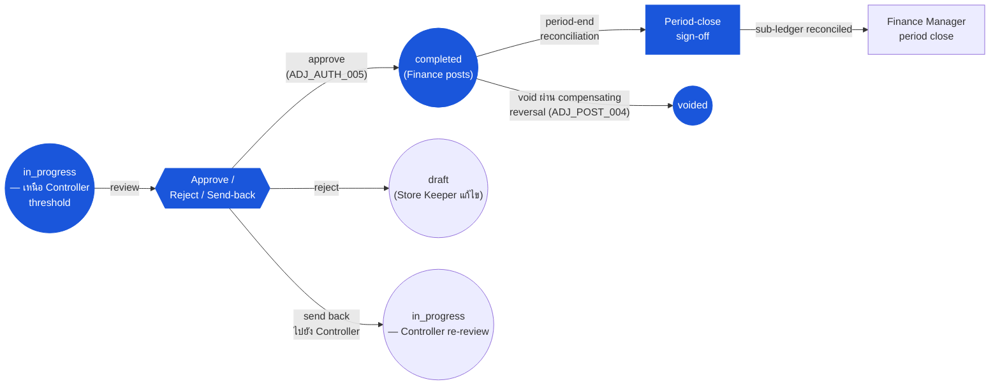

# การปรับสต๊อก (Inventory Adjustment) — User Flow — Finance

> **At a Glance**
> **Persona:** Finance &nbsp;·&nbsp; **โมดูล:** [inventory-adjustment](/th/inventory/inventory-adjustment) &nbsp;·&nbsp; **ขั้น workflow:** queue เหนือ Controller-threshold — review ที่ `in_progress`; อนุมัติไปยัง `completed` (`ADJ_AUTH_005`), reject ไปยัง `draft`, ส่งกลับไปยัง Controller; การตรวจสอบ GL mapping; การ sign-off ปลายงวด &nbsp;·&nbsp; **สิทธิ์สำคัญ:** อนุมัติเหนือ Finance threshold (`ADJ_AUTH_005`); gate ปิดงวด
> **persona นี้ทำอะไร:** Review ผลกระทบต้นทุนของ adjustments เหนือ threshold, post ไปยัง `completed` และ sign-off การ reconcile inventory-to-GL ปลายงวดสำหรับโมดูล

### ตำแหน่ง Workflow (Finance เน้น)

### Permission Matrix — V5 Touchpoint × Action (Finance)

Finance ดำเนินงานข้ามสอง touchpoints ที่แตกต่าง: **การอนุมัติต้นทุนขนาดใหญ่** (เอกสารเหนือ Controller-threshold ใน Finance queue) และ **การ reconcile ปลายงวด** (ตรวจสอบว่ากิจกรรม adjustment roll up เข้า inventory sub-ledger และ GL อย่างถูกต้อง) Finance ไม่มีอำนาจเหนือเอกสารต่ำกว่า Controller-threshold แถวมาจาก Section 2 (Entry Point and Primary Flow) ของไฟล์นี้; การอ้างอิงกฎหมายถึง [inventory-adjustment/02-business-rules](/th/inventory/inventory-adjustment/02-business-rules) § 4 (กฎ Authorization) และ § 5 (กฎ Posting)

| Action | การอนุมัติต้นทุนขนาดใหญ่ (Finance queue) | การ reconcile ปลายงวด |
|---|---|---|
| ดูเอกสาร `in_progress` เหนือ Controller threshold | ✅ (`ADJ_AUTH_005`) | ✅ (view ประวัติ) |
| ตรวจสอบ reason-code GL-account mapping (`info.glAccount`) | ✅ — ยืนยันบัญชี expense / loss ที่ถูกต้อง | ✅ (การตรวจสอบประวัติ) |
| ตรวจสอบ defensibility ของ FIFO / WA cost-per-unit pick | ✅ — cross-check กับ vendor pricelist | ✅ |
| ตรวจสอบแผนก / cost-centre (`dimension.department`) | ✅ — ยืนยันความรับผิดชอบงบประมาณ | ✅ |
| อนุมัติ adjustment เหนือ Controller-threshold (`in_progress → completed`) | ✅ (`ADJ_AUTH_005`) — fire posting ตาม `ADJ_POST_002` | ❌ |
| Reject เอกสาร (`in_progress → draft`) | ✅ (`ADJ_AUTH_005`) | ❌ |
| ส่งกลับไปยัง Controller สำหรับการสืบสวนใหม่ | ✅ (comment เท่านั้น; เอกสารคงอยู่ `in_progress`) | ❌ |
| Void เอกสาร `completed` (compensating reversal) | ✅ (`ADJ_POST_004`) — สำหรับข้อผิดพลาด cost-mapping งวดก่อน | ✅ |
| Reconcile inventory sub-ledger vs GL Inventory control | ❌ | ✅ (`ADJ_XMOD_007`) |
| การ sign-off ปลายงวด (pre-condition สำหรับ Finance Manager close) | ❌ | ✅ (`ADJ_CALC_010` period-impact aggregation) |
| แก้ไขเอกสารต่ำกว่า Controller-threshold | ❌ (โดเมน Controller) | ❌ |
| กำหนดค่า `tb_adjustment_type` reason codes / thresholds | ❌ (System Administrator ตาม `ADJ_AUTH_008`) | ❌ |
| แก้ไขเอกสาร `completed` โดยตรง | ❌ (`ADJ_VAL_013` — immutable) | ❌ |

> ℹ️ **Finance ไม่สามารถริเริ่ม void โดยไม่มี compensating reversal:** การเปลี่ยน `completed → voided` ต้องการ compensating `tb_stock_in` (ถ้า void stock-out) หรือ `tb_stock_out` (ถ้า void stock-in) ที่ post ก่อนตาม `ADJ_POST_004` Finance อาจริเริ่มและอนุมัติเอกสารชดเชย; เฉพาะหลัง post นั้น ต้นฉบับเคลื่อนไปยัง `voided`

## 1. บทบาทในโมดูลนี้

Persona **Finance** เป็นเจ้าของ **การตรวจสอบผลกระทบต้นทุนและ GL-mapping** สำหรับโมดูล adjustment อำนาจของพวกเขามุ่งเน้นที่ความถูกต้องทางการเงินของการ post adjustment — ตรวจสอบว่า reason code resolve ไปยังบัญชี GL ที่ถูกต้อง, ผลกระทบต้นทุนสมเหตุสมผลต่อ baseline ของ vendor-pricelist / costing-engine, inventory sub-ledger reconcile กับบัญชี GL Inventory control ที่ปิดงวด และกิจกรรม adjustment ปลายงวด defensible ต่อ external auditors ภายในโมดูล Finance ถือ:

- **อำนาจ approve / reject** บนเอกสาร `in_progress` เหนือ Inventory Controller threshold (โดยทั่วไป `฿10,000` aggregate cost, tenant-configurable) ตาม `ADJ_AUTH_005` — recall write-offs ขนาดใหญ่, damage write-offs ขนาดใหญ่, theft write-offs ขนาดใหญ่, การแก้ไข data-fix ขนาดใหญ่
- **Scope การตรวจสอบผลกระทบต้นทุน** — ตรวจสอบว่า `cost_per_unit` ที่เลือก (FIFO จาก layer เก่าที่สุด หรือ WA ปัจจุบัน) สอดคล้องกับ entries vendor-pricelist ล่าสุดและ baseline ของ costing engine ต้นทุน outlier ถูก flag สำหรับการสืบสวนเพิ่ม
- **การตรวจสอบ GL-account mapping** — `info.glAccount` ที่ resolve จาก `tb_adjustment_type` ต้อง map ไปยังบัญชี GL ที่ valid, period-open ใน chart of accounts Reason codes ที่ map ผิด flag สำหรับ re-configure ของ Sysadmin
- **อำนาจการ sign-off ปลายงวด** — ตรวจสอบว่ากิจกรรม adjustment ของงวด roll up เข้า inventory sub-ledger อย่างถูกต้องและ sub-ledger reconcile กับ GL Inventory control Sign-off เป็น pre-condition ต่อ period close ของ Finance Manager บน `tb_period.status` ตาม [inventory](/th/inventory/inventory) `INV_AUTH_006`
- **อำนาจ compensating-reversal** — ริเริ่ม void บนเอกสาร `completed` เมื่อ adjustment ของงวดก่อนพิสูจน์ว่าผิด (โดยทั่วไปข้อผิดพลาด cost-mapping หรือ duplicate-post ระบุหลังการกระทำ) ตาม `ADJ_POST_004`

Finance **ไม่** แก้ไขเอกสาร `completed` โดยตรง (immutable ตาม `ADJ_VAL_013`), ไม่สร้าง adjustments สำหรับ reasons ที่ไม่ใช่การเงิน (โดเมน Store Keeper / Controller), ไม่อนุมัติเอกสารต่ำกว่า Controller-threshold (โดเมนของ Controller) และไม่กำหนดค่า reason-code masters หรือ thresholds (Sysadmin ตาม `ADJ_AUTH_008`)

Persona group Finance ยังเป็นด่านหน้าของ workflow **Period Close** ใน [inventory](/th/inventory/inventory) — ที่ปลายงวด Finance reconcile กิจกรรม inventory adjustment กับบัญชี GL Inventory control และ sign-off งวดว่าพร้อมปิด การเปลี่ยน `tb_period.status` จริง (`open → closed → locked`) เป็นเจ้าของโดย Finance Manager ตาม [inventory](/th/inventory/inventory) `INV_AUTH_006`; หน้านี้มุ่งเน้นที่ review ฝั่ง adjustment ที่ป้อนการเปลี่ยนเหล่านั้น

ความเป็นเจ้าของโมดูล adjustment ของ Finance เริ่มเมื่อเอกสารเหนือ Controller-threshold ชน Finance approval queue หรือที่ review ปลายงวดที่กำหนด และสิ้นสุดที่ขอบเขตหนึ่งที่ enumerate ใน Section 4

## 2. จุดเข้าและ Primary Flow

**จุดเข้า:** สี่ประตูเข้าสู่ action ของ Finance บน adjustments

- **โมดูล Inventory Adjustment → Finance Approval queue** — list เอกสาร `in_progress` เหนือ Controller threshold ขับเคลื่อนโดย Controller forward / direct create above-Controller-threshold จุดเข้ารายวันหลักในช่วงที่มีผลกระทบต้นทุนสูง
- **Period-end Review dashboard** — view aggregate ของ adjustments `completed` ทั้งหมดในงวดตาม reason, location, department พร้อม totals ของผลกระทบต้นทุนและการ reconcile กับบัญชี GL Inventory control
- **Cost-anomaly alerts** — การแจ้งเตือนเมื่อ adjustment ที่ post ชน anomaly threshold ที่ configure (เช่น cost per unit > 3× ของค่าเฉลี่ย vendor 90 วันสำหรับ product) จุดเข้า review reactive — adjustment เป็น `completed` แล้วแต่ Finance สืบสวนสำหรับ follow-up (corrective entry, Sysadmin re-config, การสืบสวนการฉ้อโกง)
- **Reconciliation discrepancy alerts** — เมื่อ reconcile ปลายงวดตรวจพบผลต่างระหว่าง inventory sub-ledger และ GL Inventory control, Finance สืบสวนและสาวกลับไปยัง adjustment posts เฉพาะ

**Primary flow (review และอนุมัติ stock-out เหนือ Controller-threshold, 10 ขั้น):**

1. **เปิด Finance Approval queue** โมดูล Inventory Adjustment → Finance Approvals Queue แสดง `tb_stock_out` ที่ Controller-forward ที่ `doc_status = in_progress` ด้วยเหตุผล `RECALL_WRITE_OFF`, total cost `฿85,000` (เหนือ Controller threshold), ผู้สร้าง (Store Keeper), Controller (ที่ forward), อายุใน queue
2. **เปิด detail เอกสาร** คลิกเข้าไปในแถว Detail view แสดงบริบทเต็ม: header (location, reason, description, department), บรรทัด (product, qty, FIFO-picked lot / cost per unit, total per line), attachments ทั้งหมด (recall notice จาก vendor, รูปถ่ายของ lot identifiers, checklist recall ที่ sign-off), `workflow_history` (Store Keeper submit → Controller forward ที่ `<timestamp>` ด้วย comment)
3. **ตรวจสอบบริบท recall** Cross-check recall notice — vendor reference, lot numbers ที่ได้รับผลกระทบ, ขอบเขตทาง geographic / product — เทียบกับบรรทัดของเอกสาร ความไม่ตรงใด ๆ (เช่น บรรทัดสำหรับ lot ที่ไม่อยู่ใน recall notice) เป็นเหตุของการ reject
4. **ตรวจสอบ cost-per-unit ที่เลือก** การเลือก FIFO (เช่น `฿42.50` ต่อหน่วยจาก `LOT-2023-Q4`) — cross-check กับ `cost_per_unit` ของ `tb_good_received_note_detail_item` ต้นทาง GRN และ vendor pricelist ที่เวลาการรับ การเลือก outlier (ต้นทุนต่างจากต้นทุนการรับอย่างมีนัยสำคัญ) แสดงปัญหาความถูกต้องของ cost-layer — escalate ไปยัง Sysadmin / Inventory Controller สำหรับการสืบสวน
5. **ตรวจสอบ GL-account mapping** `info.glAccount` ของเหตุผล `RECALL_WRITE_OFF` resolve ไปยังบัญชีเฉพาะ (เช่น `6540 — Product Recall Loss`) ตรวจสอบ:
    - บัญชี active และไม่ lock สำหรับวันที่เอกสาร
    - บัญชีอยู่ในประเภท cost-centre ที่ถูกต้อง (โดยทั่วไปบัญชี expense)
    - บัญชีตรงกับ chart-of-accounts policy สำหรับ recall losses (vs damage, vs expiry, vs theft — sub-classifications ที่แตกต่าง)
6. **ตรวจสอบแผนก / cost-centre** จาก `dimension.department` ของเอกสาร ยืนยันว่าแผนกถือความรับผิดชอบงบประมาณสำหรับการ write-off recall สำหรับ recalls ที่กระทบหลายแผนก เอกสารอาจต้องแบ่งเป็น adjustments ต่อแผนก (ขอ Controller / Store Keeper เพื่อ submit ใหม่)
7. **ตรวจสอบมุม insurance / vendor-recovery** การสูญเสีย recall ขนาดใหญ่มักจะ qualify สำหรับ vendor recovery ผ่าน credit note (channel ที่ต้องการตาม [inventory](/th/inventory/inventory) `INV_XMOD_007`) หรือ insurance claim ตรวจสอบว่าการ recovery คู่ขนานอยู่ใน flight; ถ้าไม่ การ write-off ดำเนินการเต็มจำนวน แต่บันทึก recovery ที่ขาดใน comment สำหรับ follow-up
8. **Approve, reject หรือ send back**
    - **Approve:** คลิก **Approve** เอกสารเปลี่ยน `in_progress → completed` ตาม `ADJ_POST_002` Inventory transaction post; cost-layer rows เขียน; GL journal สร้าง (`Dr Product Recall Loss ฿85,000 / Cr Inventory ฿85,000`) `workflow_history` บันทึก `{stage: 'completed', action: 'finance_approved', by: <finance_id>}`
    - **Reject:** กรอกเหตุผล rejection — โดยทั่วไปปัญหา cost-mapping, recovery path ที่ขาด, scope-mismatch กับ vendor notice เอกสาร return ไปยัง `draft` สำหรับการแก้ไข Store Keeper + Controller re-forward
    - **Send back ไปยัง Controller:** Comment-only — ขอให้ Controller revisit aspects เฉพาะ (เช่น ยืนยันว่า lot เฉพาะได้รับผลกระทบจริง) เอกสารคงอยู่ `in_progress`; Controller สืบสวนใหม่
9. **Post จุดชนวน (เมื่อ Approve)** Fan-out เดียวกับการ post ที่ Controller อนุมัติตาม [inventory](/th/inventory/inventory) `INV_POST_002`: `tb_inventory_transaction`, detail, cost-layer rows, GL journal `inventory_transaction_id` ของ detail ประทับ
10. **Optional: chain การสร้าง credit-note** สำหรับการ write-off vendor-recall ที่ vendor credit อยู่ใน flight Finance อาจสร้าง `tb_credit_note` ทันที (flow credit-note ของ [good-receive-note](/th/inventory/good-receive-note)) ต่อ GRN ต้นทางเพื่อ recover ต้นทุน นี่คือ workflow การเงินคู่ขนาน ไม่ใช่ส่วนของเอกสาร adjustment เอง

**Flow review ปลายงวด (5 ขั้น, เป็นตัวอย่าง):**

1. **เปิด Period-end Review dashboard** โมดูล Inventory Adjustment → Period Review → `<YYMM>` Dashboard render:
    - adjustments `completed` ทั้งหมดในงวด, group ตาม reason
    - Aggregate ผลกระทบต้นทุนต่อ reason
    - ความหนาแน่น adjustment ต่อ location (จำนวน, total cost)
    - Variance % เทียบกับ baseline ประวัติ (งวดปัจจุบัน vs 90-day rolling average) — flag reasons / locations outlier ตาม `ADJ_CALC_008`
    - การ reconcile กับบัญชี GL Inventory control: `Σ adjustment_cost_impact` vs net adjustment debit / credit ของ GL Inventory สำหรับงวด
2. **สืบสวน outliers ที่ flag** สำหรับแต่ละรายการที่ flag, drill เข้าเอกสารที่ contribute — ยืนยันว่าแต่ละตัวอนุมัติอย่างถูกต้อง, post อย่างถูกต้อง, จัดประเภทอย่างถูกต้อง
3. **ตรวจสอบการ reconcile** ผลต่างระหว่าง inventory sub-ledger และบัญชี GL Inventory control ต้อง ≤ tenant tolerance (โดยทั่วไป zero) ผลต่างใด ๆ สาวไปยังเหตุการณ์ posting เฉพาะ; การแก้ไข post เป็น stock-in / stock-out ที่ Finance สร้างพร้อมเหตุผล `DATA_FIX` หรือเป็น entry GL journal ด้วยมือ (นอกโมดูล adjustment)
4. **Sign-off** คลิก **Period Approve** Finance Manager (ที่อาจเป็นผู้ใช้คนเดียวกันหรือคนละคน) จากนั้นทำการเปลี่ยน `tb_period.status = open → closed` จริงตาม [inventory](/th/inventory/inventory) `INV_AUTH_006`
5. **Handoff ไปยัง external audit** หลัง period lock (`closed → locked`), adjustment trail ของงวดเป็น record ระดับ audit Auditor review trail ตาม Flow Auditor ของ [03-user-flow-audit-config.md](./03-user-flow-audit-config.md)

## 3. การตัดสินใจ

- **Approve vs reject vs send-back บน cost-anomaly** Approve เมื่อต้นทุน defensible (ตรงกับประวัติ GRN, ตรงกับ vendor pricelist), reject เมื่อต้นทุนผิดอย่างมีนัยสำคัญ (น่าจะ corruption ของ cost-layer ที่ต้องการการสืบสวน root-cause), send-back เมื่อต้นทุนน่าจะถูกแต่ review ของ Controller พลาดชิ้นของหลักฐาน
- **ขอ override GL-account mapping** เมื่อ `info.glAccount` default ของ reason-code ผิดสำหรับ transaction เฉพาะ (เช่น เหตุการณ์ "BREAKAGE" ที่จริงเป็นขโมยที่สงสัยว่า insurance-claimable), Finance ไม่ override โดยตรง (Finance ไม่สามารถแก้ไขบรรทัดเอกสาร) แทนนั้น Finance reject และขอ submit ใหม่พร้อม reason ที่ถูกต้อง — หรือขอ Sysadmin เพิ่ม reason code ที่เฉพาะมากขึ้น จากนั้น re-process
- **Routing channel การ recovery** เมื่อการ write-off adjustment มี vendor-credit หรือ insurance recovery คู่ขนาน Finance ตรวจสอบว่า recovery channel ริเริ่ม Adjustment ดำเนินการที่ต้นทุนเต็ม; recovery เป็น credit ที่ลดการสูญเสียสุทธิแยกต่างหาก กรณีที่ route ผิด (write-off ดำเนินการเมื่อ credit-note path เหมาะสม, การ double-count recovery) ต้องการ Finance ประสานกับ Controller / Store Keeper
- **Period close: zero-tolerance vs allowance** Reconcile ปลายงวด default ไปยัง zero-tolerance (ผลต่าง sub-ledger / GL ใด ๆ block การปิด) Tenant config อาจผ่อนเป็น ± X% allowance สำหรับ reasons เฉพาะ (เช่น tolerance การปัดเศษเล็กบนสินค้า weighted-average) ผลต่างเหนือ tolerance จุดชนวนการสืบสวนของ Finance และ (อาจ) adjustment stock-in / stock-out แก้ไขก่อนปิด
- **Re-open หลังปิด** เมื่อ external audit (หลัง period-lock) ระบุ adjustment ที่ขาดหรือผิด, path re-open ผ่าน Finance Manager ตาม [inventory](/th/inventory/inventory) `INV_AUTH_006` (เฉพาะงวด closed ไม่ใช่ locked) สงวนสำหรับกรณีพิเศษ การพิสูจน์ระดับ audit ต้องการ; re-close ต้องตามก่อนการปิดงวดปกติถัดไป

## 4. จุดออก / Handoffs

การมีส่วนร่วมของ persona Finance บน adjustment / งวดที่กำหนดสิ้นสุดที่ขอบเขตหนึ่งในสี่:

- **Approval → post เสร็จ** เอกสารเหนือ Controller-threshold อนุมัติ; `doc_status = completed`; inventory transaction post; GL journal สร้าง ไม่มี handoff persona เพิ่มเติมสำหรับเอกสารนั้น
- **Rejection → กลับไปยัง Store Keeper** เอกสาร return ไปยัง `draft` ด้วย comment rejection Store Keeper แก้ไขและ submit ใหม่ตาม [03-user-flow-store-keeper.md](./03-user-flow-store-keeper.md); Controller re-forward ถ้ายังเหนือ Controller-threshold
- **Send-back → Controller re-review** เอกสารคงอยู่ `in_progress` ด้วย comment ขอ follow-up ของ Controller Controller re-engage
- **Period-end approve → Finance Manager close** Finance sign-off กิจกรรม adjustment ของงวด; Finance Manager รัน `tb_period.status = open → closed` ตาม [inventory](/th/inventory/inventory) `INV_AUTH_006` หลัง close + audit-window, Finance Manager รัน `closed → locked` งาน adjustment สำหรับงวดเป็นปลายทาง; งวดใหม่เริ่ม

## 5. แหล่งอ้างอิง

- ภาพรวม parent: [03-user-flow.md](./03-user-flow.md) — วงจรชีวิตเอกสาร canonical และตาราง handoff ข้าม persona
- Sibling: [03-user-flow-store-keeper.md](./03-user-flow-store-keeper.md) — ผู้สร้างต้นฉบับของเอกสารเหนือ Controller-threshold
- Sibling: [03-user-flow-inventory-controller.md](./03-user-flow-inventory-controller.md) — persona ต้นน้ำที่ forward route เอกสารเข้า Finance queue
- Sibling: [03-user-flow-audit-config.md](./03-user-flow-audit-config.md) — Sysadmin ที่กำหนดค่า mappings `info.glAccount` ที่ Finance ตรวจสอบ; Auditor ที่ review trail adjustment ปลายงวดที่ Finance sign-off
- Sibling: [01-data-model.md](./01-data-model.md) — `tb_adjustment_type.info.glAccount` ที่ Finance ตรวจสอบ; ฟิลด์ extension `tb_stock_in.info` / `tb_stock_out.info` ที่ Finance อ่าน (count source, void chain)
- Sibling: [02-business-rules.md](./02-business-rules.md) — `ADJ_AUTH_005` (การอนุมัติ Finance), `ADJ_POST_002` (post fan-out), `ADJ_POST_004` (void ผ่าน compensating reversal), `ADJ_CALC_008` (variance %), `ADJ_CALC_010` (period impact), `ADJ_XMOD_007` (การ reconcile Finance / GL)
- ที่เกี่ยวข้อง: [inventory](/th/inventory/inventory) — `INV_AUTH_005` (scope การอนุมัติ Finance), `INV_AUTH_006` (Finance Manager period transitions), `INV_XMOD_008` (การ reconcile inventory-to-GL ที่ปิดงวด)
- ที่เกี่ยวข้อง: [good-receive-note](/th/inventory/good-receive-note) — Finance อาจ chain flow credit-note สำหรับ vendor-recall recovery ต่อ GRN ต้นทาง
- ที่เกี่ยวข้อง: [vendor-pricelist](/th/inventory/vendor-pricelist) — Finance cross-check cost-per-unit picks กับการตั้งราคา vendor ประวัติสำหรับการตรวจจับ outlier
- ที่เกี่ยวข้อง: [costing](/th/inventory/costing) — Finance ตรวจสอบ FIFO / WA cost picks บน adjustments ขาออกสอดคล้องกับ baseline ของ costing-engine
