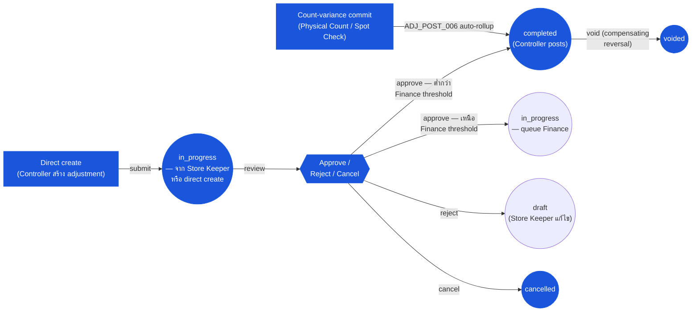

# การปรับสต๊อก (Inventory Adjustment) — User Flow — Inventory Controller

> **At a Glance**
> **Persona:** Inventory Controller &nbsp;·&nbsp; **โมดูล:** [inventory-adjustment](/th/inventory/inventory-adjustment) &nbsp;·&nbsp; **ขั้น workflow:** queue เหนือ Store-Keeper-threshold — review ที่ `in_progress`; อนุมัติไปยัง `completed` (ต่ำกว่า Finance threshold) หรือ escalate ไปยัง Finance; reject กลับไปยัง `draft`; cancel ใน `in_progress` (`ADJ_AUTH_007`); commit count-rollup; การ sign-off ผลต่างก่อนปลายงวด &nbsp;·&nbsp; **สิทธิ์สำคัญ:** อนุมัติต่ำกว่า Finance threshold (`ADJ_AUTH_004`); การอนุมัติ new-lot stock-in (`ADJ_AUTH_003`); commit count-rollup
> **persona นี้ทำอะไร:** Review adjustments เหนือ threshold และ new-lot stock-ins, post ไปยัง ledger และ clear ผลต่างก่อน Finance ปิดงวด

### ตำแหน่ง Workflow (Inventory Controller เน้น)

### Permission Matrix — V2 Action × Stage Role (Inventory Controller)

Inventory Controller คือ **อำนาจการอนุมัติระหว่าง threshold auto-approve และ Finance threshold** Matrix ด้านล่างใช้แกนสองขั้น (การอนุมัติแบนด์ Controller และการ commit count-rollup) จากมุมมองของ Controller แถวมาจาก Section 2 (Entry Point and Primary Flow) ของไฟล์นี้; การอ้างอิงกฎหมายถึง [inventory-adjustment/02-business-rules](/th/inventory/inventory-adjustment/02-business-rules) § 4 (กฎ Authorization) และ § 5 (กฎ Posting)

| Action | การอนุมัติแบนด์ Controller (`฿500–฿10,000`) | Commit count-rollup |
|---|---|---|
| Review เอกสาร `in_progress` ใน queue อนุมัติ | ✅ (`ADJ_AUTH_004`) | ✅ (review บรรทัดผลต่าง) |
| Approve stock-in / stock-out (`in_progress → completed`) | ✅ (`ADJ_AUTH_004`) — fire posting ตาม `ADJ_POST_002` | ✅ auto-advance ตาม `ADJ_POST_006` |
| Approve new-lot stock-in (ผลกระทบต้นทุนใด ๆ) | ✅ (`ADJ_AUTH_003`) — validate lot identity + cost defensibility | — |
| Reject เอกสาร (`in_progress → draft`) | ✅ (`ADJ_AUTH_004`) — เหตุผล rejection ใน `workflow_history` | ✅ (สามารถ reject count ก่อน commit) |
| Cancel เอกสาร `in_progress` (`→ cancelled`) | ✅ (`ADJ_AUTH_007`) | — |
| Forward above-threshold ไปยัง Finance | ❌ (out of band — ดู note above-band) | — |
| Commit ผลต่างนับ (Physical Count / Spot Check) | — | ✅ (`ADJ_POST_006`) — auto-create `tb_stock_in` (overage) + `tb_stock_out` (shortage) |
| Direct-create `tb_stock_in` / `tb_stock_out` | ✅ (`ADJ_AUTH_001` — scope เดียวกับ Store Keeper) | — |
| Void เอกสาร `completed` (compensating reversal) | ✅ (`ADJ_AUTH_007`, `ADJ_POST_004`) | — |
| Monitor variance dashboard (`ADJ_CALC_010` period impact) | ✅ (`ADJ_CALC_008` variance %) | ✅ |
| แก้ไขบรรทัดบนเอกสาร `completed` | ❌ (`ADJ_VAL_013` — immutable หลังการ post) | ❌ |
| กำหนดค่า `tb_adjustment_type` reason codes / thresholds | ❌ (System Administrator ตาม `ADJ_AUTH_008`) | ❌ |
| Approve เอกสาร above-Controller-threshold | ❌ (Finance ตาม `ADJ_AUTH_005`) | ❌ |

> ℹ️ **ความรับผิดชอบ Review ของ Department Manager:** บทบาท Department Manager (การกำกับ cost-centre, ความสามารถ comment / flag) พับเข้ากับ persona group Inventory Controller ใน wiki นี้ Department Managers ได้รับการแจ้งเตือนบนเอกสารที่กระทบ cost-centre ของพวกเขา (resolve ผ่าน `dimension.department` ของเอกสาร) แต่ไม่อนุมัติ — พวกเขา comment และ escalate ไปยัง Controller หรือ Finance

## 1. บทบาทในโมดูลนี้

Persona **Inventory Controller** (พับกับ Inventory Manager ในแหล่ง carmen/docs และดูดความรับผิดชอบ review ของ Department Manager) คือ **อำนาจการกำกับเหนือ threshold auto-approve** และ **เจ้าของความถูกต้องของยอด** สำหรับ property ภายในโมดูล inventory-adjustment Controller ถือ:

- **อำนาจ approve / reject** บนเอกสาร `tb_stock_in` / `tb_stock_out` `in_progress` ภายในแบนด์ threshold Controller (`฿500–฿10,000` ทั่วไป ระหว่าง Store Keeper auto-approve และ Finance) ตาม `ADJ_AUTH_004` การอนุมัติ fire `in_progress → completed` ซึ่ง post inventory transaction และ GL entry ตาม `ADJ_POST_002`
- **อำนาจอนุมัติบน new-lot stock-in** ไม่ว่าต้นทุน — adjustments new-lot ที่ Store Keeper submit route ไปยัง Controller เสมอตาม `ADJ_AUTH_003` ที่ Controller validate lot identity และ defensibility ของ cost-per-unit
- **Scope การกำกับผลต่าง** — review รูปแบบ adjustment ตาม reason, location, department, เวลาของวัน, ผู้ใช้แต่ละคน; สืบสวนผลต่างขนาดใหญ่ตาม `ADJ_CALC_008` variance-% calc และผลักดันการเปลี่ยนแปลงกระบวนการแก้ไข (การฝึก, recount, การขอ reconfigure reason-code ไปยัง Sysadmin)
- **อำนาจ commit count-rollup** — commit บรรทัดผลต่างจาก [physical-count](/th/inventory/physical-count) / [spot-check](/th/inventory/spot-check) runs ซึ่งจุดชนวนการสร้าง `tb_stock_in` / `tb_stock_out` auto-rollup ตาม `ADJ_POST_006`; cross-reference [inventory](/th/inventory/inventory) `INV_XMOD_003` / `INV_XMOD_004`
- **อำนาจ direct create** — อาจสร้าง `tb_stock_in` / `tb_stock_out` โดยตรง (เช่น เมื่อการสืบสวนเผยให้เห็นความไม่ตรงที่ Store Keeper ยังไม่ได้รายงาน หรือเมื่อ SoD ตาม `ADJ_AUTH_010` blocks Store Keeper จากการสร้าง write-off สำหรับ lot ที่พวกเขารับ)
- **อำนาจ void** — ริเริ่ม reverse ชดเชยสำหรับเอกสารที่ post ตาม `ADJ_POST_004`, เคลื่อนต้นฉบับไปยัง `voided` หลังการ post ชดเชย
- **อำนาจ cancel** บนเอกสาร `in_progress` ตาม `ADJ_AUTH_007` — เมื่อ recount หรือการสืบสวนสรุปว่า adjustment ไม่ warrant
- **ความรับผิดชอบ Review ของ Department Manager** (พับเข้ากับ persona group นี้) — การกำกับ read-only ของ adjustments ที่กระทบ cost-centre ของพวกเขา (resolve ผ่าน JSON `dimension` ของเอกสาร), การสมัครรับการแจ้งเตือน, ความสามารถ comment / flag สำหรับ escalation ไปยัง Finance

Controller **ไม่** มีอำนาจอนุมัติ above-Controller-threshold (Finance ตาม `ADJ_AUTH_005`), ไม่กำหนดค่า reason codes / thresholds (Sysadmin ตาม `ADJ_AUTH_008`) และไม่รัน period-end close (Finance Manager ตาม [inventory](/th/inventory/inventory) `INV_AUTH_006`)

ความเป็นเจ้าของโมดูล adjustment ของ Controller เริ่มเมื่อเอกสาร submit ที่หรือเหนือ threshold (หรือเมื่อ count commit) และสิ้นสุดที่ขอบเขตหนึ่งที่ enumerate ใน Section 4

## 2. จุดเข้าและ Primary Flow

**จุดเข้า:** ห้าประตูเข้าสู่ action ของ Controller บน adjustments

- **โมดูล Inventory Adjustment → queue Pending Approvals** — list เอกสาร `in_progress` ทั้งหมดภายใน scope ของ Controller (filter ได้ตาม location, reason, requester, อายุ) เอกสารเข้า queue นี้จาก Store Keeper submit ที่หรือเหนือ auto-approve threshold หรือสำหรับ new-lot stock-in นี่คือจุดเข้ารายวันหลัก
- **โมดูล Inventory Adjustment → Variance Review** — dashboard ตามรอบที่แสดงรูปแบบ adjustment: top reasons ตามผลกระทบต้นทุน, locations ที่มีผลต่างผิดปกติ, ผู้ใช้ที่มีพฤติกรรม outlier ขับเคลื่อนโดย `ADJ_CALC_010` period-impact aggregation
- **Physical Count / Spot Check → Variance Commit** — ที่ count completion, Controller commit บรรทัดผลต่างซึ่งจุดชนวน `ADJ_POST_006` auto-rollup นี่คือจุดเข้าที่ขับเคลื่อนด้วยการนับ
- **Direct create — New Stock-In / Stock-Out** — form เดียวกับ primary flow ของ Store Keeper, ใช้เมื่อ Controller สร้าง adjustment โดยตรง เอกสาร auto-route สำหรับ Finance approval ถ้าต้นทุนเกิน Controller threshold
- **Notifications / view Department Manager** — จุดเข้า read-only จากการแจ้งเตือนทาง email / dashboard เมื่อ cost-centre ภายใต้การกำกับของพวกเขาถูกกระทบโดย adjustment ที่ post หรือ pending

**Primary flow (review และ approve stock-out เหนือ threshold, 9 ขั้น — เป็นตัวอย่างของรูปแบบการอนุมัติ):**

1. **เปิด queue Pending Approvals** โมดูล Inventory Adjustment → Pending Approvals Queue แสดง `tb_stock_out` ที่ Store-Keeper-submit ที่ `doc_status = in_progress` ด้วยเหตุผล `BREAKAGE`, total cost `฿2,500` (เหนือ auto-approve threshold, ต่ำกว่า Controller threshold), ผู้สร้าง, อายุ (เวลาใน queue)
2. **เปิด detail เอกสาร** คลิกเข้าไปในแถว Detail view แสดง header (location, reason, description, department จาก `dimension`), บรรทัด (product, qty, lot-pick-preview / FIFO preview, cost preview), comments / attachments (รูปความเสียหาย, supervisor sign-off) และ `workflow_history` (Store Keeper submit ที่ `<timestamp>`)
3. **ตรวจสอบ reason code ตรงกับหลักฐาน** ตรวจสอบไขว้ reason (`BREAKAGE`) กับรูปถ่ายที่แนบและ description ของบรรทัด (เช่น "5 ขวดตกระหว่างการโอนจาก pallet") Reasons ที่ไม่ตรงกับหลักฐาน (เช่น อ้าง `EXPIRY_WRITE_OFF` บน lot ที่ไม่หมดอายุ) ถูก flag เพื่อ follow-up
4. **ตรวจสอบบริบทผลต่าง** คลิก "Show context" — หน้าจอ render adjustments ก่อนหน้าที่ location นี้สำหรับ product / reason เดียวกันใน 30 วันที่ผ่านมา และ counts ที่เปิดอยู่ที่อาจอธิบายความไม่ตรง เป้าหมาย: ตรวจจับรูปแบบ repeat-offender (เช่น "นี่คือ `BREAKAGE` ครั้งที่สี่สำหรับ P-1 ที่ LOC-A เดือนนี้ — ปัญหากระบวนการ ไม่ใช่ one-off")
5. **Validate preview ผลกระทบต้นทุน** หน้าจอ render การเลือกต้นทุน FIFO (`฿2,500` จาก `LOT-1` ที่ `฿10.00` × 250 หน่วย เป็นต้น) — ตรวจสอบว่าต้นทุนสมเหตุสมผลให้ราคา vendor ล่าสุด WA products แสดง moving average; averages outlier flag สำหรับการสืบสวน
6. **ตรวจสอบความพร้อม on-hand** ระบบ re-run `INV_VAL_005` (no negative balance) live ที่ขณะของการอนุมัติ ถ้า on-hand ที่ lot ที่เลือกเปลี่ยนตั้งแต่ submit (เช่น posting อื่นบริโภคจาก lot เดียวกัน) การอนุมัติ re-validate; การ reject ที่นี่ return เอกสารไปยัง `draft` ด้วยข้อความ "stock no longer available, please re-pick lot" ไปยัง Store Keeper
7. **Approve, reject, request more evidence หรือ cancel**
    - **Approve:** คลิก **Approve** เอกสารเปลี่ยน `in_progress → completed` ตาม `ADJ_POST_002` Inventory transaction post; cost-layer rows เขียน; GL journal สร้าง `workflow_history` บันทึก `{stage: 'completed', action: 'approved', by: <controller_id>}` Activity log แสดง Controller เป็นผู้อนุมัติ
    - **Reject:** คลิก **Reject** กรอกเหตุผล rejection เอกสาร return ไปยัง `draft`; Store Keeper เห็น rejection ใน queue ของพวกเขาพร้อมเหตุผลใน `workflow_history`; แก้ไขและ submit ใหม่ หรือ cancel
    - **Request evidence:** เพิ่ม comment ด้วยการขอหลักฐาน เอกสารคงอยู่ที่ `in_progress`; Store Keeper แนบหลักฐานที่ขอผ่าน comment และ submit ใหม่เพื่อ re-trigger การ review การอนุมัติ
    - **Cancel:** ถ้า recount หรือการสืบสวนสรุปว่า adjustment ไม่ warrant, Controller cancel เอกสาร `in_progress` ตาม `ADJ_AUTH_007` `doc_status = cancelled` ด้วยข้อความเหตุผล; ปลายทาง; ไม่มีผลกระทบ inventory
8. **Post จุดชนวน (เมื่อ Approve)** Fan-out เดียวกับ flow auto-approve ของ Store Keeper ตาม [inventory](/th/inventory/inventory) `INV_POST_002`: `tb_inventory_transaction`, `tb_inventory_transaction_detail` (`qty < 0` สำหรับ stock-out), หนึ่งหรือมากกว่าแถว `tb_inventory_transaction_cost_layer` (FIFO multi-row หรือ WA single ตาม `ADJ_CALC_006` / `ADJ_CALC_007`), GL journal (`Dr Breakage Expense ฿2,500 / Cr Inventory ฿2,500`) `inventory_transaction_id` ของ detail ประทับ
9. **Handoff ไปยัง Finance เพื่อ review** (เฉพาะปลายงวด) ที่ปิดงวด Finance review adjustment-activity aggregate ของงวดตาม Finance flow สำหรับ adjustments ต่ำกว่า Finance threshold รายวัน การอนุมัติของ Controller เป็นปลายทาง — ไม่มี handoff persona เพิ่มเติม

Flow **count-variance commit** ดำเนินตามรูปทรงต่างเล็กน้อย:

1. เปิดเอกสาร [physical-count](/th/inventory/physical-count) / [spot-check](/th/inventory/spot-check) ที่เสร็จที่ `tb_count_stock.status = completed` บรรทัดผลต่าง stage: ต่อ `(location, product, lot)` ความต่างระหว่าง qty ทางกายภาพและระบบ
2. Review แต่ละบรรทัดผลต่าง — ยืนยันว่าผลต่างจริง (ไม่ใช่ข้อผิดพลาดในการนับ), จัดประเภท (overage vs shortage), inspect attachments count-sheet ที่ประกอบและ signatures ผู้นับ
3. คลิก **Commit Variances** ระบบตาม `ADJ_POST_006`:
    - สร้างหนึ่ง `tb_stock_in` ด้วยเหตุผล `COUNT_OVERAGE` สำหรับบรรทัด overage ทั้งหมด
    - สร้างหนึ่ง `tb_stock_out` ด้วยเหตุผล `COUNT_SHORTAGE` สำหรับบรรทัด shortage ทั้งหมด
    - Auto-advance ทั้งสองไปยัง `completed` ภายใต้อำนาจของ Controller (ข้าม queue อนุมัติที่ระบุชัดเจน)
    - Post ทั้งสองตาม `ADJ_POST_002`
    - เปลี่ยน `tb_count_stock.status = completed_posted`
4. Activity log บันทึก count เป็น source (`info.countId = <count_uuid>` บนแต่ละเอกสาร rollup)

Flow **direct-create** ดำเนินตาม primary flow ของ Store Keeper (Section 2 ของ [03-user-flow-store-keeper.md](./03-user-flow-store-keeper.md)) ด้วย Controller เป็น `created_by_id` Direct-create above-Controller-threshold route ไปยัง Finance ตาม `ADJ_AUTH_005`

## 3. การตัดสินใจ

- **Approve vs reject vs request evidence** Approve เมื่อ reason / หลักฐาน / ต้นทุน / บริบททั้งหมดสนับสนุน adjustment Reject เมื่อ reason ผิด, หลักฐานขาดหรือไม่สอดคล้อง หรือ recount แก้ไขความไม่ตรง Request evidence เมื่อกรณีของผู้ submit เป็นไปได้แต่ attachments ที่ประกอบขาดหรือกำกวม (เช่น รูปความเสียหายไม่ชัด, การอ้างอิง vendor RMA ขาด)
- **Variance threshold สำหรับการสืบสวน** Adjustments เหนือ `ADJ_CALC_008` variance threshold (เช่น > 5% ของ on-hand ที่ product / location) จุดชนวนการสืบสวนลึก: ตรวจสอบไขว้กับผล [physical-count](/th/inventory/physical-count) last-count, ตรวจสอบประวัติผลต่างล่าสุดของ Store Keeper, walk the floor การสืบสวนอาจสรุปด้วย comment-only "approved with note" หรือด้วย rejection และการขอ recount
- **การอนุมัติ new-lot stock-in** เมื่ออนุมัติ new-lot stock-in ที่ Store Keeper สร้าง Controller validate โดยเฉพาะ: (a) lot identity well-formed และ unique ตาม `ADJ_VAL_009`; (b) cost-per-unit defensible (โดยทั่วไปอ่านจาก [vendor-pricelist](/th/inventory/vendor-pricelist) last-price หรือ set เป็น zero พร้อม note อธิบาย); (c) การสร้าง lot ใหม่สอดคล้องกับ reason (เช่น `VENDOR_FREE_REPLACEMENT` พิสูจน์ zero-cost new lot; bare `FOUND_STOCK` ของ lot ต้นทุนไม่ทราบยกคิ้ว) Cost-per-unit default สำหรับ true-found-stock โดยไม่มี reference ก่อนหน้าโดยทั่วไปคือ zero ด้วยเหตุผล `DATA_FIX` — เพื่อหลีกเลี่ยงการ inflate การตีมูลค่า inventory บนการคาดเดา
- **Route above-Controller-threshold ไปยัง Finance** เอกสารที่หรือเหนือ Controller threshold (โดยทั่วไป `฿10,000` ผลกระทบต้นทุน — recall write-offs ขนาดใหญ่, damage write-offs ขนาดใหญ่, theft write-offs ขนาดใหญ่) ไม่สามารถได้รับการอนุมัติโดย Controller เพียงคนเดียว Controller review และ reject หรือ **forward ไปยัง Finance** โดย submit ใหม่พร้อม annotation การอนุมัติ Finance Finance รับจาก Finance flow
- **Count-rollup commit vs review บรรทัดเดี่ยว** การ commit count-variance มาตรฐานจุดชนวน auto-rollup ตาม `ADJ_POST_006` สำหรับ counts ที่มีผลต่าง aggregate ขนาดใหญ่ (เช่น > 10% net cost impact) Controller อาจเลือก **reject the count** และขอ recount ก่อน commit — ป้องกัน auto-rollup จากการ post adjustment ขนาดใหญ่ที่ไม่ justifiable
- **Escalation view ของ Department-Manager** เมื่อ Controller (ทำหน้าที่เป็นตัวแทน Department Manager หรือร่วมกับหนึ่งคน) เห็นรูปแบบ adjustments ที่กระทบ cost-centre เดียวอย่างไม่ได้สัดส่วน พวกเขาอาจ flag สำหรับการสืบสวนของ Finance และ / หรือขอ Sysadmin re-configure reason codes / thresholds สำหรับ cost-centre นั้น

## 4. จุดออก / Handoffs

การมีส่วนร่วมของ Controller บน adjustment ที่กำหนดสิ้นสุดที่ขอบเขตหนึ่งในห้า:

- **Approval → post เสร็จ** เอกสารต่ำกว่า Finance threshold อนุมัติโดย Controller; `doc_status = completed`; inventory transaction post งานของ Controller บนเอกสารนี้สิ้นสุด; ไม่มี handoff persona เพิ่มเติม Activity log บันทึก Controller เป็นผู้อนุมัติ
- **Rejection → กลับไปยัง Store Keeper** เอกสาร `doc_status = draft` ด้วยเหตุผล rejection ใน `workflow_history` Store Keeper re-engage
- **Cancel → ปลายทาง inactive** เอกสาร `doc_status = cancelled` ด้วยเหตุผล ไม่มีผลกระทบ inventory ปลายทางจากฝั่ง Controller
- **Forward ไปยัง Finance** เอกสาร above-Controller-threshold route ไปยัง **Finance** ([03-user-flow-finance.md](./03-user-flow-finance.md)) สำหรับการอนุมัติสุดท้าย เอกสารยังคงอยู่ที่ `in_progress`; Finance รับการ review
- **Count commit → auto-rollup post** การ commit variance บน count run จุดชนวน `ADJ_POST_006` auto-rollup; เอกสาร rollup auto-advance ไปยัง `completed`; เอกสาร count ที่ `completed_posted` งานของ Controller บนฝั่ง adjustment ของ count สิ้นสุด

## 5. แหล่งอ้างอิง

- ภาพรวม parent: [03-user-flow.md](./03-user-flow.md) — วงจรชีวิตเอกสาร canonical และตาราง handoff ข้าม persona
- Sibling: [03-user-flow-store-keeper.md](./03-user-flow-store-keeper.md) — persona ต้นน้ำที่การ submit เข้า queue อนุมัติของ Controller
- Sibling: [03-user-flow-finance.md](./03-user-flow-finance.md) — persona ปลายน้ำสำหรับการอนุมัติเหนือ Controller threshold และ review ผลกระทบต้นทุนปลายงวด
- Sibling: [03-user-flow-audit-config.md](./03-user-flow-audit-config.md) — System Administrator ที่กำหนดค่า `tb_adjustment_type`, thresholds และ integration; Auditor ที่อ่านประวัติการอนุมัติของ Controller และ SoD compliance
- Sibling: [01-data-model.md](./01-data-model.md) — คอลัมน์ workflow / `last_action` ของ `tb_stock_in` / `tb_stock_out` ที่ Controller อ่านที่อนุมัติ; reason `tb_adjustment_type` และ `info.glAccount` ที่ Controller validate กับ
- Sibling: [02-business-rules.md](./02-business-rules.md) — `ADJ_AUTH_003` (gate Controller สำหรับ new-lot), `ADJ_AUTH_004` (การอนุมัติ Controller), `ADJ_AUTH_007` (cancel / void), `ADJ_POST_002` (post fan-out fire โดย Controller approve), `ADJ_POST_004` (void ผ่าน compensating reversal), `ADJ_POST_006` (count-rollup auto-post), `ADJ_CALC_008` (variance %), `ADJ_CALC_010` (period impact); cross-module `ADJ_XMOD_002` / `ADJ_XMOD_003` (count rollup)
- ที่เกี่ยวข้อง: [inventory](/th/inventory/inventory) — ทุกการอนุมัติของ Controller post ไปยัง inventory; `INV_AUTH_003` (Controller เป็น second signature ในลำดับชั้น inventory), `INV_POST_001` / `INV_POST_002` (post effects), `INV_XMOD_003` / `INV_XMOD_004` (path posting count-variance)
- ที่เกี่ยวข้อง: [physical-count](/th/inventory/physical-count) — Controller commit ผลต่างนับซึ่ง auto-create adjustment rollups
- ที่เกี่ยวข้อง: [spot-check](/th/inventory/spot-check) — การนับบางส่วน; รูปแบบ auto-rollup เดียวกัน
- ที่เกี่ยวข้อง: [costing](/th/inventory/costing) — Controller validate defensibility ของ cost-per-unit บน new-lot stock-in และ outlier FIFO / WA picks บน stock-out
- ที่เกี่ยวข้อง: [good-receive-note](/th/inventory/good-receive-note) — Controller อาจ inspect GRN ต้นทางเมื่อ review การ write-off recall ขนาดใหญ่หรือ adjustment vendor-replacement
- ที่เกี่ยวข้อง: [vendor-pricelist](/th/inventory/vendor-pricelist) — Controller cross-check cost-per-unit บน new-lot stock-in กับ last-price ของ vendor pricelist
