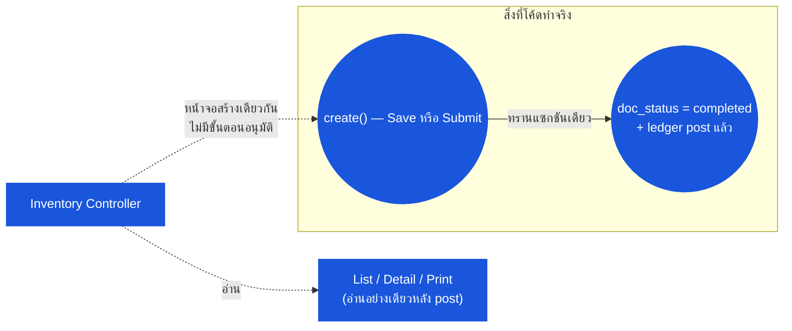

# การปรับสต๊อก (Inventory Adjustment) — User Flow — Inventory Controller

> **At a Glance**
> **Persona:** Inventory Controller (ผู้ใช้ใดก็ตามที่มีสิทธิ์ `inventory_management.view` — สิทธิ์เดียวกับ Store Keeper) &nbsp;·&nbsp; **โมดูล:** [inventory-adjustment](/th/inventory/inventory-adjustment) &nbsp;·&nbsp; **สิ่งที่ persona นี้ทำได้ที่ Store Keeper ทำไม่ได้:** ไม่มีอะไรที่แตกต่าง — ไม่มี action อนุมัติ ไม่มี queue รอการอนุมัติ และไม่มี permission key ที่แยกทั้งสอง role ที่ไหนในโค้ดของโมดูลนี้
> **สิ่งที่ persona นี้ทำจริง:** สร้าง adjustment โดยตรงบนหน้าจอเดียวกัน และอ่านผล list/detail/print ที่เป็นบันทึกภายหลังการ post

### ตำแหน่งเทียบกับ "วงจรชีวิต"

```mermaid
graph LR
    subgraph reality["สิ่งที่โค้ดทำจริง"]
        create(("create() — Save หรือ Submit")):::current -->|"ทรานแซกชันเดียว"| posted(("doc_status = completed\n+ ledger post แล้ว")):::current
    end
    ic["Inventory Controller"]:::current -.->|"หน้าจอสร้างเดียวกัน\nไม่มีขั้นตอนอนุมัติ"| create
    ic -.->|"อ่าน"| list["List / Detail / Print\n(อ่านอย่างเดียวหลัง post)"]:::current
    classDef current fill:#1a56db,color:#fff,stroke:#1a56db;
```

## 1. บทบาทในโมดูลนี้

หน้านี้เวอร์ชันก่อนหน้าบรรยาย Inventory Controller เป็นผู้มีอำนาจอนุมัติเหนือ threshold ที่ review เอกสาร `in_progress` ตรวจสอบ new-lot stock-in และ commit count-variance rollup ไม่มีข้อไหนมี route, permission key หรือ backend code path ที่ตรงกันเลย:

- ไม่มี `in_progress` ถูกกำหนดโดย `create()` ของโมดูลนี้เลย — จึงไม่มีอะไรอยู่ใน queue ให้อนุมัติ
- ไม่มี threshold ต่อผู้ใช้ ไม่มี `enum_stage_role` แยก persona นี้ออกจากผู้กรอกฟอร์ม และ nav entry / หน้าจอสร้าง / หน้ารายการ ทั้งหมด gate ด้วยสิทธิ์ `inventory_management.view` เดียวกับผู้ใช้อื่นของโมดูลนี้
- Void endpoint จริง (`voidStockIn`/`voidStockOut`) มีอยู่ใน backend และควรจะเหมาะกับเรื่องราว "Controller กลับรายการรายการที่ผิด" แต่ปุ่ม UI ที่จะเรียกมันเข้าไม่ถึงสำหรับเอกสารที่ persist แล้ว — ดู [03-user-flow.md](./03-user-flow.md) § 1 และ [02-business-rules.md](./02-business-rules.md) § 5 `ADJ_POST_004`

สิ่งที่ persona นี้ทำจริงกับโมดูลคือ: (a) ใช้หน้าจอ Add Stock-In/Add Stock-Out เดียวกันที่บรรยายใน [03-user-flow-store-keeper.md](./03-user-flow-store-keeper.md) เมื่อตนเองต้องสร้างการแก้ไข และ (b) อ่านหน้ารายการ หน้ารายละเอียด และผลพิมพ์ เป็นบันทึกประวัติของสิ่งที่ post ไปแล้ว — เนื่องจากไม่มีอะไรถูกทิ้งไว้ในสถานะที่ต้อง review

## 2. จุดเริ่มต้นและ Flow หลัก

**จุดเริ่มต้น:**

- **โมดูล Inventory Adjustment → หน้ารายการ** — หน้ารายการเดียวกับที่ Store Keeper ใช้; กรองได้ตามประเภท (Stock-In/Stock-Out) และสถานะ เนื่องจากทุกเอกสารตกไปที่ `completed` ทันที การกรองตามสถานะจึงแยกได้เพียง `completed` จาก `voided` (ตัวหลังเข้าถึงได้เฉพาะผ่านการเรียก API โดยตรง และเนื่องจาก void ตั้ง `deleted_at` ด้วย เอกสารที่ void แล้วจึงหายไปจากหน้ารายการนี้เมื่อ void แล้วเช่นกัน)
- **โมดูล Inventory Adjustment → รายละเอียด (คลิกแถว)** — เปิดหน้าอ่านอย่างเดียว **Print** เป็นปุ่ม action เดียวที่แสดงผลแน่นอน (`canPrint = isView && !!id` เป็น true เสมอสำหรับเอกสารที่ persist แล้ว)
- **สร้างโดยตรง** — หน้าจอเดียวกับ Store Keeper ไม่มีจุดเริ่มต้นหรือฟิลด์พิเศษอื่นใด

**Flow หลัก (review เอกสารที่ post แล้ว, 4 ขั้นตอน — ไม่มีขั้นตอนอนุมัติให้ทำ):**

1. **เปิดหน้ารายการ** กรองตามประเภท/สถานะ/วันที่/คำค้นตามต้องการ
2. **เปิดแถว** หน้ารายละเอียดแสดง header (reason, ตำแหน่ง, คำอธิบาย, วันที่) และบรรทัดสินค้า ทั้งหมดอ่านอย่างเดียว
3. **พิมพ์ ถ้าจำเป็น** ผ่านปุ่ม Print ที่พร้อมใช้งานเสมอ (ไปยัง FastReport viewer ผ่าน `inventory-adjustments.print-to-report`)
4. **ไม่มีขั้นตอนที่ 4** ไม่มีปุ่ม Approve, Reject หรือ Void แสดงผลสำหรับ view นี้ เนื่องจาก `doc_status` ของเอกสารเป็น `completed` เสมอ — ยืนยันโดย trace `isView && !isReadOnly` (false) และ `canVoid = isEdit && ...` (ก็ false เช่นกัน เนื่องจาก `isEdit` เข้าไม่ถึง)

## 3. Decision Branches

ไม่มี decision branch ให้บันทึกสำหรับ persona นี้ใน implementation ปัจจุบัน — ทุกเอกสารที่มีอยู่ถูก post ไปแล้ว และไม่มี action ใน app ที่เปลี่ยนแปลงสิ่งนั้น "decision" เดียวที่มีความหมายคือจะสร้าง adjustment ทิศทางตรงข้ามใหม่เป็นการแก้ไขด้วยมือสำหรับรายการที่ผิดพลาดก่อนหน้าหรือไม่ ซึ่งเหมือนกับ flow ของ Store Keeper ทุกประการ

## 4. จุดสิ้นสุด

ไม่เกี่ยวข้อง — ไม่มีการส่งต่อเข้าหรือออกจากการมีส่วนร่วมของ persona นี้ เนื่องจากไม่มีเอกสารใดถูกทิ้งไว้ในสถานะที่ต้องการ action จาก persona นี้เลย

## 5. แหล่งอ้างอิง

- ภาพรวมหลัก: [03-user-flow.md](./03-user-flow.md) — วงจรชีวิตแบบเป็น completed เสมอ และ code path ที่ตายแล้วของ Edit/Void ที่หน้านี้อ้างอิง
- ส่วนคู่ขนาน: [03-user-flow-store-keeper.md](./03-user-flow-store-keeper.md) — flow การสร้าง เหมือนกันทุกประการสำหรับ persona นี้
- ส่วนคู่ขนาน: [02-business-rules.md](./02-business-rules.md) — `ADJ_POST_004` (void endpoint จริงที่เข้าไม่ถึงในปัจจุบัน)
- ส่วนคู่ขนาน: [01-data-model.md](./01-data-model.md) — ความจริงของ `doc_status` และพฤติกรรม void-ก็-soft-delete
- ที่เกี่ยวข้อง: [inventory](/th/inventory/inventory) — ผลกระทบต่อ ledger ของทุกการ post ดูได้ผ่าน Transaction Log
