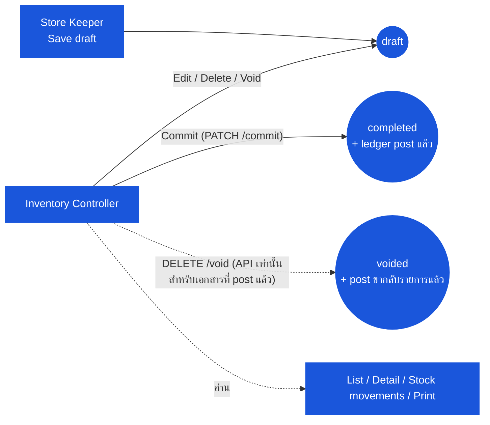

# การปรับสต๊อก (Inventory Adjustment) — User Flow — Inventory Controller

> **At a Glance**
> **Persona:** Inventory Controller (ผู้ใช้ใดก็ตามที่มีสิทธิ์ `inventory_management.view` — สิทธิ์เดียวกับ Store Keeper) &nbsp;·&nbsp; **โมดูล:** [inventory-adjustment](/th/inventory/inventory-adjustment) &nbsp;·&nbsp; **สิ่งที่ persona นี้ทำได้ที่ Store Keeper ทำไม่ได้:** ไม่มีอะไรที่ถูกบังคับ — ไม่มี action อนุมัติหรือ permission key ที่แยกทั้งสอง; *ธรรมเนียมปฏิบัติ* คือ Controller commit สิ่งที่คนอื่น draft ไว้และกลับรายการสิ่งที่ผิดพลาด
> **สิ่งที่ persona นี้ทำจริง:** กรองหน้ารายการเป็น `Draft` เปิดแต่ละ draft แก้ไข / ลบ / void หรือ **Commit** มัน; อ่านเอกสารที่ completed (รายละเอียด, **Stock movements**, Print); void เอกสารที่ post แล้วผ่าน API เมื่อต้องกลับรายการ

### ตำแหน่งเทียบกับวงจรชีวิต

```mermaid
graph LR
    sk["Store Keeper\nSave draft"]:::current --> draft(("draft")):::current
    ic["Inventory Controller"]:::current -->|"Edit / Delete / Void"| draft
    ic -->|"Commit (PATCH /commit)"| posted(("completed\n+ ledger post แล้ว")):::current
    ic -.->|"DELETE /void (API เท่านั้นสำหรับเอกสารที่ post แล้ว)"| voided(("voided\n+ post ขากลับรายการแล้ว")):::current
    ic -.->|"อ่าน"| views["List / Detail / Stock movements / Print"]:::current
    classDef current fill:#1a56db,color:#fff,stroke:#1a56db;
```

## 1. บทบาทในโมดูลนี้

ฉบับร่าง 2026-05 ของหน้านี้บรรยายผู้มีอำนาจอนุมัติเหนือ threshold ที่ review เอกสาร `in_progress`; ฉบับ 2026-07-15 จึงกล่าว (อย่างถูกต้องสำหรับโค้ดนั้น) ว่าไม่มีอะไรถูกทิ้งไว้ในสถานะที่ review ได้ ตั้งแต่ 2026-07-30 **มี**สิ่งให้ review แล้ว: draft สิ่งที่ยังไม่มีอยู่:

- ไม่มี `in_progress` ถูกกำหนดโดยโมดูลนี้เลย (`create` → `draft`, `commit` → `completed`, `void` → `voided`); filter สถานะ `In Progress` ของหน้ารายการเป็นตัวเลือกจาก component ที่แชร์กันซึ่งไม่เคย match stock-in/stock-out
- ไม่มี threshold ต่อผู้ใช้ ไม่มี `enum_stage_role` ไม่มีการเรียก workflow orchestrator — nav entry และทุก route gate ด้วย `inventory_management.view`
- ไม่มี action Approve / Reject — **Commit** คือ "การอนุมัติ" เพียงอย่างเดียว และใครก็ตามที่ถือ permission ของโมดูลกดได้

## 2. จุดเริ่มต้นและ Flow หลัก

**จุดเริ่มต้น:**

- **โมดูล Inventory Adjustment → หน้ารายการ** — กรองตามประเภท (URL param `adj_type`: Stock-In / Stock-Out), สถานะ (`Draft` / `Completed` / `Voided`; icon + label สถานะตั้งแต่ 2026-08-24), วันที่, คำค้น เอกสารที่ void แล้วถูก soft-delete โดย void endpoint จึงไม่ปรากฏในหน้ารายการ
- **โมดูล Inventory Adjustment → รายละเอียด (คลิกแถว)** — เปิดเอกสารในโหมด view `draft` แสดง **Edit** และ **Delete**; เอกสารที่ `completed` แสดง **Print** และแผง **Stock movements** (`GET /stock-ins/{id}/stock-movements`, `buildStockMovements`) ที่ list บรรทัดที่ post แล้วพร้อม lot, จำนวน, ต้นทุน และ transaction type

**Flow หลัก (review และ commit draft, 5 ขั้นตอน):**

1. **กรองหน้ารายการเป็น `Draft`** (และทิศทางที่สนใจ)
2. **เปิด draft** ตรวจ reason, ตำแหน่ง, วันที่ (ต้องอยู่ในงวด), บรรทัด และ — สำหรับ stock-in — `cost_per_unit` ที่กรอก
3. **แก้ไขหรือทิ้งถ้าจำเป็น** **Edit** → แก้ header/บรรทัด → **Save** (`PATCH /{id}/save`, ตรวจ `doc_version`); หรือ **Delete** (โหมด view, `DELETE /{id}`); หรือ **Edit** → **Void** พร้อมเหตุผล (`DELETE /{id}/void` — บน draft นี่เพียง mark เป็น `voided` + soft-delete ไม่มีอะไรให้กลับรายการ)
4. **Commit** **Commit** → confirm dialog → `PATCH /{id}/commit` พร้อม `doc_version` ปัจจุบัน Stock-out: service ตรวจ on-hand ต่อสินค้าก่อน (`STOCK_OUT_INSUFFICIENT_STOCK`); ทั้งสองทิศทาง re-check วันที่เอกสารเทียบกับงวด เมื่อสำเร็จ ledger rows มีอยู่แล้ว `inventory_transaction_id` ถูก stamp บนแต่ละบรรทัด และเอกสารเป็น `completed`
5. **ตรวจสอบ** เปิดเอกสารอีกครั้ง → **Stock movements** แสดง lot และ layer `adjustment_in` / `adjustment_out`; Transaction Log ([inventory/transaction](/th/inventory/inventory/transaction)) แสดง rows เดียวกันภายใต้เลข SI / SO

**การกลับรายการเอกสารที่ post แล้ว (API):** `DELETE /{bu}/stock-ins/{id}/void` (`{ void_reason }`) — `voidStockIn` ตรวจก่อนว่า on-hand ที่ตำแหน่งนั้นรองรับการกลับรายการของทุกบรรทัดที่ post แล้ว (`Cannot void: product … has insufficient on-hand qty (…) to reverse …`) แล้ว post `adjustment_out` ต่อบรรทัดที่ต้นทุนที่ ledger แก้ไขตอนนี้ และ mark header เป็น `voided` + `deleted_at` `voidStockOut` ทำแบบเดียวกันด้วยขา `adjustment_in` เอกสารจึงหายจาก query ของ list/detail

## 3. Decision Branches

- **draft ดูผิด** Edit แล้ว Save หรือ Delete / Void — ไม่มีสต๊อกขยับ จึงไม่ต้องกลับรายการอะไร
- **Commit ล้มเหลวเรื่องสต๊อก** draft ยังอยู่พร้อมข้อความขาด; ลดจำนวนหรือรับสต๊อกเข้าก่อน
- **Commit ล้มเหลวเรื่องวันที่** `STOCK_IN_DATE_OUTSIDE_OPEN_PERIOD` / `STOCK_OUT_DATE_NOT_CURRENT_PERIOD` — ลงวันที่ draft ใหม่ (stock-out ลงวันที่ในงวดก่อนหน้าที่ยังเปิดอยู่ไม่ได้)
- **เอกสารที่ post แล้วผิด** Void ผ่าน API (UI ไม่มีปุ่มสำหรับเอกสารที่ completed) หรือสร้าง adjustment ตรงข้าม
- **ใกล้ปิดงวด** stock-in / stock-out ที่เป็น `draft` และลงวันที่ในงวดทุกฉบับ block **Start Period Close** — commit หรือลบมันก่อน ([inventory/period-end](/th/inventory/inventory/period-end))

## 4. จุดสิ้นสุด

เอกสารที่ commit แล้ว immutable ใน UI; เอกสารที่ void แล้วออกจากหน้ารายการ การส่งต่อ: ไปยัง Store Keeper (แก้ draft) หรือไปยังผู้ดำเนินการปิดงวดเมื่อไม่มี draft เหลือสำหรับงวดนั้น

## 5. แหล่งอ้างอิง

- ภาพรวมหลัก: [03-user-flow](/th/inventory/inventory-adjustment/03-user-flow) — วงจรชีวิตและแผนที่ endpoint
- ส่วนคู่ขนาน: [03-user-flow-store-keeper](/th/inventory/inventory-adjustment/03-user-flow-store-keeper) — flow การกรอก
- ส่วนคู่ขนาน: [02-business-rules](/th/inventory/inventory-adjustment/02-business-rules) — `ADJ_POST_002`–`ADJ_POST_005` (save / commit / delete / void), `ADJ_VAL_010`–`ADJ_VAL_014`
- ส่วนคู่ขนาน: [01-data-model](/th/inventory/inventory-adjustment/01-data-model) — ค่า `doc_status` และพฤติกรรม void-ก็-soft-delete
- Frontend: `ia-component.tsx` (filter หน้ารายการ), `ia-form.tsx` / `ia-form-hero.tsx` (การ gate ของ Edit / Delete / Void / Commit / Print), `use-inventory-adjustment.ts`
- Backend: `stock-in.service.ts` / `stock-out.service.ts` (`commit`, `voidStockIn` / `voidStockOut`, `findStockShortage`, `getStockMovements`)
- ที่เกี่ยวข้อง: [inventory](/th/inventory/inventory) — ผลกระทบต่อ ledger ของ commit และ void ดูได้ผ่าน Transaction Log
