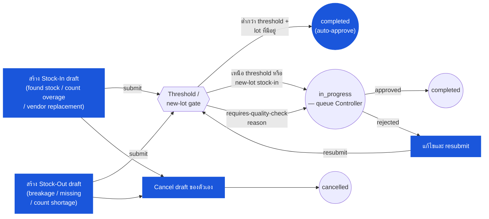

# การปรับสต๊อก (Inventory Adjustment) — User Flow — Store Keeper

> **At a Glance**
> **Persona:** Store Keeper &nbsp;·&nbsp; **โมดูล:** [inventory-adjustment](/th/inventory/inventory-adjustment) &nbsp;·&nbsp; **ขั้น workflow:** สร้าง `tb_stock_in` / `tb_stock_out` ที่ `draft` &nbsp;·&nbsp; submit &nbsp;·&nbsp; auto-approve ไปยัง `completed` (ต่ำกว่า threshold + lot ที่มีอยู่) หรือ route ไปยัง queue Controller (เหนือ threshold หรือ new-lot stock-in) &nbsp;·&nbsp; cancel draft ของตัวเอง &nbsp;·&nbsp; **สิทธิ์สำคัญ:** สร้าง / แก้ไข / submit / cancel draft ของตัวเอง (`ADJ_AUTH_001`); auto-approve ต่ำกว่า threshold (`ADJ_AUTH_002`)
> **persona นี้ทำอะไร:** ระบุความไม่ตรง (ของพบใหม่ / breakage / ผลต่างนับ), capture หลักฐาน และ submit draft adjustment

### ตำแหน่ง Workflow (Store Keeper เน้น)

### Permission Matrix — V1 Status × Action (Store Keeper)

Store Keeper ถือสิทธิ์สร้างและแก้ไขที่ `draft`, อำนาจ auto-approve สำหรับเอกสาร existing-lot ต่ำกว่า threshold และการมองเห็น read-only เมื่อ `in_progress` หรือ `completed` แถวมาจาก Section 2 (Entry Point and Primary Flow) ของไฟล์นี้; การอ้างอิงกฎหมายถึง [inventory-adjustment/02-business-rules](/th/inventory/inventory-adjustment/02-business-rules) § 4 (กฎ Authorization) และ § 5 (กฎ Posting)

| Action | `draft` | `in_progress` | `completed` | `cancelled` / `voided` |
|---|---|---|---|---|
| สร้าง `tb_stock_in` (stock-in adjustment) | ✅ (`ADJ_AUTH_001`) | — | — | — |
| สร้าง `tb_stock_out` (stock-out adjustment) | ✅ (`ADJ_AUTH_001`) | — | — | — |
| แก้ไข header (location, reason, description, department) | ✅ (`ADJ_AUTH_001`) | ❌ read-only ขณะรอการอนุมัติ | ❌ (`ADJ_VAL_013`) | ❌ |
| เพิ่ม / แก้ไข / ลบบรรทัด (product, qty, lot) | ✅ (`ADJ_AUTH_001`) | ❌ | ❌ (`ADJ_VAL_013`) | ❌ |
| กรอก `cost_per_unit` (stock-in, lot ใหม่) | ✅ (`ADJ_AUTH_001`) — route ไปยัง Controller ตาม `ADJ_AUTH_003` | ❌ | ❌ | ❌ |
| แนบหลักฐานประกอบ (รูปถ่าย, รายงานความเสียหาย, ป้าย lot) | ✅ (`ADJ_VAL_010`) | ✅ (comment เท่านั้น) | ❌ | ❌ |
| Submit — ต่ำกว่า threshold + lot ที่มีอยู่ (auto-approve) | ✅ (`ADJ_AUTH_002`) | — | — | — |
| Submit — เหนือ threshold หรือ new-lot stock-in | ✅ (`ADJ_AUTH_003`) — route ไปยัง Controller | — | — | — |
| Cancel draft ของตัวเอง | ✅ (`ADJ_POST_003`) | ❌ | ❌ | — |
| ดูเอกสาร (read-only) | ✅ | ✅ | ✅ | ✅ |
| สร้าง stock-out ขนาดใหญ่สำหรับ lot ที่พวกเขารับ (SoD) | ❌ (`ADJ_AUTH_010` — ข้อจำกัด SoD เหนือ threshold) | ❌ | — | — |

> ℹ️ **Auto-approve fast path:** เมื่อต้นทุนเอกสาร aggregate ต่ำกว่า tenant auto-approve threshold (default `฿500`) และ stock-in เป็นสำหรับ **lot ที่มีอยู่** (ไม่ใช่การสร้าง lot ใหม่) เอกสาร cascade `draft → in_progress → completed` ใน action submit เดียว Inventory transaction และ GL entry post ทันที งานของ Store Keeper สิ้นสุดที่จุดนี้โดยไม่มี handoff Controller

> ℹ️ **New-lot stock-in route ไปยัง Controller เสมอ:** แม้เมื่อต้นทุนต่ำกว่า auto-approve threshold stock-in ที่สร้าง **lot ใหม่** (`info.isNewLot = true`) route ไปยัง Inventory Controller เพื่ออนุมัติเสมอตาม `ADJ_AUTH_003` นี่คือเหตุการณ์อ่อนไหว — lot ใหม่สามารถซ่อนการ manipulate ต้นทุน — ดังนั้น Controller validate lot identity และ defensibility ของ `cost_per_unit` ก่อนอนุมัติ

## 1. บทบาทในโมดูลนี้

Persona **Store Keeper** (พับกับ Warehouse Staff ในแหล่ง carmen/docs) คือผู้ปฏิบัติงานระดับพื้นที่ที่ **ระบุความไม่ตรง ริเริ่ม adjustment แนบหลักฐานประกอบ และบันทึกเหตุผล** ภายในโมดูล inventory-adjustment Store Keeper ถือ:

- **อำนาจสร้าง** บนเอกสาร `tb_stock_in` (ขาเข้า: ของพบใหม่, count overage, recall replacement, vendor-supplied free replacement, data fix) และ `tb_stock_out` (ขาออก: breakage, expiry write-off, theft write-off, count shortage) ภายใน scope `tb_user_location` ของพวกเขาตาม `ADJ_AUTH_001`
- **อำนาจ post auto-approve** บนเอกสารต่ำกว่า threshold (default `฿500` aggregate cost, tenant-configurable) ตาม `ADJ_AUTH_002` — เอกสาร cascade `draft → in_progress → completed` ตอน submit, inventory transaction post ทันที และงานของ Store Keeper บนเอกสารนั้นสิ้นสุด
- **ไม่มีอำนาจอนุมัติ** บนเอกสารเหนือ threshold (route ไปยัง Inventory Controller ตาม `ADJ_AUTH_004`), ไม่มีอำนาจอนุมัติบน new-lot stock-in ไม่ว่าต้นทุน (route ไปยัง Controller เสมอตาม `ADJ_AUTH_003`), ไม่มีอำนาจกำหนดค่าบน `tb_adjustment_type` reason codes (System Administrator เป็นเจ้าของ), ไม่มีอำนาจแก้ไขบนเอกสาร `completed` (immutable ตาม `ADJ_VAL_013`) และไม่มีอำนาจที่เกี่ยวข้องกับงวด

Segregation of duties ภายใต้ `ADJ_AUTH_010` เพิ่มข้อจำกัดอีกหนึ่ง: Store Keeper ไม่สามารถสร้าง write-off ขนาดใหญ่ (`tb_stock_out` เหนือ SoD threshold) ต่อ lot ที่พวกเขารับเองผ่าน GRN การ write-off ขนาดเล็กตามปกติได้รับการยกเว้น; การ write-off ขนาดใหญ่ต้องการ adjuster อิสระ (Store Keeper คนละคน หรือ Inventory Controller สร้างเอกสารโดยตรง)

ความเป็นเจ้าของ inventory-adjustment ของ Store Keeper เริ่มเมื่อความไม่ตรงถูกระบุที่พื้นที่ (ระหว่างการตรวจสอบ bin, การ execute การนับ, การค้นพบ breakage, การ sweep expiry, vendor handover) และสิ้นสุดที่ขอบเขตหนึ่งที่ enumerate ใน Section 4 ด้านล่าง

## 2. จุดเข้าและ Primary Flow

**จุดเข้า:** สามประตูเข้า adjustment ที่ Store-Keeper-initiate บวกประตูที่สี่โดยปริยาย (count-rollup) ที่ Store Keeper คือผู้ execute การนับ

- **โมดูล Inventory Adjustment → New Stock-In** — ขาเข้าด้วยมือสำหรับ found-stock, count-overage (one-off, ad-hoc), vendor-replacement, data-fix สร้าง `tb_stock_in` ที่ `doc_status = draft`
- **โมดูล Inventory Adjustment → New Stock-Out** — ขาออกด้วยมือสำหรับ breakage, expiry write-off, theft write-off, count-shortage (one-off, ad-hoc) สร้าง `tb_stock_out` ที่ `doc_status = draft`
- **Quick-action จาก Inventory dashboard** — ปุ่ม "Report damage" / "Report found stock" ที่ pre-fill reason code และ route ไปยัง form Stock-In / Stock-Out ด้านบน
- *(โดยปริยาย)* **Physical Count / Spot Check run** — เมื่อการนับเสร็จด้วยผลต่าง การ commit ของ Inventory Controller จุดชนวนเอกสาร `tb_stock_in` / `tb_stock_out` auto-rollup ตาม `ADJ_POST_006` Store Keeper เป็นผู้ execute การนับ (ไม่ใช่ผู้สร้างเอกสารบน auto-rollup) แต่งานการนับของพวกเขาเป็น input ต้นทาง flow การนับเต็มอยู่ในไฟล์ persona ของ [physical-count](/th/inventory/physical-count) / [spot-check](/th/inventory/spot-check)

**Primary flow (manual stock-in สำหรับ found stock, 9 ขั้น — เป็นตัวอย่างของรูปแบบขาเข้า):**

1. **ระบุความไม่ตรง** ระหว่างการตรวจสอบ bin-stock ตามปกติหรือการเติม shelf, Store Keeper เห็นสต๊อกทางกายภาพมากกว่าที่ระบบแสดง พวกเขานับใหม่เพื่อยืนยัน, ตรวจสอบป้าย lot (ถ้าติดตาม lot), ถ่ายภาพป้าย lot / หลักฐานทางกายภาพ และบันทึกการอ้างอิง supplier / batch
2. **เปิดหน้าจอ Stock-In** โมดูล Inventory Adjustment → New Stock-In หน้าจอสร้าง `tb_stock_in` ที่ `doc_status = draft` ด้วย Store Keeper เป็น `created_by_id`, วันที่ / เวลาปัจจุบันเป็น `si_date` และ location ที่ pre-fill จาก mapping `tb_user_location` หลักของผู้ใช้ (override ได้ไปยัง location อื่นใน scope) Auto-numbering สร้าง `si_no` ตาม `ADJ_VAL_001`
3. **เลือก adjustment reason** บังคับ: `adjustment_type_id` อ้างอิง `tb_adjustment_type` ที่ filter โดย `type = STOCK_IN` ตาม `ADJ_VAL_002` เหตุผลทั่วไป: `FOUND_STOCK`, `COUNT_OVERAGE`, `RECALL_REPLACEMENT`, `VENDOR_FREE_REPLACEMENT`, `DATA_FIX` Reason code ขับเคลื่อนการจัดประเภท GL ปลายน้ำ (`info.glAccount`) และอาจ flag `requiresDocument` / `requiresQualityCheck`
4. **กรอก description** ข้อความอิสระระดับ header ที่บังคับตาม `ADJ_VAL_004` — อธิบายทำไมและเมื่อใด (เช่น "Bin check 2026-05-15 14:00; พบ 5 หน่วยของ P-1 บนชั้นล่าง ไม่บันทึกไว้ก่อนหน้า; ป้าย batch LOT-1 ตรงกับ system lot ที่มีอยู่") Soft-fail ตอน save; hard-fail ตอน submit
5. **เพิ่มบรรทัด** ต่อ product: `product_id` (auto-complete จาก product catalogue), `qty` (จำนวนเต็มบวกหรือทศนิยมสูงสุด 5dp), `lot_no` ของ lot (lot ที่มีอยู่ถ้าสต๊อกตรงกับป้ายที่รู้จัก; lot ใหม่ถ้า true found-stock โดยไม่มีบันทึกก่อนหน้า) สำหรับ lot ที่มีอยู่ `cost_per_unit` auto-fill จาก cost-layer ล่าสุดของ lot และ read-only สำหรับ lot ใหม่ `cost_per_unit` แก้ไขได้แต่เอกสาร route สำหรับ Controller approval ไม่ว่า threshold ตาม `ADJ_AUTH_003` สำหรับสินค้าเน่าเสียง่ายบน lot ใหม่ `expiryDate` ต้องการตาม `ADJ_VAL_009`
6. **แนบหลักฐานประกอบ** Drag-and-drop รูปถ่าย / เอกสารที่สแกนเข้าพื้นที่ comment / attachment เมื่อ `info.requiresDocument = true` ของ reason (ทั่วไปสำหรับ `RECALL_REPLACEMENT`, `FOUND_STOCK` ขนาดใหญ่) ต้องมี attachment อย่างน้อยหนึ่งตัวตาม `ADJ_VAL_010` — submit-side hard-fail มิฉะนั้น Attachments persist บน array JSON `tb_stock_in_comment.attachments` เป็น `{originalName, fileToken, contentType}`
7. **Set แผนก / cost-centre** บังคับ: รายการ JSON `dimension` `[{type: "department", id: "<uuid>", code: "<dept_code>"}, ...]` ตาม `ADJ_VAL_005` ปกติ pre-fill จากแผนก default ของผู้ใช้ แผนกขับเคลื่อน GL cost-centre บน journal entry ที่เกิดขึ้น
8. **Submit** คลิก **Submit** ระบบรันกฎ `ADJ_VAL_*` ทั้งหมด + การตรวจสอบล่วงหน้าฝั่ง inventory (no-negative-balance ไม่ใช้กับ stock-in; period-containment ตาม `ADJ_VAL_011` ใช้) Validation ผ่าน:
    - **ต่ำกว่า auto-approve threshold + ไม่ใช่ new-lot:** `draft → in_progress → completed` cascade ตาม `ADJ_POST_001` / `ADJ_POST_002` Inventory transaction post ทันที Activity log: `{action: 'auto_approve_post', threshold: <amount>}` ข้ามไปยังขั้น 9
    - **เหนือ threshold หรือ new-lot stock-in:** `draft → in_progress` เอกสารปรากฏใน queue ของ Inventory Controller ตาม `ADJ_AUTH_003` / `ADJ_AUTH_004` เอกสารเป็น read-only ต่อ Store Keeper ขณะ `in_progress` (พวกเขาสามารถ comment แต่ไม่แก้ไขบรรทัด) รอการอนุมัติ / reject ของ Controller
9. **Post จุดชนวน** Inventory write ตาม [inventory/02-business-rules](/th/inventory/inventory/02-business-rules) `INV_POST_001`: `tb_inventory_transaction` (`inventory_doc_type = stock_in`, `inventory_doc_no = tb_stock_in.id`); `tb_inventory_transaction_detail` (`qty > 0`, `cost_per_unit`, `total_cost`, `current_lot_no`); `tb_inventory_transaction_cost_layer` (`in_qty > 0`, `transaction_type = adjustment_in`, `cost_per_unit`, `lot_no`, `lot_index`, `lot_seq_no`, `at_period`, `period_id`); การ refresh weighted-average ตาม `ADJ_CALC_005` ถ้าสินค้าเป็น WA GL journal: `Dr Inventory / Cr <FOUND_STOCK gain GL account>` ที่ total เอกสาร `inventory_transaction_id` ของ detail ประทับ On-hand ที่ `(location, product, lot)` คือค่า derived ใหม่ตาม `INV_CALC_004` งานของ Store Keeper บนเอกสารนี้สิ้นสุด

Flow **stock-out** ดำเนินตามรูปทรงเดียวกันด้วยความแตกต่างหลัก:

- Reason picker filter ไปยัง `type = STOCK_OUT` (`BREAKAGE`, `EXPIRY_WRITE_OFF`, `THEFT_WRITE_OFF`, `COUNT_SHORTAGE`, `RECALL_WRITE_OFF`)
- `cost_per_unit` บนบรรทัด **ไม่ใช่ที่ผู้ใช้กรอก** — engine เลือกตอน post ตาม `ADJ_CALC_006` (FIFO) หรือ `ADJ_CALC_007` (WA) หน้าจอ render preview ("FIFO จะบริโภคจาก LOT-1 ที่ ฿10.00 ก่อน จากนั้น LOT-2 ที่ ฿12.00") เพื่อให้ Store Keeper flag การเลือกผิดปกติ
- Lot picker default ไปยังลำดับ FIFO แต่ override ได้สำหรับ `EXPIRY_WRITE_OFF` (write off lot ที่หมดอายุ ไม่ใช่ lot เก่าที่สุด); การ override บันทึกใน `info.lotOverride`
- การตรวจสอบ no-negative-balance จุดชนวนตอน submit ตาม `ADJ_VAL_012` / `INV_VAL_005` ถ้า `qty` เกิน on-hand ที่มีที่ lot ที่เลือก submit reject ด้วย `"Outbound movement would drive on-hand below zero."` — Store Keeper ลด `qty`, เลือก lot อื่น หรือ escalate ไปยัง Controller
- ข้อจำกัด SoD ตาม `ADJ_AUTH_010`: write-off ขนาดใหญ่ของ lot ที่ Store Keeper รับเอง reject ตอน submit; ต้องการ adjuster อิสระ
- Reason flag `info.requiresDocument` บ่อยขึ้น (breakage, theft, expiry-write-off โดยทั่วไปต้องการรูปถ่าย / หลักฐาน sign-off) — อย่างน้อยหนึ่ง attachment ตาม `ADJ_VAL_010`

Flow **count-rollup** เป็นเจ้าของโดยไฟล์ persona ของ [physical-count](/th/inventory/physical-count) / [spot-check](/th/inventory/spot-check); Store Keeper execute การนับ บรรทัดผลต่าง stage และ Inventory Controller commit — ซึ่งจุดชนวนเอกสาร `tb_stock_in` / `tb_stock_out` auto-rollup ตาม `ADJ_POST_006` Store Keeper ไม่สร้างหรือเป็นเจ้าของเอกสาร rollup เอง

## 3. การตัดสินใจ

- **ขาเข้า existing-lot vs new-lot** Lot ที่มีอยู่ — cost-per-unit auto-fill จาก cost-layer ล่าสุดของ lot, เอกสารดำเนินตาม gate threshold-vs-auto-approve มาตรฐาน Lot ใหม่ — `cost_per_unit` แก้ไขได้แต่เอกสาร **route สำหรับ Controller approval เสมอ** ไม่ว่าผลกระทบต้นทุน เพราะการสร้าง lot ใหม่เป็นเหตุการณ์อ่อนไหวที่สามารถซ่อนการ manipulate ต้นทุน
- **ต่ำกว่า vs เหนือ auto-approve threshold** ต่ำกว่า — เอกสาร auto-advance ไปยัง `completed` ตอน submit, inventory transaction post ทันที เหนือ — เอกสาร route ไปยัง queue ของ Inventory Controller; Store Keeper รอ (read-only ขณะ `in_progress`)
- **Stock-out cost-per-unit ผู้ใช้ไม่กรอก** สำหรับ stock-out, Store Keeper กรอกเฉพาะ `qty` Preview ต้นทุนแสดงลำดับ FIFO (หรือ WA ปัจจุบัน); ตอน submit, engine เลือกต้นทุนจริง Store Keeper เห็นต้นทุนที่เลือกใน activity log หลัง completion ความกังวลต้นทุนผิดปกติ escalate ไปยัง Controller ก่อน submit ไม่ใช่หลัง
- **Lot override สำหรับ expiry write-off** การเลือก lot default คือ FIFO (`lot_seq_no` ascending) สำหรับ `EXPIRY_WRITE_OFF`, Store Keeper override FIFO default ด้วย lot ที่หมดอายุเฉพาะ — ระบบบันทึก `info.lotOverride = <lot_no>` สำหรับ audit trail การ override ถูกพิสูจน์โดย reason code; เอกสารที่ไม่ใช่ `EXPIRY_WRITE_OFF` ที่มี lot override อาจ flag สำหรับ Controller review
- **ความพยายามยอดติดลบถูก reject** Stock-out submit reject ที่ validation layer ตาม `ADJ_VAL_012` / `INV_VAL_005` เมื่อ `qty` จะขับ on-hand ติดลบที่ lot ที่เลือก Store Keeper ลด `qty`, แบ่งข้าม lots (เอกสาร multi-line) หรือ escalate ไปยัง Controller เพื่อสืบสวน (ความไม่ตรงอาจระบุ inbound ที่ขาด — เช่น การรับที่ไม่บันทึก — ที่ warrant stock-in แยกเพื่อแก้ไขยอดก่อน)
- **Location-type gate** Picker location filter ไปยัง `enum_location_type ∈ {inventory, consignment}` ตาม `ADJ_VAL_003` และ [inventory](/th/inventory/inventory) `INV_VAL_009` Direct-cost locations ไม่ถือยอดและไม่สามารถปรับ Store Keeper เห็นตัวเลือกที่ disable พร้อม tooltip ถ้าพวกเขาพยายามสลับ
- **การรวม multi-line** เอกสาร stock-in หรือ stock-out เดียวสามารถถือบรรทัด product หลายตัว (ทั่วไปสำหรับ count-variance rollup หรือ write-off multi-product) Threshold auto-approve คือ **aggregate ข้ามบรรทัด** ไม่ใช่ต่อบรรทัด — เอกสาร multi-line ที่มี total cost เหนือ threshold route ไปยัง Controller แม้แต่ละบรรทัดต่ำกว่า threshold
- **Reason flag requires-quality-check** สำหรับเหตุผลที่ `info.requiresQualityCheck = true` (โดยทั่วไป expiry-write-off, recall-write-off, breakage ขนาดใหญ่), fast path auto-approve ถูกข้ามและเอกสาร **route ไปยัง Controller เสมอ** สำหรับ human review ไม่ว่าผลกระทบต้นทุน

## 4. จุดออก / Handoffs

การมีส่วนร่วมของ Store Keeper บน adjustment ที่กำหนดสิ้นสุดที่ขอบเขตหนึ่งในหก:

- **Auto-approve post เสร็จ** Stock-in / stock-out ที่ต่ำกว่า threshold, ไม่ใช่ new-lot, ไม่ใช่ requires-quality-check post ทันทีตอน submit `doc_status = completed`; inventory transaction post; GL entry สร้าง งานของ Store Keeper เสร็จ; ไม่มี handoff Activity log บันทึก `auto_approve_post`
- **Handoff เหนือ threshold ไปยัง Inventory Controller** เอกสารที่ `tb_stock_in.doc_status = in_progress` (หรือ `tb_stock_out.doc_status = in_progress`) route ไปยัง **Inventory Controller** ([03-user-flow-inventory-controller.md](./03-user-flow-inventory-controller.md)) เพื่ออนุมัติ Store Keeper re-engage เฉพาะถ้า Controller reject (เอกสาร return ไปยัง `draft`) หรือขอหลักฐานเพิ่มเติมบน activity log
- **Handoff new-lot ไปยัง Inventory Controller** เหมือนกับเหนือ threshold แต่จุดชนวนโดยกฎ new-lot ตาม `ADJ_AUTH_003` Controller validate identity / defensibility ของ cost-per-unit ของ lot ใหม่โดยเฉพาะก่อนอนุมัติ
- **Handoff count-execution ผ่านเอกสารนับ** เมื่องานประจำวันของ Store Keeper คือการ execute [physical-count](/th/inventory/physical-count) หรือ [spot-check](/th/inventory/spot-check) run, ผลกระทบ inventory-adjustment (variance rollup auto-post) จุดชนวนโดย commit ของ Inventory Controller ไม่ใช่โดย Store Keeper โดยตรง Anchor handoff คือ `tb_count_stock.status = completed`
- **เอกสาร cancel ก่อน post** ถ้า Store Keeper รู้กลาง draft ว่าความไม่ตรงเป็นข้อผิดพลาดในการนับหรือเอกสารผิด พวกเขา cancel — `doc_status = cancelled` พร้อมข้อความเหตุผล ไม่มีผลกระทบ inventory เอกสารที่ cancel คงอยู่ใน DB สำหรับ audit สถานะปลายทางจากฝั่ง Store Keeper
- **เอกสาร reject โดย Controller** ถ้า Controller reject เอกสาร `doc_status` return ไปยัง `draft` ด้วย comment rejection ใน `workflow_history` Store Keeper แก้ไขและ submit ใหม่ หรือ cancel ถ้าปัญหาไม่สามารถแก้ไข (เช่น recount ยืนยันว่าไม่มีความไม่ตรงเลย)

## 5. แหล่งอ้างอิง

- ภาพรวม parent: [03-user-flow.md](./03-user-flow.md) — วงจรชีวิตเอกสาร canonical (Section 2 การเปลี่ยนระดับเอกสาร; Section 2.2 auto-approve fast path; Section 2.3 fan-out ของ posting) ที่เส้นทางของ persona นี้ traverse; ตาราง handoff ข้าม persona ที่ anchor ขอบเขต Store Keeper → Inventory Controller
- Sibling: [03-user-flow-inventory-controller.md](./03-user-flow-inventory-controller.md) — persona ปลายน้ำที่รับเอกสาร above-threshold, new-lot และ requires-quality-check เพื่ออนุมัติ; commit rollups ผลต่างนับ
- Sibling: [03-user-flow-finance.md](./03-user-flow-finance.md) — persona ที่ปลายน้ำต่อสำหรับการอนุมัติเหนือ Controller threshold (recall write-offs ขนาดใหญ่, damage write-offs ขนาดใหญ่)
- Sibling: [03-user-flow-audit-config.md](./03-user-flow-audit-config.md) — System Administrator ที่กำหนดค่ารายการ `tb_adjustment_type` ที่ Store Keeper เลือกจาก, threshold auto-approve ที่ gate เปรียบเทียบ และ mapping `tb_user_location` ที่ scope locations ที่เลือกได้
- Sibling: [01-data-model.md](./01-data-model.md) — รูปทรง `tb_stock_in` / `tb_stock_out` canonical (อ้างอิงในขั้น 2–7 ของ primary flow), รูปทรง `tb_inventory_transaction` (ขั้น 9), ค่า `enum_adjustment_type` (`STOCK_IN` / `STOCK_OUT`), วงจรชีวิต `enum_doc_status`
- Sibling: [02-business-rules.md](./02-business-rules.md) — กฎ validation `ADJ_VAL_001` (เลขที่เอกสาร unique), `ADJ_VAL_002` (reason ตรงกับทิศทาง), `ADJ_VAL_003` (location active + ไม่ใช่ direct), `ADJ_VAL_004` (description บังคับ), `ADJ_VAL_005` (department ใน dimension), `ADJ_VAL_006` (product active), `ADJ_VAL_007` (qty > 0), `ADJ_VAL_008` (ต้นทุน non-negative), `ADJ_VAL_009` (lot identity), `ADJ_VAL_010` (attachment เมื่อต้องการ), `ADJ_VAL_011` (period gate), `ADJ_VAL_012` (no-negative-balance บน stock-out); กฎ auth `ADJ_AUTH_001`–`ADJ_AUTH_003` (Store Keeper create / auto-approve / new-lot gates), `ADJ_AUTH_010` (SoD); กฎ posting `ADJ_POST_001` (submit), `ADJ_POST_002` (post fan-out)
- ที่เกี่ยวข้อง: [inventory](/th/inventory/inventory) — ทุก adjustment post ไปยัง inventory; กฎ `INV_VAL_005` (no negative balance), `INV_VAL_008` (period gate), `INV_VAL_009` (direct-cost gate), `INV_CALC_005` / `INV_CALC_006` (cost picks), `INV_POST_001` / `INV_POST_002` (posting effects) คือกฎฝั่ง ledger canonical
- ที่เกี่ยวข้อง: [physical-count](/th/inventory/physical-count) — การ execute การนับที่ระดับ location; rollup ผลต่าง auto-create เอกสาร adjustment ผ่าน `ADJ_POST_006` / `ADJ_XMOD_002` Store Keeper execute การนับ แต่ไม่สร้างเอกสาร rollup โดยตรง
- ที่เกี่ยวข้อง: [spot-check](/th/inventory/spot-check) — การนับบางส่วน; รูปแบบ auto-rollup เดียวกับ physical-count ตาม `ADJ_XMOD_003`
- ที่เกี่ยวข้อง: [good-receive-note](/th/inventory/good-receive-note) — Store Keeper เป็นผู้ปฏิบัติงานทางกายภาพคนเดียวกันที่ dock; การ write-off recall ขนาดใหญ่อาจ cross-link ข้อมูล GRN lot ต้นทางผ่านลิงก์ source polymorphic ของ inventory transaction
- ที่เกี่ยวข้อง: [costing](/th/inventory/costing) — FIFO และ WA cost picking บนขาออก; การ refresh WA บนขาเข้าที่ post engine apply หลังการ submit ของ Store Keeper
