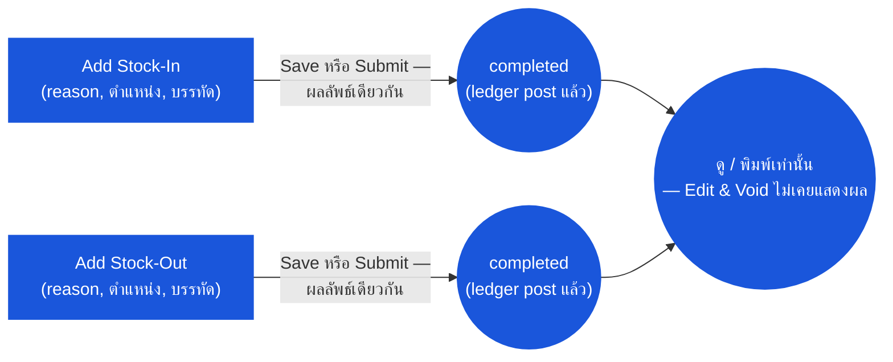

# การปรับสต๊อก (Inventory Adjustment) — User Flow — Store Keeper

> **At a Glance**
> **Persona:** Store Keeper (ผู้ใช้ใดก็ตามที่มีสิทธิ์ `inventory_management.view`) &nbsp;·&nbsp; **โมดูล:** [inventory-adjustment](/th/inventory/inventory-adjustment) &nbsp;·&nbsp; **สิ่งที่เกิดขึ้น:** กรอกฟอร์ม กด Save หรือ Submit — ปุ่มไหนก็ได้สร้างเอกสารที่ `completed` แล้วและ post เข้า ledger แล้ว &nbsp;·&nbsp; **สิทธิ์หลัก:** `inventory_management.view` (ทั่วไป; ไม่มี permission key สร้าง/แก้ไขเฉพาะที่ถูกตรวจสอบที่ไหนใน route ของโมดูลนี้)
> **สิ่งที่ persona นี้ทำ:** เปิด Add Stock-In / Add Stock-Out เลือก reason และตำแหน่ง กรอกบรรทัดสินค้า แล้ว submit

### ตำแหน่งใน Workflow

```mermaid
graph LR
    create_in["Add Stock-In\n(reason, ตำแหน่ง, บรรทัด)"]:::current -->|"Save หรือ Submit —\nผลลัพธ์เดียวกัน"| completed_in(("completed\n(ledger post แล้ว)")):::current
    create_out["Add Stock-Out\n(reason, ตำแหน่ง, บรรทัด)"]:::current -->|"Save หรือ Submit —\nผลลัพธ์เดียวกัน"| completed_out(("completed\n(ledger post แล้ว)")):::current
    completed_in --> readonly(("ดู / พิมพ์เท่านั้น\n— Edit & Void ไม่เคยแสดงผล")):::current
    completed_out --> readonly
    classDef current fill:#1a56db,color:#fff,stroke:#1a56db;
```

## 1. บทบาทในโมดูลนี้

ไม่มีความแตกต่างระดับโค้ดระหว่าง "Store Keeper" กับผู้ใช้อื่นของหน้าจอนี้ — nav entry และ route สร้าง/แก้ไขทั้งหมด gate ด้วยสิทธิ์ทั่วไปตัวเดียว `inventory_management.view` หน้านี้บรรยาย flow จากมุมมองของผู้กรอกเอกสารจริง (ของพบใหม่, ของแตก, ผลต่างจากการนับ) ภายในโมดูล ผู้ใช้นั้น:

- เปิด **Add Stock-In** (`/inventory-management/inventory-adjustment/new?type=stock-in`) หรือ **Add Stock-Out** (`...?type=stock-out`)
- เลือก reason จากรายการที่กรองตามทิศทาง (แถว `tb_adjustment_type` ที่ `type` ตรงกัน), ตำแหน่ง (กรองเหลือประเภท Inventory/Consignment ฝั่ง client) และบรรทัดสินค้าหนึ่งรายการขึ้นไป
- กด **Save** หรือ **Submit** — ทั้งคู่เรียก mutation `create()` เดียวกัน และ backend เขียน `doc_status = completed` พร้อม post เข้า ledger ไม่ว่าจะกดปุ่มไหน (ดู [02 — กติกาทางธุรกิจ](/th/inventory/inventory-adjustment/02-business-rules) § 1)
- ไม่มี action ใดให้ทำต่อบนเอกสารนั้นอีก เมื่อเอกสารมีอยู่แล้ว — ปุ่ม Edit และ Void ไม่เคยแสดงผลสำหรับเอกสารที่ persist แล้ว (ดู landing page § 1) และ action Delete ของหน้ารายการ แม้จะแสดงผลเสมอ ก็ล้มเหลวฝั่ง server เสมอ

## 2. จุดเริ่มต้นและ Flow หลัก

**จุดเริ่มต้น:**

- **โมดูล Inventory Adjustment → Add Stock-In** — สำหรับของพบใหม่ ส่วนเกินจากการนับ หรือการแก้ไขเพิ่มอื่นใด
- **โมดูล Inventory Adjustment → Add Stock-Out** — สำหรับของแตก หมดอายุ ขาดจากการนับ หรือการแก้ไขลดอื่นใด

**Flow หลัก (Stock-In, 6 ขั้นตอน):**

1. **เปิด Add Stock-In** วันที่ของฟอร์ม default เป็นวันนี้ ถูก cap ที่วันสิ้นสุดของงวดปัจจุบัน (`resolveDefaultDate`)
2. **เลือก reason** ฟิลด์ **Reason** (`adjustment_type_id`) แสดงเฉพาะแถว `tb_adjustment_type` ที่ active และ `type = stock_in` กรองฝั่ง client
3. **เลือกตำแหน่ง** `LookupUserLocation` กรองเหลือประเภทตำแหน่ง Inventory/Consignment
4. **เพิ่มบรรทัด** การคลิก **Add Item** ต้องเลือกตำแหน่งไว้ก่อนแล้ว แต่ละบรรทัด: เลือกสินค้า (จำกัดขอบเขตด้วยตำแหน่งที่เลือกผ่าน `LookupProductInLocation`), กรอก `qty` (ต้อง `>= 1`) และ `cost_per_unit` — เติมเริ่มต้นจากต้นทุนเฉลี่ยปัจจุบันของสินค้าที่ตำแหน่งนั้นเป็นข้อเสนอ แต่แก้ไขได้เต็มที่; ค่าที่ส่งจะกลายเป็นต้นทุนของ cost layer ใหม่
5. **กรอกคำอธิบาย optional** (สูงสุด 256 ตัวอักษร; ไม่บังคับ)
6. **กด Save หรือ Submit** ทั้งคู่ post ทันที: เอกสารถูกสร้างที่ `doc_status = completed`, `tb_inventory_transaction` + แถว cost-layer ถูกเขียนในทรานแซกชันเดียวกัน และผู้ใช้ถูกนำกลับไปที่หน้ารายการ

**Stock-Out ต่างกันสองจุด:**

- คอลัมน์ `cost_per_unit` ถูกซ่อนออกจาก grid บรรทัดทั้งหมด — ไม่มีอะไรให้กรอกเรื่องต้นทุน
- ต้นทุนจริงถูกแก้ไขอัตโนมัติโดย ledger ตอนเขียน: สินค้าที่ใช้ FIFO บริโภคจาก cost layer เก่าสุดก่อน; สินค้าที่ใช้ Average คิดที่ค่าเฉลี่ยปัจจุบันของ BU ถ้า `qty` ที่ขอเกิน on-hand ที่ตำแหน่งนั้น (ยืนยันเฉพาะสินค้าที่ใช้ Average) การสร้างทั้งหมดล้มเหลวด้วย `"Insufficient stock. Requested: <X>, Available: <Y>"` และไม่มีเอกสารถูกสร้าง

## 3. Decision Branches

- **Save เทียบกับ Submit** ไม่มีความแตกต่าง — ทั้งคู่ให้เอกสารที่ post แล้วและ `completed` ทันที (ดู [03-user-flow.md](./03-user-flow.md) § 2.1)
- **การกรอกต้นทุน Stock-In** ต้นทุนที่เสนอจาก `useProductCostByLocationQty` override ได้อย่างอิสระ; ไม่มี gate อนุมัติสำหรับการทำเช่นนั้น ไม่ว่าต้นทุนที่กรอกจะห่างจากข้อเสนอเท่าใด
- **สต๊อกไม่พอบน Stock-Out** ถูกปฏิเสธเฉพาะสำหรับสินค้าที่ใช้ Average costing ในการอ่านซอร์สรอบนี้; พฤติกรรมของสินค้าที่ใช้ FIFO เมื่อ qty เกินจำนวนที่มียังไม่ได้ยืนยันแยกต่างหาก และควรถือว่ายังไม่ยืนยัน
- **ความผิดพลาดหลังการ post** ไม่มีทางแก้ไขใน app — Edit และ Void ทั้งคู่เข้าไม่ถึงสำหรับเอกสารที่ persist แล้ว วิธีเดียวที่จะกลับรายการรายการที่ผิดในปัจจุบันต้องการการเรียก API โดยตรงไปยัง void endpoint หรือ (ในทางปฏิบัติ) การสร้าง adjustment ทิศทางตรงข้ามเป็นการแก้ไขด้วยมือ

## 4. จุดสิ้นสุด

เอกสาร `completed` ทันทีที่ `create()` คืนค่าสำเร็จ — ไม่มีการส่งต่อไปยังผู้ตรวจสอบ เพราะไม่มี role ผู้ตรวจสอบในโค้ด การมีส่วนร่วมของผู้ใช้จบลง ณ จุดนั้น; เอกสารหลังจากนั้นมองเห็นได้เฉพาะในหน้ารายการ/รายละเอียด/พิมพ์

## 5. แหล่งอ้างอิง

- ภาพรวมหลัก: [03-user-flow.md](./03-user-flow.md) — วงจรชีวิตแบบเป็น completed เสมอ และ code path ที่ตายแล้วของ Edit/Void
- ส่วนคู่ขนาน: [03-user-flow-inventory-controller.md](./03-user-flow-inventory-controller.md) — หน้าจอเดียวกัน บรรยายจากมุมมองการ review ภายหลัง
- ส่วนคู่ขนาน: [02-business-rules.md](./02-business-rules.md) — `ADJ_VAL_001`–`ADJ_VAL_013`, `ADJ_CALC_001`–`ADJ_CALC_007`, `ADJ_POST_001`
- ส่วนคู่ขนาน: [01-data-model.md](./01-data-model.md) — รูปทรง `tb_stock_in`/`tb_stock_out` ที่อ้างอิงในขั้นตอน 2–5 ด้านบน
- ที่เกี่ยวข้อง: [inventory](/th/inventory/inventory) — ledger ที่ทุกการ post เขียนไป
- ที่เกี่ยวข้อง: [costing](/th/inventory/costing) — การแก้ไขต้นทุน FIFO/Average บน Stock-Out; การคำนวณค่าเฉลี่ยถ่วงน้ำหนักใหม่บน Stock-In
