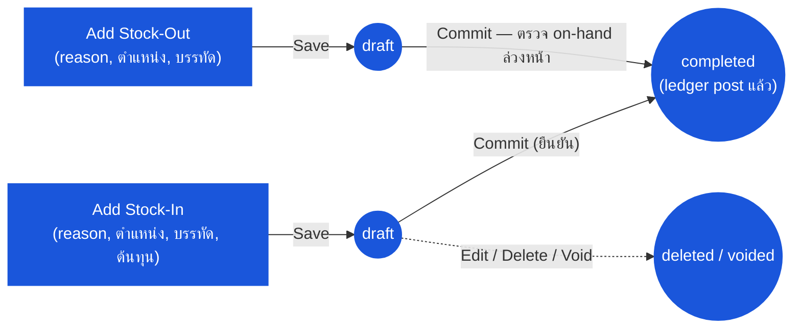

# การปรับสต๊อก (Inventory Adjustment) — User Flow — Store Keeper

> **At a Glance**
> **Persona:** Store Keeper (ผู้ใช้ใดก็ตามที่มีสิทธิ์ `inventory_management.view`) &nbsp;·&nbsp; **โมดูล:** [inventory-adjustment](/th/inventory/inventory-adjustment) &nbsp;·&nbsp; **สิ่งที่เกิดขึ้น:** กรอกฟอร์ม **Save** เป็น `draft` (ยังไม่มีอะไรขยับ) **Commit** เพื่อ post — `PATCH /{id}/commit` เขียน ledger และ lock เอกสาร &nbsp;·&nbsp; **สิทธิ์หลัก:** `inventory_management.view` (ทั่วไป; ไม่มี permission สร้าง/commit เฉพาะที่ถูกตรวจสอบใน route ของโมดูลนี้)
> **สิ่งที่ persona นี้ทำ:** เปิด Add Stock-In / Add Stock-Out เลือก reason และตำแหน่ง กรอกบรรทัดสินค้า save แล้ว commit

### ตำแหน่งใน Workflow

```mermaid
graph LR
    create_in["Add Stock-In\n(reason, ตำแหน่ง, บรรทัด, ต้นทุน)"]:::current -->|"Save"| draft_in(("draft")):::current
    create_out["Add Stock-Out\n(reason, ตำแหน่ง, บรรทัด)"]:::current -->|"Save"| draft_out(("draft")):::current
    draft_in -->|"Commit (ยืนยัน)"| posted(("completed\n(ledger post แล้ว)")):::current
    draft_out -->|"Commit — ตรวจ on-hand ล่วงหน้า"| posted
    draft_in -.->|"Edit / Delete / Void"| gone(("deleted / voided")):::current
    classDef current fill:#1a56db,color:#fff,stroke:#1a56db;
```

## 1. บทบาทในโมดูลนี้

ไม่มีความแตกต่างระดับโค้ดระหว่าง "Store Keeper" กับผู้ใช้อื่นของหน้าจอนี้ — nav entry และ route ทั้งหมด gate ด้วยสิทธิ์ทั่วไปตัวเดียว `inventory_management.view` หน้านี้บรรยาย flow จากมุมมองของผู้กรอกเอกสารจริง (ของพบใหม่, ของแตก, ผลต่างจากการนับ) ภายในโมดูล ผู้ใช้นั้น:

- เปิด **Add Stock-In** (`/inventory-management/inventory-adjustment/new?type=stock-in`) หรือ **Add Stock-Out** (`…?type=stock-out`)
- เลือก reason จากรายการที่กรองตามทิศทาง (แถว `tb_adjustment_type` ที่ `type` ตรงกัน), ตำแหน่ง (กรองเหลือประเภท Inventory/Consignment ฝั่ง client) และบรรทัดสินค้าหนึ่งรายการขึ้นไป
- กด **Save** เพื่อเก็บ `draft` (`POST /stock-ins` | `/stock-outs`; แอปคงอยู่ที่เอกสารใหม่ในโหมด view) หรือ **Commit** เพื่อ post การ Commit จากฟอร์มที่ยังไม่เคย save จะสร้าง draft ก่อน แล้วเรียก `PATCH /{id}/commit` (`confirmCommit`, `ia-form.tsx`)
- เปิด draft อีกครั้งได้ (**Edit**) แก้ header และบรรทัด (`PATCH /{id}/save`) **Delete** จากโหมด view หรือ **Void** จากโหมด Edit

## 2. จุดเริ่มต้นและ Flow หลัก

**จุดเริ่มต้น:**

- **โมดูล Inventory Adjustment → Add Stock-In** — สำหรับของพบใหม่ ส่วนเกินจากการนับ หรือการแก้ไขเพิ่มอื่นใด
- **โมดูล Inventory Adjustment → Add Stock-Out** — สำหรับของแตก หมดอายุ ขาดจากการนับ หรือการแก้ไขลดอื่นใด

**Flow หลัก (Stock-In, 7 ขั้นตอน):**

1. **เปิด Add Stock-In** วันที่ของฟอร์ม default เป็นวันนี้ ถูก cap ที่วันสิ้นสุดของงวดปัจจุบัน (`resolveDefaultDate`); ต้องอยู่ในช่วงงวดปัจจุบัน (Zod) และฝั่ง server ต้องอยู่ในงวด inventory ที่ open/locked
2. **เลือก reason** ฟิลด์ **Reason** (`adjustment_type_id`) แสดงเฉพาะแถว `tb_adjustment_type` ที่ active และ `type = stock_in` กรองฝั่ง client
3. **เลือกตำแหน่ง** `LookupUserLocation` กรองเหลือประเภทตำแหน่ง Inventory/Consignment
4. **เพิ่มบรรทัด** การคลิก **Add Item** เปิด product picker ทันที (`1f0f1f1a`) และเตือนถ้ายังไม่ได้เลือกตำแหน่ง แต่ละบรรทัด: สินค้า (จำกัดขอบเขตด้วยตำแหน่งที่เลือก), `qty` (`≥ 0` ใน Zod, `min(0)`), `cost_per_unit` — เติมเริ่มต้นจากต้นทุนปัจจุบันของสินค้าที่ตำแหน่งนั้น (`useProductCostByLocationQty`, `e246abaa`) แต่แก้ไขได้ (API ยังรับ `expired_at` ต่อบรรทัด; ฟอร์มไม่มีฟิลด์นี้)
5. **กรอกคำอธิบาย optional** (สูงสุด 256 ตัวอักษร; ไม่บังคับ)
6. **Save** `POST /stock-ins` สร้าง header ที่ `draft` โดย `si_no` ออกเลขจาก `si_date`; หน้าจอสลับเป็นโหมด view บนเอกสารใหม่ ยังไม่มีอะไรขยับ
7. **Commit** ฟอร์มถูก validate ก่อน แล้ว confirm dialog ("commit = post เข้าสต๊อก แก้ไขต่อไม่ได้") เปิด; เมื่อยืนยัน `PATCH /stock-ins/{id}/commit` พร้อม `doc_version` ปัจจุบัน post ทุกบรรทัด (`executeAdjustmentIn` — cost layer ใหม่ที่ต้นทุนที่กรอก, `at_period` จาก `si_date`), stamp `inventory_transaction_id`, ตั้ง `completed` และกลับไปหน้ารายการ

**Stock-Out ต่างกันสามจุด:**

- คอลัมน์ `cost_per_unit` ถูกซ่อน — ต้นทุนถูกแก้ไขโดย ledger ตอน commit (FIFO layer เก่าสุดก่อน; Average ที่ค่าเฉลี่ยปัจจุบันของ BU) และไม่เคย persist บน `tb_stock_out_detail`
- วันที่ต้องอยู่ในงวด**ปัจจุบัน** (`STOCK_OUT_DATE_NOT_CURRENT_PERIOD`) ไม่ใช่งวดที่เปิดใดก็ได้
- Commit ตรวจ on-hand ต่อสินค้าล่วงหน้า: ถ้าขาดจะคืน `Insufficient stock for {product} at {location}: on hand {x}, requested {y}` (400) และไม่มีอะไรถูกเขียน

## 3. Decision Branches

- **Save เทียบกับ Commit** Save = draft ที่แก้ไขได้ ไม่มีผลต่อสต๊อก Commit = การ post ที่ย้อนกลับไม่ได้ (มีเพียง Void ผ่าน API ที่กลับรายการได้ภายหลัง)
- **การกรอกต้นทุน Stock-In** ต้นทุนที่เสนอ override ได้อย่างอิสระ; ไม่มี gate อนุมัติสำหรับการทำเช่นนั้น
- **สต๊อกไม่พอบน Stock-Out** ถูกปฏิเสธตอน commit สำหรับทั้งสองวิธีคิดต้นทุน (การตรวจล่วงหน้าของ service `findStockShortage`); draft ยังอยู่จึงแก้จำนวนได้
- **วันที่นอกงวด** ถูกปฏิเสธตอน save (422) และอีกครั้งตอน commit; ลงวันที่ draft ใหม่
- **ความผิดพลาดก่อน commit** แก้ไข draft, Delete มัน (โหมด view) หรือ Void มัน (โหมด Edit → Void พร้อมเหตุผล)
- **ความผิดพลาดหลัง commit** UI ไม่มีปุ่ม Void บนเอกสารที่ completed (`canVoid` ต้องการโหมด Edit ซึ่งเอกสารที่ completed เข้าไม่ได้) เรียก `DELETE /{id}/void` โดยตรง หรือสร้าง adjustment ทิศทางตรงข้าม

## 4. จุดสิ้นสุด

เอกสารที่ commit แล้วเป็น `completed` ทันทีที่ `commit()` คืนค่า; การมีส่วนร่วมของผู้ใช้จบลง ณ จุดนั้น draft คงอยู่ในหน้ารายการ (filter สถานะ `Draft`) จนกว่าจะ commit, delete หรือ void

## 5. แหล่งอ้างอิง

- ภาพรวมหลัก: [03-user-flow](/th/inventory/inventory-adjustment/03-user-flow) — วงจรชีวิต draft → commit → void และแผนที่ endpoint
- ส่วนคู่ขนาน: [03-user-flow-inventory-controller](/th/inventory/inventory-adjustment/03-user-flow-inventory-controller) — หน้าจอเดียวกัน บรรยายจากมุมมอง review-แล้ว-commit
- ส่วนคู่ขนาน: [02-business-rules](/th/inventory/inventory-adjustment/02-business-rules) — `ADJ_VAL_001`–`ADJ_VAL_014`, `ADJ_CALC_001`–`ADJ_CALC_007`, `ADJ_POST_001`–`ADJ_POST_006`
- ส่วนคู่ขนาน: [01-data-model](/th/inventory/inventory-adjustment/01-data-model) — รูปทรง `tb_stock_in`/`tb_stock_out` ที่อ้างอิงด้านบน
- Frontend: `ia-form.tsx` (`confirmCommit`, `isReadOnly`), `ia-form-hero.tsx`, `use-ia-item-table.tsx` (การเติมต้นทุนล่วงหน้า), `ia-form-schema.ts`, `use-inventory-adjustment.ts`
- ที่เกี่ยวข้อง: [inventory](/th/inventory/inventory) — ledger ที่ทุก commit เขียนไป; [costing](/th/inventory/costing) — การแก้ไขต้นทุน FIFO/Average
