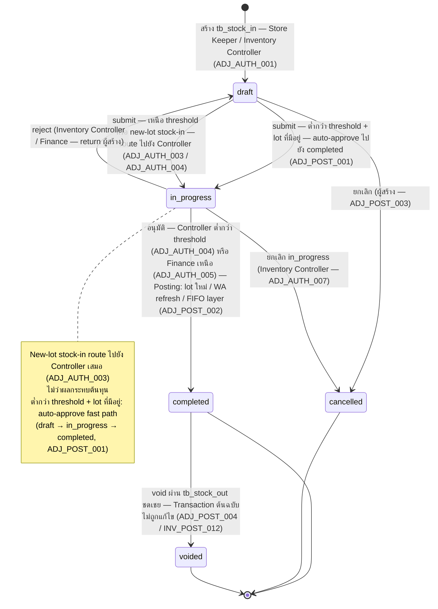
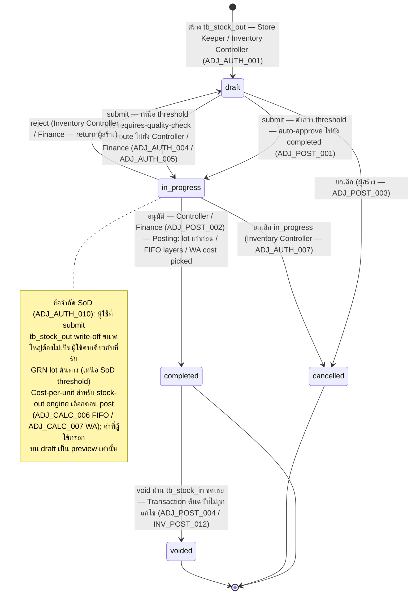

# การปรับสต๊อก (Inventory Adjustment) — User Flow

> **At a Glance**
> **โมดูล:** [inventory-adjustment](/th/inventory/inventory-adjustment) &nbsp;·&nbsp; **Personas:** Store Keeper &nbsp;·&nbsp; Inventory Controller &nbsp;·&nbsp; Finance &nbsp;·&nbsp; Audit / Config (Auditor + Sysadmin)
> **วงจรชีวิต workflow:** `draft → in_progress → completed → (voided ผ่าน compensating)` ตาม `enum_doc_status`; cancel ก่อน post ผ่าน `draft / in_progress → cancelled` สองต้นคู่ขนาน — `tb_stock_in` (IN) และ `tb_stock_out` (OUT) ต่ำกว่า threshold + lot ที่มีอยู่ auto-approves; เหนือ threshold หรือ new-lot route ไปยัง Controller / Finance
> **เจาะลึก views ต่อ persona ด้านล่างสำหรับรายละเอียดระดับ action**

## 1. ภาพรวม

หน้านี้คือ **จุดเข้าภาพรวม** สำหรับชุด user-flow ของโมดูล `inventory-adjustment` โมดูล adjustment คือ **classic document-driven module** แตกต่างจาก sibling [inventory](/th/inventory/inventory) — งานเคลื่อนตาม header ที่จับต้องได้ที่ persona เห็น แก้ไข และดำเนินการบน: เอกสาร `tb_stock_in` (ขาเข้า write-on) หรือ `tb_stock_out` (ขาออก write-off) ที่ถือวงจรชีวิต `doc_status` (`draft → in_progress → completed → cancelled / voided`), สถานะ workflow, comments / attachments และบรรทัด detail ต่อ product สิ่งที่ทำให้ adjustments ต่างจาก PR หรือ PO คือลิงก์ที่เคร่งครัดไปยัง inventory ledger: ทุกเอกสาร `completed` เขียนหนึ่ง `tb_inventory_transaction` ต่อบรรทัด detail ด้วย `enum_inventory_doc_type = stock_in` / `stock_out` และการเขียน ledger นั้นคือ anchor การเงิน / audit เมื่อ post แล้วเอกสาร immutable; การแก้ไขต้องการ void + compensating adjustment ใหม่ตาม [inventory-adjustment/02-business-rules](/th/inventory/inventory-adjustment/02-business-rules) `ADJ_POST_004` และ [inventory](/th/inventory/inventory) `INV_POST_012`

Section 2 ด้านล่างบรรยาย **state machine ของวงจรชีวิตเอกสาร** — ชุด canonical ของการเปลี่ยน `doc_status` ที่ถูกกฎหมาย เป็นอิสระจากผู้กระทำ ไฟล์ต่อ persona แต่ละไฟล์ (ลิงก์จาก Section 3) บรรยาย *เส้นทางผ่าน* state space นี้ของ persona นั้น — จุดเข้า, action ที่ทำได้, การตัดสินใจที่เผชิญ และ handoff ที่จบการมีส่วนร่วม Section 4 จากนั้นสรุป handoffs ข้าม persona ที่ stitch เส้นทางส่วนตัวเข้าด้วยกัน (Store Keeper → Inventory Controller สำหรับการอนุมัติเหนือ threshold; Inventory Controller → Finance สำหรับการอนุมัติต้นทุนขนาดใหญ่; Finance → period close; System Administrator → ทุก personas สำหรับการกำหนดค่า reason-code / threshold) อ่านภาพรวมนี้ก่อนเพื่อ anchor วงจรชีวิต จากนั้นเจาะลึกไฟล์ persona ที่ตรงกับบทบาทของคุณ

## 2. วงจรชีวิตเอกสาร

เอกสารดำเนินตามวงจรชีวิตห้าสถานะ Prisma บน `enum_doc_status` กรอบ carmen/docs ของ "Draft → Posted → Void" ยุบ workflow stage ที่ระบุชัดเจน (`in_progress`) และสถานะ cancel ก่อน post (`cancelled`); ตารางด้านล่างใช้ความจริง Prisma ห้าสถานะตาม [inventory-adjustment/01-data-model](/th/inventory/inventory-adjustment/01-data-model) § 5 ข้อ 4

โมดูล adjustment ใช้ **สองต้นเอกสารคู่ขนาน** — `tb_stock_in` (ทิศทาง IN / stock-in adjustment) และ `tb_stock_out` (ทิศทาง OUT / stock-out adjustment) — ทั้งคู่กำกับโดย `enum_doc_status` ห้าสถานะเดียวกัน แผนภาพด้านล่างแสดงการเปลี่ยน `doc_status` ที่ถูกกฎหมายสำหรับแต่ละต้นเอกสาร ตัวจำแนก `enum_adjustment_type` (`STOCK_IN` / `STOCK_OUT`) บน master ของ reason-code (`tb_adjustment_type`) gate ว่าต้นใดที่ reason ใช้ได้

**Stock-in adjustment (`tb_stock_in`) — ทิศทาง IN (badge เขียว):**

**Stock-out adjustment (`tb_stock_out`) — ทิศทาง OUT (badge แดง):**

> ℹ️ **Note — `enum_doc_status` เดียว, สองต้นเอกสาร:** ทั้ง `tb_stock_in` และ `tb_stock_out` แชร์ `enum_doc_status` เดียวกัน (`draft`, `in_progress`, `completed`, `cancelled`, `voided`) แผนภาพสองตัวด้านบนแสดงกฎการเปลี่ยนเดียวกันที่ apply กับแต่ละต้น; ความต่างเชิงพฤติกรรมหลักอยู่ใน fan-out ของการ posting: stock-in สร้าง lot ใหม่และเพิ่ม cost layer (หรือ refresh WA) ในขณะที่ stock-out บริโภค lot ที่มีอยู่จากเก่าก่อนและเลือกต้นทุนตอน post เอกสาร count-rollup (`ADJ_POST_006`) auto-advance ไป `completed` ภายใต้อำนาจ commit ของ Inventory Controller ข้าม queue การอนุมัติ `in_progress` ที่ระบุชัดเจน

### 2.1 การเปลี่ยนระดับเอกสาร

| จากสถานะ | Action | ไปสถานะ | อนุญาตสำหรับ | เงื่อนไขล่วงหน้า |
| -------- | ------ | ------- | ----------- | -------------- |
| `(none)` | สร้าง `tb_stock_in` / `tb_stock_out` ใหม่ | `draft` | Store Keeper, Inventory Controller, Finance (สำหรับ ad-hoc); System สำหรับ count-rollup | ผู้ใช้ภายใน scope `tb_user_location` ตาม `ADJ_AUTH_001`; location เป็นประเภท inventory- หรือ consignment- ตาม `ADJ_VAL_003` Auto-numbering สร้าง `si_no` / `so_no` ตาม `ADJ_VAL_001` |
| `draft` | แก้ไขบรรทัด / attachments / description / reason | `draft` | ผู้สร้าง + Inventory Controller (ภายใน scope) | Validation `ADJ_VAL_002`–`ADJ_VAL_010` รันที่ save (soft-fail สำหรับบางตัว) ยังไม่มีผลกระทบ inventory |
| `draft` | submit | `in_progress` (เหนือ threshold หรือ new-lot) | ผู้สร้าง | `ADJ_VAL_001`–`ADJ_VAL_011` ทั้งหมดผ่าน; `INV_VAL_005` (no negative balance) pre-check ผ่านสำหรับ stock-out เอกสาร route ไปยัง queue ของ Controller `workflow_history` ต่อด้วย; `last_action = submitted` |
| `draft` | submit auto-approve | `completed` (cascade ผ่าน `in_progress`) | Store Keeper | Validations ทั้งหมดผ่าน; ต้นทุนเอกสาร aggregate ต่ำกว่า threshold auto-approve ตาม `ADJ_AUTH_002`; ไม่ใช่ new-lot stock-in ตาม `ADJ_AUTH_003` ระบบ auto-fire posting `ADJ_POST_002` ตาม `ADJ_POST_001` |
| `draft` | cancel | `cancelled` | ผู้สร้าง | ไม่มีผลกระทบ inventory; ข้อความเหตุผลต้องการ เอกสารคงอยู่ใน DB สำหรับ audit ปลายทาง |
| `in_progress` | อนุมัติ | `completed` | Inventory Controller (ต่ำกว่า `ADJ_AUTH_005` threshold) หรือ Finance (เหนือ) | Validations ทั้งหมด re-check; period containment re-check ที่ post ตาม `ADJ_VAL_011` `ADJ_POST_002` จุดชนวน — เขียน inventory transaction, cost-layer rows, GL entries เอกสารกลายเป็น immutable |
| `in_progress` | reject | `draft` | Inventory Controller, Finance | Comment / เหตุผลของผู้ตรวจสอบบันทึกใน `workflow_history`; เอกสาร return ไปยังผู้สร้างสำหรับการแก้ไขหรือยกเลิก ไม่มีผลกระทบ inventory |
| `in_progress` | cancel | `cancelled` | ผู้ตรวจสอบ (Controller / Finance) | ผู้ตรวจสอบสรุปว่า adjustment ไม่จำเป็น (เช่น recount แก้ไขความไม่ตรง) ไม่มีผลกระทบ inventory; ปลายทาง |
| `completed` | view / report | `completed` | ทุก personas (ตาม scope) | สถานะ active ปลายทาง Activity log, journal entries, inventory transaction join ทั้งหมดอ่านได้ เอกสาร immutable ตาม `ADJ_VAL_013` |
| `completed` | void ผ่าน adjustment ชดเชย | `voided` | Inventory Controller, Finance | `tb_stock_in` / `tb_stock_out` ชดเชยถูกสร้างพร้อมทิศทางกลับและ `info.voidsAdjustmentId = <original>`; เอกสารชดเชย submit และ post ตาม `ADJ_POST_002` (เขียน inventory transaction reverse) เฉพาะหลังจาก post นั้น `doc_status` ของเอกสารต้นฉบับเคลื่อนไปยัง `voided` ตาม `ADJ_POST_004` Inventory transaction ต้นฉบับ **ไม่** ถูกแก้ไขตาม [inventory](/th/inventory/inventory) `INV_POST_012` |
| `completed` / `voided` / `cancelled` | soft-delete | (สถานะเดียวกัน) ด้วย `deleted_at` set | Inventory Controller, Finance | สำหรับ `completed`: ต้องมี reverse ชดเชยตาม `ADJ_VAL_014` สำหรับ `cancelled` / `voided`: soft-delete โดยตรงอนุญาต ซ่อนจากข้อความสอบถามเริ่มต้น; preserve สำหรับ audit |

### 2.2 Auto-approve fast path

สำหรับเอกสารต่ำกว่า threshold (ผลกระทบต้นทุนต่ำกว่า tenant auto-approve threshold, default `฿500`) วงจรชีวิตยุบเป็น `draft → completed` ใน action submit เดียว — ระบบ cascade ผ่าน `in_progress` โดยมองไม่เห็น Audit trail ยังบันทึกการเปลี่ยนทั้งสองใน `workflow_history` ด้วย annotation `auto_approve = true` fast-path นี้ใช้กับ:

- **Store Keeper** routine stock-in สำหรับ lot ที่มีอยู่ (ต่ำกว่า threshold)
- **Store Keeper** routine stock-out สำหรับ breakage / shortage (ต่ำกว่า threshold)
- **System** count-rollup auto-post (threshold ใด ๆ โดยอาศัยลายเซ็น count-commit ของ Controller เป็นการอนุมัติ)

ไม่ใช้กับ:

- **New-lot stock-in** โดย Store Keeper — route สำหรับ Controller approval เสมอไม่ว่าต้นทุนตาม `ADJ_AUTH_003`
- เอกสาร above-threshold — route ไปยัง queue Controller หรือ Finance ตาม `ADJ_AUTH_004` / `ADJ_AUTH_005`
- Reason codes ที่ flag `info.requiresQualityCheck = true` — ข้าม auto-approve เพื่อบังคับ Controller review

### 2.3 Fan-out ของ Posting

การเปลี่ยน `in_progress → completed` (ไม่ว่า auto หรือผ่านการอนุมัติ) คือ **เหตุการณ์ posting** ตาม `ADJ_POST_002`:

- หนึ่ง `tb_inventory_transaction` ต่อบรรทัด detail
- หนึ่ง `tb_inventory_transaction_detail` ต่อบรรทัด ด้วย `qty` มีเครื่องหมายตามทิศทาง
- หนึ่งหรือมากกว่าแถว `tb_inventory_transaction_cost_layer`: หนึ่งแถวขาเข้าสำหรับ stock-in; FIFO multi-row หรือ WA single row สำหรับ stock-out
- GL journal entry — `Dr/Cr` resolve จาก `info.glAccount` ของ adjustment-type และ `dimension.department` ของเอกสาร

`inventory_transaction_id` ของแถว detail ประทับหลังจาก inventory transaction commit ความล้มเหลวที่ step ใดก็ตาม roll transaction ทั้งหมดกลับ; เอกสารยังคงอยู่ที่ `in_progress` และผู้ตรวจสอบเห็น error

## 3. สารบัญ Persona

แต่ละ persona ด้านล่างมีไฟล์เจาะลึกเฉพาะที่บรรยายจุดเข้า, primary flow, การตัดสินใจ และจุดออก 4 persona groups ยุบ 6 personas ของ carmen/docs: `Store Keeper` (= Warehouse Staff), `Inventory Controller` (= Inventory Manager, บวกความรับผิดชอบ review ของ Department Manager), `Finance`, `Audit / Config` (= Auditor + System Administrator)

- [Store Keeper](./03-user-flow-store-keeper.md) — ระบุความไม่ตรงในพื้นที่ (ระหว่างการตรวจสอบ bin, การ execute การนับ, vendor handover, การค้นพบ breakage), ริเริ่ม `tb_stock_in` / `tb_stock_out` ที่ `draft`, แนบหลักฐานประกอบ (รูปถ่าย, รายงานความเสียหาย, ป้ายหมดอายุ, count sheets), เลือก reason code, กรอกข้อมูล product / qty / lot, submit ความเป็นเจ้าของ inventory-adjustment ของพวกเขาสิ้นสุดเมื่อ (a) เอกสาร auto-approve และ post (ต่ำกว่า threshold) หรือ (b) เอกสาร route ไปยัง Inventory Controller สำหรับการอนุมัติเหนือ threshold หรือ new-lot
- [Inventory Controller](./03-user-flow-inventory-controller.md) — เป็นเจ้าของ **การกำกับ adjustment** เหนือ threshold auto-approve Review adjustments ที่ submit เพื่อความถูกต้องและสมเหตุสมผล; สืบสวนผลต่างขนาดใหญ่และรูปแบบ reason-code ผิดปกติตาม location / department / time; อนุมัติ / reject ตาม `ADJ_AUTH_004`; post (`in_progress → completed`) เพื่อให้ inventory transaction และ GL entry จุดชนวน ยัง commit rollups ผลต่างจากการนับที่เกิดจาก [physical-count](/th/inventory/physical-count) / [spot-check](/th/inventory/spot-check) ความรับผิดชอบ review ของ Department Manager (กำกับ cost-centre read-only, การ flag escalation) ถูกพับเข้ากับ persona group นี้
- [Finance](./03-user-flow-finance.md) — เป็นเจ้าของ **การตรวจสอบผลกระทบต้นทุนและ GL mapping** อนุมัติ adjustments เหนือ Controller threshold ตาม `ADJ_AUTH_005`; ตรวจสอบ GL account mapping ต่อ reason code ตรงกับ chart of accounts; กระทบยอด inventory sub-ledger กับ GL ที่ปิดงวด; เซ็นรับรองรายงาน adjustment activity ที่ปลายงวด ไม่สามารถแก้ไข adjustments โดยตรง — การแก้ไขไหลผ่านรูปแบบ void + compensating adjustment
- [Audit / Config](./03-user-flow-audit-config.md) — System Administrator (กำหนดค่า `tb_adjustment_type` reason codes รวม `info.glAccount` mapping, flags `requiresDocument` / `requiresQualityCheck`, tenant thresholds สำหรับ auto-approve / Controller / Finance, RBAC, integration endpoints) และ Auditor (read-only inspection ของ adjustment trail end-to-end — reason codes, attachments, ลายเซ็นอนุมัติ, journal entries, void chains, SoD compliance ตาม `ADJ_AUTH_010`)

## 4. Handoffs ข้าม Persona

ตารางด้านล่าง capture moments ที่งาน adjustment เคลื่อนจากความรับผิดชอบของ persona หนึ่งไปยังอีก persona handoff แต่ละตัว anchor ที่สถานะระบบ ณ จุดโอน

| จาก persona | Trigger | ไป persona | สถานะระบบที่ handoff |
| ------------ | ------- | ---------- | ----------------------- |
| Store Keeper | เอกสาร submit ที่หรือเหนือ threshold auto-approve | Inventory Controller | `tb_stock_in.doc_status = in_progress` (หรือ `tb_stock_out.doc_status = in_progress`); ยังไม่มี inventory transaction เขียน เอกสารใน queue อนุมัติของ Controller |
| Store Keeper | New-lot stock-in submit (ไม่ว่าต้นทุน) | Inventory Controller | `tb_stock_in.doc_status = in_progress`; เอกสาร flag ด้วย `info.requires_new_lot_review = true` |
| Store Keeper | Count execution เสร็จ บรรทัดผลต่างถูก stage | Inventory Controller | `tb_count_stock.status = completed` (ใน [physical-count](/th/inventory/physical-count) / [spot-check](/th/inventory/spot-check)); บรรทัดผลต่างที่ stage มีอยู่แต่ยังไม่ post Controller commit จุดชนวน `ADJ_POST_006` auto-rollup |
| Inventory Controller | เอกสารอนุมัติต่ำกว่า Finance threshold | (Posting — ไม่มี handoff persona เพิ่มเติม) | `tb_stock_in.doc_status = completed`; inventory transaction post; activity log บันทึก `{ actor: controller, action: 'approve_post' }` |
| Inventory Controller | ผลกระทบต้นทุนเอกสารเกิน Controller threshold | Finance | เอกสารยังคงอยู่ที่ `in_progress`; route ไปยัง queue Finance ตาม `ADJ_AUTH_005` Preview ผลกระทบต้นทุน, reason-code, GL-account mapping ทั้งหมดมองเห็นโดย Finance |
| Inventory Controller | เอกสาร reject (recount แก้ไข, reason ไม่ถูกต้อง ฯลฯ) | Store Keeper | `doc_status = draft`; comment ของผู้ตรวจสอบใน `workflow_history` Store Keeper แก้ไข / submit ใหม่หรือ cancel |
| Inventory Controller | Count-variance commit | (Auto-post — ไม่มี handoff เพิ่มเติมสำหรับ adjustment) | Auto-rollup `tb_stock_in` (overage) / `tb_stock_out` (shortage) auto-advance ไป `completed`; `tb_count_stock.status = completed_posted` |
| Finance | เอกสาร above-Controller-threshold อนุมัติ | (Posting — ไม่มี handoff) | `doc_status = completed`; inventory transaction post; GL journal entry สร้างและ queue สำหรับ Finance subsystem |
| Finance | Period-end adjustment-activity review เสร็จ | Finance Manager (period close ใน [inventory](/th/inventory/inventory)) | Adjustments `completed` ในงวดทั้งหมด reconcile กับ inventory sub-ledger; ผลต่างต่ำกว่า tolerance; งวดพร้อมปิด Cross-reference [inventory/03-user-flow](/th/inventory/inventory/03-user-flow) period-level transitions |
| Inventory Controller / Finance | ต้องการ reverse ชดเชย (post-fact correction) | ผู้สร้างต้นฉบับ (หรือ Controller / Finance เอง) | `tb_stock_in` / `tb_stock_out` ต้นฉบับที่ `completed` เอกสารชดเชยทิศทางตรงข้ามใหม่ถูกสร้าง; submit + post; ต้นฉบับจากนั้นเคลื่อนไปยัง `voided` |
| System Administrator | การเปลี่ยนการกำหนดค่า reason-code (reason ใหม่เพิ่ม, `info.glAccount` อัปเดต, threshold เปลี่ยน) | ทุก personas | ไม่มีการเปลี่ยนสถานะ transaction; กฎใหม่ apply prospective กับเอกสาร draft ใหม่ เอกสาร `draft` / `in_progress` ที่มีอยู่อาจต้องการ re-evaluate ตามกฎ snapshot |
| Auditor | Review adjustment audit trail (reason codes, attachments, ลายเซ็นอนุมัติ, journal entries, void chains) | (Read-only — ไม่มี handoff เพิ่มเติม) | เอกสาร `completed` / `voided` ทั้งหมดอ่านได้; การละเมิด SoD flag; reconciliation queries รัน |

## 5. แหล่งอ้างอิง

- `../carmen/docs/inventory-adjustment/INV-ADJ-User-Flow-Diagram.md` — แผนภาพ user-flow ของ carmen/docs สำหรับโมดูล adjustment (note: realign `Draft → Posted → Void` สามสถานะไปยังวงจรชีวิตห้าสถานะ Prisma ตาม [inventory-adjustment/01-data-model](/th/inventory/inventory-adjustment/01-data-model) § 5 ข้อ 4)
- `../carmen/docs/inventory-adjustment/INV-ADJ-Page-Flow.md` — เอกสาร page-flow (ว่าง / placeholder ใน carmen/docs ปัจจุบัน)
- `../carmen/docs/inventory-adjustment/INV-ADJ-Overview.md` — ภาพรวมโมดูล ที่มาของ list 6-persona role ที่หน้านี้ยุบเป็น 4 groups
- Sibling: [01-data-model.md](./01-data-model.md) — รูปทรง `tb_stock_in` / `tb_stock_out` canonical, ค่า `enum_doc_status`, ความแตกต่างต่อ carmen/docs ที่กำหนดกรอบวงจรชีวิตใน Section 2
- Sibling: [02-business-rules.md](./02-business-rules.md) — validation, calculation, authorization, posting และกฎข้ามโมดูลที่อ้างอิงโดยแต่ละแถวการเปลี่ยนใน Section 2 (โดยเฉพาะ `ADJ_VAL_001`–`ADJ_VAL_014`, `ADJ_AUTH_001`–`ADJ_AUTH_010`, `ADJ_POST_001`–`ADJ_POST_010`, `ADJ_XMOD_001`–`ADJ_XMOD_009`)
- Sibling: [inventory/03-user-flow](/th/inventory/inventory/03-user-flow) — วงจรชีวิต movement-and-period canonical ที่การ post adjustment ป้อน; period-level transitions (`open → closed → locked`) anchor ฝั่ง period-end ของกระบวนการ review adjustment
- โมดูลที่เกี่ยวข้อง: [inventory](/th/inventory/inventory) (ทุก adjustment post ไปยัง inventory), [costing](/th/inventory/costing) (FIFO / WA cost picks บนขาออก, layer refresh บนขาเข้า), [physical-count](/th/inventory/physical-count) / [spot-check](/th/inventory/spot-check) (rollup ผลต่างที่ auto-create เอกสาร adjustment ตาม `ADJ_XMOD_002` / `ADJ_XMOD_003`), [good-receive-note](/th/inventory/good-receive-note) (vendor-replacement คู่ขนาน; การ recall write-offs ขนาดใหญ่ cross-link ข้อมูล GRN lot), [product](/th/inventory/product) (ถือ `costing_method` ที่ gate การเลือกต้นทุนขาออก)
