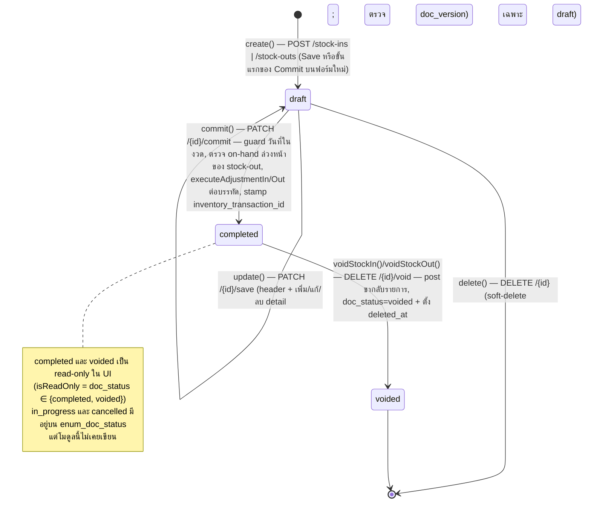

# การปรับสต๊อก (Inventory Adjustment) — User Flow

> **At a Glance**
> **โมดูล:** [inventory-adjustment](/th/inventory/inventory-adjustment) &nbsp;·&nbsp; **Persona:** สองมุมมองที่ไม่แตกต่างกันของหน้าจอเดียว (Store Keeper, Inventory Controller); Finance และ Audit/Config ไม่มี route หรือ permission ที่ตรงกัน — ดูหน้าของแต่ละตัวสำหรับประกาศแก้ไข
> **วงจรชีวิต (ตั้งแต่ 2026-07-30, backend `281a16399`):** `create` → **`draft`** (ยังไม่ post อะไร) → **Commit** (`PATCH /{id}/commit`) → `completed` (post ledger แล้ว, immutable) → **Void** (`DELETE /{id}/void`) → `voided` (post ขากลับรายการแล้ว, แถว soft-delete) `in_progress` / `cancelled` ไม่เคยถูกกำหนด
> **ดูรายละเอียดระดับ action ในหน้า persona ด้านล่าง**

## 1. ภาพรวม

หน้านี้ฉบับ 2026-07-15 บรรยายหน้าจอที่ *การสร้างคือการ post* — ทั้ง Save และ Submit ให้เอกสาร `completed` ที่ immutable ทันที และ Edit / Void เป็นปุ่มที่ตายแล้ว นั่นถูกต้องสำหรับโค้ดในเวลานั้นและ**ไม่เป็นจริงอีกต่อไป**: เมื่อ 2026-07-30 backend เปลี่ยน `StockInService.create` / `StockOutService.create` ให้เขียน `doc_status = draft` และย้ายการเขียน ledger ไปยังเมธอด `commit` เฉพาะ (`PATCH /stock-ins/{id}/commit`, `PATCH /stock-outs/{id}/commit`) และฟอร์มฝั่ง frontend ถูกออกแบบใหม่ในวันเดียวกัน (`198d83c1`) ด้วย action **Save**, **Commit**, **Void** และ **Delete** ตอนนี้ tester มีวงจรชีวิตสามสถานะจริงให้คิดถึง: draft ที่แก้ไขหรือลบได้, commit ที่ขยับสต๊อก และ void ที่กลับรายการมัน

## 2. วงจรชีวิตเอกสาร

```mermaid
stateDiagram-v2
    [*] --> draft : create() — POST /stock-ins | /stock-outs (Save หรือขั้นแรกของ Commit บนฟอร์มใหม่)
    draft --> draft : update() — PATCH /{id}/save (header + เพิ่ม/แก้/ลบ detail; ตรวจ doc_version)
    draft --> [*] : delete() — DELETE /{id} (soft-delete; เฉพาะ draft)
    draft --> completed : commit() — PATCH /{id}/commit — guard วันที่ในงวด, ตรวจ on-hand ล่วงหน้าของ stock-out, executeAdjustmentIn/Out ต่อบรรทัด, stamp inventory_transaction_id
    completed --> voided : voidStockIn()/voidStockOut() — DELETE /{id}/void — post ขากลับรายการ, doc_status=voided + ตั้ง deleted_at
    voided --> [*]

    note right of completed
        completed และ voided เป็น read-only ใน UI
        (isReadOnly = doc_status ∈ {completed, voided})
        in_progress และ cancelled มีอยู่บน enum_doc_status
        แต่โมดูลนี้ไม่เคยเขียน
    end note
```

### 2.1 แต่ละปุ่มทำอะไร

| Action ของ UI | Endpoint | เงื่อนไขก่อน | ผล |
| ------------- | -------- | ------------ | --- |
| **Save** (ฟอร์มใหม่) | `POST /{bu}/stock-ins` \| `/stock-outs` | ฟอร์ม Zod ผ่าน; `si_date`/`so_date` อยู่ในงวดที่เปิด (SI) / งวดปัจจุบัน (SO) — ตรวจฝั่ง server ด้วย | สร้าง header + บรรทัดที่ `draft`; จัดสรร `si_no`/`so_no` จากวันที่เอกสาร; แอปคงอยู่ที่เอกสาร (`/{id}?type=stock-in|stock-out`) ในโหมด view |
| **Save** (draft ที่มีอยู่) | `PATCH /{id}/save` | `doc_status = draft`; `doc_version` ตรงกัน | ใช้ฟิลด์ header และการเพิ่ม/แก้/ลบบรรทัด; `doc_version` เพิ่มขึ้น การส่ง `doc_status` ใดที่ไม่ใช่ `draft` ถูกปฏิเสธ (`STOCK_IN_STATUS_CHANGE_NOT_ALLOWED`: "doc_status cannot be changed on save — use the commit or void endpoint") |
| **Commit** | (`POST` ก่อนถ้ายังไม่เคย save) แล้ว `PATCH /{id}/commit` พร้อม `{ doc_version }` | ฟอร์มผ่าน (validate ก่อน confirm dialog เปิด); `doc_status = draft` (`STOCK_IN_ONLY_DRAFT_COMMITTABLE`); มีตำแหน่ง + ≥ 1 บรรทัด; วันที่อยู่ในงวด; stock-out: on-hand ≥ ที่ขอต่อสินค้า | ต่อบรรทัด `executeAdjustmentIn` / `executeAdjustmentOut` เขียน ledger rows และ stamp `inventory_transaction_id`; header → `completed`, `doc_version + 1`; navigate กลับไปหน้ารายการ |
| **Delete** | `DELETE /{id}` | `doc_status = draft` (โหมด view ก็พอ — ไม่ต้อง Edit, `ed37e6b0`) | Soft-delete; เอกสารที่ completed ตอบ `STOCK_IN_COMPLETED_NO_DELETE` ("Cannot delete a completed Stock In — inventory has already been adjusted") |
| **Void** | `DELETE /{id}/void` พร้อมเหตุผล | เอกสารเปิดในโหมด **Edit** (`canVoid = isEdit && !isReadOnly`) — จึงเท่ากับ `draft` ในทางปฏิบัติ; เอกสารที่ post แล้ว void ได้ผ่าน API | บรรทัดที่ post แล้วถูกกลับรายการด้วย adjustment ขาตรงข้ามที่ต้นทุนปัจจุบัน (void ของ stock-in ตรวจก่อนว่า on-hand รองรับการกลับรายการได้); header → `voided`, ตั้ง `deleted_at`, เก็บ `info.void_reason` แถวจึงหายจาก query ของ list/detail (filter `deleted_at: null`) |

### 2.2 การกระจายผลของการ Posting (เกิดขึ้นตอน commit ต่อบรรทัด)

1. หนึ่งแถว `tb_inventory_transaction` (`inventory_doc_type = stock_in` / `stock_out`, `inventory_doc_no` = id ของเอกสาร)
2. หนึ่งแถว `tb_inventory_transaction_detail` (Stock-In: `qty` บวกที่ `cost_per_unit` ผู้ใช้กรอก; Stock-Out: `qty` ลบที่ต้นทุนที่ ledger แก้ไขเอง — FIFO layer เก่าสุดก่อน หรือค่าเฉลี่ยปัจจุบันของ BU)
3. แถว `tb_inventory_transaction_cost_layer` หนึ่งแถวขึ้นไป โดย `at_period` / `period_id` มาจากงวดของ**วันที่เอกสาร** (`resolvePeriodForDate(si_date)` สำหรับ stock-in; `resolveCurrentPeriod` สำหรับการบริโภคของ stock-out) และ lot `{location_code}{YYMM}{seq4}`
4. ประทับ `inventory_transaction_id` ของบรรทัด detail; `GET /{id}/stock-movements` (2026-09-17) แสดงบรรทัดเหล่านี้กลับบนเอกสารพอดี

ไม่มี journal entry ทางบัญชี GL ใด ๆ ถูกสร้างในการกระจายผลนี้เลย

## 3. สารบัญ Persona

โค้ดไม่ได้ implement role ที่แตกต่างกันสำหรับโมดูลนี้ — มีหน้าจอสร้าง/แก้ไขเดียวและหน้ารายการเดียว gate ด้วยสิทธิ์ตัวเดียว `inventory_management.view` (`constant/module-list.ts`) โดยไม่มี workflow stage หรือการกำหนด `enum_stage_role` ที่ไหนใน `stock-in.service.ts` / `stock-out.service.ts` gateway แยก guard key `stockIn.create / update / commit / delete / print / findOne / findAll / getStockMovements` (`stock-ins.controller.ts`) แต่ permission catalog ของ frontend ประกาศเพียง key CRUD `inventory_management.stock_in.*` / `.stock_out.*` และใช้มันกับ nav entry สองรายการของ Store Operations (Stock Replenishment, Wastage Reporting) ไม่ใช่หน้าจอนี้

- [Store Keeper](/th/inventory/inventory-adjustment/03-user-flow-store-keeper) — กรอกเอกสาร: Add Stock-In / Add Stock-Out, Save เป็น draft, Commit เพื่อ post
- [Inventory Controller](/th/inventory/inventory-adjustment/03-user-flow-inventory-controller) — หน้าจอเดียวกัน; review draft ก่อน commit, void ความผิดพลาด, อ่าน list / detail / stock movements / print
- [Finance](/th/inventory/inventory-adjustment/03-user-flow-finance) — ไม่พบ route, permission หรือ backend endpoint ที่ตรงกัน มีเพียงประกาศแก้ไข
- [Audit / Config](/th/inventory/inventory-adjustment/03-user-flow-audit-config) — ไม่พบ route, permission หรือ backend endpoint ที่ตรงกัน มีเพียงประกาศแก้ไข

## 4. หมายเหตุข้ามโมดูล

- [physical-count](/th/inventory/physical-count) — `PhysicalCountService.submit()` เขียนแถว `tb_stock_in`/`tb_stock_out` โดยตรงที่ `completed` โดยไม่มี reason code เป็นบันทึก audit ของบรรทัดผลต่างการนับ — และ**ไม่**เรียก `executeAdjustmentIn/Out` (ยืนยัน 2026-09-22: ไม่มีการอ้างอิง `inventoryTransactionService` ใน `physical-count/*.ts`) แถวเหล่านั้นปรากฏในหน้ารายการของโมดูลนี้เป็นเอกสาร completed ที่ไม่เคยขยับสต๊อก
- [inventory-adjustment/wastage-reporting](/th/inventory/inventory-adjustment/wastage-reporting) — `POST /wastage-reporting` สร้าง `tb_stock_out` หนึ่งฉบับต่อ location และ commit ในการเรียกเดียวกัน (draft → `executeAdjustmentOut` → `completed`)
- [inventory/period-end](/th/inventory/inventory/period-end) — stock-in / stock-out ที่เป็น `draft` และลงวันที่ในงวด block **Start Period Close**; gate การปิดนับเฉพาะ SI/SO ที่ `in_progress` (ซึ่งไม่เคยถูกสร้างที่นี่)
- [inventory](/th/inventory/inventory) — ทุก commit เรียก `InventoryTransactionService` ตัวเดียวกับที่ GRN, SR และ period-end เรียก
- [costing](/th/inventory/costing) — การสร้าง FIFO layer (Stock-In) / การบริโภค FIFO หรือคำนวณค่าเฉลี่ยถ่วงน้ำหนักใหม่ (Stock-Out) คือ costing engine ที่แชร์กัน

## 5. แหล่งอ้างอิง

- ส่วนคู่ขนาน: [01-data-model](/th/inventory/inventory-adjustment/01-data-model) — schema, ความจริงของ `doc_status`, `expired_at` บนบรรทัด stock-in
- ส่วนคู่ขนาน: [02-business-rules](/th/inventory/inventory-adjustment/02-business-rules) — กฎการตรวจสอบ การคำนวณ และการ posting จริงของโมดูล
- Frontend: `../carmen-inventory-frontend-react/routes/inventory-management/inventory-adjustment/` — `ia-form.tsx` (สถานะ mode, `confirmCommit`, `isReadOnly`), `ia-form-hero.tsx` (การ gate ของ Edit / Delete / Print), `use-inventory-adjustment.ts` (`useCreate…`, `useUpdate…` → `/save`, `useCommit…` → `/commit`, `useVoid…` → `/void`, `useDelete…`), `ia-component.tsx` (หน้ารายการ, filter `adj_type` + สถานะ)
- Backend: `../carmen-turborepo-backend-v2/apps/micro-business/src/inventory/stock-in/stock-in.service.ts` / `.../stock-out/stock-out.service.ts` (`create`, `update`, `commit`, `delete`, `voidStockIn`/`voidStockOut`, `getStockMovements`); gateway `apps/backend-gateway/src/application/stock-ins/`, `stock-outs/`, `inventory-adjustments/` (รายการรวมแบบอ่านอย่างเดียว + print)
- Bruno: `../carmen-turborepo-backend-bruno/collections/carmen-inventory/inventory/stock-in/` (`POST-create`, `PATCH-update`, `PATCH-commit`, `DELETE-void-stock-in`, `DELETE-remove`, `GET-print-to-report`, `GET-by-id`, `GET-list`), `inventory/stock-out/` (ชุดเดียวกัน), `inventory/inventory-adjustment/` (list, by-id, print)
