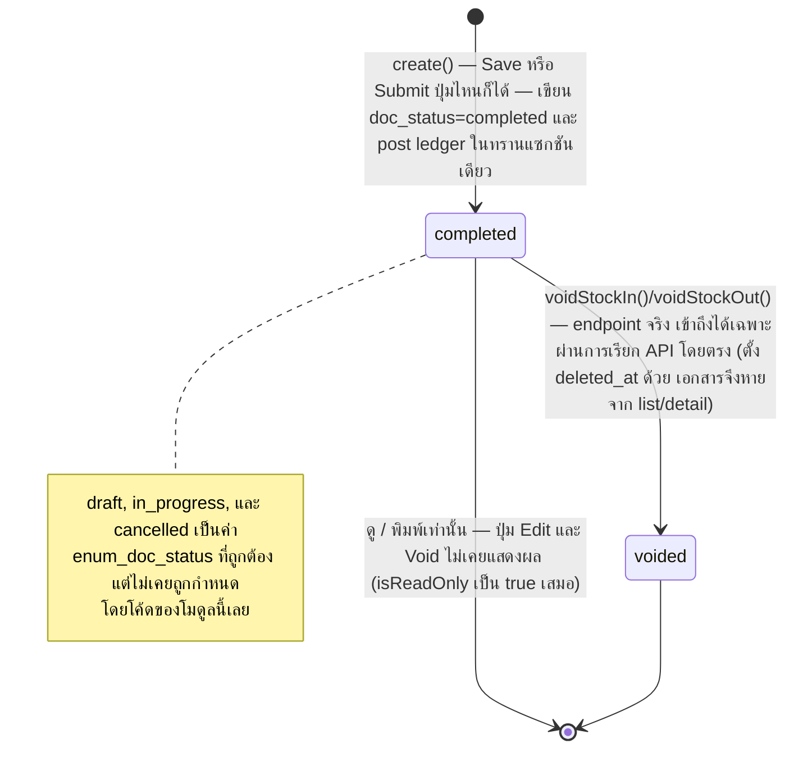

# การปรับสต๊อก (Inventory Adjustment) — User Flow

> **At a Glance**
> **โมดูล:** [inventory-adjustment](/th/inventory/inventory-adjustment) &nbsp;·&nbsp; **Persona:** สองหน้าจอที่ไม่แตกต่างกัน (Store Keeper, Inventory Controller); Finance และ Audit/Config ไม่มี route หรือ permission ที่ตรงกัน — ดูหน้าของแต่ละตัวสำหรับประกาศแก้ไข
> **วงจรชีวิต:** การสร้าง *คือ* การ post — `doc_status = completed` ถูกเขียนโดยไม่มีเงื่อนไขโดย `create()` ในทรานแซกชันเดียวกับการเขียน ledger ไม่มี draft, ไม่มี approval queue, ไม่มี Void ใน app (ดู [02 — กติกาทางธุรกิจ](/th/inventory/inventory-adjustment/02-business-rules) § 5)
> **ดูรายละเอียดระดับ action ในหน้า persona ด้านล่าง**

## 1. ภาพรวม

Inventory Adjustment เป็น **โมดูลที่ขับเคลื่อนด้วยเอกสารในชื่อเท่านั้น** — หน้าจอสร้างดูเหมือนฟอร์ม draft-แล้ว-submit ปกติ (มีทั้งปุ่ม **Save** และ **Submit**) แต่ปุ่มทั้งสองเรียก mutation `create()` เดียวกัน และ backend ไม่สนใจค่า `doc_status` ที่ client ส่งมาและเขียน `completed` เสมอ การเขียน ledger (`executeAdjustmentIn`/`executeAdjustmentOut`) เกิดขึ้นในทรานแซกชันฐานข้อมูลเดียวกับการ insert header/detail ดังนั้น "วงจรชีวิต" ทั้งหมดที่ tester ต้องคิดถึงคือ: **กรอกฟอร์ม กดปุ่มไหนก็ได้ แล้วสต๊อกก็ถูกขยับไปแล้ว**

ผลกระทบนี้ส่งต่อไปทั้งหน้าจอ flag `isReadOnly` บนหน้ารายละเอียดคือ `doc_status === 'voided' || doc_status === 'completed'` ซึ่งเป็น true ตั้งแต่วินาทีที่เอกสารมีอยู่ ปุ่ม **Edit** แสดงผลเฉพาะเมื่อ `!isReadOnly` จึงไม่แสดงสำหรับเอกสารจริงเลย และปุ่ม **Void** แสดงผลเฉพาะในโหมด Edit จึงไม่แสดงเช่นกัน ปุ่ม **Delete** ในเมนูแถวของหน้ารายการ*แสดงผล*สำหรับทุกแถว แต่การคลิกและยืนยันจะล้มเหลวฝั่ง server เสมอด้วยข้อความ "ไม่สามารถลบเอกสารที่ completed แล้ว" เนื่องจากการ delete ฝั่ง server ก็ต้องการ `doc_status === draft` เช่นกัน ในทางปฏิบัติ เมื่อเอกสาร Stock-In หรือ Stock-Out มีอยู่แล้ว สิ่งเดียวที่ทำได้ผ่าน UI คือ **ดูและพิมพ์**

## 2. "วงจรชีวิต" เอกสาร

```mermaid
stateDiagram-v2
    [*] --> completed : create() — Save หรือ Submit ปุ่มไหนก็ได้ — เขียน doc_status=completed และ post ledger ในทรานแซกชันเดียว
    completed --> [*] : ดู / พิมพ์เท่านั้น — ปุ่ม Edit และ Void ไม่เคยแสดงผล (isReadOnly เป็น true เสมอ)
    completed --> voided : voidStockIn()/voidStockOut() — endpoint จริง เข้าถึงได้เฉพาะผ่านการเรียก API โดยตรง (ตั้ง deleted_at ด้วย เอกสารจึงหายจาก list/detail)
    voided --> [*]

    note right of completed
        draft, in_progress, และ cancelled เป็นค่า
        enum_doc_status ที่ถูกต้อง แต่ไม่เคยถูกกำหนด
        โดยโค้ดของโมดูลนี้เลย
    end note
```

### 2.1 สิ่งที่เกิดขึ้นจริงเมื่อกด Save เทียบกับ Submit

| Action ของ UI | `doc_status` ที่ client ตั้งก่อน submit | สิ่งที่ backend ทำ |
| ------------- | ---------------------------------------- | ------------------- |
| กด **Save** | `"draft"` | ถูกละเลย — `create()` เขียน `enum_doc_status.completed` เสมอ ledger post ทันที |
| กด **Submit** | `"completed"` | ผลลัพธ์เดียวกัน |

ไม่มีความแตกต่างในทางปฏิบัติระหว่างสองปุ่มตอนสร้าง (`update()` เคารพค่า `doc_status` ที่ client ส่งจริง แต่ `update()` เข้าถึงได้เฉพาะเมื่อสถานะที่เก็บไว้เป็น `draft` อยู่แล้ว — ซึ่งตามข้างต้นไม่เคยเกิดขึ้นสำหรับเอกสารที่สร้างผ่านโมดูลนี้)

### 2.2 การกระจายผลของการ Posting (เกิดขึ้นตอนสร้าง ต่อบรรทัด)

1. หนึ่งแถว `tb_inventory_transaction` (`inventory_doc_type = stock_in` / `stock_out`)
2. หนึ่งแถว `tb_inventory_transaction_detail` (Stock-In: `qty` บวกที่ `cost_per_unit` ผู้ใช้กรอก; Stock-Out: `qty` ลบที่ต้นทุนที่ ledger แก้ไขเอง — FIFO layer เก่าสุดก่อน หรือค่าเฉลี่ยปัจจุบันของ BU)
3. แถว `tb_inventory_transaction_cost_layer` หนึ่งแถวขึ้นไป (Stock-In: layer ขาเข้าใหม่หนึ่งแถว แยกเพื่อการปัดเศษตาม `splitFifoCost`; Stock-Out FIFO: หนึ่งแถวต่อ lot ที่บริโภค; Stock-Out Average: หนึ่งแถวที่ค่าเฉลี่ยปัจจุบัน)
4. ประทับ `inventory_transaction_id` ของบรรทัด detail

ไม่มี journal entry ทางบัญชี GL ใด ๆ ถูกสร้างในการกระจายผลนี้เลย

## 3. สารบัญ Persona

โค้ดไม่ได้ implement role ที่แตกต่างกันสำหรับโมดูลนี้ — มีหน้าจอสร้าง/แก้ไขเดียวและหน้ารายการเดียว gate ด้วยสิทธิ์ทั่วไปตัวเดียว `inventory_management.view` โดยไม่มี workflow stage หรือการกำหนด `enum_stage_role` ที่ไหนใน `stock-in.service.ts` / `stock-out.service.ts` หน้า persona สองหน้าด้านล่างบรรยายหน้าจอเดียวกันจากสองมุมมอง (ใครมักจะกรอกฟอร์ม vs ใครมักจะ review ledger ที่เกิดขึ้น) ไม่ใช่สิทธิ์สองระดับ:

- [Store Keeper](./03-user-flow-store-keeper.md) — ผู้ใช้ประจำวันที่เปิด Add Stock-In / Add Stock-Out เลือก reason และตำแหน่ง กรอกบรรทัด และกด Save หรือ Submit — ไม่ว่าทางไหน เอกสารมีอยู่แล้วและถูก post แล้ว
- [Inventory Controller](./03-user-flow-inventory-controller.md) — ใช้หน้าจอเดียวกันเพื่อสร้าง adjustment โดยตรง และนอกเหนือจากนั้นก็อ่านผล list/detail/print — ไม่มี action อนุมัติให้ persona นี้ทำ เพราะไม่มีอะไรถูกทิ้งไว้ในสถานะรอตรวจสอบเลย
- [Finance](./03-user-flow-finance.md) — ไม่พบ route, permission หรือ backend endpoint ที่ตรงกัน มีเพียงประกาศแก้ไข
- [Audit / Config](./03-user-flow-audit-config.md) — ไม่พบ route, permission หรือ backend endpoint ที่ตรงกัน มีเพียงประกาศแก้ไข

## 4. หมายเหตุข้ามโมดูล

- [physical-count](/th/inventory/physical-count) — `PhysicalCountService.submit()` สร้างแถว `tb_stock_in`/`tb_stock_out` โดยตรงที่ `completed` โดยไม่มี reason code เป็นบันทึก audit ของผลต่างการนับ ส่วนที่ว่า path นั้นขับเคลื่อน ledger แบบเดียวกับ `create()` ของโมดูลนี้เองหรือไม่ ยังไม่ได้รับการยืนยันในรอบนี้ — ถือว่ารอการตรวจสอบซ้ำระหว่างรอบ resync ของโมดูลนั้นเอง
- [inventory](/th/inventory/inventory) — ทุกการ post stock-in/stock-out เรียก `InventoryTransactionService` ตัวเดียวกับที่ GRN, SR และ period-end เรียก
- [costing](/th/inventory/costing) — การสร้าง FIFO layer (Stock-In) / การบริโภค FIFO หรือคำนวณค่าเฉลี่ยถ่วงน้ำหนักใหม่ (Stock-Out) คือ costing engine ที่แชร์กัน ไม่เฉพาะเจาะจงกับโมดูลนี้

## 5. แหล่งอ้างอิง

- ส่วนคู่ขนาน: [01-data-model.md](./01-data-model.md) — schema และข้อค้นพบ "เป็น completed เสมอ" แบบเต็ม บวกพฤติกรรม void-ก็-soft-delete
- ส่วนคู่ขนาน: [02-business-rules.md](./02-business-rules.md) — กฎการตรวจสอบ การคำนวณ และการ posting จริงของโมดูล
- Frontend: `ia-form.tsx` (สถานะ mode, `submitWith("draft"|"completed")`), `ia-form-hero.tsx` (logic การ gate ของ Edit/Void/Delete), `ia-component.tsx` (action Delete ในหน้ารายการ)
- Backend: `stock-in.service.ts` / `stock-out.service.ts` `create()`/`update()`/`delete()`/`voidStockIn()`/`voidStockOut()`
