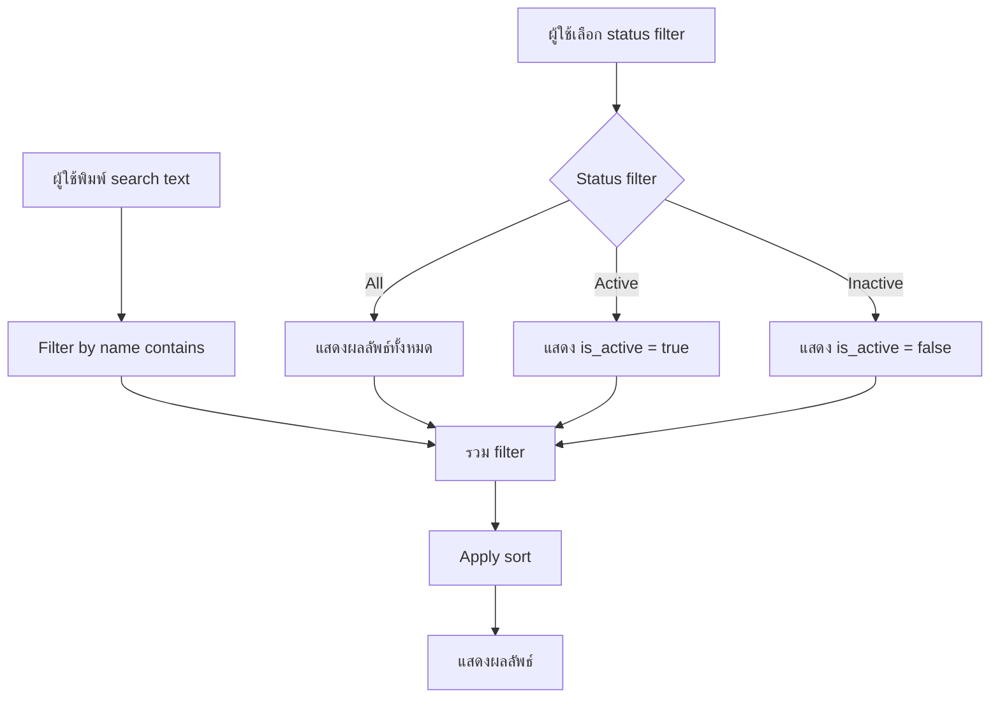
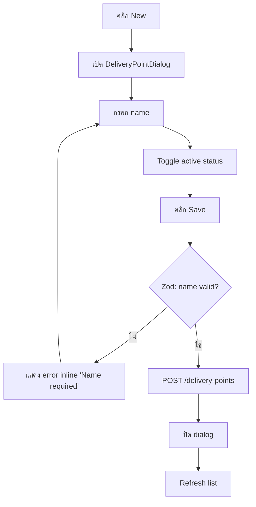
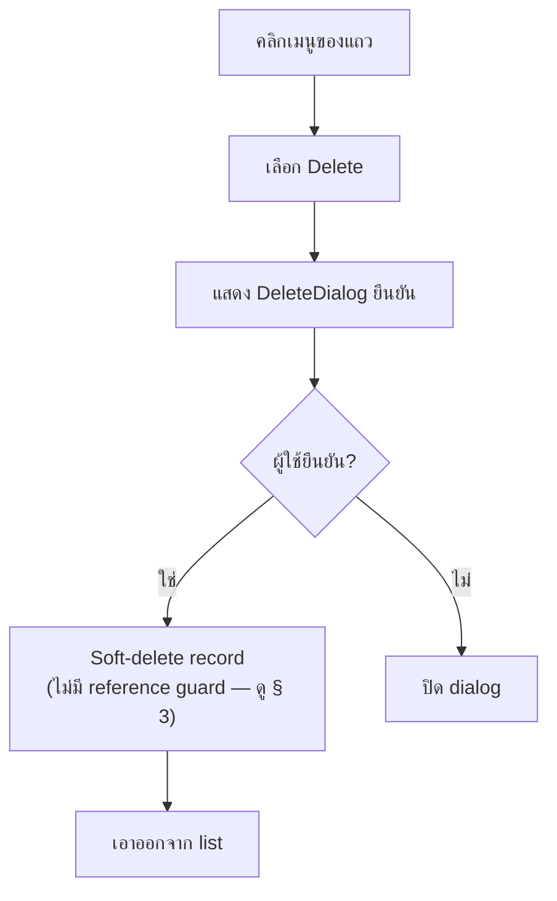

# จุดส่งของ (Delivery Point)

> **At a Glance**
> **เจ้าของ:** Product Admin &nbsp;·&nbsp; **ตาราง:** `tb_delivery_point` &nbsp;·&nbsp; **ใช้โดย:** PO, GRN, locations &nbsp;·&nbsp; ที่อยู่ทางกายภาพสำหรับ drop-off ของผู้ขาย

## 1. คืออะไร / ใครใช้

**จุดส่งของ** คือที่อยู่ทางกายภาพที่ผู้ขายส่งสินค้ามา — loading dock, ทางเข้าหลังครัว, ช่องรับของของไซต์ระยะไกล PO บรรจุจุดส่งของเพื่อให้ผู้ขายรู้ว่าจะ drop ที่ไหน; GRN บันทึกจุดรับจริง; และ inventory **location** สามารถ tag จุดส่งของ default เพื่อให้ GRN routing มีปลายทางที่สมเหตุสมผล

โดยทั่วไป property จะมีจุดส่งของไม่กี่จุด (Main Dock, Banquet Dock, Spa Receiving) ไม่ว่าจะมี inventory location ปลายน้ำกี่แห่งก็ตาม **บริหารจัดการโดย** Product Admin; **อ่านโดย** developer และ tester ใน PO / GRN routing

## 2. งานที่พบบ่อย

| งาน | ที่ไหน | หมายเหตุ |
|---|---|---|
| เพิ่มจุดส่งของ | Configuration → Master Data → Delivery Point → **New** | บังคับ: `name` |
| ยกเลิกการใช้งาน | Toggle `is_active` | ซ่อนจาก picker PO/GRN; เอกสารย้อนหลังยัง resolve ได้ |
| Tag default ของ location | รายละเอียดของ [master-data/location](/th/inventory/master-data/location) | ตั้ง `tb_location.delivery_point_id` |
| Override บน GRN | ฟิลด์ header ของ GRN | GRN inherit จาก PO แต่อาจ override ตอนรับ |

flow list, create, และ delete บนเอนทิตีสองฟิลด์ที่เรียบง่ายนี้:

> Diagram adapted from `carmen/docs/app/system-administration/delivery-points/FD-delivery-points.md` · verified against `carmen-inventory-frontend-react/routes/config/delivery-point/delivery-point-component.tsx` (2026-09-28) · Changes: renamed `isActive` to the real `is_active` column.

> Diagram adapted from `carmen/docs/app/system-administration/delivery-points/FD-delivery-points.md` · verified against `carmen-inventory-frontend-react/routes/config/delivery-point/delivery-point-component.tsx`, `components/templates/config-entity-dialog.tsx:222-226`, `components/share/delivery-point-dialog.tsx:15-22` (2026-09-28) · Changes: named the real `DeliveryPointDialog` component and the real create endpoint in place of the source's generic "Create record". Corrected the fix from the prior pass — the Save button is not disabled while the name is invalid (`config-entity-dialog.tsx:222-226` disables it only while `isPending`); an empty name is instead caught by the zod schema on submit (`delivery-point-dialog.tsx:15-22`), which shows an inline "Name required" field error.

> Diagram adapted from `carmen/docs/app/system-administration/delivery-points/FD-delivery-points.md` · verified against `carmen-inventory-frontend-react/components/templates/config-list-template.tsx` (2026-09-28) · Changes: named the real `DeleteDialog` component in place of the source's generic "Show confirmation", and noted the unconfirmed delete guard per § 3.

## 3. การตรวจสอบและข้อผิดพลาด

| อาการ / ข้อความ | สาเหตุ | การจัดการ |
|---|---|---|
| "Name already in use" | `name` ซ้ำบนแถว non-deleted | เลือกชื่ออื่น |
| "Name required" | `name` ว่าง | เพิ่มชื่อแสดงผล |
| **ยังไม่ยืนยัน** — ไม่พบ delete guard | `delivery-point.service.ts`'s `delete()` เป็น soft-delete แบบไม่มีเงื่อนไข (`is_active: false` + `deleted_at`) โดยไม่มีการเช็ค PO/GRN/location ที่อ้างอิง | เดิมหน้านี้ระบุว่า "cannot delete — referenced by POs / GRNs / locations" เป็น error ที่บังคับใช้จริง; ให้ถือว่า**ยังไม่ถูกบังคับใช้**จนกว่าจะตรวจสอบซ้ำ |
| Location แสดงชื่อจุดส่งของล้าสมัย | snapshot `tb_location.delivery_point_name` ไม่ได้ refresh หลังเปลี่ยนชื่อ | Backfill ผ่าน maintenance job |

## 4. Edge Cases

- **การ propagate การเปลี่ยนชื่อ** เอกสารเก็บ FK ดังนั้นการแสดงผล refresh อัตโนมัติ Location ที่ **snapshot ชื่อ** (`tb_location.delivery_point_name`) ต้อง backfill ถ้าต้องการให้การเปลี่ยนชื่อแสดงบน legacy lookup
- **การ inactivate** ซ่อนจาก picker แต่ปล่อยให้การอ้างอิงประวัติ resolve ได้
- **ไม่มีฟิลด์ code** — มีเพียง `name` ที่เป็น identity ที่นี่

---

## 5. โมเดลข้อมูล (Dev)

แหล่งที่มา: tenant schema

### 5.1 `tb_delivery_point`

| Field | Prisma Type | Nullable | คำอธิบาย |
| --- | --- | --- | --- |
| `id` | `String @db.Uuid` | No | Primary key |
| `name` | `String @db.VarChar` | No | ชื่อแสดงผล (เช่น `Main Dock`) |
| `is_active` | `Boolean?` | Yes | Active flag, default `true` |
| `note`, `info`, `dimension` | — | Yes | Metadata มาตรฐาน |
| `doc_version` | `Int` | No | เวอร์ชัน optimistic-lock (default `0`) |
| Audit columns | — | Yes | `created_*`, `updated_*`, `deleted_*` |

**Constraints:** `@@unique([name, deleted_at])` map `deliverypoint_name_u` Index บน `name` Reverse relations ไปยัง `tb_location`, `tb_purchase_request_detail` และตาราง PO-PR linkage

## 6. กติกาทางธุรกิจ

- **Uniqueness** `name` unique ในแถว non-deleted (DB-enforced)
- **Deletion guards — ยังไม่ยืนยัน** ไม่พบการเช็ค FK ใน `delete()`; soft-delete สำเร็จโดยไม่มีเงื่อนไขแม้มี PO/GRN/location ที่เปิดอยู่อ้างอิง
- **Validation** `name` บังคับ
- **Lifecycle** จุดส่งของ inactive ยังอ่านได้บนเอกสารย้อนหลัง; ซ่อนจาก picker
- **การ propagate การเปลี่ยนชื่อ** เอกสาร resolve ผ่าน FK; snapshot ชื่อบน `tb_location` ต้อง backfill
- **FK บน PO header มีจริงแล้วนับจาก 2026-09-15** `tb_purchase_order.delivery_point_id` (FK `tb_purchase_order_delivery_point_id_fkey`) + `delivery_point_name` ถูกเพิ่มโดย `20260915120000_po_header_delivery_point`; flow `group-pr` / `confirm-pr` ของ PO รับจุดส่งของบน header (backend `c467a287d`) ก่อนหน้านั้นการอ้างอิงอยู่เฉพาะบน PR detail / แถว junction PO-PR เท่านั้น
- **Default sort** `GET /delivery-points` ที่ไม่มี `?sort=` คืน `name:asc, id:asc` (`delivery-point.service.ts`, `withDefaultSort`, 2026-09-13)

## 7. การอ้างอิงข้ามโมดูล

- [purchase-order](/th/inventory/purchase-order) — PO header บรรจุการอ้างอิงจุดส่งของ
- [good-receive-note](/th/inventory/good-receive-note) — GRN inherit จาก PO, อาจ override
- [master-data/location](/th/inventory/master-data/location) — แต่ละ location tag จุดส่งของ default ได้
- [purchase-request](/th/inventory/purchase-request) — PR detail อาจมี hint จุดส่งของที่ propagate ไปยัง PO

## 8. แหล่งอ้างอิง

- **Prisma:** `../carmen-turborepo-backend-v2/packages/prisma-shared-schema-tenant/prisma/schema.prisma` — `tb_delivery_point` (line ~641)
- **Migration:** `20260915120000_po_header_delivery_point`
- **E2E:** `../carmen-inventory-frontend-e2e/tests/079-delivery-point.spec.ts` + `docs/test-cases/gaps/079-delivery-point-gap.md` (30 กรณีที่ยังไม่ครอบคลุม)
- **Frontend:** `../carmen-inventory-frontend-react/routes/config/delivery-point/`
