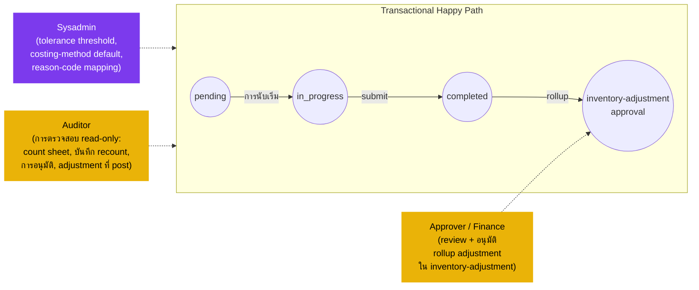

# การนับสต๊อกประจำงวด (Physical Count) — User Flow — Audit & Config

> **At a Glance**
> **Persona:** Audit / Config (Approver / Finance Reviewer + Auditor + Sysadmin) &nbsp;·&nbsp; **โมดูล:** [physical-count](/th/inventory/physical-count) &nbsp;·&nbsp; **ขั้นตอน workflow:** Approver / Finance Reviewer เซ็นรับ rollup adjustment ฝั่ง downstream; Auditor สังเกตการณ์การนับขณะ in-progress และตรวจ chain count → recount → approval → adjustment → journal; Sysadmin ตั้งค่า tolerance threshold (`PHC_VAL_007`), default `enum_physical_count_costing_method`, การ map reason-code &nbsp;·&nbsp; **สิทธิ์สำคัญ:** Approver อนุมัติ rollup adjustment; Auditor read-only; Sysadmin ตั้งค่า default
> **สิ่งที่ persona นี้ทำ:** อนุมัติ variance-rollup adjustment (Approver / Finance), สังเกตการนับเพื่อ SoD และ compliance นโยบาย (Auditor) และตั้งค่า default ของ tolerance / costing-method (Sysadmin)

## 1. Persona

กลุ่ม persona นี้ยุบสาม role ที่การสัมผัสโมดูล physical-count คือการอนุมัติ การสังเกต หรือการ config:

- **Approver / Finance Reviewer** — review การนับและ rollup adjustment ที่เสร็จ ตรวจสอบความสมเหตุสมผลของ variance กับ pattern ในประวัติ อนุมัติเอกสาร variance-adjustment เซ็นปิดผลกระทบทางการเงิน ณ ปิดงวด
- **Auditor** — สังเกตการณ์การนับตัวอย่างขณะ in-progress ตรวจ chain เต็มจากต้นจนจบ (count sheet บันทึก recount การอนุมัติ adjustment ที่ post journal entry) สำหรับ compliance, segregation-of-duties และการปฏิบัติตามนโยบาย
- **Sysadmin** — ตั้งค่า default ของ tenant: tolerance threshold สำหรับ flag variance (`PHC_VAL_007`), default `enum_physical_count_costing_method` และการ map reason-code สำหรับ `COUNT_OVERAGE` / `COUNT_SHORTAGE` ใน [inventory-adjustment](/th/inventory/inventory-adjustment)

Authority anchor สำหรับ `PHC_AUTH_003`

### ตำแหน่งเทียบกับ flow ธุรกรรม (ผู้สังเกตการณ์นอก path)

### Permission Matrix — V6 Action × Sub-persona (Audit / Config)

ทั้งสาม sub-persona ไม่เกี่ยวข้องกับธุรกรรมในโมดูล physical-count — ไม่มีใครสร้าง แก้ไข submit หรือเปิดเอกสาร count ใหม่ Action อนุมัติของ Approver / Finance ลงจอดบน rollup adjustment ใน [inventory-adjustment](/th/inventory/inventory-adjustment) ไม่ใช่บน `tb_physical_count` row มาจากหัวข้อ 3 (Primary Actions) ของไฟล์นี้; citation ของกฎอ้างอิง [physical-count/02-business-rules](/th/inventory/physical-count/02-business-rules) § 4 / § 5

| Action | Approver / Finance | Auditor | Sysadmin |
|---|---|---|---|
| ดู count period / เอกสาร count / count detail (read-only) | ✅ | ✅ (`PHC_AUTH_003`) | ✅ |
| ดู thread comment ของ recount และการมอบหมาย zone ของ counter | ✅ | ✅ (`PHC_AUTH_003`) | ✅ |
| ดู rollup adjustment (`tb_stock_in` / `tb_stock_out`) ใน [inventory-adjustment](/th/inventory/inventory-adjustment) | ✅ | ✅ | ✅ |
| Review บรรทัด variance + `info.countId` ที่ link กลับไปที่ source count | ✅ (`PHC_AUTH_003`) | ✅ | ❌ |
| อนุมัติ rollup adjustment (`in_progress → completed`) | ✅ (`ADJ_AUTH_*` ใน [inventory-adjustment](/th/inventory/inventory-adjustment)) | ❌ | ❌ |
| Reject rollup adjustment (return กลับ Count Lead) | ✅ | ❌ | ❌ |
| สังเกตการนับขณะ in-progress (ตัวอย่าง; เพิ่ม comment สังเกต) | ❌ | ✅ (`PHC_AUTH_003`) | ❌ |
| ตรวจ chain เต็ม (count sheet → recount → การอนุมัติ → posted adj → inventory tx) | ❌ | ✅ (`PHC_AUTH_003`) | ❌ |
| ตั้งค่า tolerance threshold (`PHC_VAL_007` default) | ❌ | ❌ | ✅ (`PHC_AUTH_003`) |
| ตั้งค่า costing-method default (`enum_physical_count_costing_method`) | ❌ | ❌ | ✅ (`PHC_AUTH_003`) |
| ตั้งค่า reason-code mapping (`COUNT_OVERAGE` / `COUNT_SHORTAGE` → บัญชี GL) | ❌ | ❌ | ✅ (`PHC_AUTH_003`) |
| สร้าง / แก้ไข / submit เอกสาร count | ❌ | ❌ | ❌ |
| เปิด completed count ใหม่ (`PHC_VAL_008`) | ❌ | ❌ | ❌ |

> ℹ️ **หมายเหตุขอบเขตการอนุมัติ:** อำนาจการอนุมัติของ Approver / Finance ใช้บนเอกสาร rollup `tb_stock_in` / `tb_stock_out` ใน [inventory-adjustment](/th/inventory/inventory-adjustment) ไม่ใช่บน `tb_physical_count` โดยตรง เอกสาร physical-count เองเป็น terminal ที่ `completed`; เฉพาะ rollup adjustment เท่านั้นที่ดำเนินไปยังการ post GL หมายความว่าคอลัมน์ Approver / Finance ข้างต้นใช้ที่ขอบเขต inventory-adjustment ไม่ใช่ที่ขอบเขต physical-count

## 2. จุดเริ่ม

- **My approvals** — Approver / Finance: คิวของเอกสาร rollup `tb_stock_in` / `tb_stock_out` ใน `in_progress` ตาม [inventory-adjustment](/th/inventory/inventory-adjustment) `ADJ_AUTH_*` หมายเหตุ: การอนุมัติลงจอดบนเอกสาร adjustment ไม่ใช่บน `tb_physical_count`
- **Audit log** — Auditor: มุมมอง read-only ข้าม period, เอกสาร count, thread comment ของ recount, rollup adjustment, journal entry
- **หน้าจอ Configuration** — Sysadmin: หน้า admin ของ tolerance / costing-method / reason-code

## 3. Primary Actions

| Action | Persona | State precondition | State effect | Notes |
| ------ | ------- | ------------------ | ------------ | ----- |
| Review rollup variance adjustment | Approver / Finance | Rollup `tb_stock_in` / `tb_stock_out` อยู่ `in_progress` | (read) บรรทัด variance + `info.countId` ที่ link กลับไป source count | Cross-reference [inventory-adjustment/03-user-flow-finance](/th/inventory/inventory-adjustment/03-user-flow-finance) |
| อนุมัติ rollup adjustment | Approver / Finance | ADJ-side validation ทั้งหมดผ่าน | Adjustment เลื่อนไป `completed`; เขียน `tb_inventory_transaction` | การอนุมัติคือการเซ็นปิดทางการเงิน |
| Reject rollup adjustment | Approver / Finance | Variance ไม่สมเหตุสมผล / สืบสวนไม่พอ | Adjustment return ไป `draft`; Count Lead ต้องสืบสวน | อาจ trigger recount หรือ hold เพื่อ reconciliation |
| สังเกตการนับขณะ in-progress | Auditor | เอกสาร count อยู่ `in_progress` | (read) การป้อน `actual_qty` สด, การมอบหมาย zone ของ counter, flag recount | ตัวอย่าง; บันทึกการสังเกตเก็บเป็น comment ของ count |
| ตรวจ chain เต็ม | Auditor | Count `completed`; rollup adjustment `completed` | (read) count sheet → บันทึก recount → การอนุมัติ → posted adjustment → inventory transaction → journal entry | audit trail ทั้งหมด |
| ตั้งค่า tolerance threshold | Sysadmin | (ใดก็ได้) | Default tenant ใหม่สำหรับ `PHC_VAL_007` | ใช้กับ count ในอนาคต |
| ตั้งค่า costing-method default | Sysadmin | (ใดก็ได้) | Default tenant ใหม่สำหรับ `enum_physical_count_costing_method` | ใช้กับ rollup ในอนาคต |
| ตั้งค่า reason-code mapping | Sysadmin | (ใดก็ได้) | `tb_adjustment_type` row สำหรับ `COUNT_OVERAGE` / `COUNT_SHORTAGE` พร้อม `info.glAccount` | ตาม [inventory-adjustment/01-data-model](/th/inventory/inventory-adjustment/01-data-model) § 2.1 |

## 4. Decision Points

- **Approver / Finance — อนุมัติ reject หรือ escalate** อนุมัติเมื่อ variance อยู่ภายในเกณฑ์ในอดีตและกระบวนการนับถูกต้อง; reject และขอสืบสวนเมื่อ variance ผิดปกติ (overage บวกใหญ่ผิดปกติ shortage กลม ๆ น่าสงสัย); escalate ไปยังผู้อนุมัติระดับสูงเมื่อผลกระทบทางการเงินเกิน threshold ตาม `ADJ_AUTH_005`
- **Auditor — สังเกตเร็วหรือ inspect ช้า** การสังเกตขณะ `in_progress` จับปัญหาวินัยของกระบวนการ; การ inspect ช้าหลัง `completed` ของ count + chain ของ adjustment ยืนยันว่าเอกสารครบสมบูรณ์สำหรับ external audit
- **Sysadmin — ความเข้มงวด vs operational friction** Tolerance ที่แน่นกว่า (% ต่ำ) จับ variance มากกว่าแต่สร้าง overhead recount มากกว่า; tolerance หลวมกว่าทำให้การนับเร็วแต่อาจ mask shrinkage การเลือก costing-method (`standard` vs `last` vs `average`) เปลี่ยนวิธีการคำนวณมูลค่า variance

> **TODO:** ดึง UI ที่แน่นอนสำหรับ admin tolerance / costing-method จาก `../carmen-inventory-frontend-react/`; ยืนยันว่า tolerance เป็น per-tenant, per-location หรือ per-category

## 5. Exit / Handoff

| Trigger | Handoff to | Artefact |
| ------- | ---------- | -------- |
| Approver / Finance อนุมัติ rollup adjustment | ledger ของ [inventory](/th/inventory/inventory) (ระบบ) | `tb_inventory_transaction` เขียน; journal entry ของ GL post |
| Approver / Finance reject rollup adjustment | Count Lead | Rollup `tb_stock_in` / `tb_stock_out` return ไป `draft` |
| Auditor inspect เสร็จ | (read-only, ไม่เปลี่ยนสถานะ) | รายงาน audit (artefact ภายนอก) |
| Sysadmin อัปเดต config | (configuration ใช้กับ count ถัดไป) | ค่า default ของ tenant ที่อัปเดต |

## 6. แหล่งอ้างอิง

- **Primary (TODO):** source carmen/docs — ไม่มีสำหรับโมดูลนี้
- **Frontend (TODO):** `../carmen-inventory-frontend-react/` — คิวอนุมัติและหน้าจอ config admin
- **E2E (TODO):** `../carmen-inventory-frontend-e2e/tests/` — ยังไม่มี spec physical-count
- ที่เกี่ยวข้อง: [physical-count/03-user-flow](/th/inventory/physical-count/03-user-flow) (overview), [physical-count/02-business-rules](/th/inventory/physical-count/02-business-rules) (`PHC_AUTH_003`, `PHC_VAL_007`, `PHC_POST_002`), [inventory-adjustment/03-user-flow-finance](/th/inventory/inventory-adjustment/03-user-flow-finance) (flow approver ฝั่ง rollup), [inventory-adjustment/03-user-flow-audit-config](/th/inventory/inventory-adjustment/03-user-flow-audit-config) (flow audit / config คู่ขนานฝั่ง adjustment)
