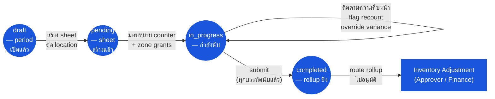

# การนับสต๊อกประจำงวด (Physical Count) — User Flow — Count Lead

> **At a Glance**
> **Persona:** Count Lead (Inventory Controller / Manager) &nbsp;·&nbsp; **โมดูล:** [physical-count](/th/inventory/physical-count) &nbsp;·&nbsp; **ขั้นตอน workflow:** สร้าง `tb_physical_count_period` (`draft`) &nbsp;·&nbsp; สร้าง count sheet ต่อ `(period, location)` (`pending`) &nbsp;·&nbsp; มอบหมาย counter / zone &nbsp;·&nbsp; flag variance ให้ recount &nbsp;·&nbsp; submit เป็น `completed` (ยิง variance rollup ไปยัง [inventory-adjustment](/th/inventory/inventory-adjustment) ตาม `PHC_POST_001`) &nbsp;·&nbsp; **สิทธิ์สำคัญ:** เปิด period, สร้าง count sheet, flag recount (`PHC_VAL_007`), submit count (`PHC_AUTH_001`)
> **สิ่งที่ persona นี้ทำ:** เจ้าของคนเดียวของการนับ — จัดตาราง กำหนดขอบเขต ติดตาม แก้ไขข้อขัดแย้ง และ trigger variance rollup ไปยัง inventory-adjustment

## 1. Persona

**Count Lead** — Inventory Controller / Inventory Manager เจ้าของคนเดียวของการนับ: จัดตาราง period, ตั้งค่าขอบเขต (location, หมวด, โหมด — frozen vs live), มอบหมาย counter และ zone, สร้างและแจก count sheet, ติดตามความคืบหน้า, แก้ไขข้อขัดแย้งผ่าน recount, และ trigger variance rollup ไปยัง [inventory-adjustment](/th/inventory/inventory-adjustment) Authority anchor สำหรับ `PHC_AUTH_001`

### ตำแหน่ง workflow (Count Lead เน้น)

### Permission Matrix — V1 Status × Action (Count Lead)

Count Lead เป็นเจ้าของคนเดียวของการนับ — persona เดียวที่เปิด period, สร้าง sheet, มอบหมาย counter, flag recount, และ submit ได้ row มาจากหัวข้อ 3 (Primary Actions) ของไฟล์นี้; citation ของกฎอ้างอิง [physical-count/02-business-rules](/th/inventory/physical-count/02-business-rules) § 4 / § 5

| Action | Period `draft` | Count `pending` | Count `in_progress` | Count `completed` |
|---|---|---|---|---|
| เปิด count period (`tb_physical_count_period`) | ✅ (`PHC_VAL_001` — tb_period เปิด) | — | — | — |
| สร้าง count sheet สำหรับ (period, location) | ✅ | ✅ (`PHC_VAL_002`–`PHC_VAL_003`) | — | — |
| ตั้งค่าโหมดการนับ (`physical_count_type`: frozen / live) | ✅ | ✅ (ก่อน in_progress เท่านั้น) | ❌ (`PHC_VAL_002` — immutable เมื่อเริ่ม) | ❌ |
| มอบหมาย counter ให้ zone | — | ✅ (`PHC_AUTH_004`) | ✅ | ❌ |
| ติดตามความคืบหน้า (`product_counted` vs `product_total`) | — | ✅ | ✅ (`PHC_CALC_004`) | ✅ (read-only) |
| Flag บรรทัด variance ให้ recount (`PHC_VAL_007`) | — | — | ✅ (`PHC_AUTH_001`) | ❌ |
| Override / accept variance (countersignature) | — | — | ✅ (`PHC_AUTH_001`) | ❌ |
| Submit count (`in_progress → completed`) | — | — | ✅ (`PHC_AUTH_001`; `PHC_VAL_004` — ทุกบรรทัดนับ; `PHC_POST_001` rollup ยิง) | — |
| Route rollup adjustment ไปอนุมัติ | — | — | — | ✅ — ไปยัง Approver / Finance ผ่าน [inventory-adjustment](/th/inventory/inventory-adjustment) |
| แก้ไขบรรทัดหลัง complete | — | — | — | ❌ (`PHC_VAL_008` — immutable; สร้าง adjustment ใหม่) |

## 2. จุดเริ่ม

- **Period scheduler / calendar** — เปิด `tb_physical_count_period` ใหม่ที่สิ้นงวดบัญชีหรือตาม cadence ของ cycle count
- **รายการเอกสาร count** — drill เข้า period ที่มีอยู่เพื่อเพิ่มเอกสาร `tb_physical_count` ต่อ location
- **My queue** — บรรทัดที่ flag recount และ submission ที่รอ action จาก Count Lead
- **Notifications** — alert การ complete ของ counter, alert variance-breach

## 3. Primary Actions

| Action | State precondition | State effect | Notes |
| ------ | ------------------ | ------------ | ----- |
| เปิด count period | `tb_period` เปิดตาม `INV_VAL_008` | `tb_physical_count_period` ใหม่ใน `draft` | ตาม `PHC_VAL_001` |
| สร้าง count sheet | Period อยู่ `draft` หรือ `counting`; location เป็น inventory- หรือ consignment-type | `tb_physical_count` ใหม่ใน `pending`; จับ on-hand snapshot ต่อบรรทัด | ตาม `PHC_VAL_002`–`PHC_VAL_003` เลือก `physical_count_type` (`yes` frozen / `no` live) |
| มอบหมาย counter ให้ zone | เอกสาร count อยู่ `pending` | บันทึก counter zone-grant | ตาม `PHC_AUTH_004` |
| ติดตามความคืบหน้า | เอกสาร count อยู่ `in_progress` | (read) `product_counted` vs `product_total` | ความคืบหน้าสดผ่าน `PHC_CALC_004` |
| Flag บรรทัดให้ recount | Variance breach tolerance ตาม `PHC_VAL_007` | Detail-comment พร้อม tag recount | recount ต้องทำโดย counter คนละคน |
| Override / accept variance | Flag `PHC_VAL_007` มีอยู่ | Flag ถูกเคลียร์; บรรทัด eligible สำหรับ rollup | บันทึก countersignature ของ Count Lead ใน thread detail-comment |
| Submit count | `product_counted == product_total`, ไม่มี flag recount เปิด | `status = completed`; สร้าง rollup adjustment | ตาม `PHC_POST_001`–`PHC_POST_002` |

## 4. Decision Points

- **การเลือกโหมด (frozen vs live)** Frozen (`physical_count_type = yes`) บล็อกการเขียน inventory ทั้งหมดที่ location สำหรับช่วงการนับตาม `PHC_VAL_006`; variance สะอาดกว่า แต่ต้องหยุดดำเนินงาน Live (`no`) ทำให้ดำเนินงานต่อได้; audit ยากกว่า ขับเคลื่อนโดยมูลค่า location และนโยบาย audit
- **การตอบสนองต่อ tolerance breach** เมื่อ `|diff_qty| / on_hand_qty` เกิน threshold, Count Lead สามารถ (a) trigger recount (counter คนละคน), (b) override / accept variance พร้อม countersignature, (c) hold บรรทัดเพื่อสืบสวน
- **Submit vs hold** เมื่อทุกบรรทัดนับแล้ว Count Lead เลือก submit (ยิง rollup) หรือ hold เพื่อ operational reconciliation (เช่น การรับที่คาดหวังยังไม่ post)

> **TODO:** ดึง UI ที่แน่นอนสำหรับการ flag recount, countersignature override, และปุ่ม rollup-trigger จาก `../carmen-inventory-frontend-react/`

## 5. Exit / Handoff

| Trigger | Handoff to | Artefact |
| ------- | ---------- | -------- |
| Submit count | ระบบ → rollup ของ [inventory-adjustment](/th/inventory/inventory-adjustment) | `tb_physical_count.status = completed`; `tb_stock_in` / `tb_stock_out` สร้างพร้อม `info.countId` |
| Route rollup adjustment ไปอนุมัติ | Audit / Config (Approver / Finance) ตาม `ADJ_AUTH_*` | Rollup `tb_stock_in` / `tb_stock_out` เป็น `in_progress` |
| Period ปิด | Auditor (read-only) | เอกสารใต้-period ทั้งหมดเป็น `completed` |

## 6. แหล่งอ้างอิง

- **Primary (TODO):** source carmen/docs — ไม่มีสำหรับโมดูลนี้
- **Frontend (TODO):** `../carmen-inventory-frontend-react/` — หน้าจอ UI ของ Count Lead
- **E2E (TODO):** `../carmen-inventory-frontend-e2e/tests/` — ยังไม่มี spec physical-count
- ที่เกี่ยวข้อง: [physical-count/03-user-flow](/th/inventory/physical-count/03-user-flow) (overview), [physical-count/02-business-rules](/th/inventory/physical-count/02-business-rules) (`PHC_AUTH_001`, `PHC_VAL_*`, `PHC_POST_*`), [inventory-adjustment/03-user-flow-inventory-controller](/th/inventory/inventory-adjustment/03-user-flow-inventory-controller) (flow ฝั่ง rollup, persona เดียวกันทำหน้าที่เป็นเจ้าของ adjustment)
