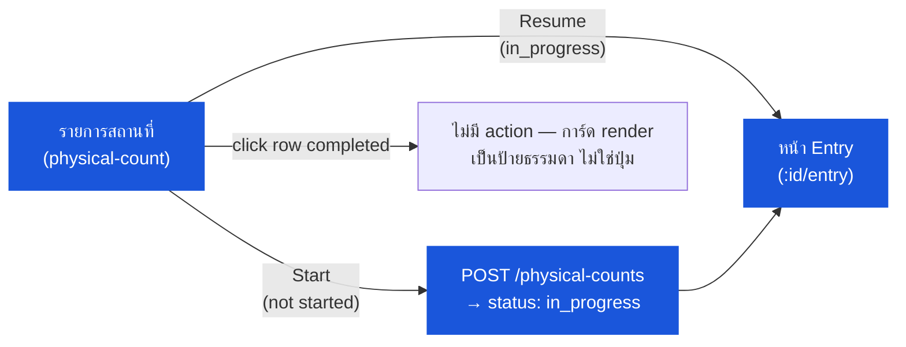

# การนับสต๊อกประจำงวด (Physical Count) — User Flow — หน้ารายการ

> **At a Glance**
> **หน้าจอ:** `physical-count` (`pc-component.tsx`) &nbsp;·&nbsp; **โมดูล:** [physical-count](/th/inventory/physical-count) &nbsp;·&nbsp; **Role:** ผู้ใช้ใดก็ตามที่ถือ `inventory_management.physical_count` — role เดียวกันกับที่บันทึกใน [03-user-flow-counter.md](/th/inventory/physical-count/03-user-flow-counter) มองจากหน้ารายการแทนที่จะเป็นหน้า entry/review
> **สิ่งที่หน้าจอนี้ทำ:** แสดงสถานที่ของงวดนับปัจจุบัน (หรืองวดที่เลือกไว้ก่อนหน้า) จัดกลุ่มตามสถานะ และเริ่มหรือทำต่อการนับที่สถานที่หนึ่ง

## 1. ขอบเขตหน้าจอ

หน้านี้ — สืบทอดชื่อ persona "Count Lead" จาก draft ก่อนหน้า — บันทึกหน้าจอรายการ `physical-count` ไม่มีการแยกระดับโค้ดระหว่าง "Count Lead" กับ "Counter": ทั้งหน้านี้และหน้า entry/review ใน [03-user-flow-counter.md](/th/inventory/physical-count/03-user-flow-counter) ถูก gate ด้วย permission เดียวกันเป๊ะ ๆ คือ `inventory_management.physical_count` และผู้ใช้คนเดียวกันมักจะเดินผ่านทั้งสองหน้าในเซสชันเดียว

### Layout ของหน้าจอ (`pc-component.tsx`)

```mermaid
graph LR
    list["รายการสถานที่\n(physical-count)"] -->|"Start\n(not started)"| create["POST /physical-counts\n→ status: in_progress"]
    list -->|"Resume\n(in_progress)"| entry
    create --> entry["หน้า Entry\n(:id/entry)"]
    list -->|"click row completed"| noop["ไม่มี action — การ์ด render\nเป็นป้ายธรรมดา ไม่ใช่ปุ่ม"]
    classDef current fill:#1a56db,color:#fff,stroke:#1a56db;
    class list,create,entry current
```

### สิ่งที่หน้าจอแสดง

- **ตัวเลือก period** — งวดบัญชีที่เปิดอยู่ปัจจุบันของ physical-count period ถูกโหลดผ่าน `GET /physical-count-periods/current`; dropdown (`LookupPhysicalCountPeriod`) ให้ผู้ใช้เลือก period ที่ปิดไปแล้วแทน (`GET /physical-count-periods/:id`) เพื่อดูสถานที่ของ period นั้นแบบอ่านอย่างเดียว
- **KPI tile** — จำนวน All / In Progress / Not Started / Complete แต่ละอันคลิกได้เพื่อ filter
- **Checkbox "Include not-counted locations"** — toggle `include_not_count` บน call ดึง period; ไม่เช็ค (default) จะแสดงเฉพาะสถานที่ที่ `physical_count_type = yes`; เช็คแล้วจะรวมสถานที่ที่ `physical_count_type = no` ด้วย (ยังคงจำกัดที่ `location_type ∈ {inventory, consignment}` และ `is_active = true`)
- **Search bar** — filter การ์ดสถานที่ที่มองเห็นตามชื่อ/รหัส ฝั่ง client
- **การ์ดสถานที่** (`PcLocationCard`) — หนึ่งการ์ดต่อสถานที่ แสดง progress bar (`product_counted`/`product_total`), ป้าย "Count"/"Not Count" ที่มาจาก flag `physical_count_type` ของสถานที่เอง และปุ่ม action ที่ label/พฤติกรรมขึ้นกับสถานะ (§ 3)

## 2. จุดเริ่ม

- **รายการสถานที่** (`physical-count`) — จุดเริ่มเดียว ไม่มีหน้า "period scheduler" หรือ calendar แยกต่างหาก Period ถูก auto-provision (ที่ `status: draft`) ในครั้งแรกที่หน้านี้โหลดสำหรับงวดบัญชีที่เพิ่งเปิดใหม่

## 3. การกระทำหลัก

| Action | State precondition | State effect | Notes |
| ------ | ------------------ | ------------ | ----- |
| เริ่มการนับสำหรับสถานที่ที่ยังไม่เริ่ม | สถานที่ไม่มี `tb_physical_count` สำหรับ period นี้ (`physical_count_id === null`) | `POST /physical-counts` สร้างเอกสารใหม่โดยตรงที่ `in_progress`; navigate ไป `/:id/entry` | ตาม `PHC_VAL_001`–`002` ต้องการ period เป็น `counting` อยู่แล้ว — ถ้า period ที่ auto-provision ยังเป็น `draft` call นี้จะถูก reject (ดูหมายเหตุ § 2 ใน [03-user-flow.md](/th/inventory/physical-count/03-user-flow)) |
| ทำต่อการนับสำหรับสถานที่ที่ in-progress | มี `physical_count_id` และสถานะเป็น `in_progress` | Navigate ตรงไป `/:id/entry` — ไม่สร้างเอกสารใหม่ | ไม่มีการเรียก API; เป็นการเปลี่ยน route ฝั่ง client ล้วน ๆ |
| คลิกการ์ดสถานที่ที่ completed | สถานะเป็น `completed` | **ไม่มี action** `PcLocationCard` render เป็นป้าย "Done" ธรรมดา (ไม่ใช่ปุ่ม) สำหรับรายการที่ `completed` — ไม่มี `onClick` handler เลยในสถานะนี้ | Component รายการยังมี branch ของ `handleAction` ที่จะแสดง dialog "Coming Soon" สำหรับรายการที่ completed แต่มันเป็นโค้ดตายที่เข้าถึงไม่ได้ เพราะการ์ดไม่เคยเรียก `onAction` เมื่อ `actionType === "done"` ปัจจุบันไม่มีวิธีดู detail ของการนับที่ completed จากหน้านี้ |
| สลับไป period ก่อนหน้า | เลือก period จาก dropdown `LookupPhysicalCountPeriod` | โหลดสถานที่ของ period นั้นแบบอ่านอย่างเดียวผ่าน `GET /physical-count-periods/:id` | ป้ายเปลี่ยนจาก "Current Period" เป็น "Previous Period"; grid การ์ดเดียวกัน render แต่สถานที่ completed/in-progress จาก period ที่ปิดแล้วยังคงดูได้จำกัดแบบเดียวกับด้านบน |

## 4. จุดตัดสินใจ

- **รวมสถานที่ที่ไม่นับหรือไม่** ไม่เช็ค (default) แสดงเฉพาะสถานที่ที่ flag `physical_count_type = yes` — ชุดเดียวกับที่ gate การปิดงวด (`period-end.validate.ts`) เช็คแล้วจะแสดงสถานที่ที่ flag `no` ด้วย ซึ่งไม่บล็อกการปิดงวด แต่ยังนับด้วยมือได้
- **เริ่ม vs ทำต่อ vs ไม่ทำอะไร** ขับเคลื่อนทั้งหมดโดยสถานะที่คำนวณของสถานที่ (`physical_count_status`: `not_started` / `in_progress` / `completed`) — ไม่มีการตัดสินใจแยกเรื่องตารางเวลา ขอบเขต หรือเลือกโหมด ตัวเลือกจริงเดียวที่ผู้ใช้ทำบนหน้านี้คือ *จะนับสถานที่ไหนต่อไป*

## 5. ทางออก / การส่งต่อ

| Trigger | Handoff to | Artefact |
| ------- | ---------- | -------- |
| เริ่ม / ทำต่อการนับ | [หน้า Entry](/th/inventory/physical-count/03-user-flow-counter) — ผู้ใช้เดียวกัน เซสชันเดียวกัน | `tb_physical_count` เป็น `in_progress` |
| ทุกสถานที่จำเป็นถึง `completed` | [system-config/period](/th/inventory/system-config/period) — gate การปิดงวด | `period-end.validate.ts`'s `validatePhysicalCount` เลิกบล็อกการปิดงวด |

## 6. แหล่งอ้างอิง

- **Frontend:** `../carmen-inventory-frontend-react/routes/inventory-management/physical-count/pc-component.tsx`, `routes/inventory-management/shared/pc-location-card.tsx`
- **Backend:** `../carmen-turborepo-backend-v2/apps/micro-business/src/inventory/physical-count/physical-count.service.ts` (`create`), `.../physical-count-period/physical-count-period.service.ts` (`findCurrent`)
- **E2E:** `../carmen-inventory-frontend-e2e/tests/` — ยังไม่มี spec physical-count
- ที่เกี่ยวข้อง: [physical-count/03-user-flow](/th/inventory/physical-count/03-user-flow) (overview), [physical-count/02-business-rules](/th/inventory/physical-count/02-business-rules) (`PHC_VAL_001`–`003`, `PHC_AUTH_001`), [physical-count/03-user-flow-counter](/th/inventory/physical-count/03-user-flow-counter) (การเดินทางฝั่ง entry/review ของ role เดียวกัน)
