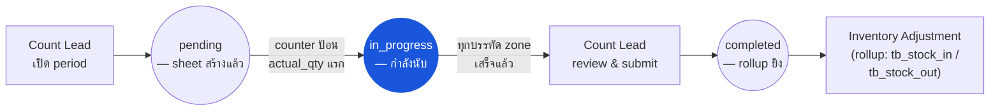

# การนับสต๊อกประจำงวด (Physical Count) — User Flow — Counter

> **At a Glance**
> **Persona:** Counter (Store Keeper) &nbsp;·&nbsp; **โมดูล:** [[physical-count]] &nbsp;·&nbsp; **ขั้นตอน workflow:** ป้อน `actual_qty` แรก (auto-transition `pending → in_progress`; stamp `start_counting_at` / `start_counting_by_id`) &nbsp;·&nbsp; แก้ไข `actual_qty` และเพิ่ม comment บรรทัดบน zone ของตน &nbsp;·&nbsp; เซ็นปิด sheet ที่เสร็จกลับ Count Lead &nbsp;·&nbsp; **สิทธิ์สำคัญ:** แก้ไขบรรทัดใน zone ของตน (`PHC_AUTH_002 / PHC_AUTH_004`); submit เอกสารเป็น `completed` ไม่ได้ (Count Lead เท่านั้น)
> **สิ่งที่ persona นี้ทำ:** เดินใน zone ที่ได้รับมอบหมาย บันทึกปริมาณ physical ทีละบรรทัด และ flag รายการเสียหาย / ไม่มีป้าย / ไม่คุ้นเคยให้ Count Lead

## 1. Persona

**Counter** — Counter / Store Keeper พนักงานระดับพื้นที่ที่ทำการนับ physical บน zone ที่ได้รับมอบหมาย บันทึกปริมาณบน count sheet (`tb_physical_count_detail.actual_qty`) flag รายการที่เสียหาย ไม่มีป้าย หรือไม่คุ้นเคยผ่าน comment ระดับบรรทัด และเซ็นปิด sheet ที่เสร็จกลับ Count Lead Authority anchor สำหรับ `PHC_AUTH_002`

### ตำแหน่ง workflow (Counter เน้น)

### Permission Matrix — V1 Status × Action (Counter)

Counter เป็น persona ป้อนข้อมูลที่จำกัดขอบเขตอยู่ที่ zone ที่ได้รับมอบหมาย อ่านและเขียน `actual_qty` บนบรรทัดของตนและเพิ่ม comment ได้ แต่ submit เอกสาร count หรือเปลี่ยน config ใด ๆ ไม่ได้ row มาจากหัวข้อ 3 (Primary Actions) ของไฟล์นี้; citation ของกฎอ้างอิง [[physical-count/02-business-rules]] § 4 / § 5

| Action | เอกสาร count `pending` | เอกสาร count `in_progress` | เอกสาร count `completed` |
|---|---|---|---|
| ดู count sheet ที่ได้รับมอบหมาย (zone-scoped) | ✅ (`PHC_AUTH_004`) | ✅ (`PHC_AUTH_004`) | ✅ (read-only) |
| ป้อน `actual_qty` แรก (trigger `pending → in_progress`) | ✅ (`PHC_AUTH_002`) | — | ❌ |
| ป้อน / แก้ไข `actual_qty` บนบรรทัด zone ของตน | — | ✅ (`PHC_VAL_005` — qty ≥ 0) | ❌ (`PHC_VAL_008` — immutable) |
| Flag รายการเสียหาย / ไม่มีป้าย / ไม่คุ้นเคย (comment + photo) | — | ✅ (`PHC_AUTH_002`) | ❌ |
| เพิ่ม free-text comment ให้เอกสาร count | — | ✅ (`PHC_AUTH_002`) | ❌ |
| เซ็นปิด zone ที่เสร็จ (แจ้ง Count Lead) | — | ✅ (notification; ไม่เปลี่ยนสถานะ) | — |
| Submit เอกสาร count (`in_progress → completed`) | ❌ (`PHC_AUTH_002` — Count Lead เท่านั้น) | ❌ (`PHC_AUTH_002` — Count Lead เท่านั้น) | — |
| ดูบรรทัดนอก zone ของตน | ❌ (`PHC_AUTH_004` — zone-scoped) | ❌ (`PHC_AUTH_004` — zone-scoped) | ❌ |
| ป้อนใหม่บรรทัด recount ที่ Count Lead flag | — | ✅ (counter คนละคนกับคนเดิม) | ❌ |

## 2. จุดเริ่ม

- **การมอบหมายการนับของฉัน** — รายการเอกสาร `tb_physical_count` ที่สถานะ `pending` หรือ `in_progress` ซึ่ง counter มี zone-grant
- **มุมมอง count sheet** — drill เข้าเอกสาร count หนึ่งฉบับและเห็นเฉพาะบรรทัด detail สำหรับ zone ของ counter
- **Mobile / handheld scanner** — อุปกรณ์พื้นที่ทั่วไปสำหรับ scan barcode สินค้าและป้อน `actual_qty` ทีละบรรทัด

## 3. Primary Actions

| Action | State precondition | State effect | Notes |
| ------ | ------------------ | ------------ | ----- |
| เปิด count sheet ที่ได้รับมอบหมาย | เอกสาร count อยู่ `pending` หรือ `in_progress`; counter มี zone-grant | (read) บรรทัด zone-scoped มองเห็น | ตาม `PHC_AUTH_004` |
| ป้อน `actual_qty` แรก | เอกสาร count อยู่ `pending` | เอกสาร count เลื่อนไป `in_progress`; stamp `start_counting_at` / `start_counting_by_id` | การป้อนบรรทัดแรก trigger transition |
| ป้อน / แก้ไข `actual_qty` บนบรรทัด | บรรทัดภายใน zone ของตน | `actual_qty` บันทึก; stamp `counted_at` / `counted_by_id` | `actual_qty ≥ 0` ตาม `PHC_VAL_005` |
| Flag รายการเสียหาย / ไม่มีป้าย / ไม่คุ้นเคย | บรรทัดใน zone ของ counter | สร้าง `tb_physical_count_detail_comment` row พร้อม attachment (photo) | Soft-flag; Count Lead review |
| เพิ่ม comment ให้เอกสาร count | เอกสารอยู่ `in_progress` | สร้าง `tb_physical_count_comment` row | บันทึก free-text (เช่น "zone B นับครบแล้ว รอ recount บรรทัด 17") |
| เซ็นปิด zone ที่เสร็จ | ทุกบรรทัดของ zone มี `actual_qty` ไม่เป็น null | Notification ยิงไปยัง Count Lead | Counter ไม่ submit เอกสาร — Count Lead ทำ ตาม `PHC_AUTH_002` |

## 4. Decision Points

- **รายการเสียหาย / ไม่คุ้นเคย** เมื่อ counter พบรายการที่ไม่ตรงกับ sheet (ไม่มีป้าย เสียหาย จัดประเภทผิด) บรรทัดถูก flag พร้อม comment + photo; การจัดการ variance เป็นการตัดสินใจของ Count Lead
- **ศูนย์-บนชั้น vs ศูนย์-นับ** ถ้า sheet แสดง `on_hand_qty > 0` แต่ counter ไม่เห็นอะไรบนชั้น `actual_qty = 0` ถูกป้อนชัดเจน (ไม่ปล่อยว่าง) `actual_qty` ว่างบล็อก submit ตาม `PHC_VAL_004`; ป้อนศูนย์ดำเนินไปสู่ variance flag
- **บรรทัด recount** เมื่อบรรทัดถูก flag ให้ recount, recount ต้องทำโดย counter **คนละคน** เพื่อกำจัด bias ในการนับของบุคคล — counter เดิมไม่ป้อนบรรทัดของตนใหม่

> **TODO:** ดึงหน้าจอ UI mobile / scanner ที่แน่นอนและ toggle blind-count (book qty ซ่อน) จาก `../carmen-inventory-frontend/`

## 5. Exit / Handoff

| Trigger | Handoff to | Artefact |
| ------- | ---------- | -------- |
| ทำบรรทัดที่ได้รับมอบหมายเสร็จทั้งหมด | Count Lead | Notification + tag completed-zone ใน comment thread |
| Flag บรรทัดเพื่อตรวจเพิ่ม | Count Lead | `tb_physical_count_detail_comment` พร้อม tag เสียหาย / ไม่มีป้าย |
| (ไม่มี action submit) | Count Lead | Counter submit ไม่ได้; เฉพาะ Count Lead ตาม `PHC_AUTH_002` |

## 6. แหล่งอ้างอิง

- **Primary (TODO):** source carmen/docs — ไม่มีสำหรับโมดูลนี้
- **Frontend (TODO):** `../carmen-inventory-frontend/` — UI ของ Counter / mobile; ตรวจ cmobile (`../cmobile/`) สำหรับการ implement count sheet ฝั่ง PWA ถ้ามี
- **E2E (TODO):** `../carmen-inventory-frontend-e2e/tests/` — ยังไม่มี spec physical-count
- ที่เกี่ยวข้อง: [[physical-count/03-user-flow]] (overview), [[physical-count/02-business-rules]] (`PHC_AUTH_002`, `PHC_VAL_004`–`PHC_VAL_005`), [[physical-count/03-user-flow-count-lead]] (คู่ handoff)
