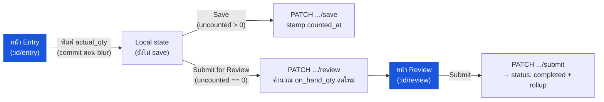

# การนับสต๊อกประจำงวด (Physical Count) — User Flow — หน้า Entry & Review

> **At a Glance**
> **หน้าจอ:** `physical-count/:id/entry` (`pc-entry-component.tsx`) และ `physical-count/:id/review` (`pc-review-component.tsx`) &nbsp;·&nbsp; **โมดูล:** [physical-count](/th/inventory/physical-count) &nbsp;·&nbsp; **Role:** ผู้ใช้ permission-gated คนเดียวกันกับที่บันทึกใน [03-user-flow-count-lead.md](/th/inventory/physical-count/03-user-flow-count-lead)
> **สิ่งที่ persona นี้ทำ:** ป้อน `actual_qty` ต่อบรรทัดสินค้า แนบ note/photo ต่อบรรทัดถ้าต้องการ บันทึก save ความคืบหน้า submit เพื่อ review และยืนยัน submit สุดท้าย

## 1. ขอบเขตหน้าจอ

หน้านี้ — สืบทอดชื่อ persona "Counter" จาก draft ก่อนหน้า — บันทึกหน้าจอ entry และ review จริง ไม่มีการมอบหมาย zone ไม่มี zone-grant ต่อ counter และไม่มีข้อจำกัดว่าใครแก้ไขบรรทัดไหนได้: ผู้ใช้ใดก็ตามที่ถือ permission ของโมดูลสามารถแก้ไขบรรทัดใด ๆ บนการนับ in-progress ใดก็ได้

### Action ของหน้า entry (`pc-entry-component.tsx`)

```mermaid
graph LR
    entry[["หน้า Entry\n(:id/entry)"]]:::current
    entry -->|"พิมพ์ actual_qty\n(commit ตอน blur)"| commit["Local state\n(ยังไม่ save)"]
    commit -->|"Save\n(uncounted > 0)"| save["PATCH .../save\nstamp counted_at"]
    commit -->|"Submit for Review\n(uncounted == 0)"| review["PATCH .../review\nคำนวณ on_hand_qty สดใหม่"]
    review --> reviewScreen[["หน้า Review\n(:id/review)"]]:::current
    reviewScreen -->|"Submit"| submit["PATCH .../submit\n→ status: completed + rollup"]
    classDef current fill:#1a56db,color:#fff,stroke:#1a56db;
```

### สิ่งที่หน้า entry แสดง

- **Header** (`pc-entry-header.tsx`) — ชื่อ/รหัสสถานที่ ป้ายสถานะ จำนวน `counted/total` เปอร์เซ็นต์ความคืบหน้า progress bar วันที่ `start_counting_at` และ timestamp "last saved" ที่เป็น client-side เท่านั้น
- **Search + filter pill สถานะ** — All / Counted / Uncounted กรองการ์ดสินค้าที่มองเห็นฝั่ง client; search จับคู่ชื่อ/รหัส/SKU/ชื่อท้องถิ่นของสินค้า
- **ปุ่ม Refresh** — เรียก `PATCH .../refresh` ซึ่งรัน query union สินค้าเดียวกับตอนสร้างใหม่และเพิ่มสินค้าที่เข้าเงื่อนไขใหม่เข้า sheet
- **Import / Export** — Export เขียนไฟล์ `.xlsx` ของยอดนับ effective ปัจจุบัน (id, รหัส/ชื่อ/ชื่อท้องถิ่น/SKU สินค้า, หน่วย, `actual_qty`); Import อ่าน spreadsheet กลับและจับคู่แถวด้วย SKU รายงานจำนวนที่จับคู่/ข้าม
- **การ์ดสินค้า** (`EntryItemRow`, virtualized) — ชื่อ/รหัส/ชื่อท้องถิ่น/SKU สินค้า, input ตัวเลข `actual_qty` (commit ตอน blur, clamp `≥ 0` ที่ client), ปุ่ม calculator (`CalculatorDialog` สำหรับคำนวณยอดรวมจากปริมาณลัง/หน่วย), ป้ายหน่วยนับ และลิงก์ "Add Notes" เปิด dialog note ที่ใช้ร่วมกัน (ข้อความอิสระ + รูปแนบ อ้างอิง `tb_physical_count_detail_comment`) Book quantity (`on_hand_qty`) **ไม่เคยแสดง** บนหน้านี้
- **"Set uncounted to zero"** — เติมค่า local ของทุกบรรทัดที่ยังว่างเป็น `0` แบบ bulk (ไม่ save เอง)
- **Save vs. Submit for Review** — footer แสดง **Save** เมื่อมีบรรทัดใดยังไม่นับ; เมื่อทุกบรรทัดมีค่าแล้ว (จากการแก้ไข local หรือ save ก่อนหน้า) Save จะหายไปและเหลือเพียง **Submit for Review**

### สิ่งที่หน้า review แสดง (`pc-review-component.tsx` ผ่าน `ReviewComponent` ที่ใช้ร่วมกัน)

- ชื่อ/รหัสสถานที่ และตัวเลขสรุปสี่ตัวที่คำนวณฝั่ง client จาก payload review: **matches** (`diff_qty === 0`), **variances**, **overages** (`diff_qty > 0`), **shortages** (`diff_qty < 0`)
- รายการบรรทัดที่มี variance เท่านั้น แต่ละบรรทัดแสดงปริมาณระบบ (`on_hand_qty`), ปริมาณจริง, variance (`diff_qty`) และหน่วย
- ปุ่ม **Submit** เดียว ซึ่งเป็น action ปลายทางสุดท้ายของทั้งเอกสาร

## 2. จุดเริ่ม

- **จากหน้ารายการ** — Start/Resume navigate ตรงไป `physical-count/:id/entry` (ดู [03-user-flow-count-lead.md](/th/inventory/physical-count/03-user-flow-count-lead))
- **จากหน้า review การปิดงวด** (`pe-review.tsx`) — การ์ดของสถานที่ที่ in-progress ที่นั่นก็ลิงก์ไป `physical-count/:id/entry` เช่นกัน; การ์ดของสถานที่ที่ completed ที่นั่น เหมือนบนหน้ารายการหลัก render ไม่มี action ที่คลิกได้

## 3. การกระทำหลัก

| Action | State precondition | State effect | Notes |
| ------ | ------------------ | ------------ | ----- |
| ป้อน/แก้ไข `actual_qty` บนบรรทัด | เอกสาร `in_progress` | Local state เท่านั้น จนกว่าจะ Save หรือ Submit for Review | ค่าถูก clamp เป็น `≥ 0` ที่ client (`entry-item-row.tsx`); ยังไม่ยืนยันค่าต่ำสุดฝั่ง server |
| แนบ note/photo ให้บรรทัด | เวลาใดก็ได้ | `POST /physical-count-detail-comments/:detailId` (multipart: `message`, `type`, `files`) | อ้างอิง `tb_physical_count_detail_comment`; component notes-dialog ที่ใช้ร่วมกับหน้า entry อื่น ๆ ในโค้ดฐานนี้ |
| Save | มีอย่างน้อยหนึ่งบรรทัดมีค่า; เอกสารไม่ `completed` | `PATCH .../save` — stamp `counted_at`/`counted_by_id` และคำนวณ `diff_qty` ใหม่บนบรรทัดที่ส่งมาเทียบกับ `on_hand_qty` ที่เก็บอยู่ในขณะนั้น (ปกติยังเป็น `0` ก่อน review); ต้องการ `doc_version` | ทำซ้ำได้; ไม่เปลี่ยน `tb_physical_count.status` |
| Submit for Review | ทุกบรรทัดมีค่า effective (`uncountedCount === 0`) | `PATCH .../review` — คำนวณ `on_hand_qty`/`diff_qty` ใหม่สำหรับ **ทุก** บรรทัดจากยอด ledger สด; navigate ไป `/review` | ไม่ stamp `counted_at`; ไม่เปลี่ยน `status` ต้องการ `doc_version` ดูข้อควรระวัง `counted_at` ใน [02-business-rules.md](/th/inventory/physical-count/02-business-rules) `PHC_VAL_004` |
| Submit (สุดท้าย จาก `/review`) | `counted_at != null` ของทุกบรรทัด | `PATCH .../submit` — `status → completed`; ยิง variance rollup เข้า `tb_stock_in`/`tb_stock_out` | Terminal; ตาม `PHC_POST_001`–`004` ต้องการ `doc_version` |
| Refresh สินค้า | เอกสารไม่ `completed` | `PATCH .../refresh` — เพิ่มสินค้าที่เข้าเงื่อนไขใหม่เข้า sheet | ไม่ลบหรือตีราคาบรรทัดที่มีอยู่ใหม่ |

## 4. Decision Points

- **Save ทันทีหรือพิมพ์ต่อไป** การ save เร็วเป็นวิธีเดียวที่ทำให้ `counted_at` ถูก stamp บนบรรทัดก่อนที่การตรวจสอบความครบถ้วนของ Submit สุดท้าย (`PHC_VAL_004`) จะรัน; การพึ่ง Submit for Review เพียงอย่างเดียวเพื่อเติมบรรทัดสุดท้ายมีความเสี่ยงตาม edge case ที่ระบุใน [02-business-rules.md](/th/inventory/physical-count/02-business-rules) `PHC_VAL_004` ที่ `actual_qty` ของบรรทัดถูกตั้งค่าแล้วแต่ `counted_at` ยังเป็น null
- **ศูนย์บนชั้น vs ปล่อยบรรทัดว่าง** บรรทัดว่างไม่มีค่า effective และนับเป็น "uncounted"; การป้อน `0` ชัดเจนเป็นการนับจริงที่แยกต่างหาก
- **Import vs ป้อนด้วยมือ** Import จับคู่แถวเข้าบรรทัดด้วย SKU สินค้าและรายงานจำนวนที่จับคู่/ข้าม — มีประโยชน์สำหรับการโหลด export จาก handheld scanner แบบ bulk แต่มันไม่ได้ตรวจสอบปริมาณกับ tolerance ด้วยตัวเอง (ไม่มีกลไกเช่นนั้น)

## 5. ทางออก / การส่งต่อ

| Trigger | Handoff to | Artefact |
| ------- | ---------- | -------- |
| Submit (สุดท้าย) | ระบบ — variance rollup | `tb_physical_count.status = completed`; `tb_stock_in`/`tb_stock_out` สร้าง (ดู [02-business-rules.md](/th/inventory/physical-count/02-business-rules) § 5) |
| Navigate กลับ | [หน้ารายการ](/th/inventory/physical-count/03-user-flow-count-lead) | ไม่เปลี่ยนสถานะ |

## 6. แหล่งอ้างอิง

- **Frontend:** `../carmen-inventory-frontend-react/routes/inventory-management/physical-count/pc-entry-component.tsx`, `pc-review-component.tsx`, `pc-entry-header.tsx`, `pc-entry-notes-dialog.tsx`; `routes/inventory-management/shared/entry-item-row.tsx`, `review-component.tsx`
- **Backend:** `../carmen-turborepo-backend-v2/apps/micro-business/src/inventory/physical-count/physical-count.service.ts` (`save`, `reviewItems`, `submit`, `refresh`)
- **E2E:** `../carmen-inventory-frontend-e2e/tests/` — ยังไม่มี spec physical-count
- ที่เกี่ยวข้อง: [physical-count/03-user-flow](/th/inventory/physical-count/03-user-flow) (overview), [physical-count/02-business-rules](/th/inventory/physical-count/02-business-rules) (`PHC_VAL_004`–`007`, `PHC_POST_001`–`004`), [physical-count/03-user-flow-count-lead](/th/inventory/physical-count/03-user-flow-count-lead) (การเดินทางฝั่งหน้ารายการของ role เดียวกัน)
