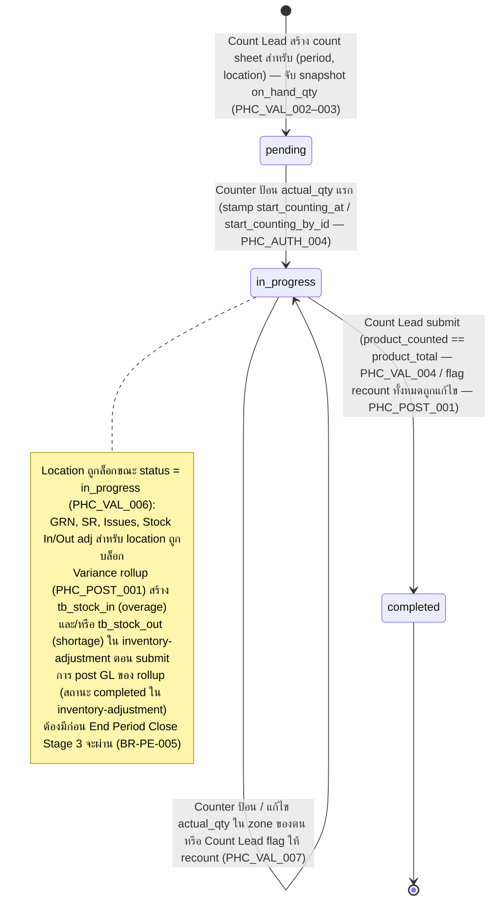

# การนับสต๊อกประจำงวด (Physical Count) — User Flow

> **At a Glance**
> **โมดูล:** [physical-count](/th/inventory/physical-count) &nbsp;·&nbsp; **Persona:** Count Lead (Inventory Controller / Manager) &nbsp;·&nbsp; Counter (Store Keeper) &nbsp;·&nbsp; Audit / Config (Approver / Finance Reviewer + Auditor + Sysadmin)
> **วงจรชีวิต workflow:** Period (`enum_physical_count_period_status`): `draft → counting → completed` Per-document (`enum_physical_count_status`): `pending → in_progress → completed` Submit ยิง variance rollup ไปยัง [inventory-adjustment](/th/inventory/inventory-adjustment) (`tb_stock_in` overage / `tb_stock_out` shortage)
> **ดูรายละเอียดระดับ action ในมุมมองต่อ persona ด้านล่าง**

## 1. ภาพรวม

หน้านี้เป็น **จุดเริ่ม overview** สำหรับชุด user-flow ของโมดูล `physical-count` ไม่เหมือนโมดูลเอกสารเดี่ยว (PR, PO, GRN) physical count ดำเนินการเป็น **การดำเนินงานสามชั้น** — header `tb_physical_count_period` รวบรวมเอกสาร count ทั้งหมดสำหรับงวดบัญชีหนึ่ง; ภายใต้นั้น เอกสาร `tb_physical_count` หนึ่งฉบับต่อ `(period, location)` พกพาสถานะการนับและความคืบหน้าของ counter; ภายใต้แต่ละเอกสาร count, row ของ `tb_physical_count_detail` ถือ `on_hand_qty` (book snapshot) / `actual_qty` (counted) / `diff_qty` (variance) ต่อสินค้า งานเดินตามลำดับชั้นนี้: Count Lead เปิด period, สร้าง count sheet ต่อ location, มอบหมาย counter; Counter เดินใน zone และป้อนปริมาณ physical ทีละบรรทัด; Count Lead ตรวจสอบ variance, trigger recount, อนุมัติการ complete; rollup จะเขียน variance adjustment ไปยัง [inventory-adjustment](/th/inventory/inventory-adjustment) ซึ่งเป็น path ไปยัง ledger ของ [inventory](/th/inventory/inventory)

หัวข้อ 2 ด้านล่างอธิบาย **state machine ของวงจรชีวิตเอกสาร** ทั้ง `tb_physical_count_period.status` (`draft → counting → completed`) และ `tb_physical_count.status` (`pending → in_progress → completed`) โดยไม่ขึ้นกับว่าใครทำ ไฟล์ต่อ persona (ลิงก์จากหัวข้อ 3) อธิบาย *เส้นทางผ่าน* state space นี้ของ persona — จุดเริ่ม action ที่ทำได้ branch ตัดสินใจ handoff ที่จบการมีส่วนร่วม หัวข้อ 4 สรุป handoff ข้าม persona ที่เย็บเส้นทางบุคคลเข้าด้วยกัน (Count Lead → Counter สำหรับการมอบหมาย zone; Counter → Count Lead สำหรับเซ็นรับ sheet ที่เสร็จ; Count Lead → Approver/Finance สำหรับอนุมัติ adjustment ของ variance ผ่าน [inventory-adjustment](/th/inventory/inventory-adjustment))

> **TODO:** ดึงหน้าจอ UI / flow wizard canonical จาก `../carmen-inventory-frontend/` เมื่อ route `physical-count` ค้นพบได้; cross-reference E2E spec ที่ `../carmen-inventory-frontend-e2e/tests/` เมื่อเพิ่ม ไม่มี source folder carmen/docs สำหรับโมดูลนี้

## 2. วงจรชีวิตเอกสาร

**State machine ระดับ period (`enum_physical_count_period_status`):**

```mermaid
stateDiagram-v2
    [*] --> draft : Count Lead สร้าง period header (tb_period เปิดตาม INV_VAL_008 — PHC_VAL_001)
    draft --> counting : tb_physical_count แรกถูกสร้างภายใต้ period (auto-transition — Count Lead)
    counting --> completed : ทุก tb_physical_count child ถึง completed (ระบบ — terminal; period ล็อก)
    completed --> [*]

    note right of counting
        เอกสาร count หนึ่งฉบับขึ้นไป (หนึ่งต่อ location) อาจ
        in_progress พร้อมกัน Period ยังอยู่ counting
        จนกว่าทุกเอกสารของ location จะถึง completed
    end note
```

**State machine ระดับเอกสาร (`enum_physical_count_status`):**

### 2.1 การเปลี่ยนสถานะระดับ period (`enum_physical_count_period_status`)

| From state | Action | To state | อนุญาตให้ | Pre-conditions |
| ---------- | ------ | -------- | ----------- | -------------- |
| `(none)` | สร้าง `tb_physical_count_period` สำหรับ `tb_period` ที่เปิด | `draft` | Count Lead | `tb_period` มีอยู่และเป็น `open` ตาม `INV_VAL_008` |
| `draft` | เปิด `tb_physical_count` ฉบับแรกภายใต้ period | `counting` | Count Lead | Auto-transition เมื่อสร้าง child-document แรก |
| `counting` | child count ทั้งหมดถึง `completed` | `completed` | ระบบ | row `tb_physical_count` ทั้งหมดภายใต้ period มี `status = completed` Terminal; period ล็อกจาก count ใหม่ |

### 2.2 การเปลี่ยนสถานะระดับเอกสาร (`enum_physical_count_status`)

| From state | Action | To state | อนุญาตให้ | Pre-conditions |
| ---------- | ------ | -------- | ----------- | -------------- |
| `(none)` | สร้าง count sheet สำหรับ `(period, location)` | `pending` | Count Lead | Period อยู่ `draft` หรือ `counting`; location เป็น inventory- หรือ consignment-type ตาม `PHC_VAL_003`; เลือกโหมด (`physical_count_type`) จับ snapshot `on_hand_qty` ต่อบรรทัด |
| `pending` | counter ป้อน `actual_qty` แรก | `in_progress` | Counter | Counter มี zone-grant สำหรับ location ตาม `PHC_AUTH_004` Stamp `start_counting_at` / `start_counting_by_id` |
| `in_progress` | แก้ไข `actual_qty` / เพิ่ม detail comment | `in_progress` | Counter (บรรทัดของตน) | บรรทัดภายใน zone ของ counter |
| `in_progress` | flag บรรทัด variance ให้ recount | `in_progress` | Count Lead | Variance breach ตาม `PHC_VAL_007` Trigger sub-flow ของ recount |
| `in_progress` | submit (ทุกบรรทัดนับแล้ว) | `completed` | Count Lead | `product_counted == product_total` ตาม `PHC_VAL_004`; flag recount ทั้งหมดแก้ไขแล้ว ยิง variance rollup ตาม `PHC_POST_001` |
| `completed` | ดู / รายงาน / audit | `completed` | ทุก persona (ตามขอบเขต) | Terminal Immutable ตาม `PHC_VAL_008` |

### 2.3 Variance-rollup fan-out

การเปลี่ยน `in_progress → completed` บน `tb_physical_count` คือ **เหตุการณ์ rollup** ตาม `PHC_POST_001` / `PHC_POST_002`:

- บรรทัดที่ `diff_qty > 0` จัดกลุ่มเป็นเอกสาร `tb_stock_in` หนึ่งฉบับขึ้นไปภายใต้ reason `COUNT_OVERAGE`
- บรรทัดที่ `diff_qty < 0` จัดกลุ่มเป็นเอกสาร `tb_stock_out` หนึ่งฉบับขึ้นไปภายใต้ reason `COUNT_SHORTAGE`
- บรรทัดที่ `diff_qty = 0` ไม่สร้าง rollup row
- เอกสาร rollup แต่ละฉบับพกพา `info.countId = <tb_physical_count.id>` สำหรับการ join ย้อนกลับ
- การ post adjustment (ตาม [inventory-adjustment/03-user-flow](/th/inventory/inventory-adjustment/03-user-flow)) เขียน inventory transaction และ GL entry; เอกสาร count ไม่เขียนลง ledger โดยตรง

> **TODO:** เขียน convention การกำหนดหมายเลขเอกสาร rollup (ว่าหนึ่ง rollup ต่อ location, หนึ่ง rollup ต่อ reason, หรือหนึ่ง rollup ต่อบรรทัด) เมื่อยืนยัน logic frontend

## 3. ไฟล์ Persona

แต่ละไฟล์อธิบายเส้นทางของหนึ่งกลุ่ม persona ผ่านวงจรชีวิตข้างต้น สามกลุ่มยุบจากสี่ persona canonical ใน [physical-count](/th/inventory/physical-count) § 4:

- **[Count Lead](/th/inventory/physical-count/03-user-flow-count-lead)** — Inventory Controller / Inventory Manager: จัดตารางการดำเนินการ ตั้งค่าขอบเขต มอบหมาย counter ติดตามความคืบหน้า แก้ไขข้อขัดแย้ง อนุมัติ recount, trigger rollup
- **[Counter](/th/inventory/physical-count/03-user-flow-counter)** — Counter / Store Keeper: ทำการนับใน zone ที่ได้รับมอบหมาย บันทึกปริมาณ flag รายการเสียหาย / ไม่คุ้นเคย เซ็นปิด sheet ที่เสร็จ
- **[Audit / Config](/th/inventory/physical-count/03-user-flow-audit-config)** — Approver / Finance Reviewer + Auditor + Sysadmin: review การนับที่เสร็จและ rollup adjustment ตรวจสอบความสมเหตุสมผลของ variance เซ็นปิดผลกระทบทางการเงิน; Auditor ตรวจ chain; Sysadmin ตั้งค่า default ของ tolerance / costing-method

## 4. Handoff ข้าม Persona

| From persona | Trigger | To persona | Handoff artefact |
| ------------ | ------- | ---------- | ---------------- |
| Count Lead | สร้าง count sheet + มอบหมาย zone | Counter | `tb_physical_count` เป็น `pending`; counter zone-grant |
| Counter | ทำ zone ของตนเสร็จ | Count Lead | บรรทัด `tb_physical_count_detail` ของ zone มี `actual_qty` ไม่เป็น null |
| Count Lead | flag บรรทัด variance ให้ recount | Counter (คนละคนกับคนนับเดิม) | Detail-comment พร้อม tag recount-required |
| Count Lead | submit การนับ | ระบบ → rollup → [inventory-adjustment](/th/inventory/inventory-adjustment) | `tb_physical_count.status = completed`; rollup `tb_stock_in` / `tb_stock_out` สร้าง |
| Count Lead | route rollup adjustment ไปอนุมัติ | Audit / Config (Approver / Finance) | `tb_stock_in` / `tb_stock_out` เป็น `in_progress` |
| Approver / Finance | อนุมัติ rollup adjustment | ระบบ → ledger ของ [inventory](/th/inventory/inventory) | `tb_stock_in` / `tb_stock_out` เป็น `completed`; เขียน `tb_inventory_transaction` |
| Auditor | review การนับที่เสร็จ + adjustment ที่ post | (read-only — terminal) | chain ทั้งหมดอ่านได้: count sheet, บันทึก recount, การอนุมัติ, adjustment ที่ post, journal entry |

> **TODO:** วาด handoff นี้เป็น diagram เมื่อ convention Mermaid / sequence-diagram สำหรับวิกิถูกกำหนด Cross-link ไป [inventory-adjustment/03-user-flow](/th/inventory/inventory-adjustment/03-user-flow) สำหรับ flow ฝั่ง rollup

## 5. แหล่งอ้างอิง

- **Primary (TODO):** source carmen/docs — ไม่มีสำหรับโมดูลนี้
- **Frontend (TODO):** `../carmen-inventory-frontend/` — source ของ UI flow
- **E2E (TODO):** `../carmen-inventory-frontend-e2e/tests/` — ยังไม่มี spec physical-count
- หน้า flow ที่เกี่ยวข้อง: [inventory-adjustment/03-user-flow](/th/inventory/inventory-adjustment/03-user-flow) (flow ฝั่ง rollup), [spot-check](/th/inventory/spot-check) (flow ลูกพี่ลูกน้องการนับบางส่วน)
