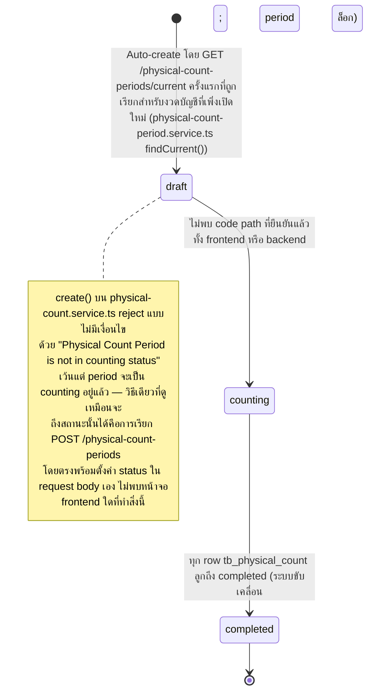
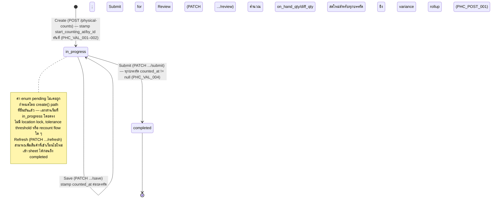

# การนับสต๊อกประจำงวด (Physical Count) — User Flow

> **At a Glance**
> **โมดูล:** [physical-count](/th/inventory/physical-count) &nbsp;·&nbsp; **Persona:** role เดียวไม่แยกกลุ่ม gate ด้วย permission เดียว (`inventory_management.physical_count`) — สองไฟล์ที่ลิงก์ด้านล่างแบ่งการเดินทางของมันตามหน้าจอ (list เทียบกับ entry/review) ไม่ใช่ตาม role ที่ต่างกันจริง
> **วงจรชีวิต workflow:** Period (`enum_physical_count_period_status`): `draft → counting → completed` (ไม่พบโค้ดที่ยืนยันแล้วเปลี่ยน `draft → counting`) Per-document (`enum_physical_count_status`): สร้างโดยตรงที่ `in_progress → completed` — `pending` เข้าถึงไม่ได้ผ่าน create path ที่ยืนยันแล้ว Submit สุดท้ายยิง variance rollup โดยตรงเข้า `tb_stock_in`/`tb_stock_out` (ดู [02-business-rules](/th/inventory/physical-count/02-business-rules) § 5)
> **หน้าจอจริง:** `physical-count` (list) → `physical-count/:id/entry` (ป้อนบรรทัด) → `physical-count/:id/review` (review variance + submit สุดท้าย)

## 1. ภาพรวม

หน้านี้เป็น **จุดเริ่ม overview** สำหรับชุด user-flow ของโมดูล `physical-count` การ implement จริงเป็นการเดินทางต่อเนื่องเดียวโดยไม่มีการส่งต่อระหว่างคนละคน: ผู้ใช้ที่ถือ permission คนหนึ่งเปิดรายการสถานที่ของงวดบัญชีปัจจุบัน (`physical-count`) เริ่มหรือทำต่อการนับที่สถานที่หนึ่ง (สร้าง `tb_physical_count` โดยตรงที่ `in_progress` หรือทำต่อฉบับที่มีอยู่) เดินหน้า entry (`physical-count/:id/entry`) ป้อน `actual_qty` ทีละบรรทัดสินค้า กด **Submit for Review** เมื่อทุกบรรทัดมีค่าแล้ว review variance ที่คำนวณบน `physical-count/:id/review` และกด **Submit** สุดท้าย — action เดียวที่ทั้งปิดการนับ (`status = completed`) และสร้างเอกสาร rollup ของ variance

หัวข้อ 2 ด้านล่างอธิบาย state machine ของวงจรชีวิตเอกสารจริงสำหรับ `tb_physical_count_period.status` และ `tb_physical_count.status` หัวข้อ 3 ลิงก์สองไฟล์ที่อธิบาย flow จริงเดียวกันจากสองมุมมองตามหน้าจอ — หน้ารายการ (`03-user-flow-count-lead.md`) และหน้า entry/review (`03-user-flow-counter.md`) — ที่คงไว้เป็นไฟล์แยกกันเพื่อความต่อเนื่องกับ layout หน้าของวิกินี้ ไม่ใช่เพราะมี role "lead" และ "counter" ที่แตกต่างกันในโค้ด หัวข้อ 4 เป็นบันทึก correction ชี้ไปยัง `03-user-flow-audit-config.md` ซึ่งบันทึกการไม่มีอยู่จริงที่ยืนยันแล้วของ surface ใด ๆ ของ Approver/Auditor/Sysadmin

## 2. วงจรชีวิตเอกสาร

**State machine ระดับ period (`enum_physical_count_period_status`):**

```mermaid
stateDiagram-v2
    [*] --> draft : Auto-create โดย GET /physical-count-periods/current ครั้งแรกที่ถูกเรียกสำหรับงวดบัญชีที่เพิ่งเปิดใหม่ (physical-count-period.service.ts findCurrent())
    draft --> counting : ไม่พบ code path ที่ยืนยันแล้วทั้ง frontend หรือ backend
    counting --> completed : ทุก row tb_physical_count ลูกถึง completed (ระบบขับเคลื่อน; period ล็อก)
    completed --> [*]

    note right of draft
        create() บน physical-count.service.ts reject แบบไม่มีเงื่อนไข
        ด้วย "Physical Count Period is not in counting status"
        เว้นแต่ period จะเป็น counting อยู่แล้ว — วิธีเดียวที่ดูเหมือนจะ
        ถึงสถานะนั้นได้คือการเรียก POST /physical-count-periods
        โดยตรงพร้อมตั้งค่า status ใน request body เอง ไม่พบหน้าจอ
        frontend ใดที่ทำสิ่งนี้
    end note
```

**State machine ระดับเอกสาร (`enum_physical_count_status`):**

```mermaid
stateDiagram-v2
    [*] --> in_progress : Create (POST /physical-counts) — stamp start_counting_at/by_id ทันที (PHC_VAL_001–002)
    in_progress --> in_progress : Save (PATCH .../save) stamp counted_at ต่อบรรทัด; Submit for Review (PATCH .../review) คำนวณ on_hand_qty/diff_qty สดใหม่สำหรับทุกบรรทัด
    in_progress --> completed : Submit (PATCH .../submit) — ทุกบรรทัด counted_at != null (PHC_VAL_004); ยิง variance rollup (PHC_POST_001)
    completed --> [*]

    note right of in_progress
        ค่า enum pending ไม่เคยถูกกำหนดโดย create() path
        ที่ยืนยันแล้ว — เอกสารเริ่มที่ in_progress โดยตรง
        ไม่มี location lock, tolerance threshold หรือ recount flow ใด ๆ
        Refresh (PATCH .../refresh) สามารถเพิ่มสินค้าที่เข้าเงื่อนไขใหม่
        เข้า sheet ได้ก่อนถึง completed
    end note
```

### 2.1 การเปลี่ยนสถานะระดับ period (`enum_physical_count_period_status`)

| From state | Action | To state | Allowed for | Pre-conditions |
| ---------- | ------ | -------- | ----------- | -------------- |
| `(none)` | `GET /physical-count-periods/current` auto-provision period สำหรับ `tb_period` ที่เปิดอยู่ปัจจุบันถ้ายังไม่มี | `draft` | ผู้ใช้ใดก็ตามที่มี permission ของโมดูล (โดยนัย ผ่านหน้ารายการ) | มี `tb_period` เปิดอยู่ |
| `draft` | — | `counting` | ยังไม่ยืนยัน | ไม่พบ code path ใด ดูหมายเหตุ § 2 ข้างต้น |
| `counting` | ทุก row `tb_physical_count` ลูกถึง `completed` | `completed` | ระบบ | ทุก `tb_physical_count` ภายใต้ period เป็น `completed` |

### 2.2 การเปลี่ยนสถานะระดับเอกสาร (`enum_physical_count_status`)

| From state | Action | To state | Allowed for | Pre-conditions |
| ---------- | ------ | -------- | ----------- | -------------- |
| `(none)` | Create (`POST /physical-counts`) | `in_progress` | ผู้ใช้ใดก็ตามที่มี `inventory_management.physical_count` | Period เป็น `counting` (`PHC_VAL_001`); สถานที่มีอยู่จริง (`PHC_VAL_002`) บรรทัดสินค้า seed จาก union ของการ assign `tb_product_location` และสินค้าใดก็ตามที่มีสต๊อกไม่เป็นศูนย์ที่สถานที่นั้น |
| `in_progress` | Save (`PATCH .../save`) | `in_progress` | ผู้ใช้เดียวกัน | บรรทัด subset ใดก็ได้; stamp `counted_at`/`counted_by_id` บนบรรทัดที่ส่งมา |
| `in_progress` | Submit for Review (`PATCH .../review`) | `in_progress` (ไม่เปลี่ยนสถานะ) | ผู้ใช้เดียวกัน | คำนวณ `on_hand_qty`/`diff_qty` ใหม่สำหรับทุกบรรทัดจากยอด ledger สด; navigate ไป `/review` |
| `in_progress` | Submit (`PATCH .../submit`, จาก `/review`) | `completed` | ผู้ใช้เดียวกัน | ทุกบรรทัดมี `counted_at != null` (`PHC_VAL_004`); ยิง variance rollup (`PHC_POST_001`–`004`) |
| `completed` | ดูอย่างเดียว | `completed` | ผู้ใช้ใดก็ตามที่มี permission ของโมดูล (อ่าน) | Terminal; ถูกบล็อกจาก Save/Review/Submit/Delete ต่อไป (`PHC_VAL_006`) ไม่มี route ที่เปิด detail ของเอกสาร `completed` จากหน้ารายการ — ดูหมายเหตุ § 3 ใน [03-user-flow-count-lead.md](/th/inventory/physical-count/03-user-flow-count-lead) |

### 2.3 การกระจายตัวของ Variance Rollup

Submit สุดท้ายคือ **rollup event** ตาม `PHC_POST_001`–`003`:

- บรรทัดที่ `diff_qty > 0` จัดกลุ่มเข้า `tb_stock_in` ใหม่ **หนึ่งฉบับ** ถูก insert ตรงที่ `doc_status = completed`
- บรรทัดที่ `diff_qty < 0` จัดกลุ่มเข้า `tb_stock_out` ใหม่ **หนึ่งฉบับ** ถูก insert ตรงที่ `doc_status = completed`
- บรรทัดที่ `diff_qty = 0` ไม่สร้าง rollup row
- ทั้ง header ที่สร้างขึ้นและบรรทัด detail ใดไม่ถูกเชื่อมกลับไปยังการนับต้นทางด้วยฟิลด์ structured ใด ๆ — มีเพียงข้อความ description ที่ใช้ร่วมกัน
- **ไม่มี row `tb_inventory_transaction` ถูกเขียนโดย action นี้** — เอกสาร rollup มีอยู่เพียงเป็นบันทึกเท่านั้น มันไม่ได้เคลื่อนย้าย on-hand balance ด้วยตัวเอง

## 3. ไฟล์ Persona

ทั้งสองไฟล์ด้านล่างอธิบาย **role ที่ gate ด้วย permission เดียวกันตัวเดียว** แบ่งตามหน้าจอที่กำลังใช้:

- **[หน้ารายการ](/th/inventory/physical-count/03-user-flow-count-lead)** — การเปิดรายการสถานที่ของงวดปัจจุบัน เริ่มหรือทำต่อการนับ
- **[หน้า Entry / Review](/th/inventory/physical-count/03-user-flow-counter)** — ป้อนบรรทัด, note, import/export, Submit for Review และ Submit สุดท้าย

## 4. กลุ่ม Persona ที่ยืนยันแล้วว่าไม่มีอยู่จริง

Draft ก่อนหน้าของโมดูลวิกินี้อธิบายกลุ่ม persona ที่สาม — Approver/Finance Reviewer, Auditor และ Sysadmin — ที่ review rollup adjustment, ตรวจ audit chain และตั้งค่า default ของ tolerance/costing-method การค้นแบบตรงเป้าหมายในทั้ง frontend, backend และ Bruno collection ไม่พบ permission key, route, workflow stage หรือหน้าจอ configuration ใดที่ตรงกับสิ่งเหล่านี้ ดู [03-user-flow-audit-config.md](/th/inventory/physical-count/03-user-flow-audit-config) สำหรับบันทึก correction

## 5. แหล่งอ้างอิง

- **Frontend:** `../carmen-inventory-frontend-react/routes/inventory-management/physical-count/` (`pc-component.tsx`, `pc-entry-component.tsx`, `pc-review-component.tsx`)
- **Backend:** `../carmen-turborepo-backend-v2/apps/micro-business/src/inventory/physical-count/physical-count.service.ts`, `.../physical-count-period/physical-count-period.service.ts`
- **E2E:** `../carmen-inventory-frontend-e2e/tests/` — ยังไม่มี spec physical-count
- Flow ที่เกี่ยวข้อง: [inventory-adjustment/03-user-flow](/th/inventory/inventory-adjustment/03-user-flow) (โมดูลที่ rollup เขียนเข้า), [spot-check](/th/inventory/spot-check) (flow ลูกพี่ลูกน้องการนับบางส่วน)
